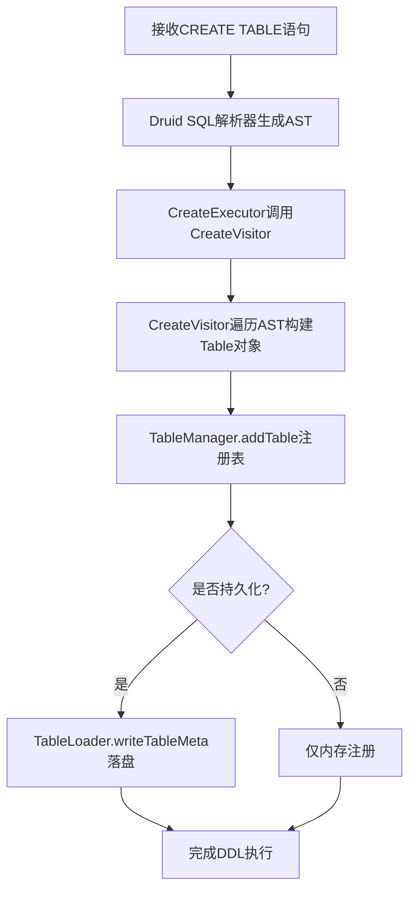
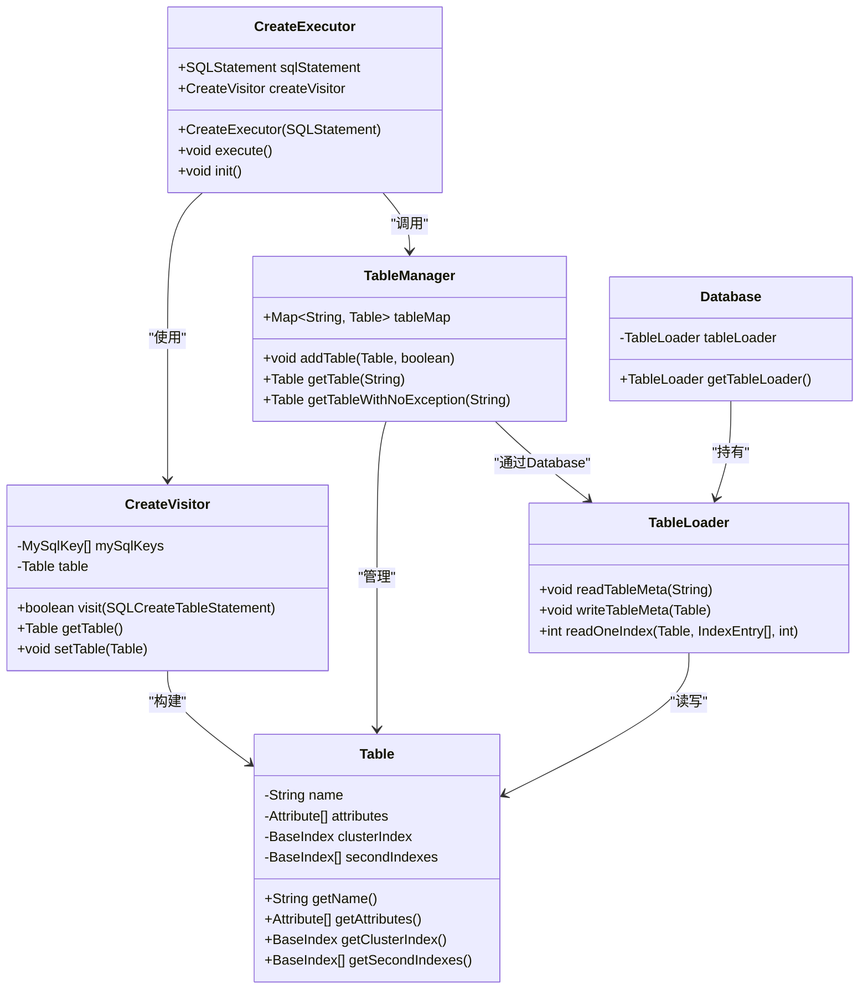
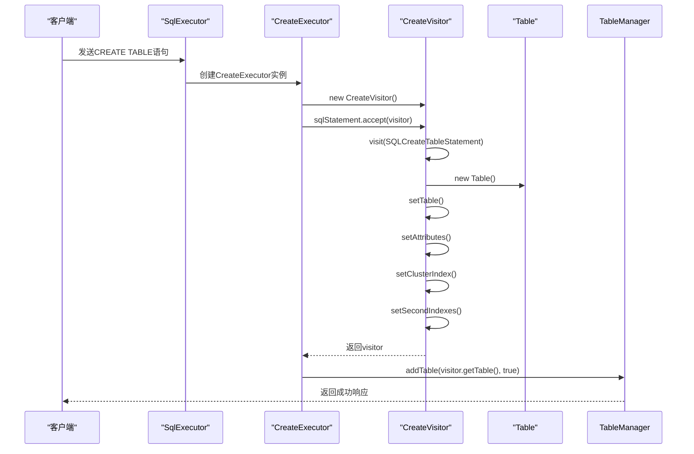
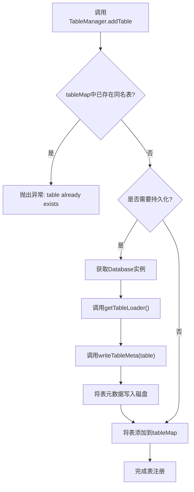
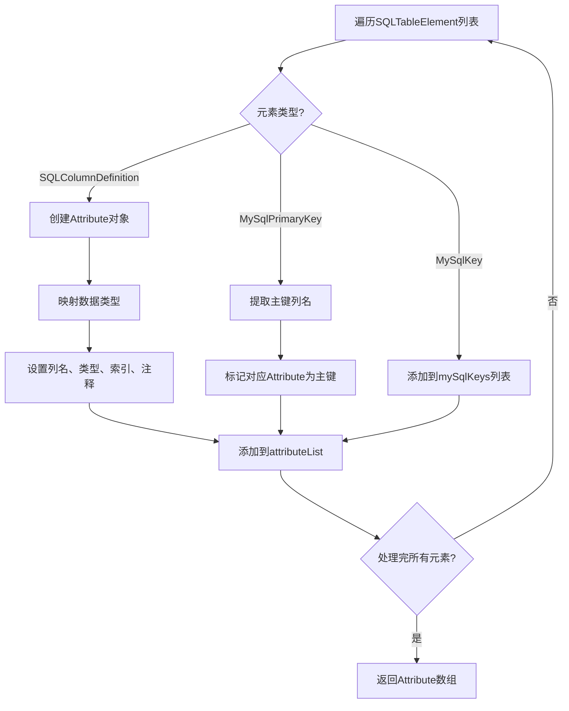
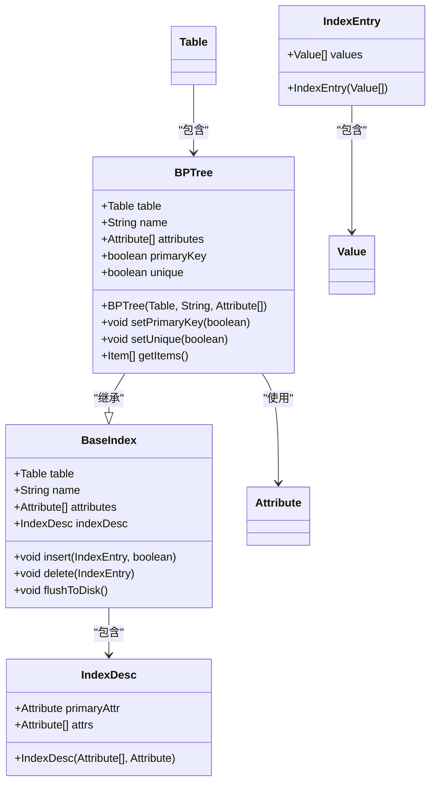
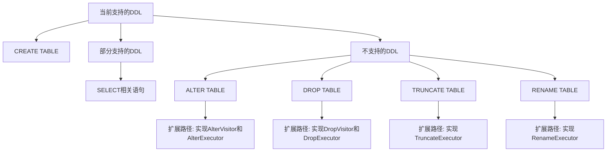

# DDL执行

<cite>
**本文档引用的文件**
- [CreateExecutor.java](file://src/main/java/alchemystar/freedom/sql/CreateExecutor.java)
- [CreateVisitor.java](file://src/main/java/alchemystar/freedom/sql/parser/CreateVisitor.java)
- [TableManager.java](file://src/main/java/alchemystar/freedom/meta/TableManager.java)
- [Table.java](file://src/main/java/alchemystar/freedom/meta/Table.java)
- [TableLoader.java](file://src/main/java/alchemystar/freedom/meta/TableLoader.java)
- [Database.java](file://src/main/java/alchemystar/freedom/engine/Database.java)
- [Attribute.java](file://src/main/java/alchemystar/freedom/meta/Attribute.java)
</cite>

## 目录
1. [简介](#简介)
2. [DDL执行流程概述](#ddl执行流程概述)
3. [核心组件分析](#核心组件分析)
4. [SQL解析与元数据构建](#sql解析与元数据构建)
5. [表注册与持久化机制](#表注册与持久化机制)
6. [字段类型映射与约束处理](#字段类型映射与约束处理)
7. [索引创建机制](#索引创建机制)
8. [不支持的DDL语句及扩展路径](#不支持的ddl语句及扩展路径)
9. [结论](#结论)

## 简介
本文档详细描述了Freedom数据库系统中DDL（数据定义语言）执行机制的实现原理，重点分析了`CREATE TABLE`语句从SQL解析到元数据落盘的完整流程。文档深入探讨了`CreateExecutor`如何通过`CreateVisitor`解析SQL语句并构建表元数据对象，以及`TableManager`如何将新表注册到全局元数据管理器中并实现持久化存储。同时，文档还涵盖了字段类型映射、主键约束处理、索引自动创建等关键实现细节，并说明了当前不支持的DDL语句类型及其可能的扩展实现路径。

## DDL执行流程概述
DDL执行流程始于SQL语句的接收，经过解析、元数据构建、表注册和持久化四个主要阶段。当接收到`CREATE TABLE`语句时，系统首先通过Druid SQL解析器生成抽象语法树（AST），然后由`CreateExecutor`调用`CreateVisitor`遍历AST并构建`Table`元数据对象。构建完成后，`TableManager`负责将新表注册到全局表映射中，并通过`TableLoader`将表结构持久化到磁盘。

**Diagram sources**
- [CreateExecutor.java](file://src/main/java/alchemystar/freedom/sql/CreateExecutor.java#L10-L30)
- [CreateVisitor.java](file://src/main/java/alchemystar/freedom/sql/parser/CreateVisitor.java#L26-L124)
- [TableManager.java](file://src/main/java/alchemystar/freedom/meta/TableManager.java#L15-L70)

**Section sources**
- [CreateExecutor.java](file://src/main/java/alchemystar/freedom/sql/CreateExecutor.java#L10-L30)
- [CreateVisitor.java](file://src/main/java/alchemystar/freedom/sql/parser/CreateVisitor.java#L26-L124)
- [TableManager.java](file://src/main/java/alchemystar/freedom/meta/TableManager.java#L15-L70)

## 核心组件分析
DDL执行机制涉及多个核心组件的协同工作，包括`CreateExecutor`、`CreateVisitor`、`TableManager`、`Table`、`TableLoader`和`Database`。这些组件共同完成了从SQL解析到元数据持久化的完整流程。

**Diagram sources**
- [CreateExecutor.java](file://src/main/java/alchemystar/freedom/sql/CreateExecutor.java#L10-L30)
- [CreateVisitor.java](file://src/main/java/alchemystar/freedom/sql/parser/CreateVisitor.java#L26-L124)
- [TableManager.java](file://src/main/java/alchemystar/freedom/meta/TableManager.java#L15-L70)
- [Table.java](file://src/main/java/alchemystar/freedom/meta/Table.java#L0-L172)
- [TableLoader.java](file://src/main/java/alchemystar/freedom/meta/TableLoader.java#L0-L109)
- [Database.java](file://src/main/java/alchemystar/freedom/engine/Database.java#L0-L78)

**Section sources**
- [CreateExecutor.java](file://src/main/java/alchemystar/freedom/sql/CreateExecutor.java#L10-L30)
- [CreateVisitor.java](file://src/main/java/alchemystar/freedom/sql/parser/CreateVisitor.java#L26-L124)
- [TableManager.java](file://src/main/java/alchemystar/freedom/meta/TableManager.java#L15-L70)

## SQL解析与元数据构建
`CreateExecutor`作为DDL执行的入口点，负责协调整个创建表的流程。它通过`init()`方法初始化`CreateVisitor`，并让SQL语句接受访问者模式的遍历，最终由`CreateVisitor`完成`Table`元数据对象的构建。

**Diagram sources**
- [CreateExecutor.java](file://src/main/java/alchemystar/freedom/sql/CreateExecutor.java#L10-L30)
- [CreateVisitor.java](file://src/main/java/alchemystar/freedom/sql/parser/CreateVisitor.java#L26-L124)

**Section sources**
- [CreateExecutor.java](file://src/main/java/alchemystar/freedom/sql/CreateExecutor.java#L10-L30)
- [CreateVisitor.java](file://src/main/java/alchemystar/freedom/sql/parser/CreateVisitor.java#L26-L124)

## 表注册与持久化机制
`TableManager`是全局元数据管理的核心组件，它维护着一个静态的`tableMap`来存储所有已注册的表。`addTable`方法不仅负责将新表添加到内存映射中，还根据`isPersist`参数决定是否将表结构持久化到磁盘。

**Diagram sources**
- [TableManager.java](file://src/main/java/alchemystar/freedom/meta/TableManager.java#L15-L70)
- [TableLoader.java](file://src/main/java/alchemystar/freedom/meta/TableLoader.java#L0-L109)
- [Database.java](file://src/main/java/alchemystar/freedom/engine/Database.java#L0-L78)

**Section sources**
- [TableManager.java](file://src/main/java/alchemystar/freedom/meta/TableManager.java#L15-L70)
- [TableLoader.java](file://src/main/java/alchemystar/freedom/meta/TableLoader.java#L0-L109)

## 字段类型映射与约束处理
在`CreateVisitor`的`getAttributes`方法中，系统会遍历`SQLTableElement`列表，识别列定义、主键约束和二级索引定义。字段类型映射通过`getType`方法实现，支持`int`、`bigint`/`long`、`varchar`/`String`和`bool`/`boolean`等基本类型。

**Diagram sources**
- [CreateVisitor.java](file://src/main/java/alchemystar/freedom/sql/parser/CreateVisitor.java#L26-L124)
- [Attribute.java](file://src/main/java/alchemystar/freedom/meta/Attribute.java#L0-L95)

**Section sources**
- [CreateVisitor.java](file://src/main/java/alchemystar/freedom/sql/parser/CreateVisitor.java#L26-L124)
- [Attribute.java](file://src/main/java/alchemystar/freedom/meta/Attribute.java#L0-L95)

## 索引创建机制
系统自动为每个表创建聚簇索引和二级索引。聚簇索引以主键为基础，而二级索引则根据`MySqlKey`定义创建。在二级索引中，系统会自动添加主键作为最后一列，以支持回表查询。

**Diagram sources**
- [CreateVisitor.java](file://src/main/java/alchemystar/freedom/sql/parser/CreateVisitor.java#L26-L124)
- [Table.java](file://src/main/java/alchemystar/freedom/meta/Table.java#L0-L172)
- [BPTree.java](file://src/main/java/alchemystar/freedom/index/bp/BPTree.java#L0-L0)

**Section sources**
- [CreateVisitor.java](file://src/main/java/alchemystar/freedom/sql/parser/CreateVisitor.java#L26-L124)
- [Table.java](file://src/main/java/alchemystar/freedom/meta/Table.java#L0-L172)

## 不支持的DDL语句及扩展路径
当前系统仅实现了`CREATE TABLE`语句的完整支持，而`ALTER TABLE`和`DROP TABLE`等DDL语句尚未实现。扩展这些功能需要在`SqlExecutor`中添加相应的执行器，并实现对应的访问者模式。

**Diagram sources**
- [CreateExecutor.java](file://src/main/java/alchemystar/freedom/sql/CreateExecutor.java#L10-L30)
- [SqlExecutor.java](file://src/main/java/alchemystar/freedom/sql/SqlExecutor.java#L0-L0)

**Section sources**
- [CreateExecutor.java](file://src/main/java/alchemystar/freedom/sql/CreateExecutor.java#L10-L30)
- [SqlExecutor.java](file://src/main/java/alchemystar/freedom/sql/SqlExecutor.java#L0-L0)

## 结论
Freedom数据库的DDL执行机制通过`CreateExecutor`、`CreateVisitor`和`TableManager`等组件的协同工作，实现了从SQL解析到元数据持久化的完整流程。系统采用访问者模式解析SQL语句，构建包含字段、主键和索引的完整表元数据，并通过`TableLoader`将元数据持久化到磁盘。虽然当前仅支持`CREATE TABLE`语句，但其模块化的设计为扩展`ALTER`、`DROP`等其他DDL语句提供了清晰的实现路径。未来可以通过添加相应的访问者和执行器来完善DDL功能的完整性。