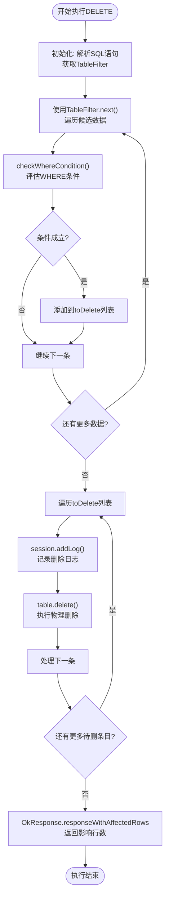
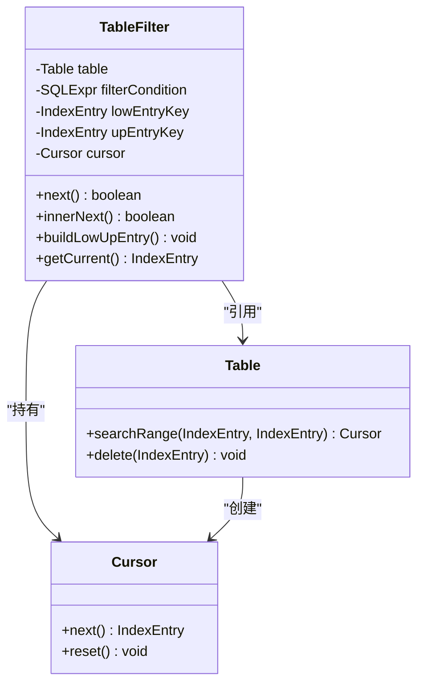
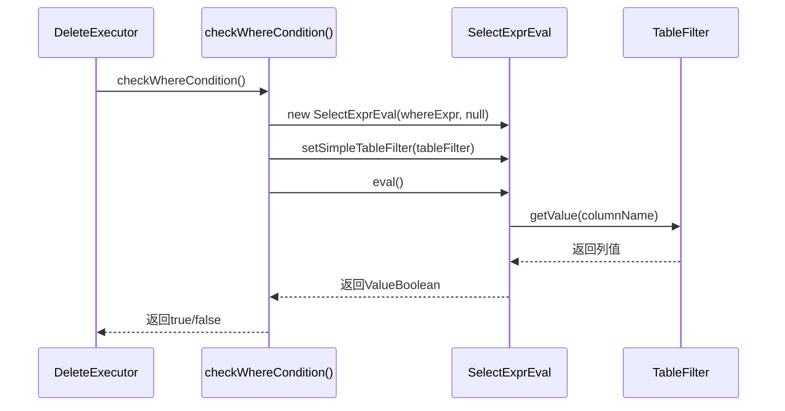
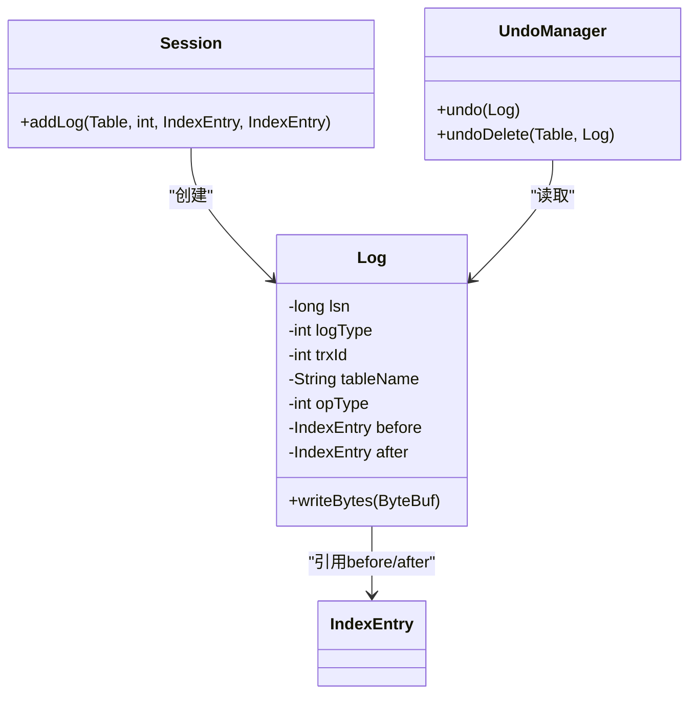

# DELETE执行

<cite>
**本文档引用的文件**  
- [DeleteExecutor.java](file://src/main/java/alchemystar/freedom/sql/DeleteExecutor.java)
- [TableFilter.java](file://src/main/java/alchemystar/freedom/sql/select/TableFilter.java)
- [Table.java](file://src/main/java/alchemystar/freedom/meta/Table.java)
- [Log.java](file://src/main/java/alchemystar/freedom/transaction/log/Log.java)
- [Session.java](file://src/main/java/alchemystar/freedom/engine/session/Session.java)
</cite>

## 目录
1. [简介](#简介)
2. [核心执行流程](#核心执行流程)
3. [条件扫描与TableFilter机制](#条件扫描与tablefilter机制)
4. [WHERE条件评估实现](#where条件评估实现)
5. [删除操作的两阶段设计](#删除操作的两阶段设计)
6. [事务日志记录与回滚机制](#事务日志记录与回滚机制)
7. [影响行数返回机制](#影响行数返回机制)
8. [总结](#总结)

## 简介
本文档详细阐述了Freedom数据库系统中`DELETE`语句的执行机制。重点分析`DeleteExecutor`如何利用`TableFilter`进行条件扫描并安全删除数据，解释为何需要先收集待删除条目再执行删除操作以避免迭代器失效问题，说明事务日志记录与存储层删除的调用顺序及其在事务回滚中的作用，并深入解析WHERE条件评估逻辑与影响行数返回机制。

## 核心执行流程

`DeleteExecutor`是DELETE语句的核心执行器，负责解析、条件评估、数据扫描与删除操作的协调。其执行流程如下：

1. **初始化**：通过`DeleteVisitor`解析SQL语句，提取表信息和WHERE条件。
2. **条件扫描**：使用`TableFilter`遍历满足条件的数据条目。
3. **条件评估**：对每个候选条目调用`checkWhereCondition`进行WHERE表达式求值。
4. **待删列表收集**：将满足条件的条目暂存于`toDelete`列表中。
5. **事务日志记录**：为每个待删条目生成删除日志并添加到会话中。
6. **物理删除**：调用`Table.delete()`方法从存储层移除数据。
7. **响应返回**：向客户端返回包含影响行数的OK响应。



**图示来源**  
- [DeleteExecutor.java](file://src/main/java/alchemystar/freedom/sql/DeleteExecutor.java#L25-L74)

**本节来源**  
- [DeleteExecutor.java](file://src/main/java/alchemystar/freedom/sql/DeleteExecutor.java#L25-L74)

## 条件扫描与TableFilter机制

`TableFilter`是DELETE语句执行过程中用于数据扫描的核心组件，它封装了对表数据的访问逻辑，支持基于索引的范围扫描。

### 扫描过程
`TableFilter.next()`方法驱动扫描过程，其内部通过`innerNext()`实现迭代逻辑。扫描前会调用`buildLowUpEntry()`构建扫描的上下界（`lowEntryKey`和`upEntryKey`），然后通过`table.searchRange(lowEntryKey, upEntryKey)`获取游标（Cursor）进行高效范围扫描。

### 范围构建逻辑
- **无WHERE条件**：构建全空键，扫描全表。
- **含等值/范围条件**：根据`=`、`>=`、`<=`等操作符构建上下界。
- **含OR表达式**：禁用范围优化，设置`upEntryKey`为null，退化为全表扫描。



**图示来源**  
- [TableFilter.java](file://src/main/java/alchemystar/freedom/sql/select/TableFilter.java#L50-L278)
- [Table.java](file://src/main/java/alchemystar/freedom/meta/Table.java#L100-L120)

**本节来源**  
- [TableFilter.java](file://src/main/java/alchemystar/freedom/sql/select/TableFilter.java#L50-L278)
- [Table.java](file://src/main/java/alchemystar/freedom/meta/Table.java#L100-L120)

## WHERE条件评估实现

WHERE条件的评估由`checkWhereCondition()`方法完成，其核心是利用`SelectExprEval`对表达式进行求值。

### 评估流程
1. 创建`SelectExprEval`实例，传入WHERE表达式和`TableFilter`。
2. 调用`eval()`方法执行表达式求值。
3. 检查返回值类型是否为`ValueBoolean`。
4. 返回布尔结果，决定是否保留该条目。

### 表达式求值上下文
`SelectExprEval`通过`setSimpleTableFilter()`方法绑定当前`TableFilter`，确保在求值过程中能正确解析列引用（如`column_name = 'value'`）。

### 异常处理
若表达式求值结果非布尔类型，系统将抛出运行时异常，防止逻辑错误导致意外删除。



**图示来源**  
- [DeleteExecutor.java](file://src/main/java/alchemystar/freedom/sql/DeleteExecutor.java#L50-L60)
- [TableFilter.java](file://src/main/java/alchemystar/freedom/sql/select/TableFilter.java#L150-L170)

**本节来源**  
- [DeleteExecutor.java](file://src/main/java/alchemystar/freedom/sql/DeleteExecutor.java#L50-L60)

## 删除操作的两阶段设计

DELETE操作采用“先收集，后删除”的两阶段设计，核心目的是**避免迭代器失效问题**。

### 问题背景
在遍历数据集的同时进行删除操作，会改变底层数据结构（如B+树节点分裂/合并），导致游标（Cursor）的内部状态失效，可能引发：
- 跳过某些条目
- 重复处理条目
- 空指针异常
- 数据不一致

### 解决方案
1. **第一阶段（收集）**：在`while (tableFilter.next())`循环中，仅评估条件并将满足条件的`IndexEntry`添加到`toDelete`列表中，不进行任何物理删除。
2. **第二阶段（删除）**：循环结束后，遍历`toDelete`列表，对每个条目执行日志记录和物理删除。

此设计确保了扫描过程的稳定性，即使后续删除操作改变了数据结构，也不会影响已完成的扫描结果。

```mermaid
flowchart TD
A[开始扫描] --> B{tableFilter.next()}
B --> |有数据| C[评估WHERE条件]
C --> D{条件成立?}
D --> |是| E[添加到toDelete列表]
D --> |否| F[继续]
E --> F
F --> B
B --> |无数据| G[结束扫描]
G --> H{遍历toDelete列表}
H --> |有条目| I[记录日志]
I --> J[物理删除]
J --> K[下一条]
K --> H
H --> |无条目| L[返回响应]
```

**图示来源**  
- [DeleteExecutor.java](file://src/main/java/alchemystar/freedom/sql/DeleteExecutor.java#L30-L45)

**本节来源**  
- [DeleteExecutor.java](file://src/main/java/alchemystar/freedom/sql/DeleteExecutor.java#L30-L45)

## 事务日志记录与回滚机制

DELETE操作的事务安全性依赖于日志记录机制，确保操作的原子性和可回滚性。

### 日志记录顺序
在`DeleteExecutor.execute()`方法中，日志记录与物理删除的调用顺序至关重要：

```java
for (IndexEntry delItem : toDelete) {
    if (session != null) {
        session.addLog(table, OpType.delete, delItem, null);
    }
    table.delete(delItem);
}
```

1. **先记录日志**：调用`session.addLog()`生成一条`DELETE`类型的日志（Log），包含表名、操作类型和被删条目（作为`before`字段）。
2. **后执行删除**：调用`table.delete()`从存储层移除数据。

### 回滚机制
- **日志内容**：`Log`对象记录了被删除条目的完整状态（`before`字段），`after`字段为null。
- **回滚操作**：当事务回滚时，系统通过`UndoManager`读取日志，执行反向操作——将`before`字段中的条目重新插入表中，实现数据恢复。
- **幂等性**：每条日志有唯一LSN（日志序列号），确保恢复过程的正确性。



**图示来源**  
- [Log.java](file://src/main/java/alchemystar/freedom/transaction/log/Log.java#L10-L150)
- [DeleteExecutor.java](file://src/main/java/alchemystar/freedom/sql/DeleteExecutor.java#L40-L43)

**本节来源**  
- [Log.java](file://src/main/java/alchemystar/freedom/transaction/log/Log.java#L10-L150)
- [DeleteExecutor.java](file://src/main/java/alchemystar/freedom/sql/DeleteExecutor.java#L40-L43)

## 影响行数返回机制

DELETE语句执行完成后，系统需向客户端返回受影响的行数。该功能由`OkResponse.responseWithAffectedRows()`方法实现。

### 计算方式
影响行数直接等于`toDelete`列表的大小：
```java
OkResponse.responseWithAffectedRows(con, toDelete.size());
```
- `toDelete.size()`：在条件扫描阶段确定，精确反映满足WHERE条件并被成功删除的行数。
- 该计数在物理删除前已确定，不受后续删除操作成败影响。

### 响应构造
`responseWithAffectedRows`方法构造符合MySQL协议的OK包，包含：
- 状态标志（0x00）
- 影响行数（以变长整数编码）
- 服务器状态
- 警告数

此响应通过`FrontendConnection`发送给客户端，完成整个DELETE操作的交互。

**本节来源**  
- [DeleteExecutor.java](file://src/main/java/alchemystar/freedom/sql/DeleteExecutor.java#L44-L45)

## 总结
Freedom数据库的DELETE执行机制设计严谨，通过`DeleteExecutor`协调`TableFilter`进行高效条件扫描，采用两阶段删除避免迭代器失效问题。WHERE条件通过`SelectExprEval`精确求值，确保删除的准确性。事务日志的先写后删策略保障了操作的原子性和可恢复性。最终，影响行数基于预收集的`toDelete`列表精确返回，为客户端提供清晰的执行反馈。整个流程体现了数据库系统在正确性、性能和事务安全之间的精妙平衡。