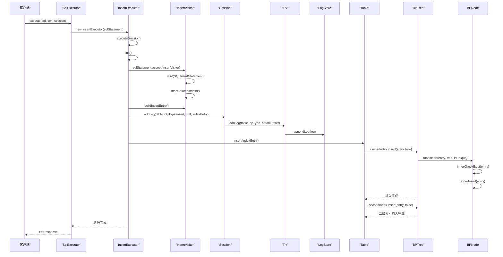
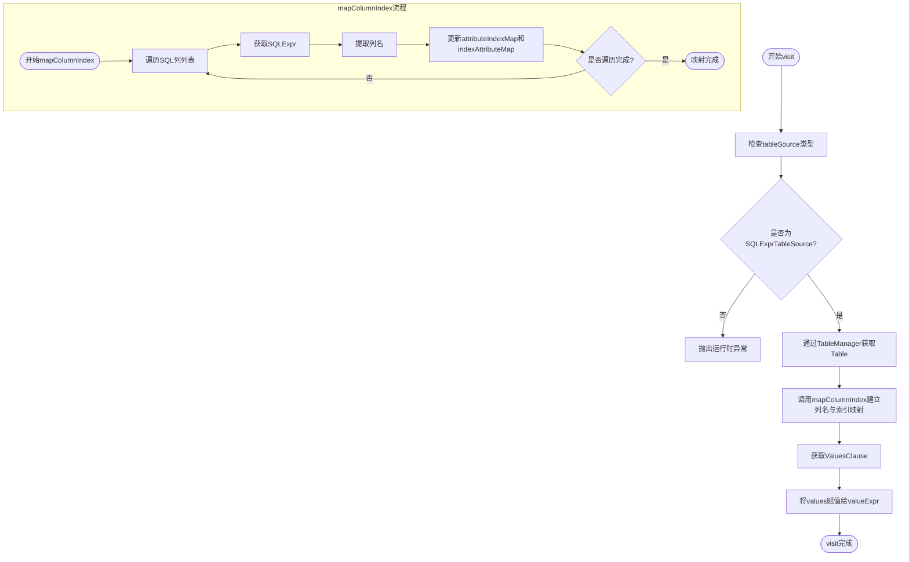
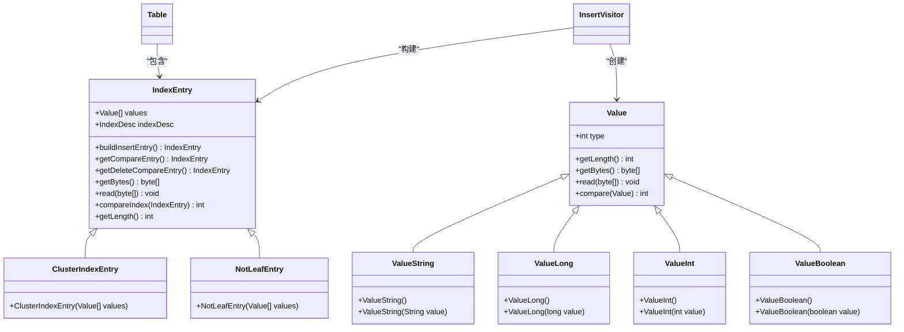
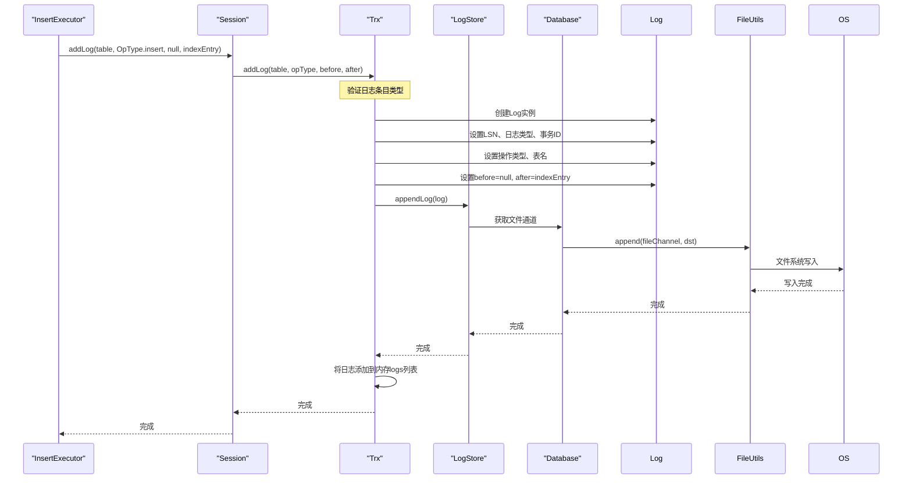
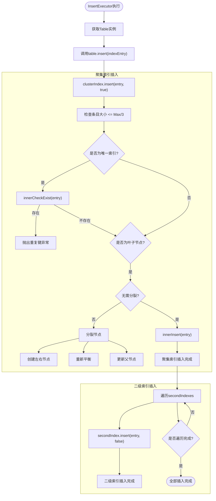
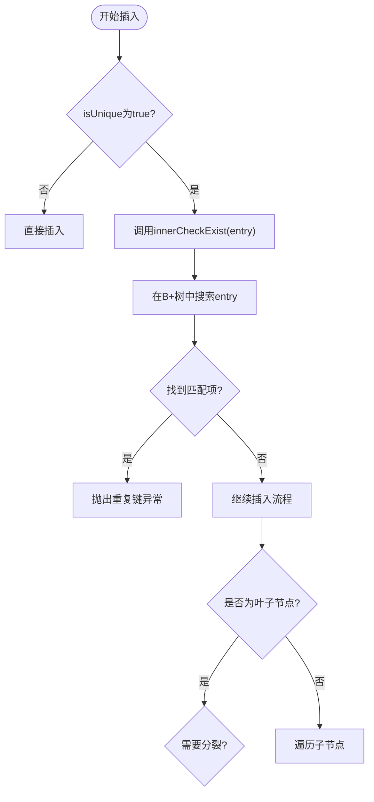
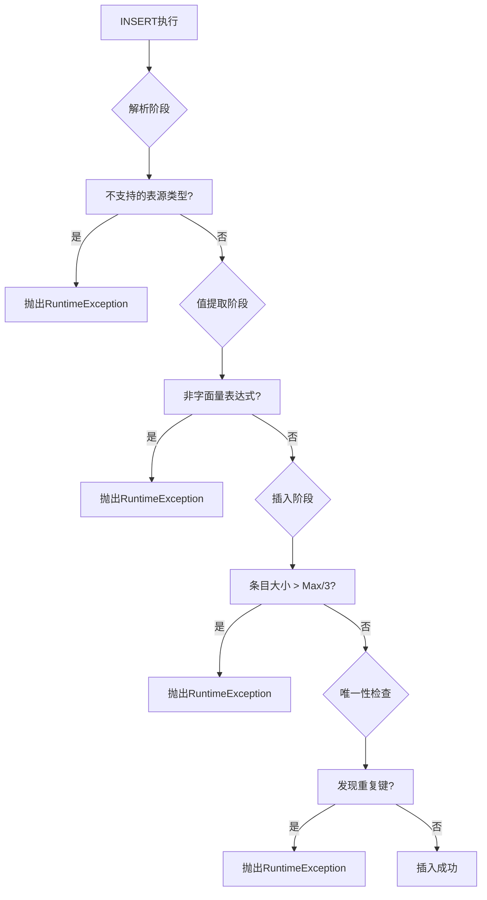

# INSERT执行

<cite>
**本文档中引用的文件**   
- [InsertExecutor.java](file://src/main/java/alchemystar/freedom/sql/InsertExecutor.java)
- [InsertVisitor.java](file://src/main/java/alchemystar/freedom/sql/parser/InsertVisitor.java)
- [IndexEntry.java](file://src/main/java/alchemystar/freedom/meta/IndexEntry.java)
- [Table.java](file://src/main/java/alchemystar/freedom/meta/Table.java)
- [Trx.java](file://src/main/java/alchemystar/freedom/transaction/Trx.java)
- [Log.java](file://src/main/java/alchemystar/freedom/transaction/log/Log.java)
- [Session.java](file://src/main/java/alchemystar/freedom/engine/session/Session.java)
</cite>

## 目录
1. [简介](#简介)
2. [核心组件分析](#核心组件分析)
3. [INSERT执行流程](#insert执行流程)
4. [InsertVisitor值提取机制](#insertvisitor值提取机制)
5. [IndexEntry构建过程](#indexentry构建过程)
6. [WAL协议实现](#wal协议实现)
7. [存储层写入流程](#存储层写入流程)
8. [主键约束检查](#主键约束检查)
9. [多值插入处理](#多值插入处理)
10. [错误处理策略](#错误处理策略)
11. [性能优化建议](#性能优化建议)

## 简介
本文档深入解析Freedom数据库系统中INSERT语句的执行流程，重点阐述`InsertExecutor`如何通过`InsertVisitor`提取值列表并构建`IndexEntry`数据条目。详细说明`execute`方法中事务日志记录与存储层写入的执行顺序，强调WAL（预写日志）协议的实现机制。文档还将分析主键约束检查机制和错误处理策略，并提供性能优化建议。

## 核心组件分析

**Section sources**
- [InsertExecutor.java](file://src/main/java/alchemystar/freedom/sql/InsertExecutor.java#L1-L38)
- [InsertVisitor.java](file://src/main/java/alchemystar/freedom/sql/parser/InsertVisitor.java#L1-L98)
- [IndexEntry.java](file://src/main/java/alchemystar/freedom/meta/IndexEntry.java#L1-L181)
- [Table.java](file://src/main/java/alchemystar/freedom/meta/Table.java#L1-L172)

## INSERT执行流程



**Diagram sources**
- [InsertExecutor.java](file://src/main/java/alchemystar/freedom/sql/InsertExecutor.java#L12-L38)
- [InsertVisitor.java](file://src/main/java/alchemystar/freedom/sql/parser/InsertVisitor.java#L26-L98)
- [Table.java](file://src/main/java/alchemystar/freedom/meta/Table.java#L64-L71)
- [Trx.java](file://src/main/java/alchemystar/freedom/transaction/Trx.java#L44-L62)
- [Log.java](file://src/main/java/alchemystar/freedom/transaction/log/Log.java#L74-L118)

## InsertVisitor值提取机制



**Diagram sources**
- [InsertVisitor.java](file://src/main/java/alchemystar/freedom/sql/parser/InsertVisitor.java#L33-L67)
- [InsertVisitor.java](file://src/main/java/alchemystar/freedom/sql/parser/InsertVisitor.java#L73-L98)

**Section sources**
- [InsertVisitor.java](file://src/main/java/alchemystar/freedom/sql/parser/InsertVisitor.java#L26-L98)

## IndexEntry构建过程



**Diagram sources**
- [IndexEntry.java](file://src/main/java/alchemystar/freedom/meta/IndexEntry.java#L18-L180)
- [InsertVisitor.java](file://src/main/java/alchemystar/freedom/sql/parser/InsertVisitor.java#L45-L67)
- [Value.java](file://src/main/java/alchemystar/freedom/meta/value/Value.java)
- [ValueString.java](file://src/main/java/alchemystar/freedom/meta/value/ValueString.java)
- [ValueLong.java](file://src/main/java/alchemystar/freedom/meta/value/ValueLong.java)

**Section sources**
- [IndexEntry.java](file://src/main/java/alchemystar/freedom/meta/IndexEntry.java#L18-L180)
- [InsertVisitor.java](file://src/main/java/alchemystar/freedom/sql/parser/InsertVisitor.java#L45-L67)

## WAL协议实现



**Diagram sources**
- [Trx.java](file://src/main/java/alchemystar/freedom/transaction/Trx.java#L44-L62)
- [Log.java](file://src/main/java/alchemystar/freedom/transaction/log/Log.java#L74-L118)
- [LogStore.java](file://src/main/java/alchemystar/freedom/store/log/LogStore.java#L72-L112)
- [FileUtils.java](file://src/main/java/alchemystar/freedom/store/fs/FileUtils.java)

**Section sources**
- [Trx.java](file://src/main/java/alchemystar/freedom/transaction/Trx.java#L44-L62)
- [Log.java](file://src/main/java/alchemystar/freedom/transaction/log/Log.java#L74-L118)

## 存储层写入流程



**Diagram sources**
- [Table.java](file://src/main/java/alchemystar/freedom/meta/Table.java#L64-L71)
- [BPTree.java](file://src/main/java/alchemystar/freedom/index/bp/BPTree.java#L232-L236)
- [BPNode.java](file://src/main/java/alchemystar/freedom/index/bp/BPNode.java#L126-L228)

**Section sources**
- [Table.java](file://src/main/java/alchemystar/freedom/meta/Table.java#L64-L71)
- [BPNode.java](file://src/main/java/alchemystar/freedom/index/bp/BPNode.java#L126-L228)

## 主键约束检查
在B+树节点插入过程中，系统会自动进行主键约束检查。当插入操作针对唯一索引（`isUnique=true`）时，系统会调用`innerCheckExist(entry)`方法检查是否存在重复键值。如果发现重复键，则抛出运行时异常，阻止插入操作。这种检查机制确保了主键的唯一性约束得到严格执行。



**Diagram sources**
- [BPNode.java](file://src/main/java/alchemystar/freedom/index/bp/BPNode.java#L126-L140)
- [BPNode.java](file://src/main/java/alchemystar/freedom/index/bp/BPNode.java#L141-L228)

**Section sources**
- [BPNode.java](file://src/main/java/alchemystar/freedom/index/bp/BPNode.java#L126-L228)

## 多值插入处理
当前系统仅支持单条INSERT语句的处理。在`InsertVisitor`的`visit`方法中，代码注释明确指出"只支持单条insert"。系统通过`SQLInsertStatement.ValuesClause`获取值列表，但仅处理第一条记录。对于多值插入场景，如`INSERT INTO table VALUES (1,'a'), (2,'b')`，系统目前无法正确处理，需要进行功能扩展。

```java
// 只支持单条insert
valueExpr = valuesClause.getValues();
```

要支持多值插入，需要修改`InsertVisitor`和`InsertExecutor`的实现，使其能够遍历所有值列表，并为每个值列表构建独立的`IndexEntry`，然后依次执行插入操作。

**Section sources**
- [InsertVisitor.java](file://src/main/java/alchemystar/freedom/sql/parser/InsertVisitor.java#L33-L67)

## 错误处理策略
系统采用分层的错误处理策略。在解析阶段，如果遇到不支持的表源类型，会抛出运行时异常。在值提取阶段，如果遇到不支持的表达式类型（非字面量），也会抛出运行时异常。在索引插入阶段，如果条目大小超过页面空间的1/3，会抛出运行时异常。在唯一性检查阶段，如果发现重复键，会抛出运行时异常。所有异常都会中断当前操作并向上抛出，确保数据一致性。



**Section sources**
- [InsertVisitor.java](file://src/main/java/alchemystar/freedom/sql/parser/InsertVisitor.java#L26-L98)
- [BPNode.java](file://src/main/java/alchemystar/freedom/index/bp/BPNode.java#L126-L228)

## 性能优化建议
1. **批量插入优化**：当前系统仅支持单条插入，建议扩展为批量插入功能。可以通过收集多个`IndexEntry`，然后一次性写入日志和存储层，减少I/O操作次数。

2. **日志写入优化**：考虑实现日志缓冲机制，在内存中累积多个日志条目后再批量写入磁盘，提高日志写入效率。

3. **索引插入优化**：对于大量数据插入场景，可以暂时禁用二级索引，先完成聚集索引插入，再批量构建二级索引。

4. **预分配空间**：对于已知大小的插入操作，可以预分配`Value[]`数组和字节缓冲区，避免频繁的内存分配。

5. **并行处理**：在多核环境下，可以考虑并行处理多个插入操作，充分利用系统资源。

6. **连接池优化**：复用`InsertVisitor`实例，避免频繁创建和销毁对象，减少GC压力。

**Section sources**
- [InsertExecutor.java](file://src/main/java/alchemystar/freedom/sql/InsertExecutor.java#L12-L38)
- [InsertVisitor.java](file://src/main/java/alchemystar/freedom/sql/parser/InsertVisitor.java#L26-L98)