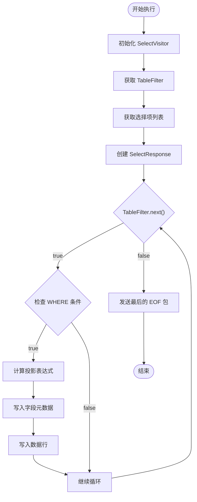
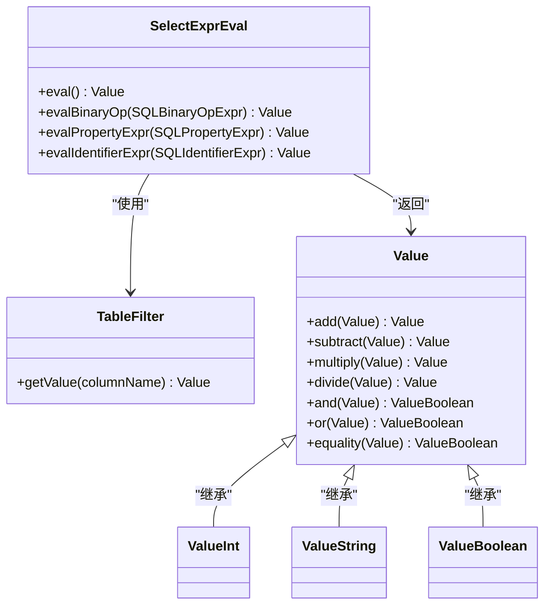
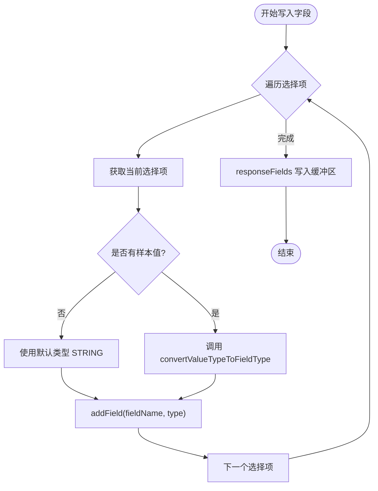
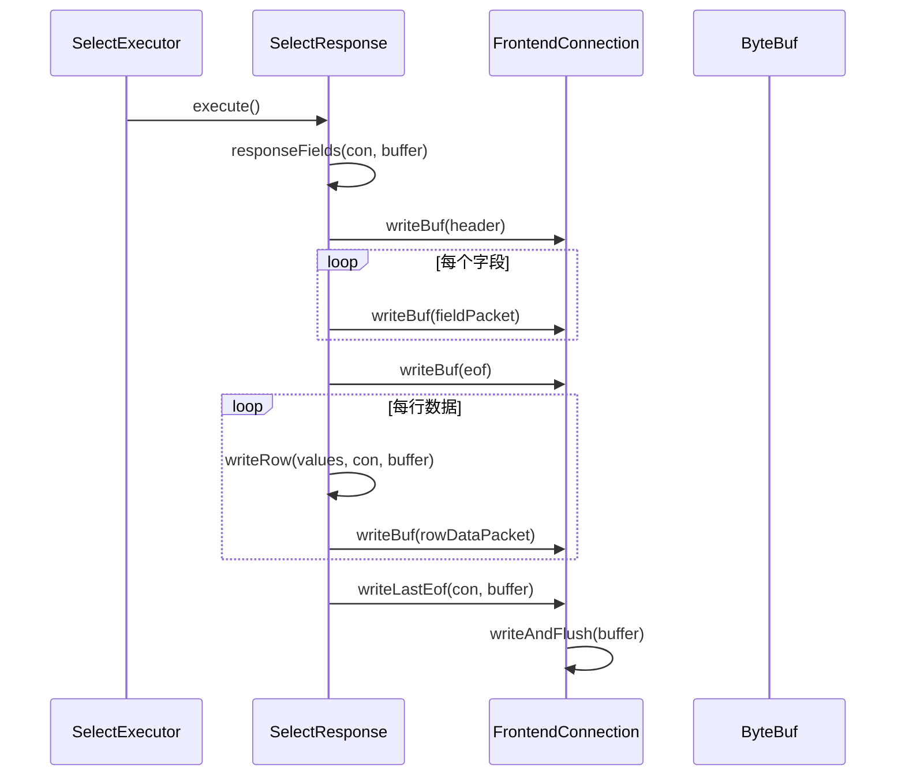

# SELECT执行

<cite>
**本文档中引用的文件**
- [SelectExecutor.java](file://src/main/java/alchemystar/freedom/sql/SelectExecutor.java)
- [SelectVisitor.java](file://src/main/java/alchemystar/freedom/sql/parser/SelectVisitor.java)
- [TableFilter.java](file://src/main/java/alchemystar/freedom/sql/select/TableFilter.java)
- [SelectExprEval.java](file://src/main/java/alchemystar/freedom/sql/select/item/SelectExprEval.java)
- [SelectResponse.java](file://src/main/java/alchemystar/freedom/engine/net/response/SelectResponse.java)
- [Value.java](file://src/main/java/alchemystar/freedom/meta/value/Value.java)
- [FrontendConnection.java](file://src/main/java/alchemystar/freedom/engine/net/handler/frontend/FrontendConnection.java)
</cite>

## 目录
1. [简介](#简介)
2. [核心组件与协作机制](#核心组件与协作机制)
3. [查询执行流程](#查询执行流程)
4. [结果集元数据推断与响应包生成](#结果集元数据推断与响应包生成)
5. 查询执行示例分析
6. [限制与不支持的功能](#限制与不支持的功能)
7. [结论](#结论)

## 简介
本文档全面解析Freedom数据库中的SELECT查询执行引擎。重点描述`SelectExecutor`如何协同`SelectVisitor`、`TableFilter`和`SelectExprEval`完成查询任务。详细说明从表扫描、WHERE条件评估、投影计算到结果集组装的完整迭代过程。深入分析结果集元数据动态推断机制和MySQL协议响应包的生成流程。

## 核心组件与协作机制

### 组件职责
- **SelectExecutor**：查询执行的主控器，负责初始化、驱动迭代、条件检查、投影计算和结果响应。
- **SelectVisitor**：SQL解析访问器，负责解析SELECT语句，提取表信息、选择项和WHERE条件，并构建`TableFilter`。
- **TableFilter**：表过滤器，负责表扫描迭代（`next()`）、WHERE条件评估（`checkWhereCondition()`）和当前行数据获取。
- **SelectExprEval**：表达式求值器，负责计算SELECT项和WHERE条件中的表达式值。

### 协作流程
1. `SelectExecutor`接收SQL语句和前端连接。
2. 创建`SelectVisitor`并解析SQL，生成`TableFilter`和选择项列表。
3. `SelectExecutor`通过`TableFilter.next()`驱动表扫描。
4. 对每一行，使用`SelectExprEval`评估WHERE条件。
5. 若条件通过，使用`SelectExprEval`计算投影表达式。
6. 将结果通过`SelectResponse`发送给客户端。

**Section sources**
- [SelectExecutor.java](file://src/main/java/alchemystar/freedom/sql/SelectExecutor.java#L20-L30)
- [SelectVisitor.java](file://src/main/java/alchemystar/freedom/sql/parser/SelectVisitor.java#L15-L25)
- [TableFilter.java](file://src/main/java/alchemystar/freedom/sql/select/TableFilter.java#L20-L30)
- [SelectExprEval.java](file://src/main/java/alchemystar/freedom/sql/select/item/SelectExprEval.java#L15-L25)

## 查询执行流程

### 执行主循环
`SelectExecutor.execute()`方法实现了查询执行的核心循环：



**Diagram sources**
- [SelectExecutor.java](file://src/main/java/alchemystar/freedom/sql/SelectExecutor.java#L40-L85)

**Section sources**
- [SelectExecutor.java](file://src/main/java/alchemystar/freedom/sql/SelectExecutor.java#L40-L85)

### 表扫描与WHERE条件评估
`TableFilter.next()`方法负责表的迭代扫描。它首先通过`buildLowUpEntry()`根据WHERE条件构建索引搜索范围，然后使用`Cursor`进行范围扫描。

```mermaid
sequenceDiagram
participant Executor as SelectExecutor
participant Filter as TableFilter
participant Cursor as Cursor
participant Eval as SelectExprEval
Executor->>Filter : next()
activate Filter
alt 未初始化
Filter->>Filter : buildLowUpEntry()
Filter->>Cursor : searchRange(low, up)
activate Cursor
Cursor-->>Filter : 返回游标
deactivate Cursor
Filter->>Filter : 设置 initialized = true
end
loop 每次调用
Filter->>Cursor : cursor.next()
activate Cursor
Cursor-->>Filter : 返回 IndexEntry
deactivate Cursor
alt 有连接条件
Filter->>Eval : eval(joinCondition)
Eval-->>Filter : 返回布尔值
alt 条件为真
Filter-->>Executor : true
else
continue
end
else
Filter-->>Executor : true
end
end
```

**Diagram sources**
- [TableFilter.java](file://src/main/java/alchemystar/freedom/sql/select/TableFilter.java#L50-L150)
- [SelectExprEval.java](file://src/main/java/alchemystar/freedom/sql/select/item/SelectExprEval.java#L50-L70)

**Section sources**
- [TableFilter.java](file://src/main/java/alchemystar/freedom/sql/select/TableFilter.java#L50-L150)

### 投影计算
当一行数据通过WHERE条件检查后，`SelectExecutor`会为每个选择项创建一个`SelectExprEval`实例来计算其值。



**Diagram sources**
- [SelectExprEval.java](file://src/main/java/alchemystar/freedom/sql/select/item/SelectExprEval.java#L35-L118)
- [Value.java](file://src/main/java/alchemystar/freedom/meta/value/Value.java#L15-L119)

**Section sources**
- [SelectExprEval.java](file://src/main/java/alchemystar/freedom/sql/select/item/SelectExprEval.java#L35-L118)

## 结果集元数据推断与响应包生成

### 元数据动态推断
`SelectResponse`类负责生成符合MySQL协议的响应包。其`writeFields`方法实现了结果集元数据的动态类型推断。



**Diagram sources**
- [SelectResponse.java](file://src/main/java/alchemystar/freedom/engine/net/response/SelectResponse.java#L90-L120)

**Section sources**
- [SelectResponse.java](file://src/main/java/alchemystar/freedom/engine/net/response/SelectResponse.java#L90-L120)

### MySQL协议响应包生成
完整的响应包遵循MySQL协议，包含以下部分：
1. **结果集头部包 (ResultSetHeaderPacket)**：包含字段数量。
2. **字段包 (FieldPacket)**：每个字段一个，包含名称和类型。
3. **EOF包 (EOFPacket)**：标志字段定义结束。
4. **数据行包 (RowDataPacket)**：每行一个，包含编码后的数据。
5. **最后的EOF包**：标志结果集结束。



**Diagram sources**
- [SelectResponse.java](file://src/main/java/alchemystar/freedom/engine/net/response/SelectResponse.java#L50-L85)
- [FrontendConnection.java](file://src/main/java/alchemystar/freedom/engine/net/handler/frontend/FrontendConnection.java#L150-L180)

**Section sources**
- [SelectResponse.java](file://src/main/java/alchemystar/freedom/engine/net/response/SelectResponse.java#L50-L85)

## 查询执行示例分析

### 简单查询
对于`SELECT id, name FROM user`：
1. `SelectVisitor`解析语句，无WHERE条件。
2. `TableFilter.next()`进行全表扫描。
3. `checkWhereCondition()`直接返回`true`。
4. `SelectExprEval`直接从当前行获取`id`和`name`的值。
5. 结果集元数据在第一行数据后推断出类型。

### 带WHERE条件的查询
对于`SELECT * FROM user WHERE age >= 18`：
1. `SelectVisitor`解析出WHERE条件`age >= 18`。
2. `buildLowUpEntry()`分析条件，设置索引搜索下界。
3. `TableFilter.next()`只扫描`age >= 18`的行。
4. `checkWhereCondition()`创建`SelectExprEval`评估`age >= 18`，返回布尔值。
5. 只有评估为`true`的行才会被投影和返回。

**Section sources**
- [SelectExecutor.java](file://src/main/java/alchemystar/freedom/sql/SelectExecutor.java#L70-L75)
- [TableFilter.java](file://src/main/java/alchemystar/freedom/sql/select/TableFilter.java#L100-L120)

## 限制与不支持的功能
当前SELECT执行引擎存在以下限制：
- **不支持JOIN**：虽然`TableFilter`有`join`字段和相关逻辑，但`SelectVisitor.checkJoinType()`明确抛出异常，仅支持`JOIN`和`INNER_JOIN`，其他类型不支持。
- **不支持复杂子查询**：解析器和执行器未实现子查询的处理逻辑。
- **不支持GROUP BY和聚合函数**：`SelectVisitor`和`SelectExecutor`中没有相关处理代码。
- **不支持ORDER BY**：没有排序逻辑的实现。
- **WHERE条件优化有限**：虽然能推断简单范围，但对复杂OR条件会退化为全表扫描。

**Section sources**
- [SelectVisitor.java](file://src/main/java/alchemystar/freedom/sql/parser/SelectVisitor.java#L130-L135)

## 结论
Freedom数据库的SELECT执行引擎通过`SelectExecutor`、`SelectVisitor`、`TableFilter`和`SelectExprEval`的紧密协作，实现了基本的查询功能。它支持全表扫描、基于索引的范围扫描、WHERE条件过滤和投影计算，并能动态推断结果集类型，生成标准的MySQL协议响应。然而，该引擎目前功能较为基础，不支持JOIN、聚合、排序等复杂查询，适用于简单的OLTP场景。