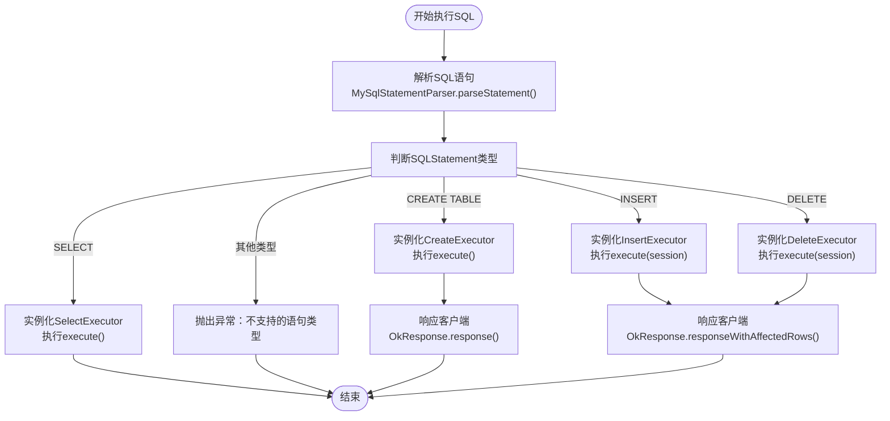
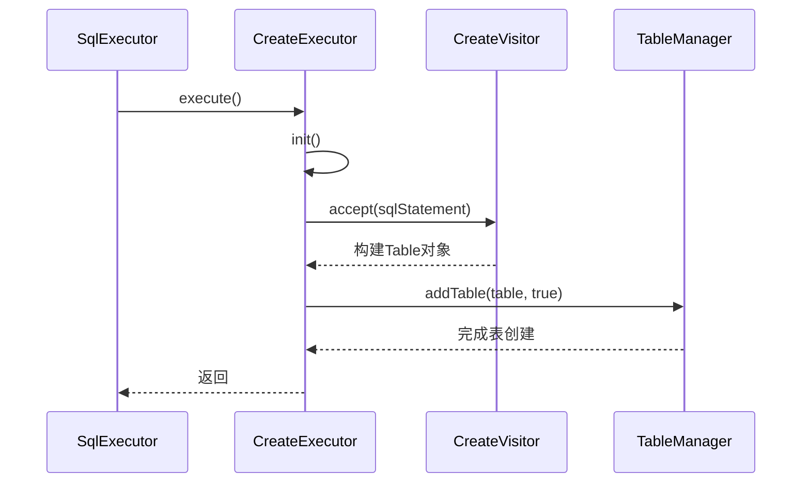
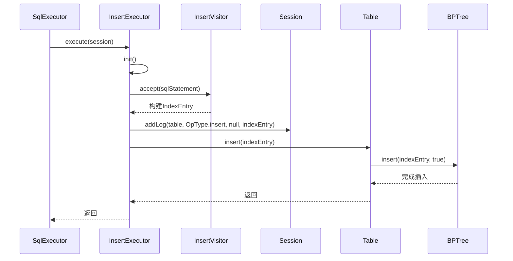
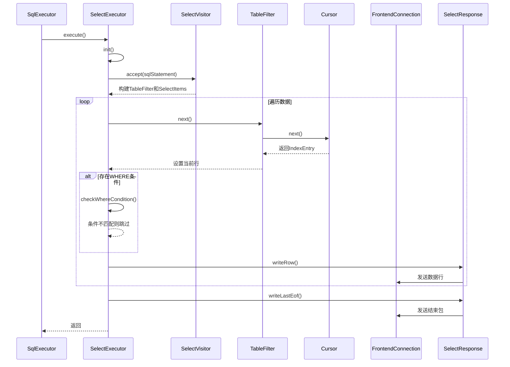
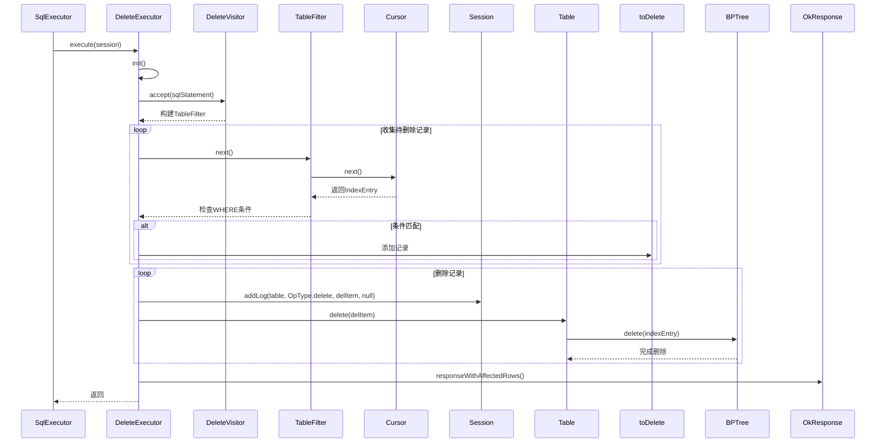
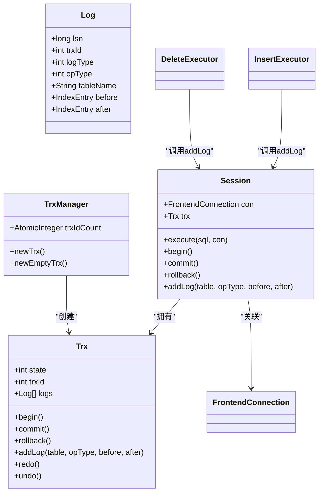
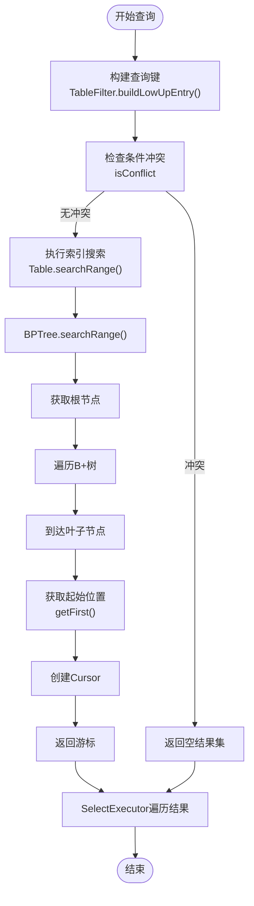

# SQL执行

<cite>
**本文档引用文件**  
- [SqlExecutor.java](file://src/main/java/alchemystar/freedom/sql/SqlExecutor.java)
- [CreateExecutor.java](file://src/main/java/alchemystar/freedom/sql/CreateExecutor.java)
- [InsertExecutor.java](file://src/main/java/alchemystar/freedom/sql/InsertExecutor.java)
- [SelectExecutor.java](file://src/main/java/alchemystar/freedom/sql/SelectExecutor.java)
- [DeleteExecutor.java](file://src/main/java/alchemystar/freedom/sql/DeleteExecutor.java)
- [FrontendConnection.java](file://src/main/java/alchemystar/freedom/engine/net/handler/frontend/FrontendConnection.java)
- [Session.java](file://src/main/java/alchemystar/freedom/engine/session/Session.java)
- [Table.java](file://src/main/java/alchemystar/freedom/meta/Table.java)
- [BPTree.java](file://src/main/java/alchemystar/freedom/index/bp/BPTree.java)
- [InsertVisitor.java](file://src/main/java/alchemystar/freedom/sql/parser/InsertVisitor.java)
- [SelectVisitor.java](file://src/main/java/alchemystar/freedom/sql/parser/SelectVisitor.java)
- [TableFilter.java](file://src/main/java/alchemystar/freedom/sql/select/TableFilter.java)
- [Trx.java](file://src/main/java/alchemystar/freedom/transaction/Trx.java)
- [TrxManager.java](file://src/main/java/alchemystar/freedom/transaction/TrxManager.java)
</cite>

## 目录
1. [引言](#引言)
2. [核心调度机制](#核心调度机制)
3. [执行器实现分析](#执行器实现分析)
   - [CreateExecutor](#createexecutor)
   - [InsertExecutor](#insertexecutor)
   - [SelectExecutor](#selectexecutor)
   - [DeleteExecutor](#deleteexecutor)
4. [事务与会话管理](#事务与会话管理)
5. [数据检索与索引机制](#数据检索与索引机制)
6. [不支持的SQL类型与扩展方法](#不支持的sql类型与扩展方法)

## 引言
本文档深入分析Freedom数据库系统的SQL执行引擎实现，重点阐述`SqlExecutor`作为核心调度中枢如何根据Druid解析出的SQL语句类型实例化相应的执行器，并详细说明各执行器与会话、连接及存储引擎的交互机制。

## 核心调度机制

`SqlExecutor`作为SQL执行的调度中枢，负责解析SQL语句并分发到相应的执行器。其核心流程如下：

**图示来源**
- [SqlExecutor.java](file://src/main/java/alchemystar/freedom/sql/SqlExecutor.java#L1-L50)

**本节来源**
- [SqlExecutor.java](file://src/main/java/alchemystar/freedom/sql/SqlExecutor.java#L1-L50)

## 执行器实现分析

### CreateExecutor
`CreateExecutor`负责处理CREATE TABLE语句，通过`CreateVisitor`解析表结构信息，并将新表注册到`TableManager`中。

**图示来源**
- [CreateExecutor.java](file://src/main/java/alchemystar/freedom/sql/CreateExecutor.java#L1-L31)
- [CreateVisitor.java](file://src/main/java/alchemystar/freedom/sql/parser/CreateVisitor.java)

**本节来源**
- [CreateExecutor.java](file://src/main/java/alchemystar/freedom/sql/CreateExecutor.java#L1-L31)

### InsertExecutor
`InsertExecutor`处理INSERT语句，解析值列表并调用存储层写入数据。执行过程包含事务日志记录和数据持久化。

**图示来源**
- [InsertExecutor.java](file://src/main/java/alchemystar/freedom/sql/InsertExecutor.java#L1-L39)
- [InsertVisitor.java](file://src/main/java/alchemystar/freedom/sql/parser/InsertVisitor.java)
- [Table.java](file://src/main/java/alchemystar/freedom/meta/Table.java)

**本节来源**
- [InsertExecutor.java](file://src/main/java/alchemystar/freedom/sql/InsertExecutor.java#L1-L39)

### SelectExecutor
`SelectExecutor`处理SELECT语句，结合B+树索引进行数据检索，并通过`FrontendConnection`返回结果集。

**图示来源**
- [SelectExecutor.java](file://src/main/java/alchemystar/freedom/sql/SelectExecutor.java#L1-L122)
- [SelectVisitor.java](file://src/main/java/alchemystar/freedom/sql/parser/SelectVisitor.java)
- [TableFilter.java](file://src/main/java/alchemystar/freedom/sql/select/TableFilter.java)

**本节来源**
- [SelectExecutor.java](file://src/main/java/alchemystar/freedom/sql/SelectExecutor.java#L1-L122)

### DeleteExecutor
`DeleteExecutor`处理DELETE语句，先收集待删除的记录，然后逐个删除并记录事务日志。

**图示来源**
- [DeleteExecutor.java](file://src/main/java/alchemystar/freedom/sql/DeleteExecutor.java#L1-L74)
- [DeleteVisitor.java](file://src/main/java/alchemystar/freedom/sql/parser/DeleteVisitor.java)
- [TableFilter.java](file://src/main/java/alchemystar/freedom/sql/select/TableFilter.java)

**本节来源**
- [DeleteExecutor.java](file://src/main/java/alchemystar/freedom/sql/DeleteExecutor.java#L1-L74)

## 事务与会话管理
SQL执行过程中，`Session`对象管理事务状态，`Trx`类实现事务的ACID特性。每个执行器通过`Session`与事务系统交互。

**图示来源**
- [Session.java](file://src/main/java/alchemystar/freedom/engine/session/Session.java)
- [Trx.java](file://src/main/java/alchemystar/freedom/transaction/Trx.java)
- [TrxManager.java](file://src/main/java/alchemystar/freedom/transaction/TrxManager.java)
- [InsertExecutor.java](file://src/main/java/alchemystar/freedom/sql/InsertExecutor.java)
- [DeleteExecutor.java](file://src/main/java/alchemystar/freedom/sql/DeleteExecutor.java)

**本节来源**
- [Session.java](file://src/main/java/alchemystar/freedom/engine/session/Session.java)
- [Trx.java](file://src/main/java/alchemystar/freedom/transaction/Trx.java)
- [TrxManager.java](file://src/main/java/alchemystar/freedom/transaction/TrxManager.java)

## 数据检索与索引机制
系统采用B+树索引进行高效数据检索。`TableFilter`结合`WhereVisitor`优化查询条件，`BPTree`实现索引的搜索操作。

**图示来源**
- [TableFilter.java](file://src/main/java/alchemystar/freedom/sql/select/TableFilter.java#L1-L278)
- [BPTree.java](file://src/main/java/alchemystar/freedom/index/bp/BPTree.java#L1-L277)
- [Table.java](file://src/main/java/alchemystar/freedom/meta/Table.java)

**本节来源**
- [TableFilter.java](file://src/main/java/alchemystar/freedom/sql/select/TableFilter.java#L1-L278)
- [BPTree.java](file://src/main/java/alchemystar/freedom/index/bp/BPTree.java#L1-L277)

## 不支持的SQL类型与扩展方法
当前系统仅支持基本的CRUD操作，以下SQL类型尚未支持：

- **UPDATE语句**：需要实现`UpdateExecutor`和`UpdateVisitor`
- **复杂JOIN**：目前仅支持INNER JOIN，需扩展`SelectVisitor`以支持其他JOIN类型
- **子查询**：需要增强`SelectVisitor`的解析能力
- **聚合函数**：需在`SelectExecutor`中实现SUM、COUNT等函数
- **事务控制语句**：如SAVEPOINT等，需扩展`FrontendConnection`的处理能力

扩展方法建议：
1. 实现`UpdateExecutor`类，类似`InsertExecutor`但包含旧值和新值
2. 增强`SelectVisitor`以支持更多SQL语法结构
3. 在`SqlExecutor`中添加对新语句类型的判断和分发
4. 实现相应的`Visitor`类来解析特定SQL结构
5. 更新`Table`类以支持更多操作类型

**本节来源**
- [SqlExecutor.java](file://src/main/java/alchemystar/freedom/sql/SqlExecutor.java#L45-L50)
- [SelectVisitor.java](file://src/main/java/alchemystar/freedom/sql/parser/SelectVisitor.java#L70-L75)