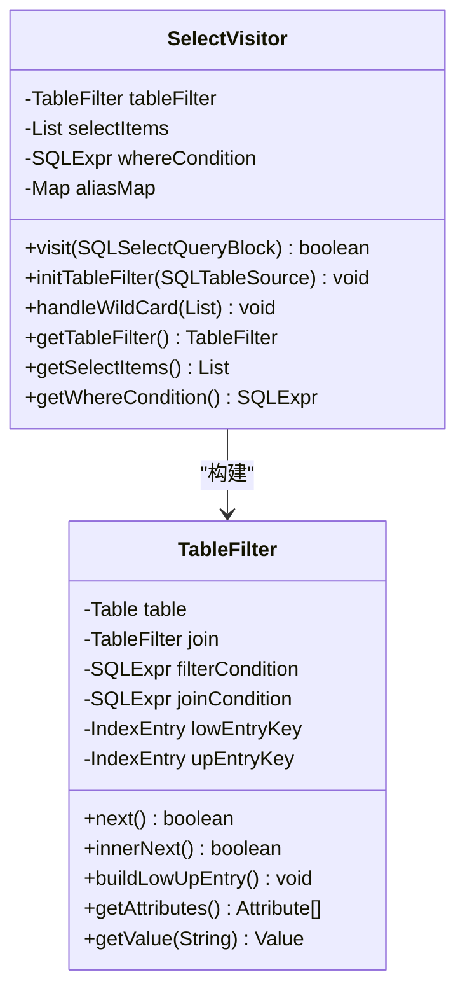
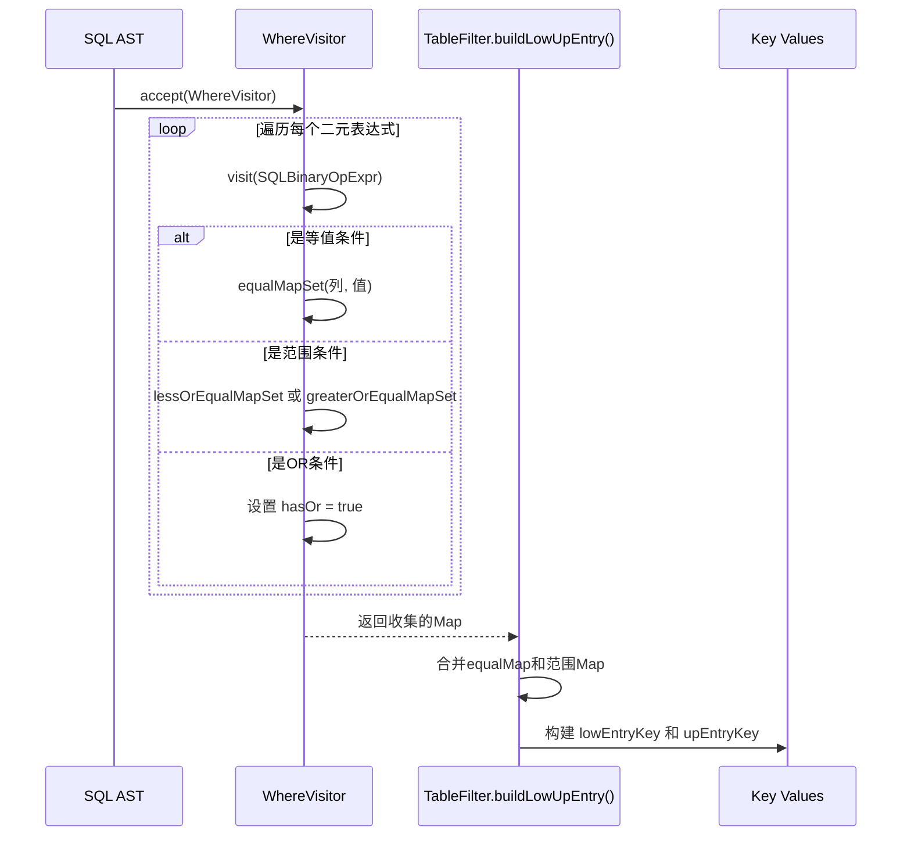
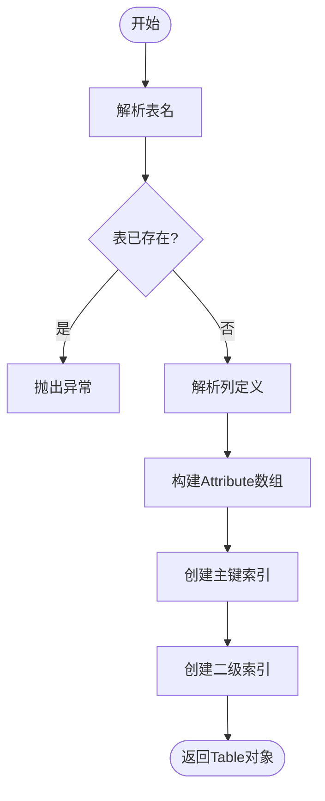
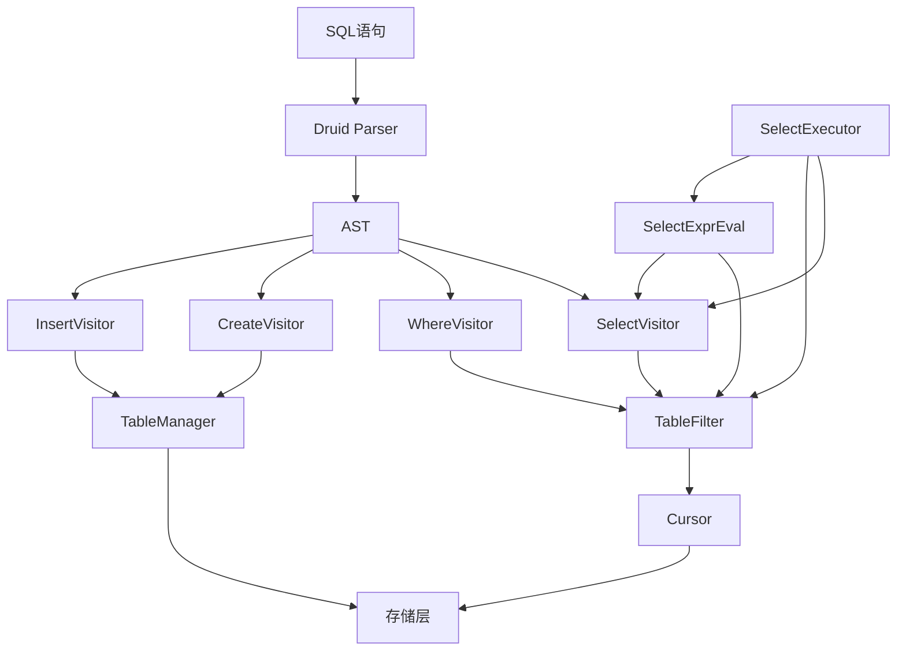

# AST语法树解析

<cite>
**本文档中引用的文件**  
- [SelectVisitor.java](file://src/main/java/alchemystar/freedom/sql/parser/SelectVisitor.java)
- [WhereVisitor.java](file://src/main/java/alchemystar/freedom/sql/parser/WhereVisitor.java)
- [TableFilter.java](file://src/main/java/alchemystar/freedom/sql/select/TableFilter.java)
- [CreateVisitor.java](file://src/main/java/alchemystar/freedom/sql/parser/CreateVisitor.java)
- [InsertVisitor.java](file://src/main/java/alchemystar/freedom/sql/parser/InsertVisitor.java)
- [SelectExecutor.java](file://src/main/java/alchemystar/freedom/sql/SelectExecutor.java)
</cite>

## 目录
1. [引言](#引言)
2. [核心组件分析](#核心组件分析)
3. [SelectVisitor 实现机制](#selectvisitor-实现机制)
4. [WhereVisitor 条件收集与边界生成](#wherevisitor-条件收集与边界生成)
5. [TableFilter 与查询执行](#tablefilter-与查询执行)
6. [其他 Visitor 类职责分析](#其他-visitor-类职责分析)
7. [完整查询转换流程示例](#完整查询转换流程示例)
8. [架构关系图](#架构关系图)
9. [结论](#结论)

## 引言
本文档深入解析基于Druid SQL解析器的AST访问者模式实现，重点阐述`SelectVisitor`和`WhereVisitor`在SELECT语句处理中的核心作用。通过分析语法树遍历机制、通配符展开、条件收集、索引边界构建等关键流程，揭示从SQL语句到内部查询结构的完整转换过程。同时说明`CreateVisitor`、`InsertVisitor`等其他访问者类的职责划分及其在语义分析与执行计划准备中的协同机制。

## 核心组件分析

本系统采用Druid SQL解析器构建抽象语法树（AST），并通过访问者模式（Visitor Pattern）对AST进行遍历与语义分析。核心组件包括：
- **SelectVisitor**：处理SELECT语句的FROM、SELECT子句，构建TableFilter并展开通配符。
- **WhereVisitor**：遍历WHERE子句，收集等值与范围条件，生成用于索引查找的边界值映射。
- **TableFilter**：表示查询中的表或连接结构，封装索引查找范围与连接逻辑。
- **CreateVisitor/InsertVisitor**：分别处理CREATE TABLE与INSERT语句的语义分析。

**Section sources**
- [SelectVisitor.java](file://src/main/java/alchemystar/freedom/sql/parser/SelectVisitor.java#L25-L185)
- [WhereVisitor.java](file://src/main/java/alchemystar/freedom/sql/parser/WhereVisitor.java#L21-L159)
- [TableFilter.java](file://src/main/java/alchemystar/freedom/sql/select/TableFilter.java#L23-L277)

## SelectVisitor 实现机制

`SelectVisitor`继承自`SQLASTVisitorAdapter`，负责处理SELECT语句的语法树节点。其主要职责包括：

1. **表结构初始化**：通过`initTableFilter`方法处理`FROM`子句，支持单表和`INNER JOIN`。对于连接操作，递归构建左、右表的`TableFilter`，并通过`setJoin`形成链式结构。
2. **通配符展开**：`handleWildCard`方法遍历`SELECT`列表，将`*`或`表名.*`展开为具体列。通过`TableManager`获取表元数据，动态生成`SQLSelectItem`列表。
3. **别名映射管理**：使用`aliasMap`维护表别名到`TableFilter`的映射，确保列引用能正确解析。
4. **连接类型检查**：仅支持`INNER JOIN`，其他连接类型将抛出异常。

该访问者最终生成一个`TableFilter`对象，作为后续查询执行的数据访问入口。



**Diagram sources**
- [SelectVisitor.java](file://src/main/java/alchemystar/freedom/sql/parser/SelectVisitor.java#L25-L185)
- [TableFilter.java](file://src/main/java/alchemystar/freedom/sql/select/TableFilter.java#L23-L277)

**Section sources**
- [SelectVisitor.java](file://src/main/java/alchemystar/freedom/sql/parser/SelectVisitor.java#L25-L185)

## WhereVisitor 条件收集与边界生成

`WhereVisitor`专门用于解析WHERE子句中的条件表达式，其核心功能是收集等值、范围条件并生成索引查找的边界值。

1. **条件分类收集**：
   - `equalMap`：存储等值条件（`=`）的列与值映射。
   - `greaterOrEqualMap`：存储大于等于（`>=`, `>`）的下界值。
   - `lessOrEqualMap`：存储小于等于（`<=`, `<`）的上界值。
2. **OR条件处理**：一旦检测到`OR`操作符，设置`hasOr=true`，指示后续执行器采用全表扫描而非索引查找。
3. **冲突检测**：若同一列存在多个不一致的等值条件（如 `id=1 AND id=2`），则标记`isConflict=true`，表示条件冲突。
4. **值类型转换**：`getValue`方法将SQL字面量（如字符串、数字）转换为内部`Value`对象（如`ValueString`, `ValueLong`）。

这些收集的信息最终被`TableFilter`用于构建索引查找的上下界键（`lowEntryKey`, `upEntryKey`）。



**Diagram sources**
- [WhereVisitor.java](file://src/main/java/alchemystar/freedom/sql/parser/WhereVisitor.java#L21-L159)
- [TableFilter.java](file://src/main/java/alchemystar/freedom/sql/select/TableFilter.java#L23-L277)

**Section sources**
- [WhereVisitor.java](file://src/main/java/alchemystar/freedom/sql/parser/WhereVisitor.java#L21-L159)

## TableFilter 与查询执行

`TableFilter`是查询执行的核心数据结构，它封装了表访问、索引查找和连接逻辑。

1. **索引范围构建**：`buildLowUpEntry`方法调用`WhereVisitor`分析`filterCondition`，根据收集的条件生成`lowEntryKey`（下界）和`upEntryKey`（上界）。若存在`OR`或冲突条件，则退化为全表扫描。
2. **数据游标初始化**：利用`table.searchRange(lowEntryKey, upEntryKey)`获取`Cursor`，实现基于B+树的范围扫描。
3. **连接处理**：对于`JOIN`，`TableFilter`通过`join`字段形成链式结构。`next()`方法在内层表上迭代，通过`checkJoinCondition()`评估连接条件。
4. **结果迭代**：`next()`方法协调主表与连接表的迭代，确保返回满足所有条件的行。

`SelectExecutor`通过`TableFilter`的`next()`接口逐行获取数据，并结合`SelectExprEval`计算SELECT列表中的表达式值。

**Section sources**
- [TableFilter.java](file://src/main/java/alchemystar/freedom/sql/select/TableFilter.java#L23-L277)
- [SelectExecutor.java](file://src/main/java/alchemystar/freedom/sql/SelectExecutor.java#L21-L121)

## 其他 Visitor 类职责分析

系统中存在多个`Visitor`类，各司其职，共同完成不同SQL语句的语义分析。

### CreateVisitor
负责`CREATE TABLE`语句的解析：
- 验证表名唯一性。
- 解析列定义，构建`Attribute`数组。
- 创建主键聚簇索引（`BPTree`）。
- 根据`MySqlKey`定义构建二级索引。



**Diagram sources**
- [CreateVisitor.java](file://src/main/java/alchemystar/freedom/sql/parser/CreateVisitor.java#L26-L124)

### InsertVisitor
负责`INSERT`语句的解析：
- 解析目标表名，获取`Table`元数据。
- 建立列名到值表达式索引的映射（`attributeIndexMap`）。
- `buildInsertEntry`方法将值表达式转换为`Value`数组，构建待插入的`IndexEntry`。

**Section sources**
- [CreateVisitor.java](file://src/main/java/alchemystar/freedom/sql/parser/CreateVisitor.java#L26-L124)
- [InsertVisitor.java](file://src/main/java/alchemystar/freedom/sql/parser/InsertVisitor.java#L26-L98)

## 完整查询转换流程示例

考虑以下SQL语句：
```sql
SELECT a.id, b.name FROM table_a a INNER JOIN table_b b ON a.bid = b.id 
WHERE a.id >= 10 AND a.id <= 20 AND b.status = 'active' AND (b.score > 80 OR b.level = 'high');
```

1. **AST构建**：Druid解析器生成包含`SELECT`、`FROM`（含`JOIN`）、`WHERE`子句的AST。
2. **SelectVisitor遍历**：
   - `initTableFilter`构建`table_a`和`table_b`的`TableFilter`，形成连接链。
   - `handleWildCard`处理列选择。
   - `whereCondition`保存WHERE表达式。
3. **WhereVisitor分析**：
   - `a.id`的范围条件存入`greaterOrEqualMap`和`lessOrEqualMap`。
   - `b.status = 'active'`存入`equalMap`。
   - 检测到`OR`，设置`hasOr=true`。
4. **TableFilter执行**：
   - `buildLowUpEntry`为`table_a`生成`[10, 20]`范围，为`table_b`因`hasOr`而采用全表扫描。
   - `searchRange`获取`table_a`的游标。
   - `next()`迭代`table_a`的每一行，对每行在`table_b`上执行全表扫描并评估连接与WHERE条件。
5. **结果生成**：`SelectExecutor`计算`a.id`和`b.name`，通过网络返回结果。

## 架构关系图



**Diagram sources**
- [SelectVisitor.java](file://src/main/java/alchemystar/freedom/sql/parser/SelectVisitor.java#L25-L185)
- [WhereVisitor.java](file://src/main/java/alchemystar/freedom/sql/parser/WhereVisitor.java#L21-L159)
- [TableFilter.java](file://src/main/java/alchemystar/freedom/sql/select/TableFilter.java#L23-L277)
- [CreateVisitor.java](file://src/main/java/alchemystar/freedom/sql/parser/CreateVisitor.java#L26-L124)
- [InsertVisitor.java](file://src/main/java/alchemystar/freedom/sql/parser/InsertVisitor.java#L26-L98)
- [SelectExecutor.java](file://src/main/java/alchemystar/freedom/sql/SelectExecutor.java#L21-L121)

## 结论
本文档详细解析了基于Druid的AST访问者模式实现。`SelectVisitor`和`WhereVisitor`协同工作，将SQL语句的逻辑结构转换为可执行的物理查询计划。`SelectVisitor`负责构建数据访问路径（`TableFilter`），`WhereVisitor`负责提取索引优化信息。`TableFilter`作为执行引擎的核心，整合了索引查找与连接逻辑。`CreateVisitor`、`InsertVisitor`等则体现了访问者模式在不同SQL语句类型上的职责分离。整个设计清晰地分离了语法分析、语义分析和执行阶段，为数据库的查询处理提供了坚实的基础。