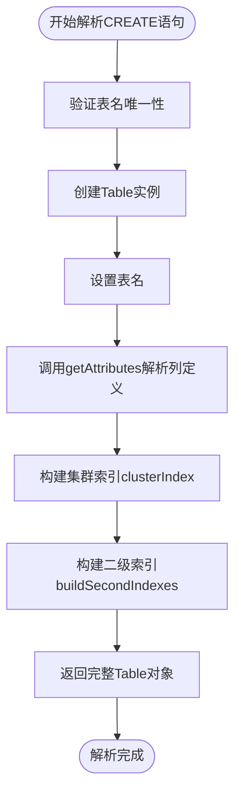
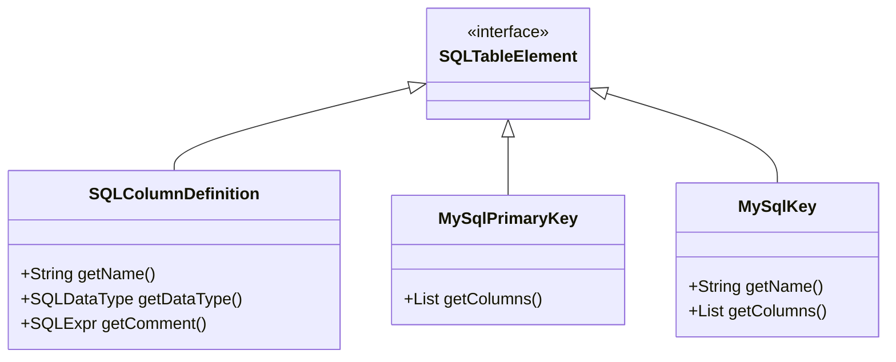
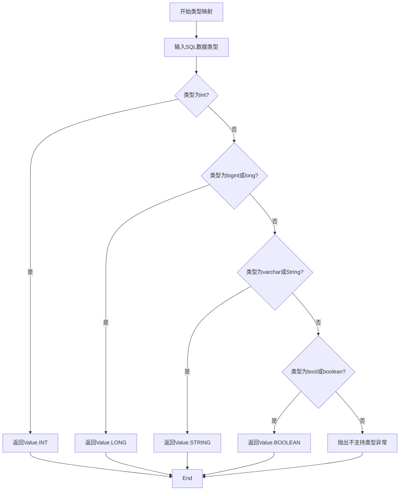
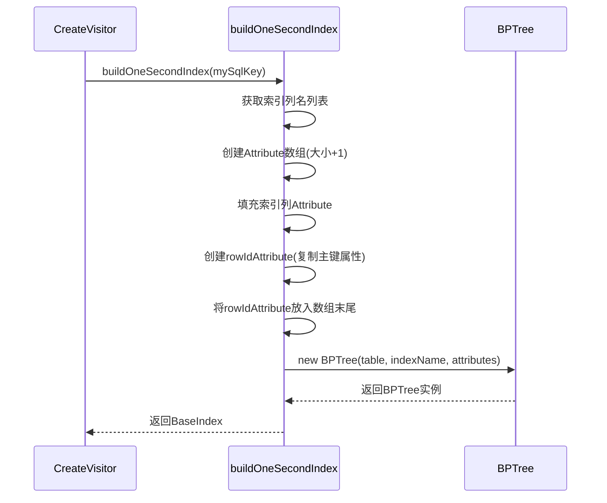
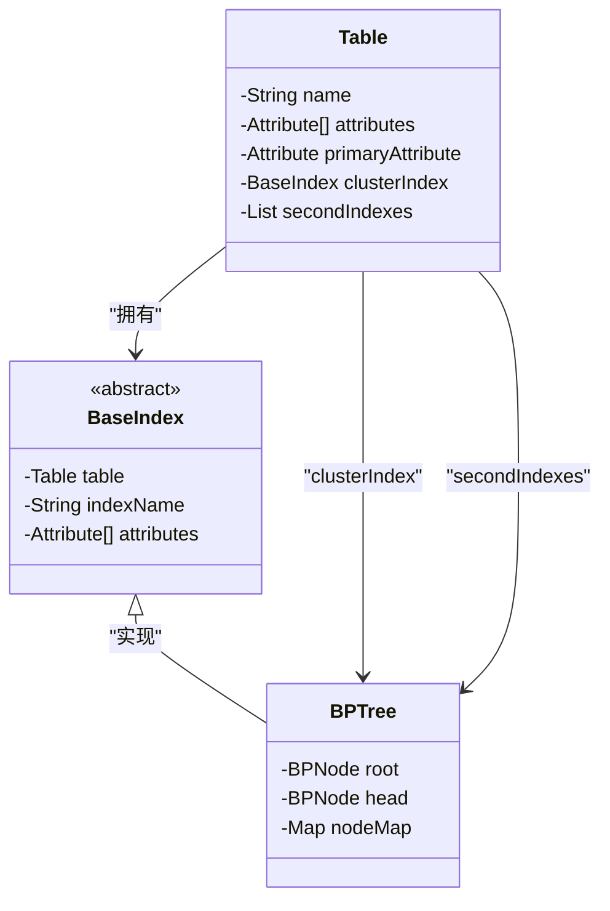

# CREATE语句AST解析

<cite>
**本文档引用文件**  
- [CreateVisitor.java](file://src/main/java/alchemystar/freedom/sql/parser/CreateVisitor.java)
- [Table.java](file://src/main/java/alchemystar/freedom/meta/Table.java)
- [Attribute.java](file://src/main/java/alchemystar/freedom/meta/Attribute.java)
- [BPTree.java](file://src/main/java/alchemystar/freedom/index/bp/BPTree.java)
- [TableManager.java](file://src/main/java/alchemystar/freedom/meta/TableManager.java)
</cite>

## 目录
1. [介绍](#介绍)
2. [核心组件](#核心组件)
3. [表元数据构建流程](#表元数据构建流程)
4. [数据类型映射逻辑](#数据类型映射逻辑)
5. [二级索引构建机制](#二级索引构建机制)
6. [集群索引自动创建](#集群索引自动创建)
7. [完整建表示例分析](#完整建表示例分析)
8. [与表管理器的集成](#与表管理器的集成)

## 介绍
本文档深入解析`CreateVisitor`类如何将SQL的`CREATE TABLE`语句解析为内部表元数据结构。重点阐述AST遍历过程、列定义解析、主键处理、索引构建以及类型映射等核心机制，揭示从SQL语句到可执行表对象的完整转换流程。

## 核心组件

`CreateVisitor`是SQL建表语句的核心解析器，负责将Druid SQL AST中的`SQLCreateTableStatement`节点转换为内存中的`Table`对象。该类继承自`SQLASTVisitorAdapter`，通过重写`visit`方法实现对建表语句的深度解析。

**Section sources**
- [CreateVisitor.java](file://src/main/java/alchemystar/freedom/sql/parser/CreateVisitor.java#L31-L48)

## 表元数据构建流程

`visit(SQLCreateTableStatement x)`方法是整个解析过程的入口。该方法首先验证表名的唯一性，然后依次解析列定义、主键约束和索引信息，最终构建出完整的表元数据。



**Diagram sources**
- [CreateVisitor.java](file://src/main/java/alchemystar/freedom/sql/parser/CreateVisitor.java#L31-L48)

**Section sources**
- [CreateVisitor.java](file://src/main/java/alchemystar/freedom/sql/parser/CreateVisitor.java#L31-L48)
- [TableManager.java](file://src/main/java/alchemystar/freedom/meta/TableManager.java#L30-L35)

### 表名唯一性验证
在创建新表之前，`CreateVisitor`通过`TableManager.getTableWithNoException(sqlTableSource.toString())`检查表名是否已存在。若存在同名表，则抛出运行时异常，确保数据库级别的表名唯一性约束。

### 列定义与主键解析
`getAttributes`方法遍历`SQLTableElement`列表，区分列定义、主键和索引声明。对于`SQLColumnDefinition`，提取列名、数据类型和注释；对于`MySqlPrimaryKey`，记录主键列名；对于`MySqlKey`，暂存索引定义供后续处理。



**Diagram sources**
- [CreateVisitor.java](file://src/main/java/alchemystar/freedom/sql/parser/CreateVisitor.java#L50-L85)

**Section sources**
- [CreateVisitor.java](file://src/main/java/alchemystar/freedom/sql/parser/CreateVisitor.java#L50-L85)
- [Attribute.java](file://src/main/java/alchemystar/freedom/meta/Attribute.java#L15-L45)

## 数据类型映射逻辑

`getType`方法负责将SQL数据类型映射为内部类型常量。该方法不区分大小写地识别常见类型，并转换为`Value`类中定义的整型常量。



**Diagram sources**
- [CreateVisitor.java](file://src/main/java/alchemystar/freedom/sql/parser/CreateVisitor.java#L87-L105)

**Section sources**
- [CreateVisitor.java](file://src/main/java/alchemystar/freedom/sql/parser/CreateVisitor.java#L87-L105)
- [Value.java](file://src/main/java/alchemystar/freedom/meta/value/Value.java)

## 二级索引构建机制

`buildSecondIndexes`方法遍历之前收集的`mySqlKeys`列表，为每个`MySqlKey`创建对应的`BPTree`索引。在构建索引列数组时，会额外添加一个`rowId`属性，该属性引用原主键列。



**Diagram sources**
- [CreateVisitor.java](file://src/main/java/alchemystar/freedom/sql/parser/CreateVisitor.java#L49-L79)

**Section sources**
- [CreateVisitor.java](file://src/main/java/alchemystar/freedom/sql/parser/CreateVisitor.java#L49-L79)
- [BPTree.java](file://src/main/java/alchemystar/freedom/index/bp/BPTree.java#L30-L50)

### rowId属性的特殊处理
在二级索引中，`rowId`属性作为逻辑行标识符，其值与主键相同。这种设计使得通过二级索引查找时，可先定位到`rowId`，再通过`rowId`在集群索引中精确查找完整行数据，实现高效的二级索引查询。

## 集群索引自动创建

系统会自动为每个表创建名为"clusterIndex"的集群索引，该索引基于主键列构建。集群索引直接存储完整的行数据，是数据物理存储的核心结构。



**Diagram sources**
- [CreateVisitor.java](file://src/main/java/alchemystar/freedom/sql/parser/CreateVisitor.java#L45-L47)
- [Table.java](file://src/main/java/alchemystar/freedom/meta/Table.java#L25-L35)

**Section sources**
- [CreateVisitor.java](file://src/main/java/alchemystar/freedom/sql/parser/CreateVisitor.java#L45-L47)
- [Table.java](file://src/main/java/alchemystar/freedom/meta/Table.java)

## 完整建表示例分析

考虑以下包含复合二级索引的建表语句：
```sql
CREATE TABLE user (
    id BIGINT PRIMARY KEY,
    name VARCHAR(100),
    age INT,
    email VARCHAR(255),
    INDEX idx_name_age (name, age),
    COMMENT '用户表'
);
```

解析过程如下：
1. 创建`Table`实例，名称为"user"
2. 解析四列：`id`(LONG, 主键), `name`(STRING), `age`(INT), `email`(STRING)
3. 创建集群索引，基于`id`列
4. 创建二级索引`idx_name_age`，包含`name`, `age`, `id`(rowId)三列
5. 设置注释信息
6. 返回完整`Table`对象

## 与表管理器的集成

解析完成后，`CreateExecutor`将调用`TableManager.addTable()`方法将新表注册到全局表映射中。`TableManager`维护一个静态的`tableMap`，确保所有会话都能访问到最新的表元数据。

**Section sources**
- [TableManager.java](file://src/main/java/alchemystar/freedom/meta/TableManager.java#L50-L60)
- [CreateExecutor.java](file://src/main/java/alchemystar/freedom/sql/CreateExecutor.java#L20-L30)