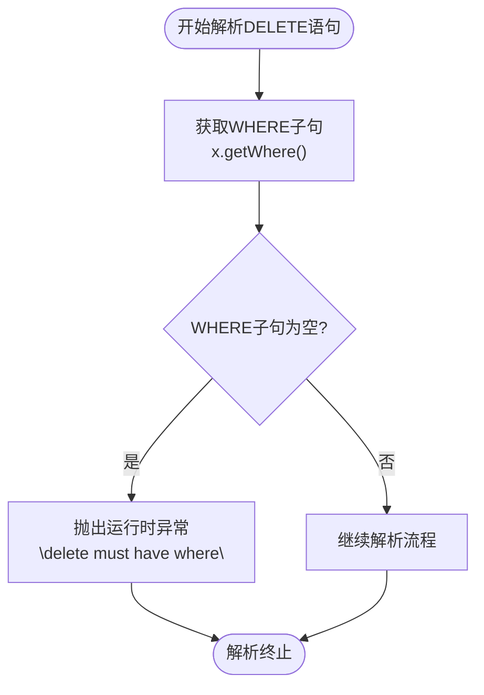
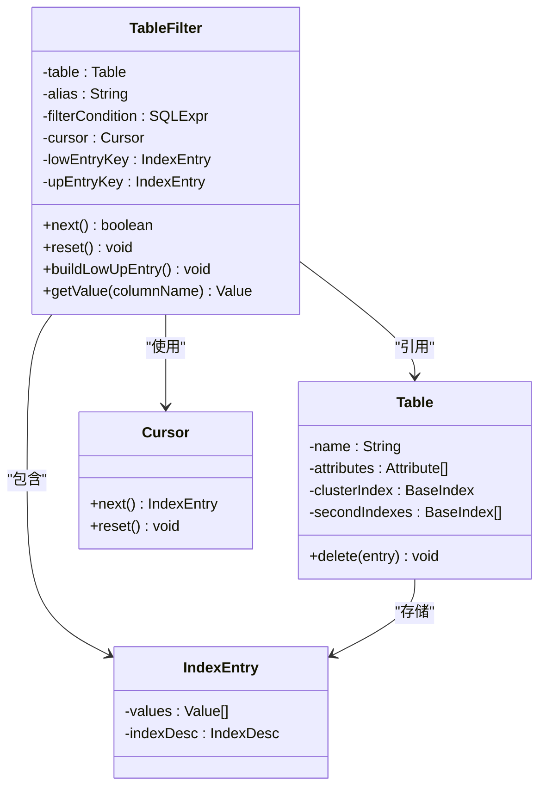
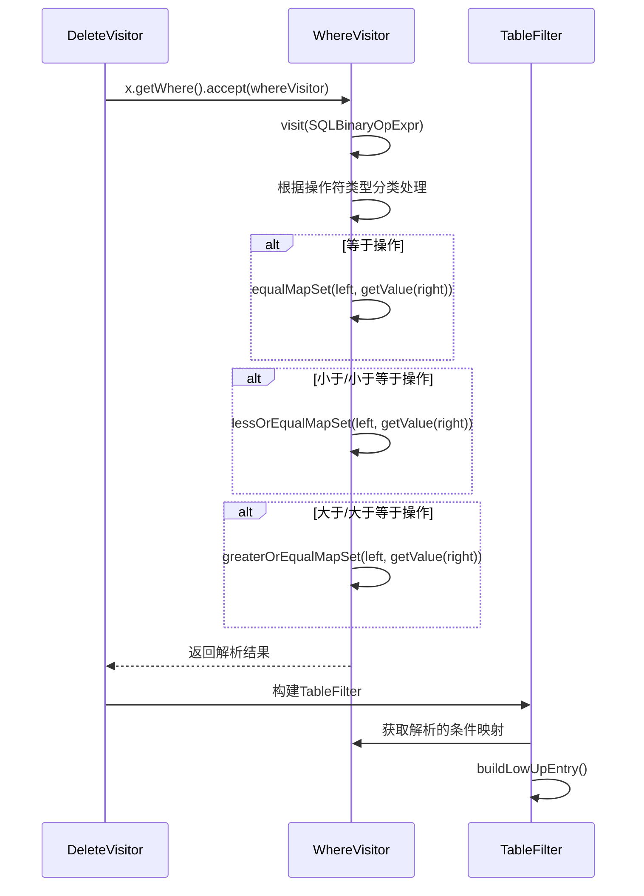
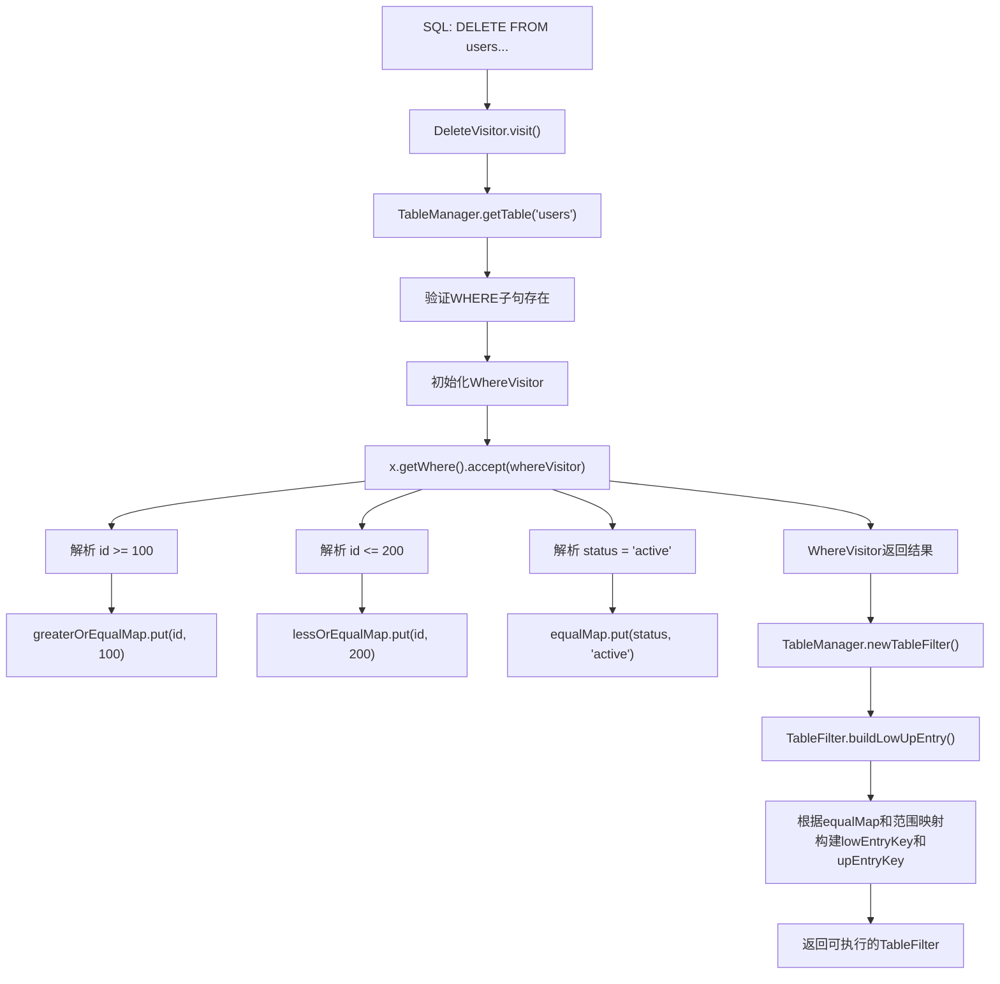
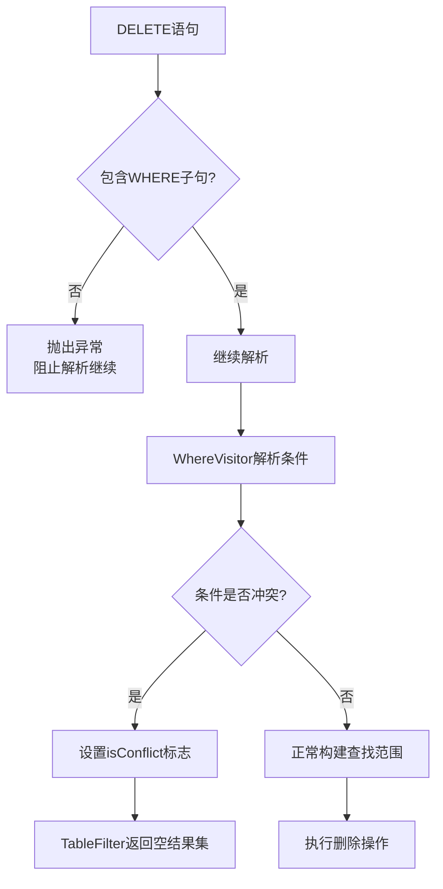
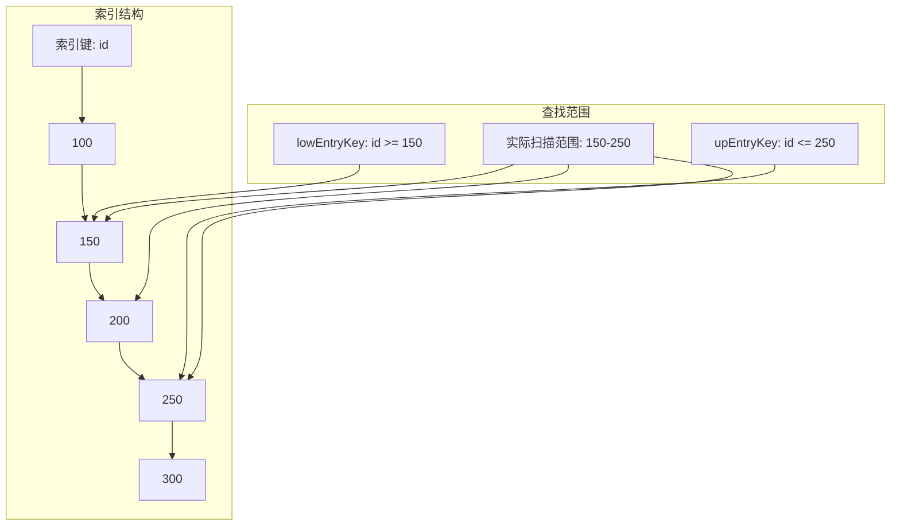

# DELETE语句AST解析

<cite>
**Referenced Files in This Document**   
- [DeleteVisitor.java](file://src/main/java/alchemystar/freedom/sql/parser/DeleteVisitor.java)
- [WhereVisitor.java](file://src/main/java/alchemystar/freedom/sql/parser/WhereVisitor.java)
- [TableFilter.java](file://src/main/java/alchemystar/freedom/sql/select/TableFilter.java)
- [DeleteExecutor.java](file://src/main/java/alchemystar/freedom/sql/DeleteExecutor.java)
- [TableManager.java](file://src/main/java/alchemystar/freedom/meta/TableManager.java)
</cite>

## 目录
1. [核心解析流程](#核心解析流程)
2. [WHERE子句强制性验证](#where子句强制性验证)
3. [TableFilter创建与作用](#tablefilter创建与作用)
4. [条件表达式解析机制](#条件表达式解析机制)
5. [完整解析流程示例](#完整解析流程示例)
6. [全表删除防护机制](#全表删除防护机制)
7. [索引查找优化](#索引查找优化)

## 核心解析流程

`DeleteVisitor`类是处理SQL DELETE语句的核心解析器，它继承自`SQLASTVisitorAdapter`，负责将抽象语法树（AST）中的`SQLDeleteStatement`节点转换为可执行的删除操作。该解析器通过访问者模式遍历AST，提取删除操作所需的关键信息，包括目标表、WHERE条件等。

解析流程始于`visit(SQLDeleteStatement x)`方法的调用，该方法接收一个`SQLDeleteStatement`对象作为参数。解析器首先获取语句中的表源信息，并通过`TableManager`从元数据中获取对应的表对象。随后，解析器验证WHERE子句的存在性，初始化`WhereVisitor`进行条件表达式解析，并最终构建`TableFilter`用于数据定位。

**Section sources**
- [DeleteVisitor.java](file://src/main/java/alchemystar/freedom/sql/parser/DeleteVisitor.java#L20-L55)

## WHERE子句强制性验证

`DeleteVisitor`通过严格的验证机制确保所有DELETE语句都包含WHERE子句，从而防止意外的全表删除操作。在`visit(SQLDeleteStatement x)`方法中，解析器会检查`x.getWhere()`的返回值，如果为null，则立即抛出运行时异常。

**Diagram sources**
- [DeleteVisitor.java](file://src/main/java/alchemystar/freedom/sql/parser/DeleteVisitor.java#L38-L40)

此验证机制是数据库安全的重要保障，强制要求所有删除操作必须基于特定条件进行，避免了因疏忽导致的数据大规模丢失风险。只有通过此验证的DELETE语句才能继续后续的解析和执行流程。

**Section sources**
- [DeleteVisitor.java](file://src/main/java/alchemystar/freedom/sql/parser/DeleteVisitor.java#L38-L40)

## TableFilter创建与作用

`TableFilter`是DELETE操作中用于记录定位的核心组件，它在`DeleteVisitor`的`visit`方法中通过`TableManager.newTableFilter()`工厂方法创建。该过滤器封装了目标表、别名和过滤条件等关键信息，为后续的数据扫描和删除操作提供支持。

**Diagram sources**
- [TableFilter.java](file://src/main/java/alchemystar/freedom/sql/select/TableFilter.java#L20-L279)
- [TableManager.java](file://src/main/java/alchemystar/freedom/meta/TableManager.java#L40-L50)

`TableFilter`的主要作用包括：1) 封装表的元数据信息；2) 管理数据游标以支持逐行扫描；3) 根据解析的条件构建索引查找范围；4) 提供统一的接口供执行器获取当前行数据。通过`buildLowUpEntry()`方法，`TableFilter`能够根据WHERE条件生成索引查找的下界和上界，从而实现高效的范围扫描。

**Section sources**
- [TableFilter.java](file://src/main/java/alchemystar/freedom/sql/select/TableFilter.java#L20-L279)
- [TableManager.java](file://src/main/java/alchemystar/freedom/meta/TableManager.java#L40-L50)

## 条件表达式解析机制

`WhereVisitor`是负责解析WHERE子句中条件表达式的专用访问器，它通过遍历条件表达式树来提取各种比较操作的语义信息。该访问器维护了三个关键的映射表：`equalMap`（等于条件）、`lessOrEqualMap`（小于等于条件）和`greaterOrEqualMap`（大于等于条件），用于记录不同属性的约束值。

**Diagram sources**
- [DeleteVisitor.java](file://src/main/java/alchemystar/freedom/sql/parser/DeleteVisitor.java#L50-L53)
- [WhereVisitor.java](file://src/main/java/alchemystar/freedom/sql/parser/WhereVisitor.java#L20-L160)
- [TableFilter.java](file://src/main/java/alchemystar/freedom/sql/select/TableFilter.java#L170-L210)

当`DeleteVisitor`调用`x.getWhere().accept(whereVisitor)`时，触发了`WhereVisitor`的遍历过程。对于二元操作表达式（`SQLBinaryOpExpr`），访问器根据操作符类型进行分类处理：等于操作存储到`equalMap`，小于/小于等于操作存储到`lessOrEqualMap`，大于/大于等于操作存储到`greaterOrEqualMap`。同时，访问器还检测OR操作的存在，一旦发现`BooleanOr`操作符，就会设置`hasOr`标志，提示后续操作需要进行全表扫描。

**Section sources**
- [WhereVisitor.java](file://src/main/java/alchemystar/freedom/sql/parser/WhereVisitor.java#L40-L100)

## 完整解析流程示例

以一个带有复合条件的DELETE语句为例，展示从SQL解析到条件映射生成的完整流程。考虑语句`DELETE FROM users WHERE id >= 100 AND id <= 200 AND status = 'active'`，其解析过程如下：

**Diagram sources**
- [DeleteVisitor.java](file://src/main/java/alchemystar/freedom/sql/parser/DeleteVisitor.java#L20-L55)
- [WhereVisitor.java](file://src/main/java/alchemystar/freedom/sql/parser/WhereVisitor.java#L40-L100)
- [TableFilter.java](file://src/main/java/alchemystar/freedom/sql/select/TableFilter.java#L170-L210)

解析流程首先通过`TableManager.getTable()`获取目标表的元数据，然后验证WHERE子句的存在性。接着，`WhereVisitor`遍历条件表达式树，将各个条件分别存储到对应的映射表中。最后，`TableFilter`利用这些映射表构建索引查找范围，其中`equalMap`中的条件用于精确匹配，而范围条件则用于确定索引扫描的边界。

**Section sources**
- [DeleteVisitor.java](file://src/main/java/alchemystar/freedom/sql/parser/DeleteVisitor.java#L20-L55)
- [WhereVisitor.java](file://src/main/java/alchemystar/freedom/sql/parser/WhereVisitor.java#L40-L100)
- [TableFilter.java](file://src/main/java/alchemystar/freedom/sql/select/TableFilter.java#L170-L210)

## 全表删除防护机制

系统通过多层次的防护机制确保不会发生意外的全表删除操作。最核心的防护是在`DeleteVisitor`层面强制要求WHERE子句的存在，任何缺少WHERE子句的DELETE语句都会在解析阶段被拒绝。

此外，`TableFilter`的`buildLowUpEntry()`方法也提供了额外的安全保障。当检测到条件冲突时（例如`id = 100 AND id = 200`），`WhereVisitor`会设置`isConflict`标志，导致`TableFilter`直接返回空结果集，从而避免了无效的删除操作。

**Diagram sources**
- [DeleteVisitor.java](file://src/main/java/alchemystar/freedom/sql/parser/DeleteVisitor.java#L38-L40)
- [WhereVisitor.java](file://src/main/java/alchemystar/freedom/sql/parser/WhereVisitor.java#L120-L130)
- [TableFilter.java](file://src/main/java/alchemystar/freedom/sql/select/TableFilter.java#L170-L180)

这种双重防护机制既保证了基本的安全性，又提供了对复杂条件的智能处理能力。即使在应用层出现逻辑错误，系统也能通过这些内置的防护措施避免灾难性的数据丢失。

**Section sources**
- [DeleteVisitor.java](file://src/main/java/alchemystar/freedom/sql/parser/DeleteVisitor.java#L38-L40)
- [WhereVisitor.java](file://src/main/java/alchemystar/freedom/sql/parser/WhereVisitor.java#L120-L130)
- [TableFilter.java](file://src/main/java/alchemystar/freedom/sql/select/TableFilter.java#L170-L180)

## 索引查找优化

DELETE操作的性能优化主要体现在通过条件解析生成高效的索引查找范围。`TableFilter`利用`WhereVisitor`解析出的条件映射，构建出精确的索引扫描边界，从而避免了全表扫描带来的性能开销。

当WHERE条件中不包含OR操作时，系统采用"low max"原则构建查找范围：`greaterOrEqualMap`中的条件确定扫描下界，`lessOrEqualMap`中的条件确定扫描上界，而`equalMap`中的条件则同时应用于上下界。这种优化使得数据库能够利用B+树索引的有序特性，快速定位到需要删除的记录范围。

**Diagram sources**
- [TableFilter.java](file://src/main/java/alchemystar/freedom/sql/select/TableFilter.java#L170-L210)
- [WhereVisitor.java](file://src/main/java/alchemystar/freedom/sql/parser/WhereVisitor.java#L40-L100)

一旦检测到OR操作，系统会自动降级为顺序扫描模式，因为OR条件通常无法有效利用索引。这种智能的优化策略确保了在大多数情况下能够实现高效的索引查找，同时在复杂条件下也能保证操作的正确性。

**Section sources**
- [TableFilter.java](file://src/main/java/alchemystar/freedom/sql/select/TableFilter.java#L170-L210)
- [WhereVisitor.java](file://src/main/java/alchemystar/freedom/sql/parser/WhereVisitor.java#L80-L90)