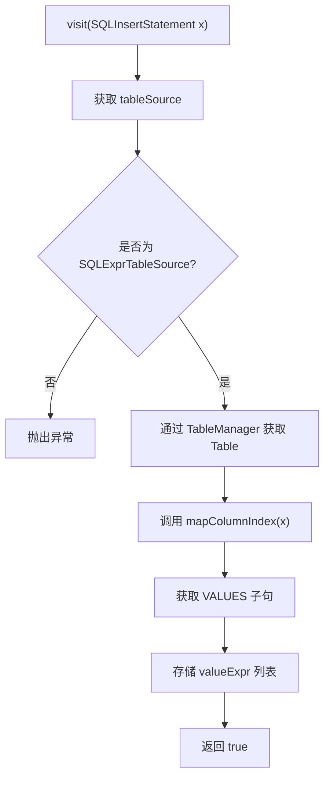
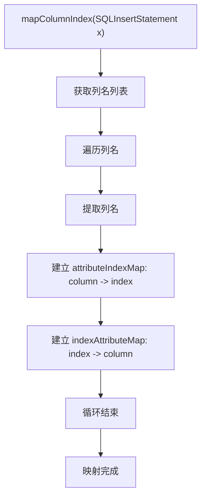
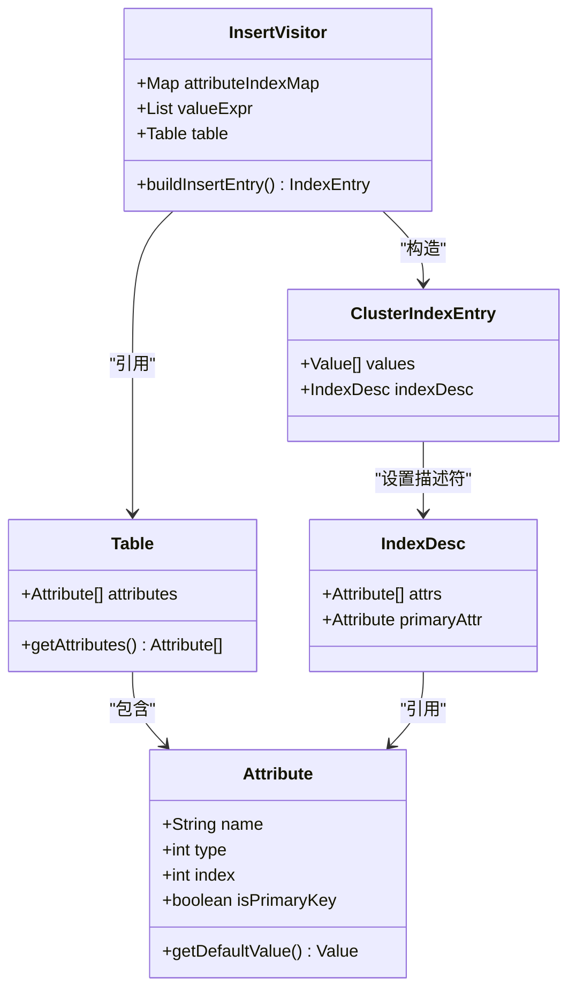
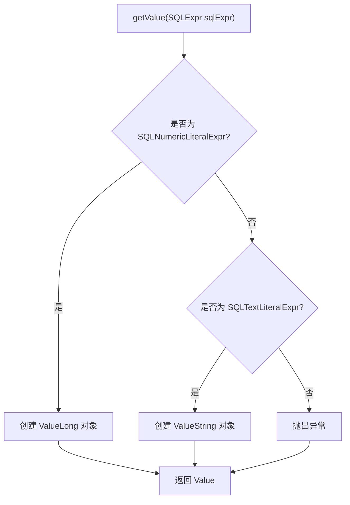
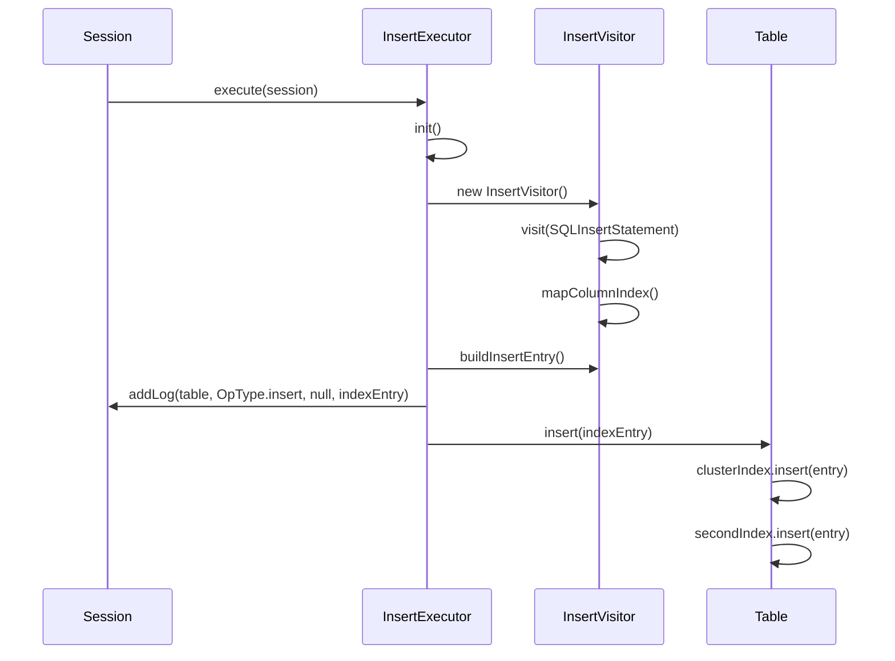

# INSERT语句AST解析

<cite>
**本文档引用的文件**  
- [InsertVisitor.java](file://src/main/java/alchemystar/freedom/sql/parser/InsertVisitor.java)
- [InsertExecutor.java](file://src/main/java/alchemystar/freedom/sql/InsertExecutor.java)
- [Table.java](file://src/main/java/alchemystar/freedom/meta/Table.java)
- [ClusterIndexEntry.java](file://src/main/java/alchemystar/freedom/meta/ClusterIndexEntry.java)
- [IndexEntry.java](file://src/main/java/alchemystar/freedom/meta/IndexEntry.java)
- [IndexDesc.java](file://src/main/java/alchemystar/freedom/meta/IndexDesc.java)
- [Attribute.java](file://src/main/java/alchemystar/freedom/meta/Attribute.java)
- [ValueLong.java](file://src/main/java/alchemystar/freedom/meta/value/ValueLong.java)
- [ValueString.java](file://src/main/java/alchemystar/freedom/meta/value/ValueString.java)
- [Value.java](file://src/main/java/alchemystar/freedom/meta/value/Value.java)
</cite>

## 目录
1. [简介](#简介)
2. [核心组件](#核心组件)
3. [解析流程分析](#解析流程分析)
4. [字段映射与索引构建](#字段映射与索引构建)
5. [插入条目构造](#插入条目构造)
6. [值提取机制](#值提取机制)
7. [执行流程与事务集成](#执行流程与事务集成)
8. [整体架构图](#整体架构图)

## 简介
本文档深入分析`InsertVisitor`类如何解析SQL的`INSERT`语句并准备插入数据。重点阐述其如何通过访问者模式解析抽象语法树（AST），提取目标表名，建立列名与值的索引映射，并构造用于B+树索引更新的`ClusterIndexEntry`对象。文档还说明了该解析器如何确保字段顺序一致性，以及其输出如何被`InsertExecutor`用于实际数据插入。

## 核心组件

`InsertVisitor`是SQL解析器的核心组件之一，负责处理`INSERT`语句的AST节点。它继承自Druid SQL解析库的`SchemaStatVisitor`，通过访问`SQLInsertStatement`节点来提取必要的元数据和值信息。

**Section sources**
- [InsertVisitor.java](file://src/main/java/alchemystar/freedom/sql/parser/InsertVisitor.java#L1-L100)

## 解析流程分析

`visit(SQLInsertStatement x)`方法是整个解析过程的入口。该方法首先获取`INSERT`语句的目标表源（`tableSource`），并验证其类型是否为`SQLExprTableSource`。随后，通过`TableManager`根据表名查找对应的`Table`元数据对象，确保目标表存在。



**Diagram sources**
- [InsertVisitor.java](file://src/main/java/alchemystar/freedom/sql/parser/InsertVisitor.java#L20-L35)

**Section sources**
- [InsertVisitor.java](file://src/main/java/alchemystar/freedom/sql/parser/InsertVisitor.java#L20-L35)
- [Table.java](file://src/main/java/alchemystar/freedom/meta/Table.java#L1-L20)

## 字段映射与索引构建

`mapColumnIndex`方法负责建立列名与值表达式之间的索引映射关系。它遍历`INSERT`语句中显式指定的列名列表，为每一列建立正向映射（列名 → 值索引）和反向映射（索引 → 列名）。这种双向映射确保了在后续构造插入数据时，能够快速定位每个列值在`VALUES`列表中的位置。



**Diagram sources**
- [InsertVisitor.java](file://src/main/java/alchemystar/freedom/sql/parser/InsertVisitor.java#L70-L80)

**Section sources**
- [InsertVisitor.java](file://src/main/java/alchemystar/freedom/sql/parser/InsertVisitor.java#L70-L80)

## 插入条目构造

`buildInsertEntry`方法根据`attributeIndexMap`构造`ClusterIndexEntry`对象。它创建一个与表结构中属性数量相等的`Value`数组。对于每个属性，它检查`attributeIndexMap`中是否存在对应的索引。如果存在，则从`valueExpr`列表中提取相应的值；如果不存在（即该列未在`INSERT`语句中指定），则使用该属性的默认值进行填充。



**Diagram sources**
- [InsertVisitor.java](file://src/main/java/alchemystar/freedom/sql/parser/InsertVisitor.java#L40-L65)
- [Table.java](file://src/main/java/alchemystar/freedom/meta/Table.java#L1-L20)
- [Attribute.java](file://src/main/java/alchemystar/freedom/meta/Attribute.java#L1-L20)
- [ClusterIndexEntry.java](file://src/main/java/alchemystar/freedom/meta/ClusterIndexEntry.java#L1-L10)
- [IndexDesc.java](file://src/main/java/alchemystar/freedom/meta/IndexDesc.java#L1-L15)

**Section sources**
- [InsertVisitor.java](file://src/main/java/alchemystar/freedom/sql/parser/InsertVisitor.java#L40-L65)
- [Attribute.java](file://src/main/java/alchemystar/freedom/meta/Attribute.java#L50-L65)

## 值提取机制

`getValue`方法负责从`SQLExpr`表达式中提取具体的值。目前，该方法仅支持字面量表达式，如`SQLNumericLiteralExpr`和`SQLTextLiteralExpr`。对于数值字面量，它创建一个`ValueLong`对象；对于文本字面量，它创建一个`ValueString`对象。任何非字面量的表达式都会导致运行时异常，这表明当前实现不支持在`INSERT`语句中使用函数或子查询作为值。

例如，对于`INSERT INTO users(id, name) VALUES(1, 'Alice')`语句：
- `getValue`方法会将`1`转换为`new ValueLong(1)`
- 将`'Alice'`转换为`new ValueString("Alice")`



**Diagram sources**
- [InsertVisitor.java](file://src/main/java/alchemystar/freedom/sql/parser/InsertVisitor.java#L67-L78)
- [ValueLong.java](file://src/main/java/alchemystar/freedom/meta/value/ValueLong.java#L1-L15)
- [ValueString.java](file://src/main/java/alchemystar/freedom/meta/value/ValueString.java#L1-L15)

**Section sources**
- [InsertVisitor.java](file://src/main/java/alchemystar/freedom/sql/parser/InsertVisitor.java#L67-L78)

## 执行流程与事务集成

`InsertExecutor`负责协调整个插入操作。在`execute`方法中，它首先调用`init`方法，该方法创建`InsertVisitor`实例并让SQL语句接受访问，从而触发`visit`方法的执行和元数据的收集。随后，`InsertExecutor`调用`insertVisitor.buildInsertEntry()`来获取最终的`IndexEntry`对象。该对象随后被传递给`Table.insert()`方法，用于在聚簇索引和二级索引中执行实际的插入操作。同时，该操作也会被记录到事务日志中。



**Diagram sources**
- [InsertExecutor.java](file://src/main/java/alchemystar/freedom/sql/InsertExecutor.java#L20-L40)
- [Table.java](file://src/main/java/alchemystar/freedom/meta/Table.java#L50-L60)

**Section sources**
- [InsertExecutor.java](file://src/main/java/alchemystar/freedom/sql/InsertExecutor.java#L20-L40)

## 整体架构图

```mermaid
graph TD
SQL[SQL INSERT 语句] --> Druid[Druid SQL Parser]
Druid --> AST[SQLInsertStatement AST]
AST --> Visitor[InsertVisitor.visit()]
Visitor --> TM[TableManager.getTable()]
Visitor --> Map[mapColumnIndex()]
Visitor --> Build[buildInsertEntry()]
Build --> Value[getValue()]
Build --> Entry[ClusterIndexEntry]
Entry --> Executor[InsertExecutor.execute()]
Executor --> Log[Session.addLog()]
Executor --> Table[Table.insert()]
Table --> Cluster[clusterIndex.insert()]
Table --> Second[secondIndex.insert()]
```

**Diagram sources**
- [InsertVisitor.java](file://src/main/java/alchemystar/freedom/sql/parser/InsertVisitor.java#L1-L100)
- [InsertExecutor.java](file://src/main/java/alchemystar/freedom/sql/InsertExecutor.java#L1-L40)
- [Table.java](file://src/main/java/alchemystar/freedom/meta/Table.java#L1-L70)