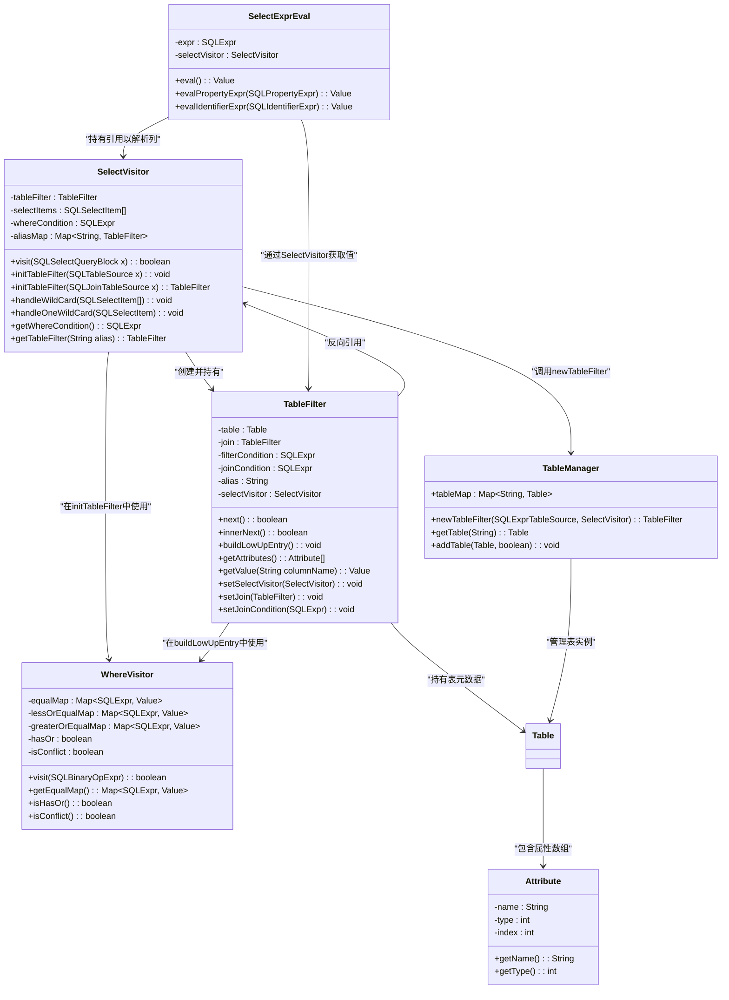
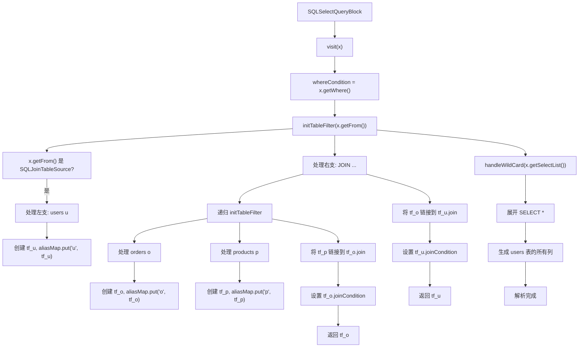

# SELECT语句AST解析

<cite>
**本文档中引用的文件**  
- [SelectVisitor.java](file://src/main/java/alchemystar/freedom/sql/parser/SelectVisitor.java)
- [TableFilter.java](file://src/main/java/alchemystar/freedom/sql/select/TableFilter.java)
- [TableManager.java](file://src/main/java/alchemystar/freedom/meta/TableManager.java)
- [WhereVisitor.java](file://src/main/java/alchemystar/freedom/sql/parser/WhereVisitor.java)
- [SelectExecutor.java](file://src/main/java/alchemystar/freedom/sql/SelectExecutor.java)
- [SelectExprEval.java](file://src/main/java/alchemystar/freedom/sql/select/item/SelectExprEval.java)
- [Attribute.java](file://src/main/java/alchemystar/freedom/meta/Attribute.java)
</cite>

## 目录
1. [引言](#引言)
2. [核心组件与类关系](#核心组件与类关系)
3. [SelectVisitor访问者模式解析机制](#selectvisitor访问者模式解析机制)
4. [TableFilter构建与表连接处理](#tablefilter构建与表连接处理)
5. [通配符展开机制](#通配符展开机制)
6. [复杂查询示例分析](#复杂查询示例分析)
7. [元数据绑定与执行阶段衔接](#元数据绑定与执行阶段衔接)
8. [总结](#总结)

## 引言
本文档深入解析`SelectVisitor`类如何实现对SQL `SELECT`语句的抽象语法树（AST）进行访问者模式解析。重点阐述`visit(SQLSelectQueryBlock x)`方法如何提取`FROM`子句并构建`TableFilter`对象，以及如何递归处理`JOIN`语法树节点。详细说明`handleWildCard`方法对`SELECT *`通配符的展开逻辑，涵盖单表与多表别名场景下的属性映射。通过一个包含`INNER JOIN`和多层嵌套的复杂查询示例，展示AST遍历过程中`aliasMap`的构建过程和表连接关系的建立。最后，解释`TableManager.newTableFilter`在元数据绑定中的作用，以及该解析结果如何为后续查询执行阶段提供结构化输入。

## 核心组件与类关系



**图示来源**
- [SelectVisitor.java](file://src/main/java/alchemystar/freedom/sql/parser/SelectVisitor.java#L25-L185)
- [TableFilter.java](file://src/main/java/alchemystar/freedom/sql/select/TableFilter.java#L25-L278)
- [TableManager.java](file://src/main/java/alchemystar/freedom/meta/TableManager.java#L25-L71)
- [WhereVisitor.java](file://src/main/java/alchemystar/freedom/sql/parser/WhereVisitor.java#L25-L160)
- [SelectExprEval.java](file://src/main/java/alchemystar/freedom/sql/select/item/SelectExprEval.java#L25-L118)
- [Attribute.java](file://src/main/java/alchemystar/freedom/meta/Attribute.java#L25-L95)

## SelectVisitor访问者模式解析机制

`SelectVisitor`类继承自`SQLASTVisitorAdapter`，实现了对`SQLSelectQueryBlock`节点的访问。其核心方法`visit(SQLSelectQueryBlock x)`是整个`SELECT`语句解析的入口点。

该方法首先从`SQLSelectQueryBlock`中提取`WHERE`子句表达式，并将其赋值给`whereCondition`字段。随后，调用`initTableFilter(x.getFrom())`方法来处理`FROM`子句，这是构建查询执行计划的基础。最后，在`handleWildCard(x.getSelectList())`方法中处理`SELECT`子句中的通配符（`*`），此操作必须在`initTableFilter`之后执行，以确保表别名信息（`aliasMap`）已正确建立。

**Section sources**
- [SelectVisitor.java](file://src/main/java/alchemystar/freedom/sql/parser/SelectVisitor.java#L25-L34)

## TableFilter构建与表连接处理

`TableFilter`是查询执行的核心数据结构，它封装了对单个表或连接结果集的访问逻辑。`initTableFilter`方法负责根据`FROM`子句的类型创建`TableFilter`。

当`FROM`子句是`SQLExprTableSource`（即单个表）时，`SelectVisitor`直接调用`TableManager.newTableFilter`创建一个`TableFilter`实例，并将其存入`aliasMap`中，以便后续通过别名进行引用。

当`FROM`子句是`SQLJoinTableSource`（即表连接）时，解析过程更为复杂。`initTableFilter(SQLJoinTableSource x)`方法会递归地处理左右两个子节点。对于每个子节点，如果它是一个基础表，则创建`TableFilter`；如果它本身也是一个`JOIN`，则递归调用`initTableFilter`。处理完左右子节点后，该方法会将右子节点的`TableFilter`链接到左子节点`TableFilter`链的最深处（即`join`为`null`的位置），从而形成一个链式结构。同时，`JOIN`的连接条件（`x.getCondition()`）被设置为这个最深`TableFilter`的`joinCondition`。这种设计巧妙地将树形的`JOIN`结构转换为线性的`TableFilter`链，简化了后续的迭代逻辑。

**Section sources**
- [SelectVisitor.java](file://src/main/java/alchemystar/freedom/sql/parser/SelectVisitor.java#L59-L127)
- [TableFilter.java](file://src/main/java/alchemystar/freedom/sql/select/TableFilter.java#L25-L278)

## 通配符展开机制

`handleWildCard`方法负责处理`SELECT *`或`SELECT table.*`这类通配符表达式。它遍历`SELECT`子句中的所有`SQLSelectItem`，当遇到`SQLAllColumnExpr`（`*`）或其所有者为`*`的`SQLPropertyExpr`（`table.*`）时，调用`handleOneWildCard`方法进行展开。

`handleOneWildCard`方法是通配符展开的核心。它首先判断通配符是否有所有者（`owner`）。如果没有所有者（如`SELECT *`），则获取主`tableFilter`的全部属性；如果有所有者（如`SELECT a.*`），则通过`aliasMap`查找对应的`TableFilter`，并获取其属性。随后，为每个属性创建一个新的`SQLSelectItem`。如果存在所有者，则创建一个`SQLPropertyExpr`（如`a.id`）；否则，创建一个`SQLIdentifierExpr`（如`id`）。这些新生成的`SQLSelectItem`被添加到`selectItems`列表中，最终取代了原始的通配符项。

这种机制确保了`SELECT *`在查询执行前被完全展开为具体的列名，为后续的表达式求值和结果集生成提供了明确的结构。

**Section sources**
- [SelectVisitor.java](file://src/main/java/alchemystar/freedom/sql/parser/SelectVisitor.java#L40-L58)
- [SelectVisitor.java](file://src/main/java/alchemystar/freedom/sql/parser/SelectVisitor.java#L60-L88)

## 复杂查询示例分析

考虑一个复杂的查询示例：
```sql
SELECT * FROM users u INNER JOIN orders o ON u.id = o.user_id INNER JOIN products p ON o.product_id = p.id WHERE u.status = 'active';
```

在AST遍历过程中：
1.  `visit(SQLSelectQueryBlock)`被调用，`whereCondition`被设置为`u.status = 'active'`。
2.  `initTableFilter`处理`FROM`子句，这是一个嵌套的`JOIN`。
3.  首先处理左支`users u`，创建`TableFilter` `tf_u`，别名为`u`，并存入`aliasMap`。
4.  处理右支`orders o INNER JOIN products p ON ...`，这是一个新的`SQLJoinTableSource`。
    -   递归处理其左支`orders o`，创建`TableFilter` `tf_o`，别名为`o`，存入`aliasMap`。
    -   递归处理其右支`products p`，创建`TableFilter` `tf_p`，别名为`p`，存入`aliasMap`。
    -   将`tf_p`链接到`tf_o`的`join`字段，并将`o.product_id = p.id`设置为`tf_o`的`joinCondition`。
    -   返回`tf_o`作为这个子`JOIN`的结果。
5.  将上一步返回的`tf_o`（代表`orders INNER JOIN products`）链接到`tf_u`的`join`字段，并将`u.id = o.user_id`设置为`tf_u`的`joinCondition`。
6.  最终，`tableFilter`指向`tf_u`，形成了一个链式结构：`tf_u` -> `tf_o` -> `tf_p`。
7.  `handleWildCard`被调用，`SELECT *`被展开。由于没有指定所有者，它会获取`tf_u`的属性，但`TableFilter`的`getAttributes()`方法返回的是其自身表的属性，因此`SELECT *`在此上下文中仅展开`users`表的列。如果需要展开所有列，应在`handleOneWildCard`中遍历整个`join`链。



**图示来源**
- [SelectVisitor.java](file://src/main/java/alchemystar/freedom/sql/parser/SelectVisitor.java#L25-L185)

## 元数据绑定与执行阶段衔接

`TableManager.newTableFilter`方法在元数据绑定中扮演着关键角色。它接收一个`SQLExprTableSource`和一个`SelectVisitor`实例，创建一个新的`TableFilter`。该方法从`tableMap`（一个全局的`Map<String, Table>`）中根据表名查找对应的`Table`元数据对象，并将其注入到`TableFilter`中。同时，它将`SelectVisitor`、表别名和`WHERE`条件也设置到`TableFilter`中。

这个过程将SQL语句中的表名与内存中的表元数据（包括列定义、索引信息等）进行了绑定。生成的`TableFilter`及其链式结构，连同被展开的`selectItems`列表和`whereCondition`，共同构成了一个完整的、结构化的查询计划。

这个查询计划被`SelectExecutor`接收。`SelectExecutor`通过`selectVisitor.getTableFilter()`和`getSelectItems()`获取这些结构化信息。在执行阶段，`TableFilter.next()`方法利用`buildLowUpEntry`（内部使用`WhereVisitor`分析`filterCondition`）来确定索引扫描的范围，并通过`join`链实现嵌套循环连接。`SelectExprEval`则利用`SelectVisitor`提供的`aliasMap`来解析`SELECT`和`WHERE`子句中的列引用，最终生成结果集。

**Section sources**
- [TableManager.java](file://src/main/java/alchemystar/freedom/meta/TableManager.java#L25-L45)
- [SelectExecutor.java](file://src/main/java/alchemystar/freedom/sql/SelectExecutor.java#L25-L122)
- [SelectExprEval.java](file://src/main/java/alchemystar/freedom/sql/select/item/SelectExprEval.java#L25-L118)

## 总结
`SelectVisitor`通过访问者模式，高效地完成了对`SELECT`语句AST的解析。它将`FROM`子句解析为`TableFilter`的链式结构，将`SELECT`子句中的通配符展开为具体的列，并将`WHERE`条件与元数据绑定。`TableManager`作为元数据的中心枢纽，确保了`TableFilter`能够访问到正确的表结构信息。最终，`SelectExecutor`利用这些解析结果，驱动查询的执行。整个过程清晰地分离了语法解析、逻辑计划生成和物理执行，体现了良好的软件设计原则。