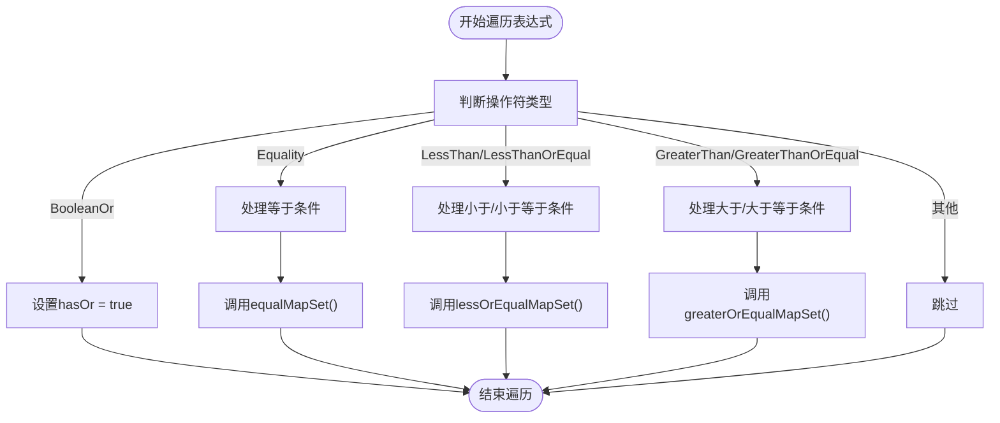
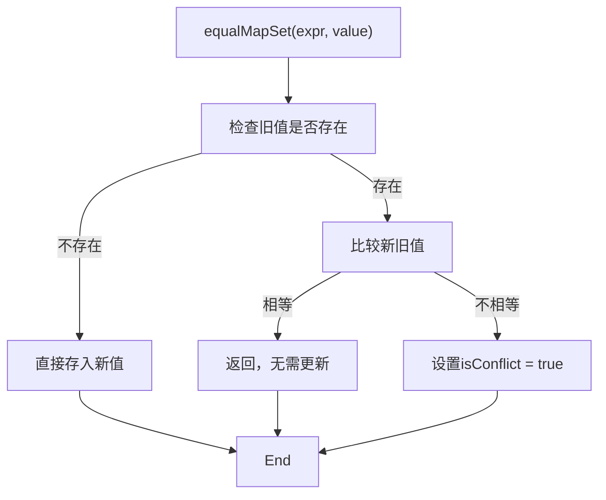
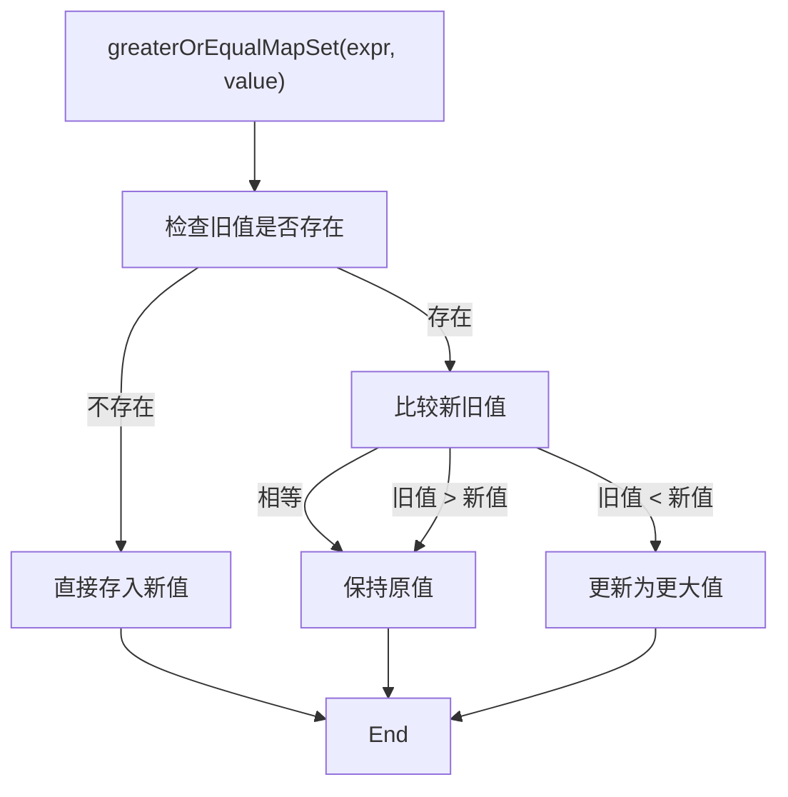
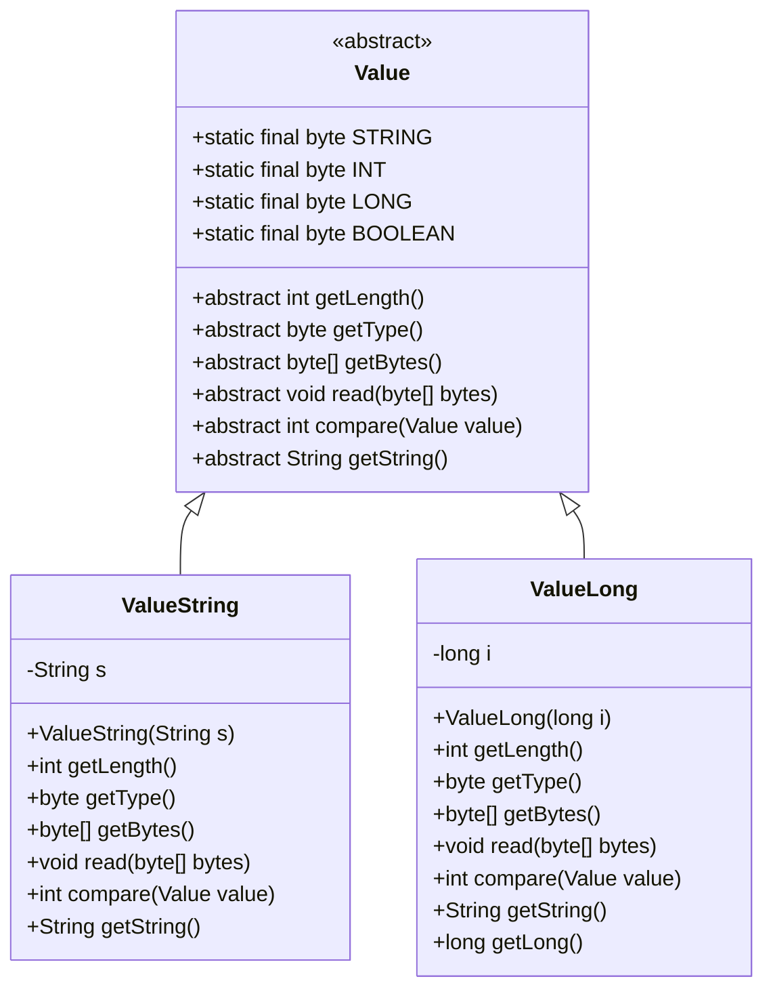
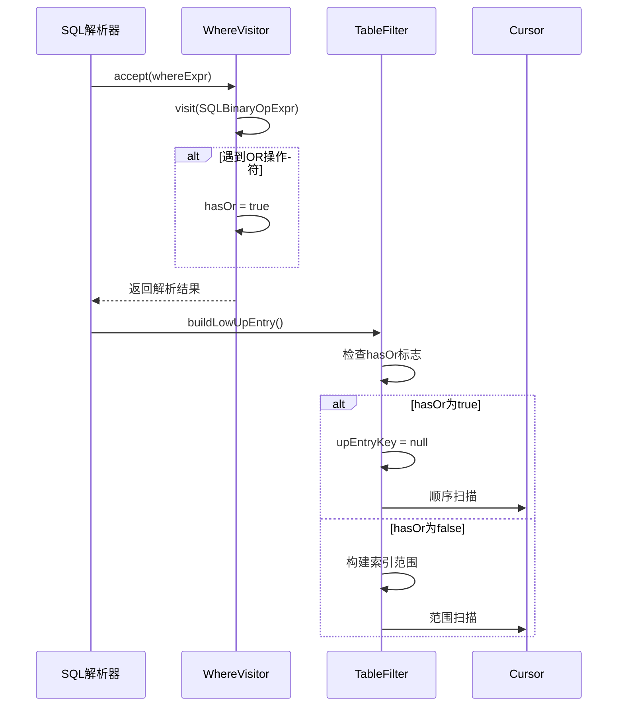
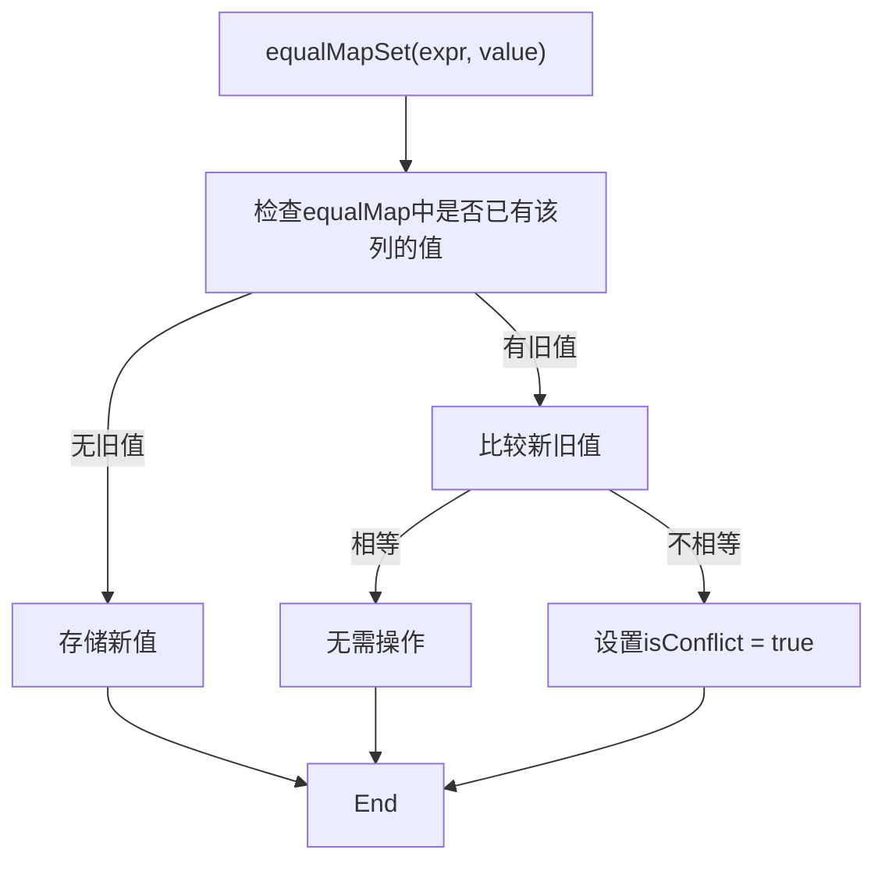
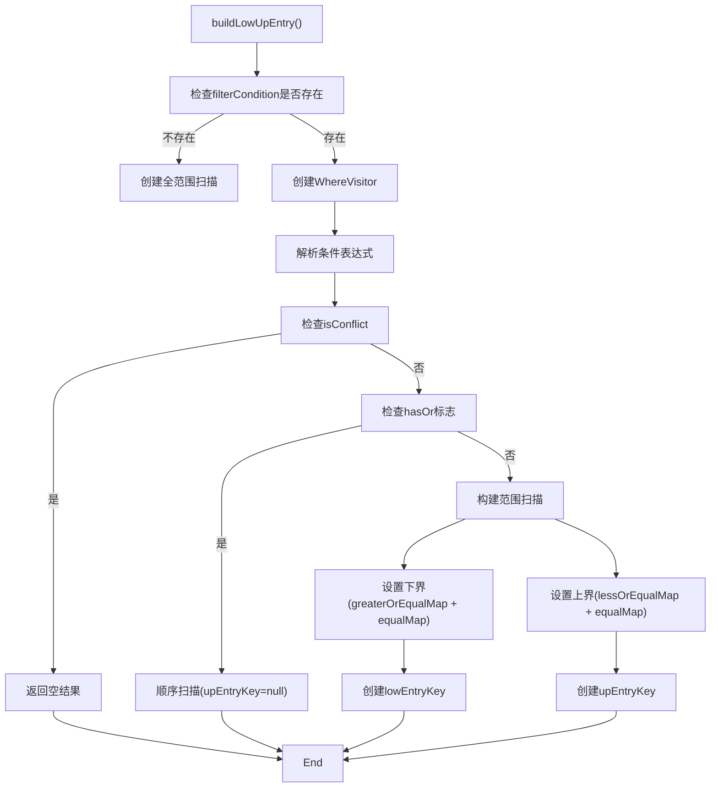

# WHERE条件AST解析

<cite>
**本文档引用的文件**
- [WhereVisitor.java](file://src/main/java/alchemystar/freedom/sql/parser/WhereVisitor.java)
- [Value.java](file://src/main/java/alchemystar/freedom/meta/value/Value.java)
- [ValueString.java](file://src/main/java/alchemystar/freedom/meta/value/ValueString.java)
- [ValueLong.java](file://src/main/java/alchemystar/freedom/meta/value/ValueLong.java)
- [TableFilter.java](file://src/main/java/alchemystar/freedom/sql/select/TableFilter.java)
</cite>

## 目录
1. [引言](#引言)
2. [核心组件](#核心组件)
3. [WhereVisitor表达式遍历机制](#wherevisitor表达式遍历机制)
4. [条件映射表构建机制](#条件映射表构建机制)
5. [字面量值转换体系](#字面量值转换体系)
6. [复杂条件组合与OR标志位](#复杂条件组合与or标志位)
7. [冲突检测机制](#冲突检测机制)
8. [索引范围扫描应用](#索引范围扫描应用)

## 引言
本文档深入解析WhereVisitor类如何遍历SQL二元操作表达式树（SQLBinaryOpExpr）并提取查询条件。重点阐述equalMap、lessOrEqualMap和greaterOrEqualMap三个映射表的构建逻辑，分析不同类型操作符的条件收集策略，以及这些解析结果在查询优化中的应用。

## 核心组件

**Section sources**
- [WhereVisitor.java](file://src/main/java/alchemystar/freedom/sql/parser/WhereVisitor.java#L21-L159)
- [Value.java](file://src/main/java/alchemystar/freedom/meta/value/Value.java#L7-L118)

## WhereVisitor表达式遍历机制

WhereVisitor继承自SQLASTVisitorAdapter，通过重写visit方法遍历SQLBinaryOpExpr表达式树节点。该访问器专门处理WHERE子句中的二元操作表达式，根据操作符类型将条件分类存储到不同的映射表中。

当遇到BooleanOr操作符时，立即设置hasOr标志位为true，表明查询条件中包含OR逻辑，这将影响后续的执行计划选择。对于其他比较操作符，仅当左操作数为列引用（SQLPropertyExpr或SQLIdentifierExpr）且右操作数为字面量（SQLLiteralExpr）时，才进行条件提取。

**Diagram sources**
- [WhereVisitor.java](file://src/main/java/alchemystar/freedom/sql/parser/WhereVisitor.java#L30-L65)

**Section sources**
- [WhereVisitor.java](file://src/main/java/alchemystar/freedom/sql/parser/WhereVisitor.java#L30-L65)

## 条件映射表构建机制

WhereVisitor维护三个核心映射表来存储不同类型的查询条件：

- **equalMap**：存储等值条件（=操作符）
- **lessOrEqualMap**：存储小于等于条件（<=和<操作符）
- **greaterOrEqualMap**：存储大于等于条件（>=和>操作符）

每种映射表都有专门的设置方法，确保值的正确性和一致性。

### 等值条件映射表（equalMap）

**Diagram sources**
- [WhereVisitor.java](file://src/main/java/alchemystar/freedom/sql/parser/WhereVisitor.java#L103-L115)

### 范围条件映射表（lessOrEqualMap和greaterOrEqualMap）

**Diagram sources**
- [WhereVisitor.java](file://src/main/java/alchemystar/freedom/sql/parser/WhereVisitor.java#L75-L91)

**Section sources**
- [WhereVisitor.java](file://src/main/java/alchemystar/freedom/sql/parser/WhereVisitor.java#L75-L115)

## 字面量值转换体系

getValue方法负责将SQL字面量表达式（SQLLiteralExpr）转换为内部Value对象体系，实现类型安全的值表示和比较。

**Diagram sources**
- [Value.java](file://src/main/java/alchemystar/freedom/meta/value/Value.java#L7-L118)
- [ValueString.java](file://src/main/java/alchemystar/freedom/meta/value/ValueString.java#L1-L95)
- [ValueLong.java](file://src/main/java/alchemystar/freedom/meta/value/ValueLong.java#L1-L108)

getValue方法根据字面量的具体类型进行转换：
- SQLTextLiteralExpr转换为ValueString对象
- SQLNumericLiteralExpr转换为ValueLong对象

这种设计实现了类型安全的值表示，支持后续的比较操作和索引查找。

**Section sources**
- [WhereVisitor.java](file://src/main/java/alchemystar/freedom/sql/parser/WhereVisitor.java#L93-L101)
- [Value.java](file://src/main/java/alchemystar/freedom/meta/value/Value.java#L7-L118)

## 复杂条件组合与OR标志位

当WHERE条件中包含OR操作符时，WhereVisitor会设置hasOr标志位为true。这个标志位对查询执行计划有重要影响。

**Diagram sources**
- [WhereVisitor.java](file://src/main/java/alchemystar/freedom/sql/parser/WhereVisitor.java#L34-L36)
- [TableFilter.java](file://src/main/java/alchemystar/freedom/sql/select/TableFilter.java#L180-L185)

例如，对于查询条件`WHERE (a = 1 AND b >= 2) OR (a = 3 AND b <= 4)`，由于包含OR操作符，hasOr标志位被设置为true，导致系统放弃使用索引范围扫描，转而采用全表顺序扫描。

**Section sources**
- [WhereVisitor.java](file://src/main/java/alchemystar/freedom/sql/parser/WhereVisitor.java#L34-L36)
- [TableFilter.java](file://src/main/java/alchemystar/freedom/sql/select/TableFilter.java#L180-L185)

## 冲突检测机制

isConflict标志位用于检测相等条件之间的矛盾。当同一个列被赋予不同的等值条件时，就会产生冲突。

例如，查询条件`WHERE a = 1 AND a = 2`会导致冲突，因为列a不能同时等于1和2。在这种情况下，isConflict标志位被设置为true，表示查询条件自相矛盾。

在TableFilter的buildLowUpEntry方法中，如果检测到isConflict为true，则直接返回空结果集，因为查询条件本身是矛盾的。

**Diagram sources**
- [WhereVisitor.java](file://src/main/java/alchemystar/freedom/sql/parser/WhereVisitor.java#L103-L115)
- [TableFilter.java](file://src/main/java/alchemystar/freedom/sql/select/TableFilter.java#L155-L157)

**Section sources**
- [WhereVisitor.java](file://src/main/java/alchemystar/freedom/sql/parser/WhereVisitor.java#L103-L115)
- [TableFilter.java](file://src/main/java/alchemystar/freedom/sql/select/TableFilter.java#L155-L157)

## 索引范围扫描应用

WhereVisitor的解析结果直接用于索引范围扫描的边界值计算。TableFilter类利用三个映射表构建索引查找的上下界。

**Diagram sources**
- [TableFilter.java](file://src/main/java/alchemystar/freedom/sql/select/TableFilter.java#L145-L195)

具体来说：
- **下界（lowEntryKey）**：由greaterOrEqualMap和equalMap共同决定
- **上界（upEntryKey）**：由lessOrEqualMap和equalMap共同决定
- **等值条件**：同时影响上下界，使范围收缩为单点

这种机制使得系统能够高效地利用索引进行范围查询，显著提升查询性能。

**Section sources**
- [TableFilter.java](file://src/main/java/alchemystar/freedom/sql/select/TableFilter.java#L145-L195)