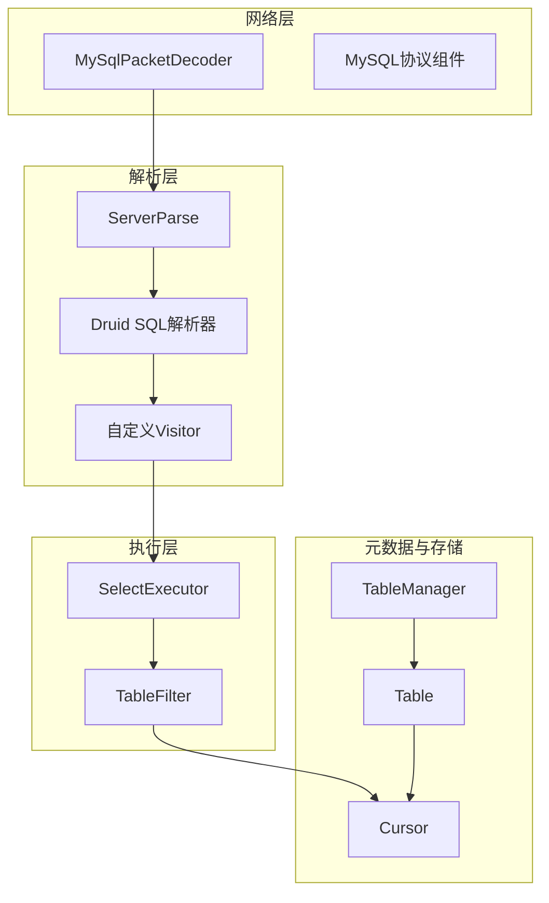
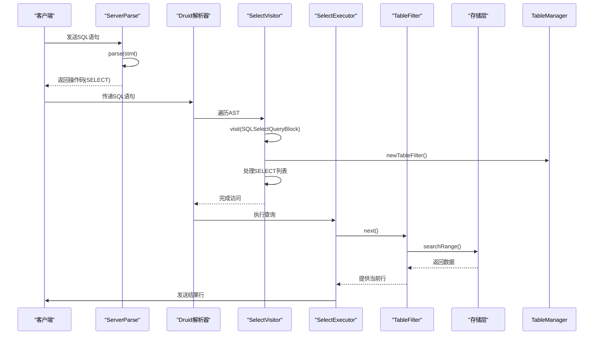
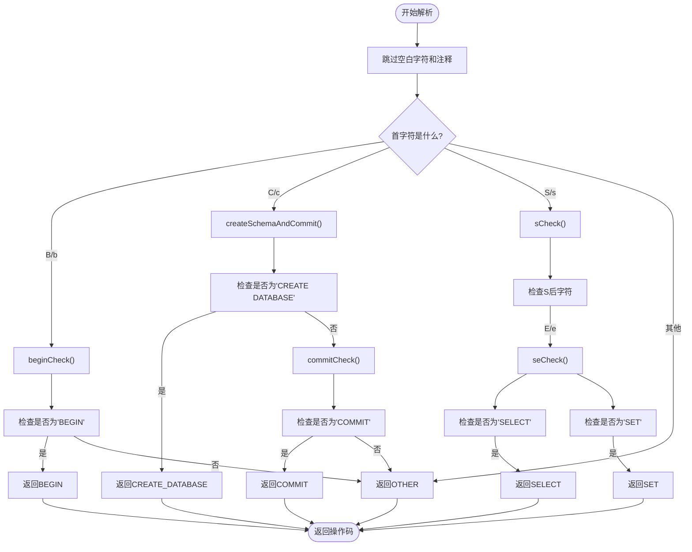
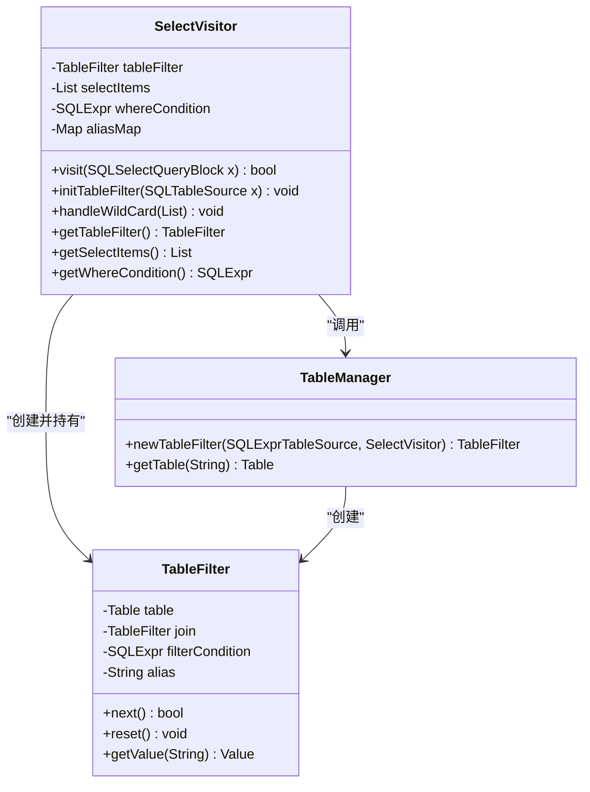
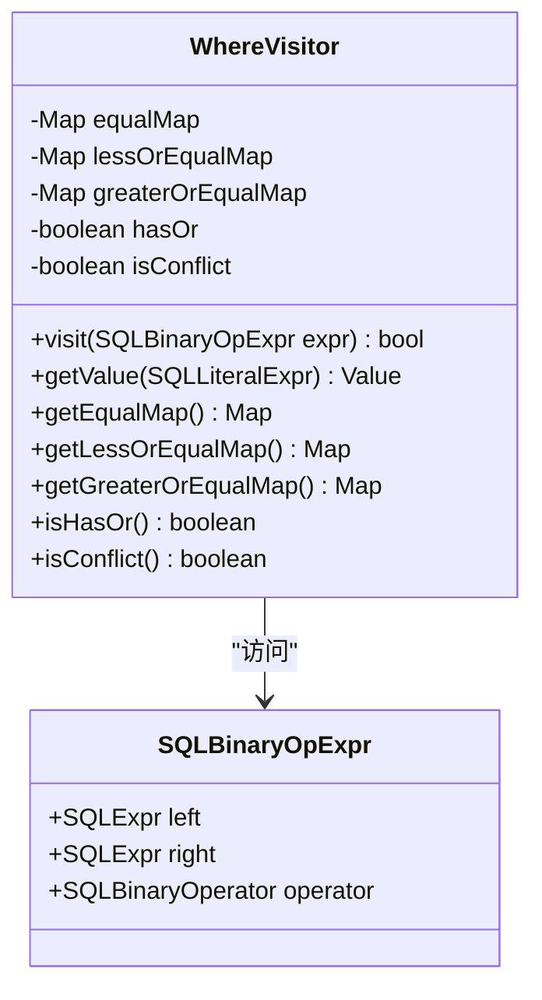
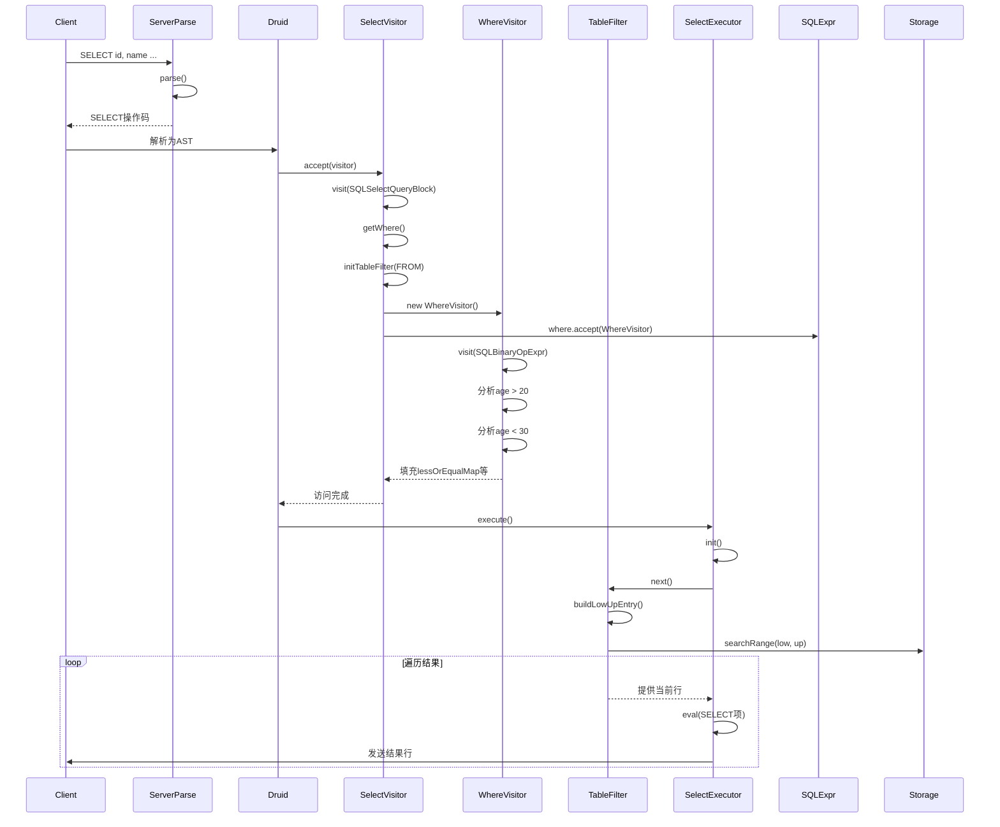
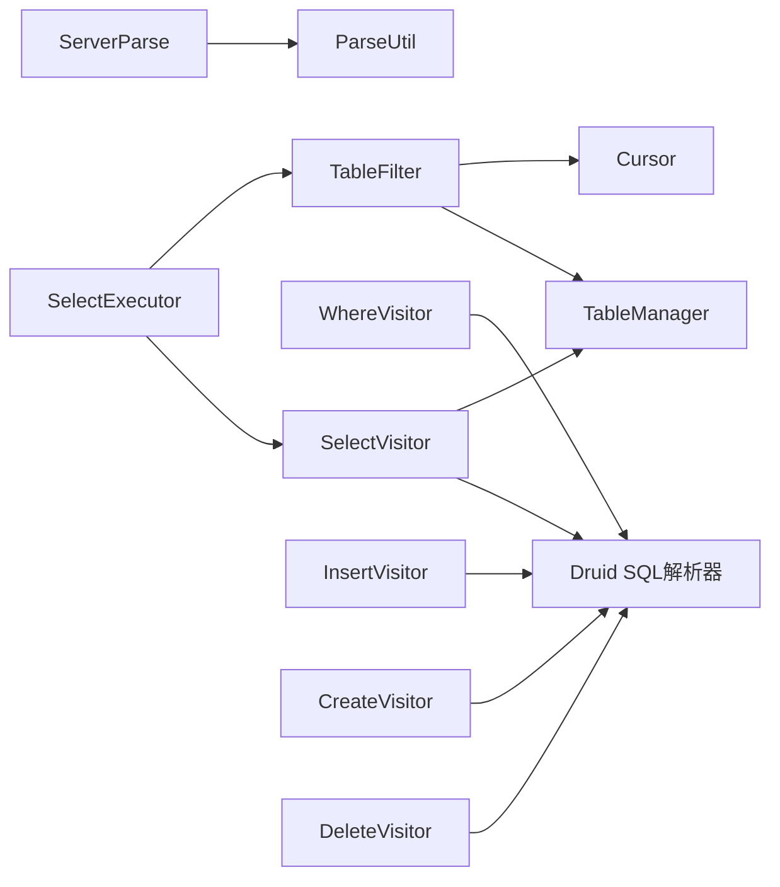

# SQL解析

<cite>
**本文档中引用的文件**  
- [ServerParse.java](file://src/main/java/alchemystar/freedom/engine/parser/ServerParse.java)
- [SelectVisitor.java](file://src/main/java/alchemystar/freedom/sql/parser/SelectVisitor.java)
- [WhereVisitor.java](file://src/main/java/alchemystar/freedom/sql/parser/WhereVisitor.java)
- [TableFilter.java](file://src/main/java/alchemystar/freedom/sql/select/TableFilter.java)
- [TableManager.java](file://src/main/java/alchemystar/freedom/meta/TableManager.java)
- [SelectExecutor.java](file://src/main/java/alchemystar/freedom/sql/SelectExecutor.java)
- [InsertVisitor.java](file://src/main/java/alchemystar/freedom/sql/parser/InsertVisitor.java)
- [CreateVisitor.java](file://src/main/java/alchemystar/freedom/sql/parser/CreateVisitor.java)
- [DeleteVisitor.java](file://src/main/java/alchemystar/freedom/sql/parser/DeleteVisitor.java)
</cite>

## 目录
1. [简介](#简介)
2. [项目结构](#项目结构)
3. [核心组件](#核心组件)
4. [架构概述](#架构概述)
5. [详细组件分析](#详细组件分析)
6. [依赖分析](#依赖分析)
7. [性能考虑](#性能考虑)
8. [故障排除指南](#故障排除指南)
9. [结论](#结论)

## 简介
本文档详细描述了Freedom数据库系统中SQL语句的解析流程，重点聚焦于`ServerParse`类如何对原始SQL语句进行初步分类。文档深入解析了基于字符匹配的高效解析机制，说明其如何识别如BEGIN、COMMIT、SELECT、INSERT等SQL命令并返回对应的操作码。同时，阐述了Druid SQL解析器与自定义Visitor组件（如SelectVisitor、WhereVisitor）的协作方式，展示如何将抽象语法树（AST）转换为内部可执行的查询计划。通过一个带WHERE条件的SELECT语句示例，完整呈现了从SQL字符串到逻辑执行计划的转换路径。此外，文档还说明了各Visitor类的职责划分及其在语义分析中的作用，并指出了当前解析器支持的语法边界和局限性。

## 项目结构
项目采用典型的Java分层架构，主要模块包括网络协议处理、SQL解析、执行引擎、元数据管理、存储访问和事务管理。SQL解析相关的核心代码位于`src/main/java/alchemystar/freedom`目录下，分为`engine/parser`和`sql/parser`两个主要包。`engine/parser`负责SQL语句的初步分类，而`sql/parser`则利用Druid SQL解析器进行深度语法分析和语义处理。

**Diagram sources**
- [ServerParse.java](file://src/main/java/alchemystar/freedom/engine/parser/ServerParse.java#L1-L50)
- [SelectVisitor.java](file://src/main/java/alchemystar/freedom/sql/parser/SelectVisitor.java#L1-L30)
- [TableFilter.java](file://src/main/java/alchemystar/freedom/sql/select/TableFilter.java#L1-L30)

**Section sources**
- [ServerParse.java](file://src/main/java/alchemystar/freedom/engine/parser/ServerParse.java#L1-L50)
- [SelectVisitor.java](file://src/main/java/alchemystar/freedom/sql/parser/SelectVisitor.java#L1-L30)

## 核心组件
本系统的核心组件围绕SQL解析与执行展开。`ServerParse`类作为解析流程的入口，负责对传入的SQL语句进行快速分类。`SelectVisitor`等自定义Visitor类继承自Druid的`SQLASTVisitorAdapter`，用于遍历AST并提取查询的语义信息。`TableFilter`类是查询执行的核心，它封装了对单个表或连接表的数据访问逻辑。`SelectExecutor`则负责协调整个SELECT语句的执行流程，从解析到结果输出。

**Section sources**
- [ServerParse.java](file://src/main/java/alchemystar/freedom/engine/parser/ServerParse.java#L25-L100)
- [SelectVisitor.java](file://src/main/java/alchemystar/freedom/sql/parser/SelectVisitor.java#L15-L80)
- [SelectExecutor.java](file://src/main/java/alchemystar/freedom/sql/SelectExecutor.java#L10-L50)

## 架构概述
SQL解析与执行的架构遵循典型的前端-后端模式。前端（`ServerParse`）进行轻量级的词法分析，将SQL语句分类为预定义的操作码。后端（`SelectVisitor`等）则进行深度的语法和语义分析，构建出可执行的查询计划。该架构实现了关注点分离，前端的高效分类避免了对所有语句都进行完整的AST解析，从而提升了整体性能。

**Diagram sources**
- [ServerParse.java](file://src/main/java/alchemystar/freedom/engine/parser/ServerParse.java#L10-L50)
- [SelectVisitor.java](file://src/main/java/alchemystar/freedom/sql/parser/SelectVisitor.java#L20-L60)
- [SelectExecutor.java](file://src/main/java/alchemystar/freedom/sql/SelectExecutor.java#L30-L80)

## 详细组件分析
### ServerParse类分析
`ServerParse`类是SQL解析流程的第一道关卡，其核心方法`parse(String stmt)`通过逐字符扫描的方式，对SQL语句进行高效分类。该方法跳过空白字符和注释，然后根据首字母进入不同的分支检查函数。

**Diagram sources**
- [ServerParse.java](file://src/main/java/alchemystar/freedom/engine/parser/ServerParse.java#L45-L120)
- [ParseUtil.java](file://src/main/java/alchemystar/freedom/engine/parser/util/ParseUtil.java#L15-L50)

**Section sources**
- [ServerParse.java](file://src/main/java/alchemystar/freedom/engine/parser/ServerParse.java#L1-L450)

### SelectVisitor类分析
`SelectVisitor`类负责处理SELECT语句的AST，提取出查询的核心语义信息。它继承自`SQLASTVisitorAdapter`，重写了`visit(SQLSelectQueryBlock x)`方法。

**Diagram sources**
- [SelectVisitor.java](file://src/main/java/alchemystar/freedom/sql/parser/SelectVisitor.java#L15-L45)
- [TableFilter.java](file://src/main/java/alchemystar/freedom/sql/select/TableFilter.java#L5-L20)
- [TableManager.java](file://src/main/java/alchemystar/freedom/meta/TableManager.java#L10-L30)

**Section sources**
- [SelectVisitor.java](file://src/main/java/alchemystar/freedom/sql/parser/SelectVisitor.java#L1-L187)

### WhereVisitor类分析
`WhereVisitor`类专门用于分析WHERE子句中的条件表达式，提取出可用于优化查询的等值、范围等信息。

**Diagram sources**
- [WhereVisitor.java](file://src/main/java/alchemystar/freedom/sql/parser/WhereVisitor.java#L15-L45)

**Section sources**
- [WhereVisitor.java](file://src/main/java/alchemystar/freedom/sql/parser/WhereVisitor.java#L1-L161)

### 完整解析流程示例
以`SELECT id, name FROM users WHERE age > 20 AND age < 30`为例，展示从SQL字符串到执行计划的完整路径。

**Diagram sources**
- [ServerParse.java](file://src/main/java/alchemystar/freedom/engine/parser/ServerParse.java#L1-L20)
- [SelectVisitor.java](file://src/main/java/alchemystar/freedom/sql/parser/SelectVisitor.java#L20-L40)
- [WhereVisitor.java](file://src/main/java/alchemystar/freedom/sql/parser/WhereVisitor.java#L30-L50)
- [SelectExecutor.java](file://src/main/java/alchemystar/freedom/sql/SelectExecutor.java#L45-L80)

## 依赖分析
系统依赖于阿里巴巴的Druid SQL解析器作为底层的AST构建工具。`engine/parser`包中的类不直接依赖Druid，而`sql/parser`包中的Visitor类则直接继承和使用Druid的API。`TableManager`作为元数据的中心管理器，被`SelectVisitor`和`TableFilter`等组件所依赖，实现了表信息的统一访问。

**Diagram sources**
- [go.mod](file://pom.xml#L1-L20)
- [ServerParse.java](file://src/main/java/alchemystar/freedom/engine/parser/ServerParse.java#L1-L15)
- [SelectVisitor.java](file://src/main/java/alchemystar/freedom/sql/parser/SelectVisitor.java#L1-L15)

**Section sources**
- [pom.xml](file://pom.xml#L1-L30)
- [ServerParse.java](file://src/main/java/alchemystar/freedom/engine/parser/ServerParse.java#L1-L50)

## 性能考虑
`ServerParse`类的设计充分考虑了性能。其基于字符匹配的解析方式避免了创建复杂的AST，对于非SELECT语句可以实现O(1)的快速分类。`SelectVisitor`在处理`SELECT *`时会将其展开为具体的列名，这虽然增加了内存开销，但简化了后续的执行逻辑。`WhereVisitor`通过提取等值和范围条件，使得`TableFilter`能够利用索引进行范围扫描，而不是全表扫描，极大地提升了查询性能。

## 故障排除指南
- **解析错误**：如果SQL语句无法被正确分类，请检查`ServerParse.java`中的`parse`方法，确认首字母分支逻辑是否正确。
- **表不存在**：在`TableManager.getTable()`中抛出异常，确保表已通过`CREATE TABLE`语句创建并加载到`tableMap`中。
- **WHERE条件无效**：在`WhereVisitor`中，如果出现冲突的等值条件（如`id=1 AND id=2`），`isConflict`标志会被置位，导致查询返回空结果。
- **JOIN不支持**：当前系统仅支持INNER JOIN，其他类型的JOIN会在`SelectVisitor.checkJoinType()`中抛出异常。

**Section sources**
- [errors.java](file://src/main/java/alchemystar/freedom/engine/net/exception/UnknownPacketException.java#L10-L50)
- [debug.java](file://src/main/java/alchemystar/freedom/test/sqltest/SelectTest.java#L15-L40)

## 结论
Freedom数据库的SQL解析器通过分层设计实现了高效与功能的平衡。`ServerParse`类的轻量级分类机制确保了高并发下的低延迟，而基于Druid的深度解析器则提供了强大的SQL语义分析能力。Visitor模式的使用使得代码结构清晰，易于扩展。当前解析器已能处理基本的DML和DDL语句，未来可在此基础上增加对更多SQL语法的支持，如子查询、聚合函数等。