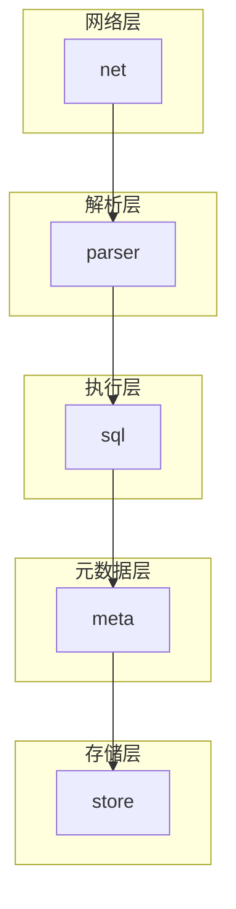
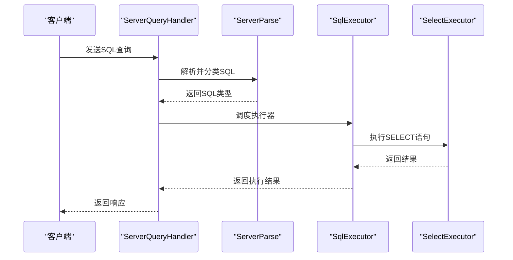
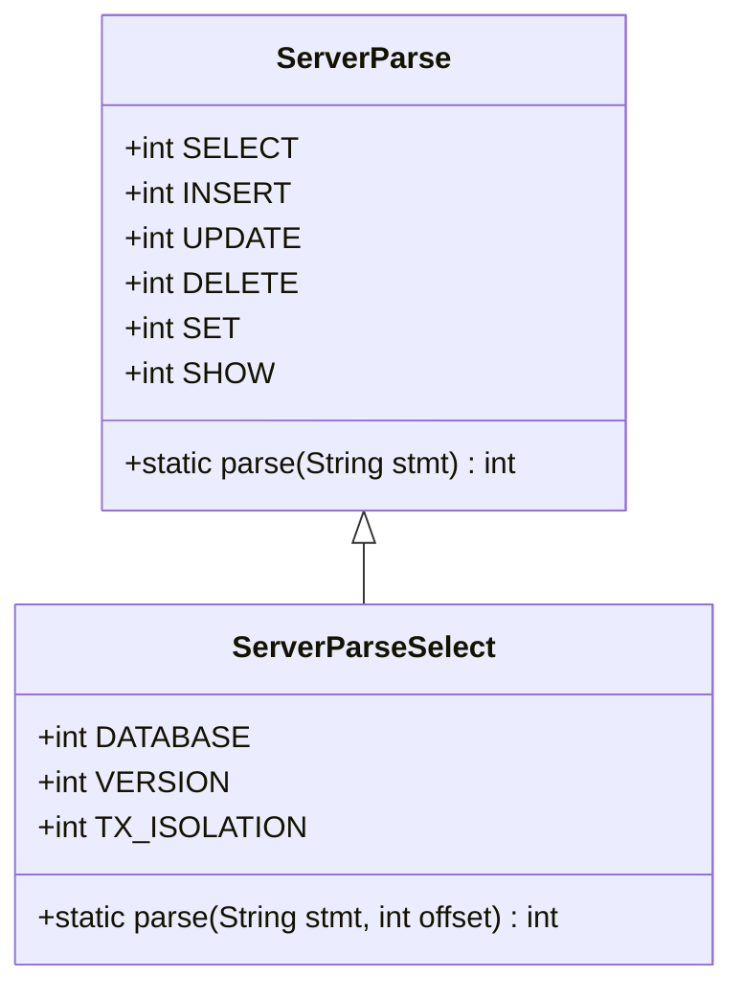
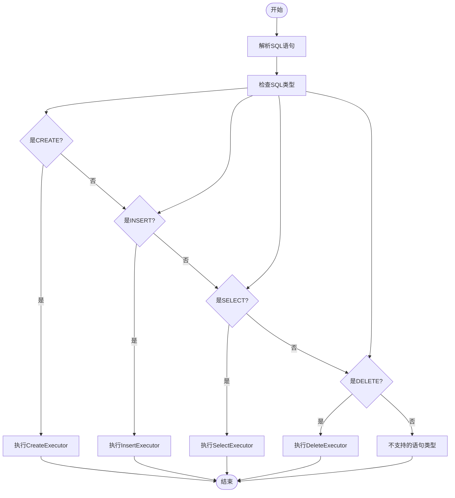
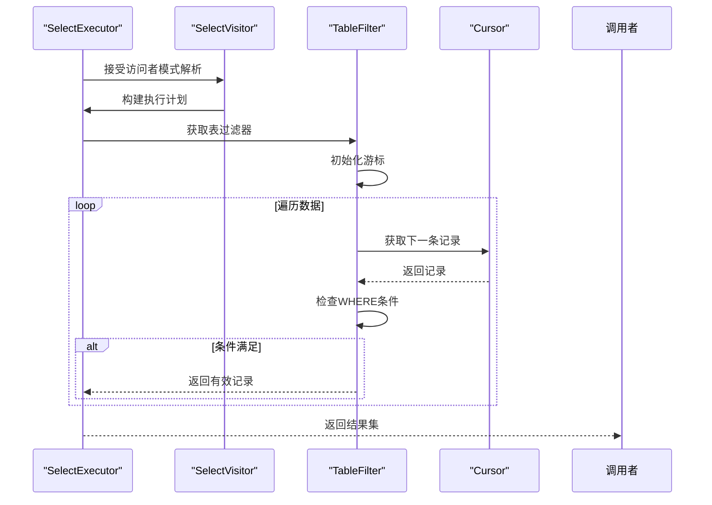
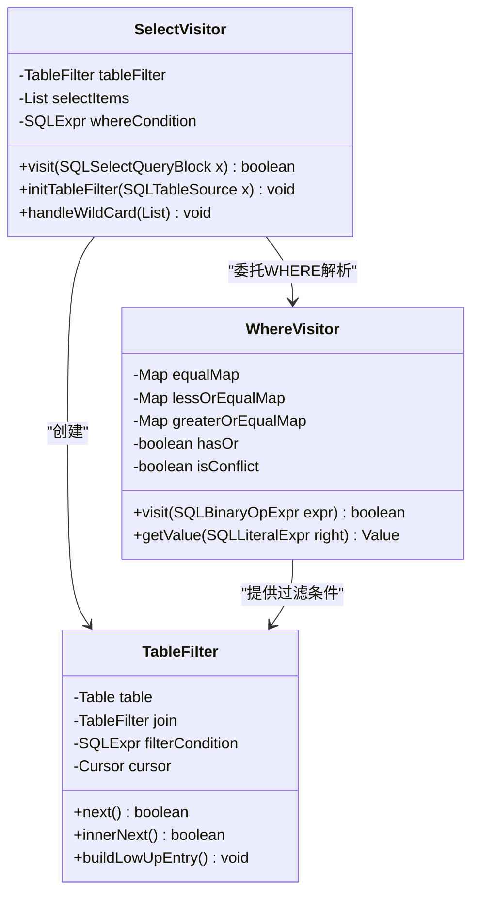
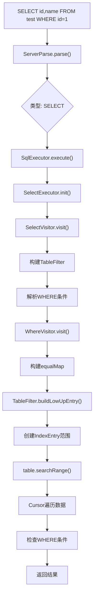
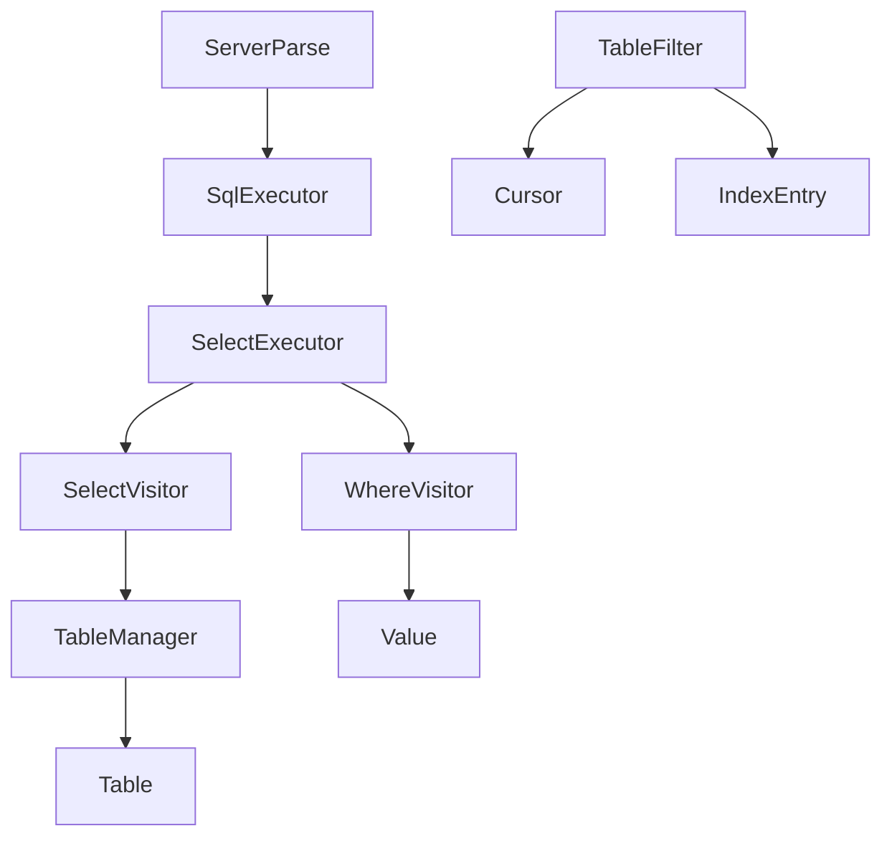

# SQL解析与执行

<cite>
**本文档中引用的文件**
- [ServerParse.java](file://src/main/java/alchemystar/freedom/engine/parser/ServerParse.java)
- [ServerParseSelect.java](file://src/main/java/alchemystar/freedom/engine/parser/ServerParseSelect.java)
- [SqlExecutor.java](file://src/main/java/alchemystar/freedom/sql/SqlExecutor.java)
- [SelectExecutor.java](file://src/main/java/alchemystar/freedom/sql/SelectExecutor.java)
- [SelectVisitor.java](file://src/main/java/alchemystar/freedom/sql/parser/SelectVisitor.java)
- [WhereVisitor.java](file://src/main/java/alchemystar/freedom/sql/parser/WhereVisitor.java)
- [TableFilter.java](file://src/main/java/alchemystar/freedom/sql/select/TableFilter.java)
- [ServerQueryHandler.java](file://src/main/java/alchemystar/freedom/engine/net/handler/frontend/ServerQueryHandler.java)
- [TableManager.java](file://src/main/java/alchemystar/freedom/meta/TableManager.java)
</cite>

## 目录
1. [简介](#简介)
2. [项目结构](#项目结构)
3. [核心组件](#核心组件)
4. [架构概述](#架构概述)
5. [详细组件分析](#详细组件分析)
6. [依赖分析](#依赖分析)
7. [性能考虑](#性能考虑)
8. [故障排除指南](#故障排除指南)
9. [结论](#结论)

## 简介
本文档详细描述了Freedom数据库系统中SQL解析与执行引擎的内部工作原理。重点阐述了从原始SQL字符串到执行结果的完整流程，包括SQL语句的分类、执行器的调度机制、基于Druid的SQL解析器与访问者模式的协作，以及SELECT语句从解析到执行的全过程。

## 项目结构
该项目采用典型的Java分层架构，主要分为网络层、解析层、执行层、存储层和元数据层。SQL解析与执行的核心逻辑位于`sql`和`engine/parser`包中。

**图示来源**
- [ServerParse.java](file://src/main/java/alchemystar/freedom/engine/parser/ServerParse.java#L1-L30)
- [SqlExecutor.java](file://src/main/java/alchemystar/freedom/sql/SqlExecutor.java#L1-L50)

**本节来源**
- [ServerParse.java](file://src/main/java/alchemystar/freedom/engine/parser/ServerParse.java#L1-L50)
- [SqlExecutor.java](file://src/main/java/alchemystar/freedom/sql/SqlExecutor.java#L1-L50)

## 核心组件
核心组件包括SQL解析器(ServerParse)、SQL执行器(SqlExecutor)、SELECT执行器(SelectExecutor)和基于访问者模式的解析组件(SelectVisitor, WhereVisitor)。

**本节来源**
- [ServerParse.java](file://src/main/java/alchemystar/freedom/engine/parser/ServerParse.java#L1-L30)
- [SqlExecutor.java](file://src/main/java/alchemystar/freedom/sql/SqlExecutor.java#L1-L50)
- [SelectExecutor.java](file://src/main/java/alchemystar/freedom/sql/SelectExecutor.java#L1-L50)

## 架构概述
SQL执行流程从网络层接收SQL语句开始，经过解析、分类、执行计划构建，最终完成数据操作。

**图示来源**
- [ServerQueryHandler.java](file://src/main/java/alchemystar/freedom/engine/net/handler/frontend/ServerQueryHandler.java#L1-L85)
- [SqlExecutor.java](file://src/main/java/alchemystar/freedom/sql/SqlExecutor.java#L1-L50)
- [SelectExecutor.java](file://src/main/java/alchemystar/freedom/sql/SelectExecutor.java#L1-L50)

## 详细组件分析

### SQL解析与分类
ServerParse组件负责将原始SQL字符串分类为不同的操作类型。

**图示来源**
- [ServerParse.java](file://src/main/java/alchemystar/freedom/engine/parser/ServerParse.java#L1-L30)
- [ServerParseSelect.java](file://src/main/java/alchemystar/freedom/engine/parser/ServerParseSelect.java#L1-L25)

**本节来源**
- [ServerParse.java](file://src/main/java/alchemystar/freedom/engine/parser/ServerParse.java#L1-L50)
- [ServerParseSelect.java](file://src/main/java/alchemystar/freedom/engine/parser/ServerParseSelect.java#L1-L50)

### SQL执行器调度
SqlExecutor根据SQL类型调度相应的执行器进行处理。

**图示来源**
- [SqlExecutor.java](file://src/main/java/alchemystar/freedom/sql/SqlExecutor.java#L1-L50)

**本节来源**
- [SqlExecutor.java](file://src/main/java/alchemystar/freedom/sql/SqlExecutor.java#L1-L50)

### SELECT执行流程
SelectExecutor负责处理SELECT语句的完整执行流程。

**图示来源**
- [SelectExecutor.java](file://src/main/java/alchemystar/freedom/sql/SelectExecutor.java#L1-L50)
- [SelectVisitor.java](file://src/main/java/alchemystar/freedom/sql/parser/SelectVisitor.java#L1-L50)
- [TableFilter.java](file://src/main/java/alchemystar/freedom/sql/select/TableFilter.java#L1-L50)

**本节来源**
- [SelectExecutor.java](file://src/main/java/alchemystar/freedom/sql/SelectExecutor.java#L1-L122)
- [SelectVisitor.java](file://src/main/java/alchemystar/freedom/sql/parser/SelectVisitor.java#L1-L186)
- [TableFilter.java](file://src/main/java/alchemystar/freedom/sql/select/TableFilter.java#L1-L278)

### 访问者模式协作
基于Druid的SQL解析器与访问者模式组件协作构建内部执行计划。

**图示来源**
- [SelectVisitor.java](file://src/main/java/alchemystar/freedom/sql/parser/SelectVisitor.java#L1-L186)
- [WhereVisitor.java](file://src/main/java/alchemystar/freedom/sql/parser/WhereVisitor.java#L1-L160)
- [TableFilter.java](file://src/main/java/alchemystar/freedom/sql/select/TableFilter.java#L1-L278)

**本节来源**
- [SelectVisitor.java](file://src/main/java/alchemystar/freedom/sql/parser/SelectVisitor.java#L1-L186)
- [WhereVisitor.java](file://src/main/java/alchemystar/freedom/sql/parser/WhereVisitor.java#L1-L160)
- [TableFilter.java](file://src/main/java/alchemystar/freedom/sql/select/TableFilter.java#L1-L278)

### SELECT语句执行示例
以一个具体的SELECT语句为例，展示其从解析到执行的全过程。

**图示来源**
- [ServerParse.java](file://src/main/java/alchemystar/freedom/engine/parser/ServerParse.java#L1-L30)
- [SqlExecutor.java](file://src/main/java/alchemystar/freedom/sql/SqlExecutor.java#L1-L50)
- [SelectExecutor.java](file://src/main/java/alchemystar/freedom/sql/SelectExecutor.java#L1-L50)
- [SelectVisitor.java](file://src/main/java/alchemystar/freedom/sql/parser/SelectVisitor.java#L1-L50)
- [WhereVisitor.java](file://src/main/java/alchemystar/freedom/sql/parser/WhereVisitor.java#L1-L50)
- [TableFilter.java](file://src/main/java/alchemystar/freedom/sql/select/TableFilter.java#L1-L50)

**本节来源**
- [SelectTest.java](file://src/main/java/alchemystar/freedom/test/sqltest/SelectTest.java#L1-L73)

## 依赖分析
各组件之间的依赖关系清晰，遵循单一职责原则。

**图示来源**
- [ServerParse.java](file://src/main/java/alchemystar/freedom/engine/parser/ServerParse.java#L1-L30)
- [SqlExecutor.java](file://src/main/java/alchemystar/freedom/sql/SqlExecutor.java#L1-L50)
- [SelectExecutor.java](file://src/main/java/alchemystar/freedom/sql/SelectExecutor.java#L1-L50)
- [SelectVisitor.java](file://src/main/java/alchemystar/freedom/sql/parser/SelectVisitor.java#L1-L50)
- [TableManager.java](file://src/main/java/alchemystar/freedom/meta/TableManager.java#L1-L50)

**本节来源**
- [ServerParse.java](file://src/main/java/alchemystar/freedom/engine/parser/ServerParse.java#L1-L50)
- [SqlExecutor.java](file://src/main/java/alchemystar/freedom/sql/SqlExecutor.java#L1-L50)
- [SelectExecutor.java](file://src/main/java/alchemystar/freedom/sql/SelectExecutor.java#L1-L50)
- [SelectVisitor.java](file://src/main/java/alchemystar/freedom/sql/parser/SelectVisitor.java#L1-L50)
- [TableManager.java](file://src/main/java/alchemystar/freedom/meta/TableManager.java#L1-L50)

## 性能考虑
系统在查询性能方面进行了多项优化，包括索引范围扫描和WHERE条件预处理。

- **索引优化**: TableFilter通过buildLowUpEntry方法构建索引范围，实现高效的数据检索
- **条件预处理**: WhereVisitor在解析阶段就处理WHERE条件，避免运行时重复解析
- **游标复用**: Cursor机制支持数据的流式处理，减少内存占用

## 故障排除指南
常见问题及解决方案：

- **SQL解析失败**: 检查SQL语法是否符合支持的范围
- **WHERE条件不生效**: 确认条件表达式是否被正确解析
- **JOIN性能问题**: 系统仅支持INNER JOIN，其他类型的JOIN不被支持
- **通配符查询问题**: 确保表结构信息正确加载

**本节来源**
- [SelectExecutor.java](file://src/main/java/alchemystar/freedom/sql/SelectExecutor.java#L1-L122)
- [TableFilter.java](file://src/main/java/alchemystar/freedom/sql/select/TableFilter.java#L1-L278)
- [WhereVisitor.java](file://src/main/java/alchemystar/freedom/sql/parser/WhereVisitor.java#L1-L160)

## 结论
Freedom的SQL解析与执行引擎采用模块化设计，通过ServerParse进行SQL分类，SqlExecutor调度不同类型的执行器，利用Druid解析器和访问者模式构建执行计划。系统支持基本的SQL操作，但在复杂查询和JOIN类型方面仍有改进空间。