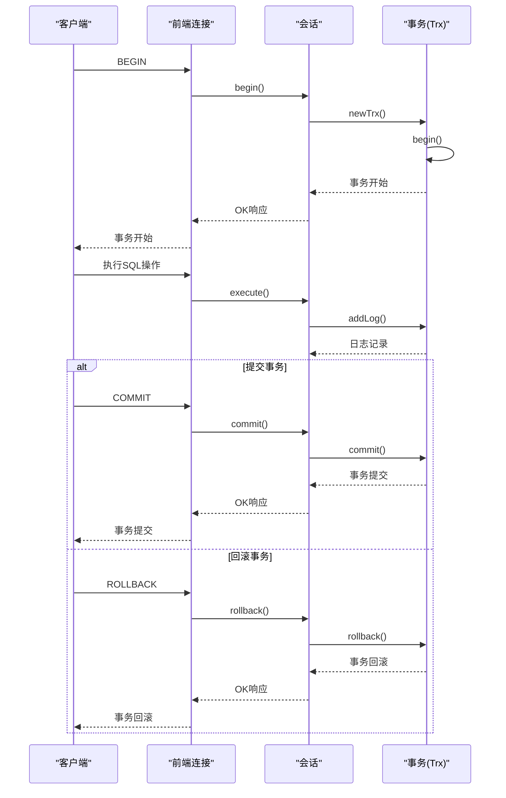
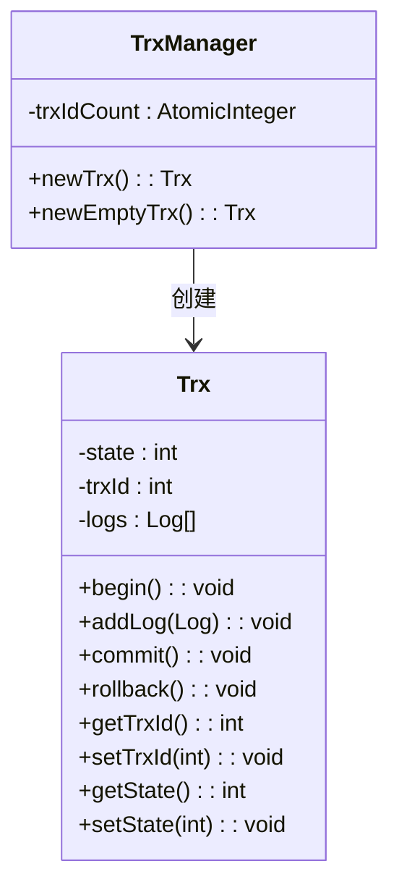
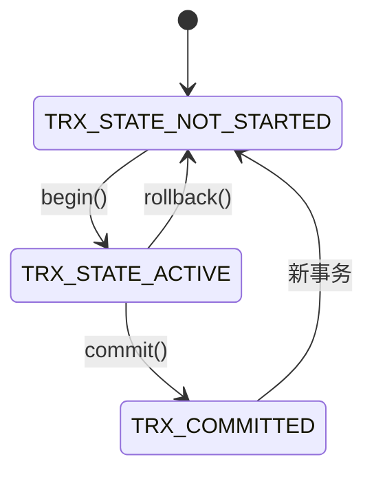
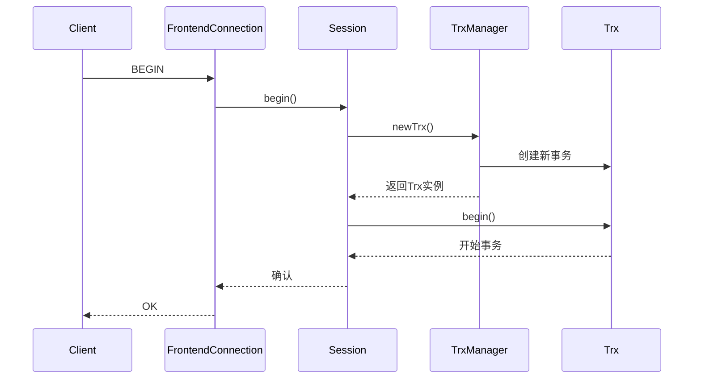
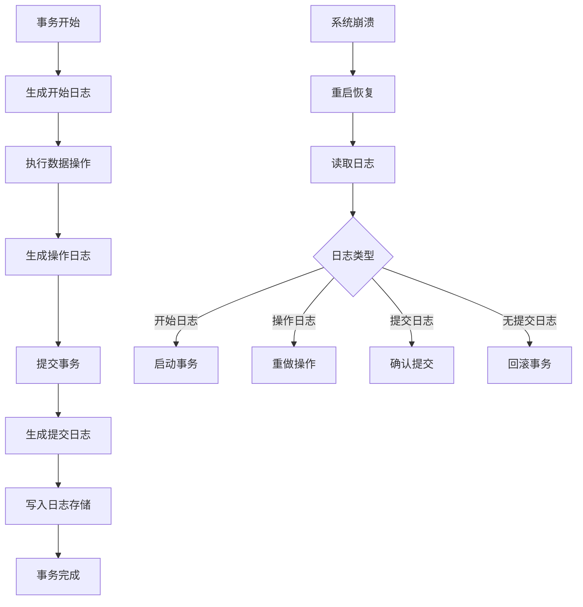
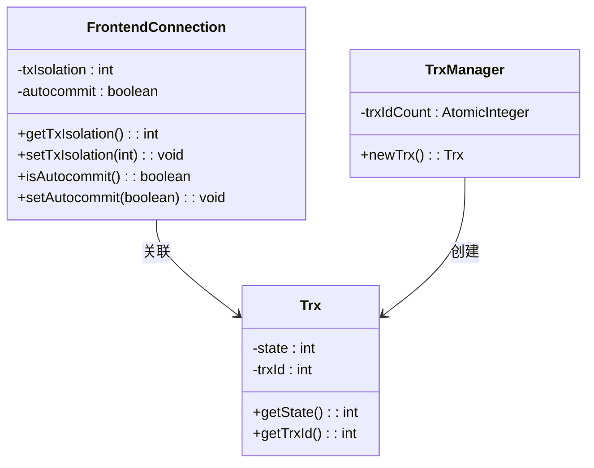
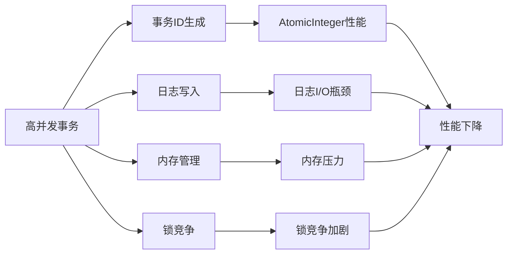

# 事务生命周期管理

<cite>
**本文档中引用的文件**  
- [TrxManager.java](file://src/main/java/alchemystar/freedom/transaction/TrxManager.java)
- [Trx.java](file://src/main/java/alchemystar/freedom/transaction/Trx.java)
- [TrxState.java](file://src/main/java/alchemystar/freedom/transaction/TrxState.java)
- [FrontendConnection.java](file://src/main/java/alchemystar/freedom/engine/net/handler/frontend/FrontendConnection.java)
- [ServerQueryHandler.java](file://src/main/java/alchemystar/freedom/engine/net/handler/frontend/ServerQueryHandler.java)
- [BeginHandler.java](file://src/main/java/alchemystar/freedom/engine/net/handler/frontend/BeginHandler.java)
</cite>

## 目录
1. [引言](#引言)
2. [事务生命周期概述](#事务生命周期概述)
3. [事务管理器与事务ID分配](#事务管理器与事务id分配)
4. [事务状态转换机制](#事务状态转换机制)
5. [事务与会话的协同工作](#事务与会话的协同工作)
6. [事务日志与恢复机制](#事务日志与恢复机制)
7. [并发控制与隔离级别](#并发控制与隔离级别)
8. [高并发场景下的性能考量](#高并发场景下的性能考量)
9. [结论](#结论)

## 引言
事务是数据库系统中确保数据一致性和完整性的核心机制。本文档详细阐述了事务从创建到提交或回滚的完整生命周期，重点分析了`TrxManager`如何通过事务ID管理并发事务，`Trx`对象如何维护事务状态（`TrxState`）的转换，并与`Session`对象协同工作的机制。同时，结合代码示例说明事务的超时处理、状态检查和并发访问控制，并探讨在高并发场景下事务管理器的性能考量和潜在瓶颈。

**Section sources**
- [Trx.java](file://src/main/java/alchemystar/freedom/transaction/Trx.java#L1-L120)
- [TrxState.java](file://src/main/java/alchemystar/freedom/transaction/TrxState.java#L1-L19)

## 事务生命周期概述
事务的生命周期始于`BEGIN`命令，终于`COMMIT`提交或`ROLLBACK`回滚。整个过程涉及事务的创建、状态变更、日志记录、提交或回滚等关键步骤。

**Diagram sources**
- [FrontendConnection.java](file://src/main/java/alchemystar/freedom/engine/net/handler/frontend/FrontendConnection.java#L200-L215)
- [ServerQueryHandler.java](file://src/main/java/alchemystar/freedom/engine/net/handler/frontend/ServerQueryHandler.java#L50-L60)
- [Trx.java](file://src/main/java/alchemystar/freedom/transaction/Trx.java#L20-L35)

## 事务管理器与事务ID分配
`TrxManager`是事务管理的核心组件，负责事务的创建和事务ID的分配。它使用`AtomicInteger`来保证事务ID的唯一性和线程安全性。

**Diagram sources**
- [TrxManager.java](file://src/main/java/alchemystar/freedom/transaction/TrxManager.java#L7-L21)
- [Trx.java](file://src/main/java/alchemystar/freedom/transaction/Trx.java#L1-L120)

**Section sources**
- [TrxManager.java](file://src/main/java/alchemystar/freedom/transaction/TrxManager.java#L7-L21)

## 事务状态转换机制
事务的状态由`TrxState`接口定义，包括未开始、进行中、已提交等状态。`Trx`对象通过`state`字段维护当前事务状态，并在关键操作时进行状态转换。

**Diagram sources**
- [TrxState.java](file://src/main/java/alchemystar/freedom/transaction/TrxState.java#L1-L19)
- [Trx.java](file://src/main/java/alchemystar/freedom/transaction/Trx.java#L20-L50)

**Section sources**
- [TrxState.java](file://src/main/java/alchemystar/freedom/transaction/TrxState.java#L1-L19)
- [Trx.java](file://src/main/java/alchemystar/freedom/transaction/Trx.java#L20-L50)

## 事务与会话的协同工作
事务与会话（`Session`）紧密协作，`FrontendConnection`通过`Session`对象来管理事务的生命周期。当客户端发送`BEGIN`命令时，会话创建新的事务并开始执行。

**Diagram sources**
- [FrontendConnection.java](file://src/main/java/alchemystar/freedom/engine/net/handler/frontend/FrontendConnection.java#L200-L205)
- [ServerQueryHandler.java](file://src/main/java/alchemystar/freedom/engine/net/handler/frontend/ServerQueryHandler.java#L50)
- [TrxManager.java](file://src/main/java/alchemystar/freedom/transaction/TrxManager.java#L10-L15)

**Section sources**
- [FrontendConnection.java](file://src/main/java/alchemystar/freedom/engine/net/handler/frontend/FrontendConnection.java#L200-L215)
- [ServerQueryHandler.java](file://src/main/java/alchemystar/freedom/engine/net/handler/frontend/ServerQueryHandler.java#L50)

## 事务日志与恢复机制
事务日志是确保数据持久性和崩溃恢复的关键。每个事务操作都会生成相应的日志记录，包括开始日志、操作日志和提交日志。

**Diagram sources**
- [Trx.java](file://src/main/java/alchemystar/freedom/transaction/Trx.java#L20-L55)
- [Trx.java](file://src/main/java/alchemystar/freedom/transaction/Trx.java#L60-L85)

**Section sources**
- [Trx.java](file://src/main/java/alchemystar/freedom/transaction/Trx.java#L20-L85)

## 并发控制与隔离级别
系统通过事务ID和状态管理来实现并发控制。虽然当前实现中未完全展示隔离级别的细节，但`FrontendConnection`中已预留了事务隔离级别的设置接口。

**Diagram sources**
- [FrontendConnection.java](file://src/main/java/alchemystar/freedom/engine/net/handler/frontend/FrontendConnection.java#L150-L170)
- [Trx.java](file://src/main/java/alchemystar/freedom/transaction/Trx.java#L1-L120)

**Section sources**
- [FrontendConnection.java](file://src/main/java/alchemystar/freedom/engine/net/handler/frontend/FrontendConnection.java#L150-L170)

## 高并发场景下的性能考量
在高并发场景下，事务管理器的性能主要受以下几个因素影响：

1. **事务ID生成的性能**：`AtomicInteger`提供了高效的线程安全ID生成，但在极高并发下可能成为瓶颈。
2. **日志写入的性能**：每个事务操作都需要写入日志，日志I/O可能成为性能瓶颈。
3. **内存占用**：事务在执行过程中需要在内存中维护日志列表，大量并发事务可能导致内存压力。
4. **锁竞争**：事务状态变更和日志写入可能涉及锁操作，高并发下锁竞争会降低性能。

**Diagram sources**
- [TrxManager.java](file://src/main/java/alchemystar/freedom/transaction/TrxManager.java#L7)
- [Trx.java](file://src/main/java/alchemystar/freedom/transaction/Trx.java#L10-L15)
- [Trx.java](file://src/main/java/alchemystar/freedom/transaction/Trx.java#L30-L35)

**Section sources**
- [TrxManager.java](file://src/main/java/alchemystar/freedom/transaction/TrxManager.java#L7)
- [Trx.java](file://src/main/java/alchemystar/freedom/transaction/Trx.java#L10-L15)

## 结论
本文档详细阐述了事务的完整生命周期，从`BEGIN`命令触发事务创建，到`COMMIT`提交或`ROLLBACK`回滚的全过程。分析了`TrxManager`如何通过事务ID管理并发事务，`Trx`对象如何维护事务状态（`TrxState`）转换，并与`Session`对象协同工作的机制。同时，探讨了事务日志、恢复机制、并发控制以及高并发场景下的性能考量。这些机制共同确保了数据库系统在各种场景下的数据一致性和可靠性。