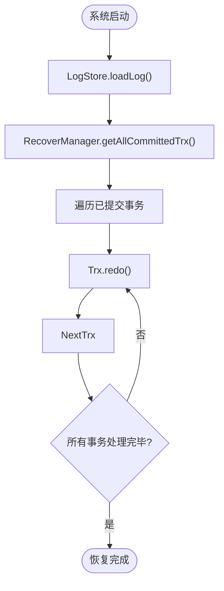
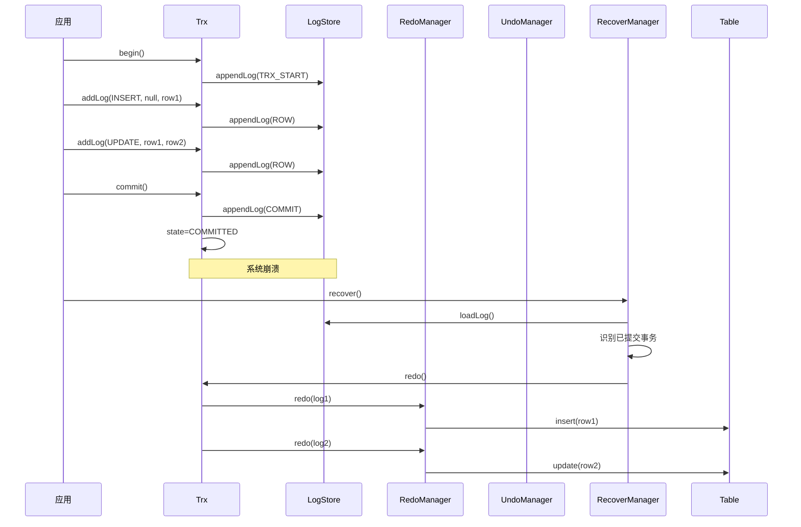
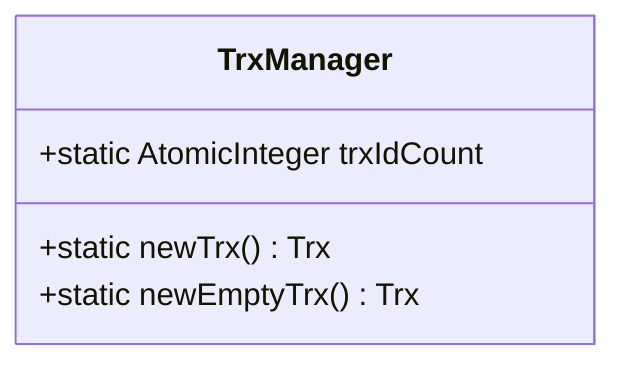
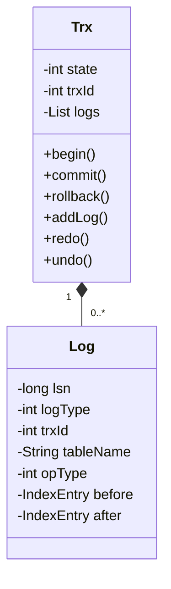
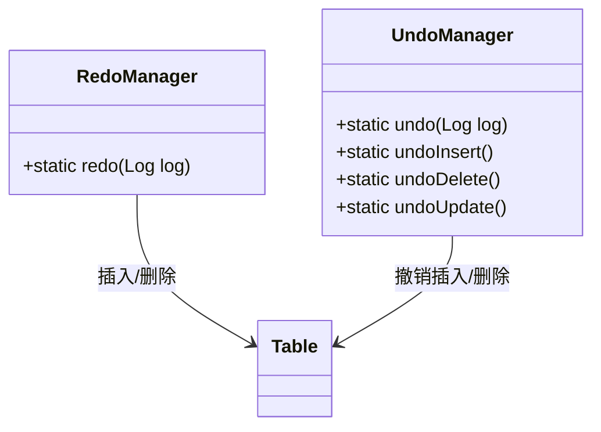

# 事务管理

<cite>
**本文档中引用的文件**  
- [TrxManager.java](file://src/main/java/alchemystar/freedom/transaction/TrxManager.java)
- [Trx.java](file://src/main/java/alchemystar/freedom/transaction/Trx.java)
- [LogStore.java](file://src/main/java/alchemystar/freedom/store/log/LogStore.java)
- [RecoverManager.java](file://src/main/java/alchemystar/freedom/recovery/RecoverManager.java)
- [RedoManager.java](file://src/main/java/alchemystar/freedom/transaction/redo/RedoManager.java)
- [UndoManager.java](file://src/main/java/alchemystar/freedom/transaction/undo/UndoManager.java)
- [Log.java](file://src/main/java/alchemystar/freedom/transaction/log/Log.java)
- [LogType.java](file://src/main/java/alchemystar/freedom/transaction/log/LogType.java)
- [OpType.java](file://src/main/java/alchemystar/freedom/transaction/OpType.java)
- [Database.java](file://src/main/java/alchemystar/freedom/Database.java)
</cite>

## 目录
1. [简介](#简介)
2. [事务生命周期管理](#事务生命周期管理)
3. [日志机制与ACID实现](#日志机制与acid实现)
4. [WAL与恢复机制](#wal与恢复机制)
5. [事务执行与崩溃恢复示例](#事务执行与崩溃恢复示例)
6. [核心组件分析](#核心组件分析)
7. [总结](#总结)

## 简介
本系统通过基于Write-Ahead Logging（WAL）的日志机制，实现事务的ACID特性。事务管理由`TrxManager`统一调度，`Trx`对象负责跟踪事务状态，`LogStore`负责日志持久化，`RedoManager`和`UndoManager`分别保障持久性与原子性。在系统崩溃后，`RecoverManager`通过重放日志完成恢复。

## 事务生命周期管理
事务的生命周期包括BEGIN、COMMIT和ROLLBACK三个核心阶段，由`Trx`类进行状态跟踪。

- **BEGIN**：调用`begin()`方法时，生成`TRX_START`类型日志并持久化，事务状态从`TRX_STATE_NOT_STARTED`变为`TRX_STATE_ACTIVE`。
- **COMMIT**：调用`commit()`方法时，生成`COMMIT`类型日志并持久化，状态变为`TRX_COMMITTED`，同时清空内存中的日志列表以释放资源。
- **ROLLBACK**：调用`rollback()`方法时，触发反向`undo`操作回滚所有已执行操作，状态重置为初始状态。

事务ID由`TrxManager`使用原子计数器全局分配，确保唯一性。

**Section sources**
- [Trx.java](file://src/main/java/alchemystar/freedom/transaction/Trx.java#L20-L118)
- [TrxManager.java](file://src/main/java/alchemystar/freedom/transaction/TrxManager.java#L7-L21)

## 日志机制与ACID实现
系统通过日志机制实现ACID四大特性：

| ACID特性 | 实现机制 |
|--------|--------|
| **原子性 (Atomicity)** | 利用Undo日志，在事务回滚或崩溃时反向执行操作，撤销已修改的数据 |
| **一致性 (Consistency)** | 通过原子性与隔离性机制，确保数据库始终处于合法状态 |
| **隔离性 (Isolation)** | 未在当前代码中体现，但可通过事务状态与锁机制实现 |
| **持久性 (Durability)** | 通过Redo日志，在系统重启后重放已提交事务的操作，确保数据不丢失 |

日志类型由`LogType`定义，包括`TRX_START`、`ROW`（数据行变更）、`COMMIT`等。每条日志包含LSN（日志序列号）、事务ID、操作类型、表名及变更前后的数据快照（before/after）。

**Section sources**
- [Log.java](file://src/main/java/alchemystar/freedom/transaction/log/Log.java#L5-L149)
- [LogType.java](file://src/main/java/alchemystar/freedom/transaction/log/LogType.java)
- [OpType.java](file://src/main/java/alchemystar/freedom/transaction/OpType.java)

## WAL与恢复机制
系统采用Write-Ahead Logging（预写日志）机制，确保在数据页写入磁盘前，所有变更日志已持久化到日志文件。

### LogStore：日志存储
`LogStore`负责日志的写入与读取。日志以二进制格式追加写入文件，包含LSN、日志类型、事务ID及具体数据变更。重启时，`loadLog()`方法从文件头读取所有日志，用于恢复。

### RecoverManager：故障恢复
`RecoverManager`在系统启动时调用`recover()`方法执行恢复流程：
1. 加载所有日志记录
2. 通过`getAllCommittedTrx()`识别已提交事务（存在`COMMIT`日志）
3. 对每个已提交事务调用`trx.redo()`重放操作



**Diagram sources**
- [LogStore.java](file://src/main/java/alchemystar/freedom/store/log/LogStore.java#L24-L112)
- [RecoverManager.java](file://src/main/java/alchemystar/freedom/recovery/RecoverManager.java#L16-L61)

## 事务执行与崩溃恢复示例
考虑以下事务：
```sql
BEGIN;
INSERT INTO users(id, name) VALUES (1, 'Alice');
UPDATE users SET name = 'Bob' WHERE id = 1;
COMMIT;
```

### 正常执行流程
1. `BEGIN` → 写入`TRX_START`日志
2. `INSERT` → 写入`ROW`日志（opType=insert，after=新记录）
3. `UPDATE` → 写入`ROW`日志（opType=update，before=旧值，after=新值）
4. `COMMIT` → 写入`COMMIT`日志，事务提交

### 崩溃恢复场景
假设在`COMMIT`日志写入前系统崩溃：
- 恢复时，`RecoverManager`发现该事务无`COMMIT`日志，不会执行`redo`
- 由于数据页尚未写入（WAL机制），数据保持原状，事务效果被忽略

若`COMMIT`日志已写入：
- 恢复时识别为已提交事务
- 执行`redo()`，调用`RedoManager.redo()`重放`INSERT`和`UPDATE`操作
- 数据状态与提交时一致，保证持久性

若事务执行中被`ROLLBACK`：
- 调用`undo()`，按日志逆序执行：
  - `UPDATE` → `undoUpdate()`（未实现）
  - `INSERT` → `undoInsert()` → 执行`DELETE`
- 所有变更被撤销，保证原子性



**Diagram sources**
- [Trx.java](file://src/main/java/alchemystar/freedom/transaction/Trx.java#L20-L118)
- [RedoManager.java](file://src/main/java/alchemystar/freedom/transaction/redo/RedoManager.java#L13-L31)
- [UndoManager.java](file://src/main/java/alchemystar/freedom/transaction/undo/UndoManager.java#L11-L44)

## 核心组件分析

### TrxManager
事务管理器，负责创建新事务并分配唯一事务ID。



**Diagram sources**
- [TrxManager.java](file://src/main/java/alchemystar/freedom/transaction/TrxManager.java#L7-L21)

### Trx
事务对象，维护事务状态、ID及日志列表，控制事务生命周期。



**Diagram sources**
- [Trx.java](file://src/main/java/alchemystar/freedom/transaction/Trx.java#L20-L118)

### RedoManager 与 UndoManager
分别负责重做与撤销操作。



**Diagram sources**
- [RedoManager.java](file://src/main/java/alchemystar/freedom/transaction/redo/RedoManager.java#L13-L31)
- [UndoManager.java](file://src/main/java/alchemystar/freedom/transaction/undo/UndoManager.java#L11-L44)

## 总结
本系统通过WAL机制与日志驱动的恢复策略，实现了事务的ACID特性。`Trx`对象精确管理事务状态，`LogStore`确保日志持久化，`RecoverManager`在崩溃后通过重放已提交事务的日志保证数据一致性。尽管`update`操作的undo/redo尚未实现，整体架构已具备完整的事务管理能力。