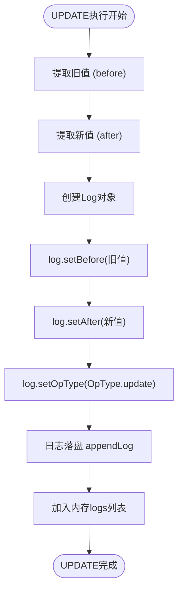
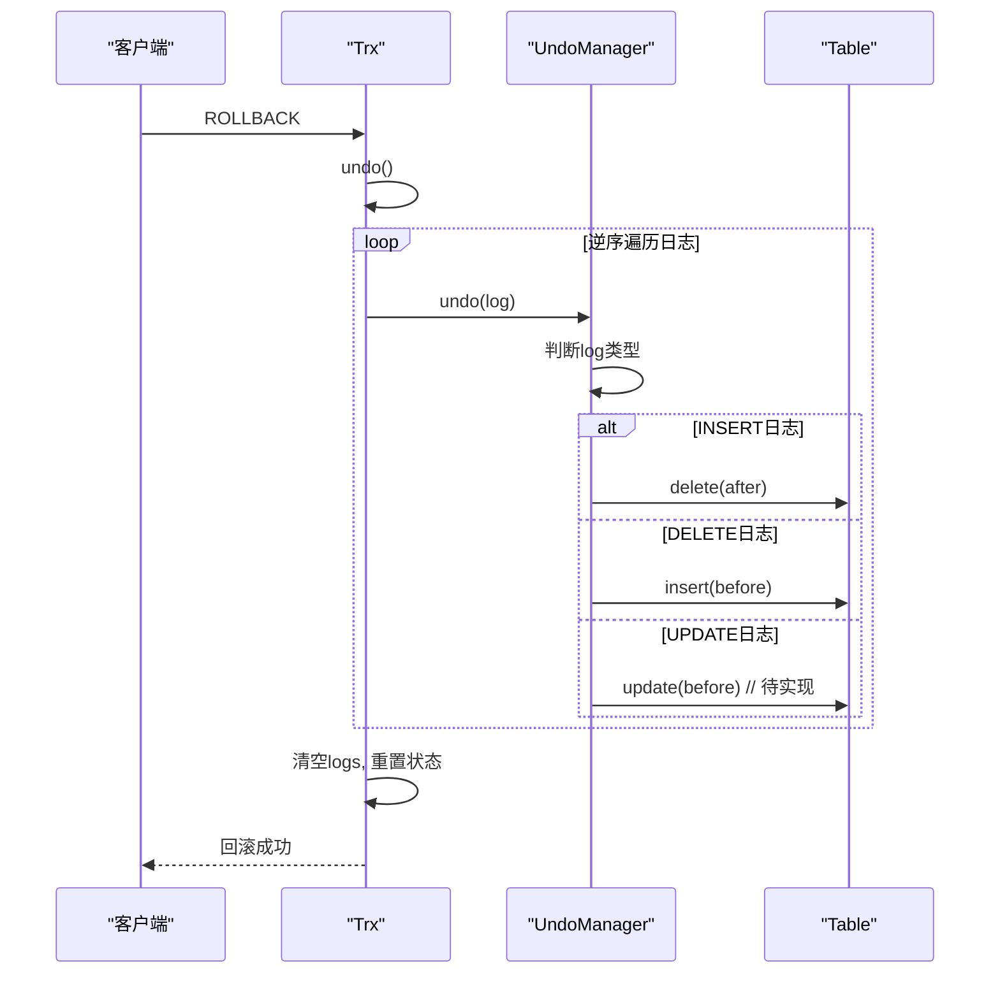

# 撤销日志（Undo）实现

<cite>
**本文档引用的文件**  
- [UndoManager.java](file://src/main/java/alchemystar/freedom/transaction/undo/UndoManager.java)
- [Trx.java](file://src/main/java/alchemystar/freedom/transaction/Trx.java)
- [TrxManager.java](file://src/main/java/alchemystar/freedom/transaction/TrxManager.java)
- [InsertExecutor.java](file://src/main/java/alchemystar/freedom/sql/InsertExecutor.java)
- [DeleteExecutor.java](file://src/main/java/alchemystar/freedom/sql/DeleteExecutor.java)
- [Table.java](file://src/main/java/alchemystar/freedom/meta/Table.java)
</cite>

## 目录
1. [事务原子性保障机制](#事务原子性保障机制)
2. [撤销日志记录方式](#撤销日志记录方式)
3. [UPDATE语句与反向操作日志生成](#update语句与反向操作日志生成)
4. [ROLLBACK命令执行流程](#rollback命令执行流程)
5. [长事务对Undo日志的影响及应对策略](#长事务对undo日志的影响及应对策略)

## 事务原子性保障机制

在数据库系统中，事务的原子性是指一个事务中的所有操作要么全部成功提交，要么全部回滚，不会出现部分执行的情况。本系统通过`Trx`类和`UndoManager`协同工作来实现这一特性。

当事务开始时，`Trx.begin()`方法会记录一条事务启动日志（`TRX_START`），并将其持久化到日志存储中。随后，所有数据修改操作（如INSERT、UPDATE、DELETE）都会生成对应的行级日志（`ROW`类型），并加入事务的内存日志列表`logs`中。这些日志不仅用于崩溃恢复时的重做（redo），也作为回滚操作的依据。

若事务最终调用`commit()`，则写入`COMMIT`日志后事务状态变为已提交，并清空内存中的日志列表；若调用`rollback()`，则触发反向撤销流程，按逆序逐条应用undo日志，恢复数据至事务开始前的状态。

**Section sources**  
- [Trx.java](file://src/main/java/alchemystar/freedom/transaction/Trx.java#L25-L50)

## 撤销日志记录方式

### 旧值的保存

在执行数据修改操作时，系统会将修改前的数据（即“旧值”）保存在日志的`before`字段中。例如，在执行DELETE操作时，被删除的记录会被完整地保存在`Log.getBefore()`中；而在执行UPDATE操作时，更新前的原始记录也会被记录下来。

对于INSERT操作，由于是新增记录，因此没有“旧值”，此时`before`字段为`null`，而新插入的记录则保存在`after`字段中。

### 回滚指针维护

每个事务对象`Trx`内部维护一个`List<Log>`类型的日志列表`logs`，该列表按操作顺序记录了该事务执行的所有日志。在回滚时，系统从后往前遍历该列表，依次调用`UndoManager.undo(log)`进行反向操作。这种设计确保了操作的逆序执行，符合回滚语义。

### 回滚段管理

系统并未显式划分独立的“回滚段”，而是将所有事务日志统一写入日志存储（`LogStore`）中。每条日志包含事务ID（`trxId`）、日志序列号（LSN）、操作类型（`opType`）、表名（`tableName`）以及前后像（`before`/`after`）。通过`Database.getInstance().getLogStore().appendLog(log)`实现日志落盘，保证即使系统崩溃也能恢复事务状态。

**Section sources**  
- [Trx.java](file://src/main/java/alchemystar/freedom/transaction/Trx.java#L60-L90)
- [UndoManager.java](file://src/main/java/alchemystar/freedom/transaction/undo/UndoManager.java#L10-L20)

## UPDATE语句与反向操作日志生成

虽然当前代码中`undoUpdate`方法尚未实现（标记为`// todo`），但从整体架构可以推断其设计思路。

当执行UPDATE语句时，系统会创建一条`ROW`类型的日志，其中：
- `before`字段保存更新前的原始记录（`ClusterIndexEntry`）
- `after`字段保存更新后的目标记录

在生成反向操作日志时，系统会根据`OpType.update`类型识别该操作，并准备执行反向UPDATE或等效的“恢复旧值”操作。理想情况下，`undoUpdate`应将记录从`after`状态恢复为`before`状态，即重新写入旧值。

尽管目前未实现，但结构上已预留接口，未来可通过调用`table.update(log.getBefore())`完成旧值恢复。

**Diagram sources**  
- [Trx.java](file://src/main/java/alchemystar/freedom/transaction/Trx.java#L70-L80)
- [UndoManager.java](file://src/main/java/alchemystar/freedom/transaction/undo/UndoManager.java#L25-L30)

## ROLLBACK命令执行流程

当用户发出`ROLLBACK`命令时，系统执行以下步骤：

1. 调用`Trx.rollback()`方法；
2. 内部调用私有方法`undo()`；
3. 从日志列表末尾向前遍历每一条日志；
4. 对每条日志调用`UndoManager.undo(log)`进行反向操作；
5. 根据日志的操作类型（`insert`、`update`、`delete`）分发处理；
6. 所有操作完成后，清除内存日志列表，重置事务状态。

具体反向操作逻辑如下：
- **INSERT的反向操作是DELETE**：调用`table.delete(log.getAfter())`删除已插入的记录；
- **DELETE的反向操作是INSERT**：调用`table.insert(log.getBefore())`重新插入被删除的记录；
- **UPDATE的反向操作是恢复旧值**：理论上应调用`table.update(log.getBefore())`，但当前未实现。

**Diagram sources**  
- [Trx.java](file://src/main/java/alchemystar/freedom/transaction/Trx.java#L100-L115)
- [UndoManager.java](file://src/main/java/alchemystar/freedom/transaction/undo/UndoManager.java#L10-L35)

## 长事务对Undo日志的影响及应对策略

### 影响分析

长事务会持续占用内存中的日志列表`logs`，直到提交或回滚才释放。这可能导致以下问题：
- **内存压力增大**：大量未提交事务的日志累积占用JVM堆内存；
- **GC压力上升**：长期存活的对象增加Full GC频率；
- **恢复时间变长**：崩溃后需重放更多日志才能达到一致状态；
- **锁竞争加剧**：长时间持有行锁或表锁，影响并发性能。

此外，由于所有日志都写入`LogStore`，长事务还会导致日志文件持续增长，可能影响磁盘空间使用效率。

### 应对策略

1. **限制事务最大执行时间**：可在会话层设置超时机制，自动中断长时间运行的事务。
2. **分批提交大事务**：建议将大规模数据变更拆分为多个小事务提交，减少单次事务的日志量。
3. **优化日志存储结构**：可引入日志归档机制，将已提交事务的日志移出主日志流，避免无限增长。
4. **引入MVCC机制**：通过多版本并发控制减少对undo日志的依赖，提升读写并发能力。
5. **监控与告警**：建立事务监控体系，及时发现并处理异常长事务。

当前系统可通过`TrxManager`统一管理事务生命周期，未来可在此基础上扩展超时检测和自动回滚功能。

**Section sources**  
- [Trx.java](file://src/main/java/alchemystar/freedom/transaction/Trx.java#L5-L119)
- [TrxManager.java](file://src/main/java/alchemystar/freedom/transaction/TrxManager.java#L5-L20)