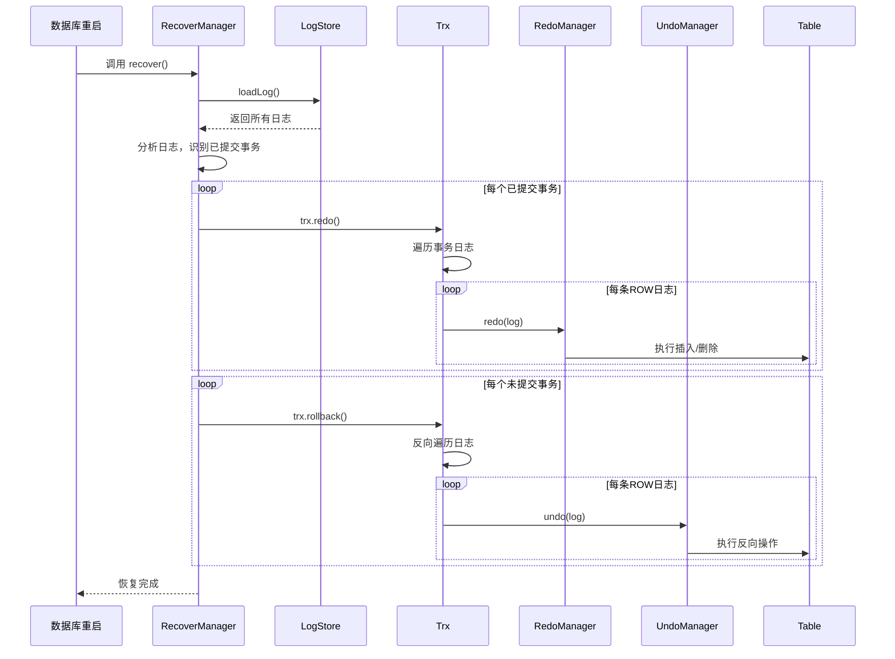

# 故障恢复流程

<cite>
**本文档引用的文件**  
- [RecoverManager.java](file://src/main/java/alchemystar/freedom/recovery/RecoverManager.java)
- [Trx.java](file://src/main/java/alchemystar/freedom/transaction/Trx.java)
- [RedoManager.java](file://src/main/java/alchemystar/freedom/transaction/redo/RedoManager.java)
- [UndoManager.java](file://src/main/java/alchemystar/freedom/transaction/undo/UndoManager.java)
- [Log.java](file://src/main/java/alchemystar/freedom/transaction/log/Log.java)
- [LogType.java](file://src/main/java/alchemystar/freedom/transaction/log/LogType.java)
</cite>

## 目录
1. [引言](#引言)
2. [故障恢复流程概述](#故障恢复流程概述)
3. [分析阶段](#分析阶段)
4. [重做阶段](#重做阶段)
5. [撤销阶段](#撤销阶段)
6. [事务状态重建与数据一致性](#事务状态重建与数据一致性)
7. [幂等性与性能优化](#幂等性与性能优化)
8. [恢复流程示意图](#恢复流程示意图)
9. [总结](#总结)

## 引言
数据库系统在运行过程中可能因硬件故障、断电或软件崩溃等原因意外中断。为确保数据的一致性和持久性，系统必须在重启后执行自动故障恢复流程。本文档详细阐述 `RecoverManager` 在数据库重启时执行的三阶段恢复机制：分析阶段、重做阶段和撤销阶段。通过解析日志文件，重建事务状态，并重放或回滚操作，最终实现数据的完整一致性。

## 故障恢复流程概述
故障恢复流程由 `RecoverManager` 类主导，其核心方法 `recover()` 在数据库启动时被调用。整个流程分为三个逻辑阶段：
1. **分析阶段**：从日志存储中加载所有日志记录，识别已提交和未提交的事务。
2. **重做阶段**：对所有已提交事务的日志进行重放，确保其修改被持久化到数据页中。
3. **撤销阶段**：对所有未提交事务的日志进行反向操作（回滚），撤销其对数据库的不一致修改。

该流程确保了数据库在崩溃后能够恢复到一个一致的状态，满足ACID特性中的原子性和持久性。

**Section sources**
- [RecoverManager.java](file://src/main/java/alchemystar/freedom/recovery/RecoverManager.java#L16-L61)

## 分析阶段
分析阶段的目标是确定恢复的起点，并区分已提交与未提交的事务。`RecoverManager` 通过调用 `LogStore.loadLog()` 方法加载磁盘上的所有日志记录到内存中。

随后，`getAllCommittedTrx()` 方法遍历日志列表，根据日志类型（`LogType`）构建事务上下文：
- 当遇到 `TRX_START` 类型日志时，创建一个新的事务对象并记录其事务ID。
- 当遇到 `ROW` 类型日志时，将其添加到对应事务的日志列表中。
- 当遇到 `COMMIT` 类型日志时，确认该事务已成功提交，并将其加入待重做事务列表。

此阶段完成后，系统获得了所有需要重做的已提交事务的完整日志序列。

**Section sources**
- [RecoverManager.java](file://src/main/java/alchemystar/freedom/recovery/RecoverManager.java#L35-L50)

## 重做阶段
重做阶段负责确保所有已提交事务的修改都被正确应用到数据库中。对于分析阶段识别出的每一个已提交事务，系统调用其 `redo()` 方法。

`Trx.redo()` 方法遍历该事务的日志列表，对于每一条 `ROW` 类型的日志，调用 `RedoManager.redo(log)` 执行具体的重做操作。`RedoManager` 根据日志中的操作类型（`OpType`）进行分支处理：
- **插入操作（insert）**：使用日志中的 `after` 字段重建 `IndexEntry` 并插入到对应的表中。
- **删除操作（delete）**：使用日志中的 `before` 字段定位并删除表中的记录。
- **更新操作（update）**：当前实现为待办（todo），但逻辑上应结合 `before` 和 `after` 字段完成更新。

重做操作直接作用于存储层的表结构，确保了数据的最终一致性。

**Section sources**
- [RecoverManager.java](file://src/main/java/alchemystar/freedom/recovery/RecoverManager.java#L25-L28)
- [Trx.java](file://src/main/java/alchemystar/freedom/transaction/Trx.java#L77-L83)
- [RedoManager.java](file://src/main/java/alchemystar/freedom/transaction/redo/RedoManager.java#L15-L30)

## 撤销阶段
撤销阶段的目标是清理未提交事务造成的中间状态，维护数据库的一致性。虽然 `RecoverManager` 的当前实现主要关注重做，但事务类 `Trx` 提供了完整的回滚机制。

`Trx.rollback()` 方法会调用私有的 `undo()` 方法，该方法从日志列表的末尾开始反向遍历（确保操作顺序正确），对每条 `ROW` 类型日志调用 `UndoManager.undo(log)`。

`UndoManager` 根据操作类型执行反向操作：
- **插入操作（insert）**：执行 `undoInsert`，即根据 `after` 字段删除已插入的记录。
- **删除操作（delete）**：执行 `undoDelete`，即根据 `before` 字段将删除的记录重新插入。
- **更新操作（update）**：执行 `undoUpdate`，即根据 `before` 字段将记录恢复到更新前的状态。

在完整的恢复流程中，撤销阶段应在重做阶段之后执行，以处理那些已开始但未提交的事务。

**Section sources**
- [Trx.java](file://src/main/java/alchemystar/freedom/transaction/Trx.java#L100-L105)
- [UndoManager.java](file://src/main/java/alchemystar/freedom/transaction/undo/UndoManager.java#L13-L45)

## 事务状态重建与数据一致性
在恢复过程中，事务的状态通过日志类型进行重建：
- `TRX_START` 日志表示事务开始。
- `COMMIT` 日志表示事务成功提交。
- 缺少 `COMMIT` 日志的事务被视为未提交，需要回滚。

`Log` 类中的 `lsn`（日志序列号）字段保证了日志的有序性，这对于按正确顺序重做和撤销操作至关重要。`TableManager` 负责管理所有表的元数据和实例，确保 `RedoManager` 和 `UndoManager` 能够正确访问目标表。

通过重做所有已提交事务和撤销所有未提交事务，数据库最终达到一个与崩溃前一致的状态，所有持久化数据都反映了已提交事务的最终结果。

**Section sources**
- [Log.java](file://src/main/java/alchemystar/freedom/transaction/log/Log.java#L15-L150)
- [LogType.java](file://src/main/java/alchemystar/freedom/transaction/log/LogType.java#L0-L15)

## 幂等性与性能优化
恢复过程的设计充分考虑了幂等性和性能：
- **幂等性**：每条日志都包含唯一的 `lsn`，并且 `RedoManager` 和 `UndoManager` 的操作设计为幂等。这意味着即使恢复过程被中断并重新执行，也不会导致数据重复修改或状态错乱。
- **性能优化**：
  - 日志批量加载：`LogStore.loadLog()` 一次性加载所有日志，减少I/O开销。
  - 内存中处理：事务日志在内存中构建和遍历，提高处理速度。
  - 事务隔离：每个事务的日志独立处理，便于并行化（尽管当前实现为串行）。

这些措施确保了恢复过程既安全又高效，能够在最短时间内使数据库重新可用。

**Section sources**
- [Log.java](file://src/main/java/alchemystar/freedom/transaction/log/Log.java#L15-L150)
- [RedoManager.java](file://src/main/java/alchemystar/freedom/transaction/redo/RedoManager.java#L15-L30)
- [UndoManager.java](file://src/main/java/alchemystar/freedom/transaction/undo/UndoManager.java#L13-L45)

## 恢复流程示意图

**Diagram sources**
- [RecoverManager.java](file://src/main/java/alchemystar/freedom/recovery/RecoverManager.java#L16-L61)
- [Trx.java](file://src/main/java/alchemystar/freedom/transaction/Trx.java#L77-L105)
- [RedoManager.java](file://src/main/java/alchemystar/freedom/transaction/redo/RedoManager.java#L15-L30)
- [UndoManager.java](file://src/main/java/alchemystar/freedom/transaction/undo/UndoManager.java#L13-L45)

## 总结
`RecoverManager` 实现了一个标准的三阶段数据库恢复流程。通过分析日志确定事务状态，重做已提交事务的修改，并撤销未提交事务的影响，系统能够在崩溃后自动恢复到一个一致的状态。该流程利用日志的幂等性保证了恢复的安全性，并通过批量加载和内存处理优化了性能。尽管当前实现侧重于重做，但其架构为完整的撤销阶段提供了坚实的基础。