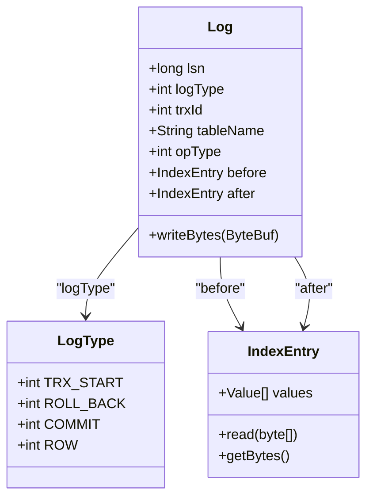
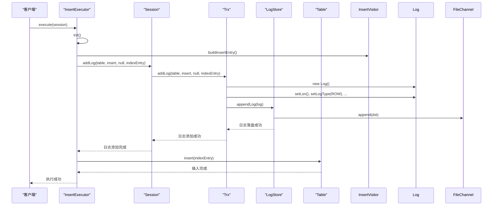
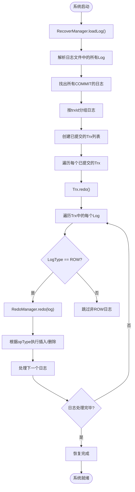
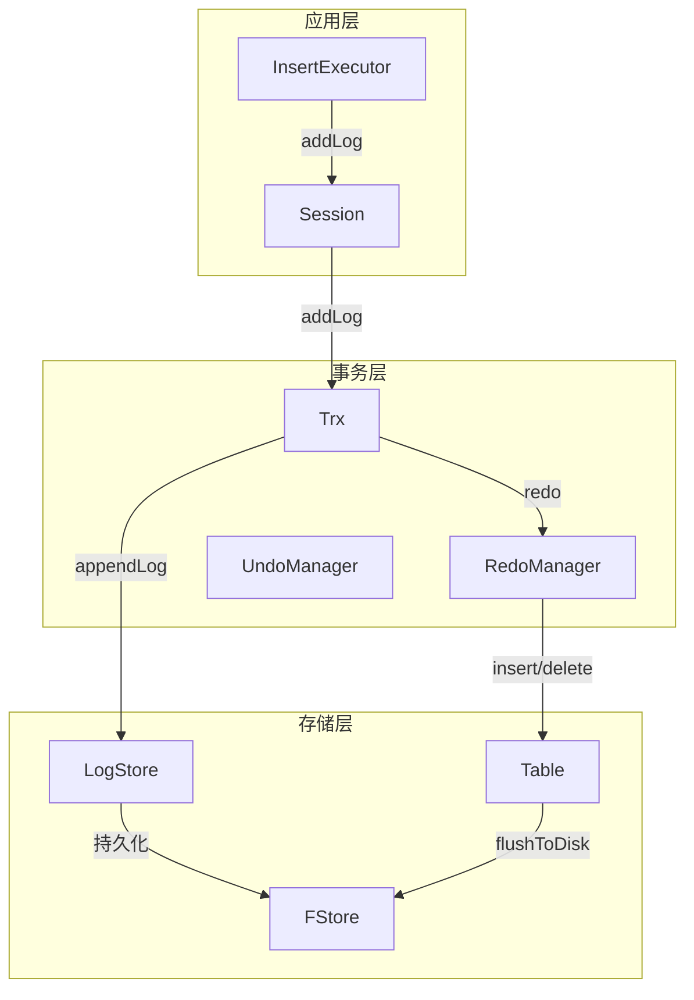

# 重做日志（Redo）实现

<cite>
**本文档引用的文件**  
- [RedoManager.java](file://src/main/java/alchemystar/freedom/transaction/redo/RedoManager.java)
- [LogStore.java](file://src/main/java/alchemystar/freedom/store/log/LogStore.java)
- [Log.java](file://src/main/java/alchemystar/freedom/transaction/log/Log.java)
- [Trx.java](file://src/main/java/alchemystar/freedom/transaction/Trx.java)
- [InsertExecutor.java](file://src/main/java/alchemystar/freedom/sql/InsertExecutor.java)
- [RecoverManager.java](file://src/main/java/alchemystar/freedom/recovery/RecoverManager.java)
- [Database.java](file://src/main/java/alchemystar/freedom/engine/Database.java)
- [Table.java](file://src/main/java/alchemystar/freedom/meta/Table.java)
- [LogType.java](file://src/main/java/alchemystar/freedom/transaction/log/LogType.java)
</cite>

## 目录
1. [简介](#简介)
2. [事务持久性保障机制](#事务持久性保障机制)
3. [重做日志的记录时机与内容结构](#重做日志的记录时机与内容结构)
4. [INSERT操作的执行路径与日志生成](#insert操作的执行路径与日志生成)
5. [系统崩溃后的恢复流程](#系统崩溃后的恢复流程)
6. [核心组件协作流程](#核心组件协作流程)
7. [总结](#总结)

## 简介
本文档详细描述了数据库系统中`RedoManager`如何通过重做日志（Redo Log）机制保障事务的持久性。重点分析了重做日志的记录时机、内容结构、与`LogStore`的协作方式，并通过一个`INSERT`操作的完整执行路径，展示从SQL解析到日志落盘的全过程。同时，说明在系统崩溃后，如何通过重放日志恢复未写入数据文件的已提交事务，确保数据不丢失。

## 事务持久性保障机制

事务的持久性是指一旦事务提交，其对数据库的修改就是永久性的，即使系统发生故障也不会丢失。本系统通过**预写日志（Write-Ahead Logging, WAL）**机制实现持久性：在任何数据页修改写入磁盘之前，必须先将对应的日志记录写入持久化存储（日志文件）。

关键组件：
- **Trx（事务）**：管理事务状态和日志列表。
- **LogStore**：负责日志的持久化存储。
- **RedoManager**：负责在恢复阶段重放日志。
- **RecoverManager**：启动时协调恢复流程。

**Section sources**
- [Trx.java](file://src/main/java/alchemystar/freedom/transaction/Trx.java#L1-L120)
- [LogStore.java](file://src/main/java/alchemystar/freedom/store/log/LogStore.java#L1-L114)

## 重做日志的记录时机与内容结构

### 记录时机
重做日志在以下关键操作时生成并立即落盘：
1. **事务开始**：记录`TRX_START`日志。
2. **数据修改（INSERT/DELETE/UPDATE）**：每次修改数据前，生成包含修改前后状态的`ROW`类型日志，并同步写入磁盘。
3. **事务提交**：在事务成功提交前，记录`COMMIT`日志并确保其持久化。

这种“先写日志”的策略确保了即使在数据页写入磁盘前系统崩溃，也可以通过日志恢复已提交的事务。

### 日志内容结构
日志记录由`Log`类表示，其核心字段包括：

| 字段名 | 类型 | 描述 |
|--------|------|------|
| `lsn` | long | 日志序列号，保证日志的唯一性和顺序性 |
| `logType` | int | 日志类型（`TRX_START`, `ROLL_BACK`, `COMMIT`, `ROW`） |
| `trxId` | int | 关联的事务ID |
| `tableName` | String | 操作涉及的表名 |
| `opType` | int | 操作类型（`insert`, `delete`, `update`） |
| `before` | IndexEntry | 修改前的数据（用于Undo） |
| `after` | IndexEntry | 修改后的数据（用于Redo） |

对于`ROW`类型的日志，`before`和`after`字段记录了完整的索引条目（`IndexEntry`），包含了修改的数据页、偏移量和新值等信息。

**Diagram sources**
- [Log.java](file://src/main/java/alchemystar/freedom/transaction/log/Log.java#L1-L151)
- [LogType.java](file://src/main/java/alchemystar/freedom/transaction/log/LogType.java#L1-L16)
- [IndexEntry.java](file://src/main/java/alchemystar/freedom/meta/IndexEntry.java)

**Section sources**
- [Log.java](file://src/main/java/alchemystar/freedom/transaction/log/Log.java#L1-L151)
- [LogType.java](file://src/main/java/alchemystar/freedom/transaction/log/LogType.java#L1-L16)

## INSERT操作的执行路径与日志生成

以下是一个`INSERT`语句从接收到日志落盘的完整执行路径：

**Diagram sources**
- [InsertExecutor.java](file://src/main/java/alchemystar/freedom/sql/InsertExecutor.java#L1-L40)
- [Trx.java](file://src/main/java/alchemystar/freedom/transaction/Trx.java#L1-L120)
- [LogStore.java](file://src/main/java/alchemystar/freedom/store/log/LogStore.java#L1-L114)
- [Table.java](file://src/main/java/alchemystar/freedom/meta/Table.java#L1-L173)

**Section sources**
- [InsertExecutor.java](file://src/main/java/alchemystar/freedom/sql/InsertExecutor.java#L1-L40)
- [Trx.java](file://src/main/java/alchemystar/freedom/transaction/Trx.java#L1-L120)

### 详细步骤
1. **SQL执行**：`InsertExecutor`解析SQL并构建待插入的`IndexEntry`。
2. **日志记录**：调用`Session.addLog()`，进而调用`Trx.addLog()`。
3. **日志构造**：`Trx`创建一个新的`Log`对象，设置`lsn`、`logType=ROW`、`opType=insert`、`tableName`以及`after=indexEntry`。
4. **日志落盘**：`Trx`调用`LogStore.appendLog()`，将日志序列化后写入文件通道（`FileChannel`），确保`fsync`。
5. **数据修改**：只有当日志成功落盘后，`InsertExecutor`才会调用`Table.insert()`执行实际的数据插入。

此流程严格遵循WAL原则，保证了持久性。

## 系统崩溃后的恢复流程

当系统重启时，`RecoverManager`会自动执行恢复流程，确保所有已提交但未写入数据文件的事务得到恢复。

**Diagram sources**
- [RecoverManager.java](file://src/main/java/alchemystar/freedom/recovery/RecoverManager.java#L1-L63)
- [Trx.java](file://src/main/java/alchemystar/freedom/transaction/Trx.java#L1-L120)
- [RedoManager.java](file://src/main/java/alchemystar/freedom/transaction/redo/RedoManager.java#L1-L33)

**Section sources**
- [RecoverManager.java](file://src/main/java/alchemystar/freedom/recovery/RecoverManager.java#L1-L63)
- [Trx.java](file://src/main/java/alchemystar/freedom/transaction/Trx.java#L1-L120)

### 恢复步骤
1. **加载日志**：`RecoverManager.recover()`调用`LogStore.loadLog()`从日志文件中读取所有日志记录。
2. **识别已提交事务**：遍历日志，通过`LogType.COMMIT`标识找出所有已提交的事务，并按`trxId`重组完整的事务日志序列。
3. **执行重做**：对每个已提交的事务，调用其`redo()`方法。
4. **重放操作**：`Trx.redo()`遍历其日志列表，对每个`ROW`类型的日志，调用`RedoManager.redo(log)`。
5. **应用修改**：`RedoManager.redo()`根据日志中的`opType`和`after`数据，重新执行`INSERT`或`DELETE`操作，将数据恢复到崩溃前的状态。

例如，对于一个`INSERT`操作，`RedoManager`会：
- 根据`log.getTableName()`获取对应的`Table`对象。
- 使用`log.getAfter()`获取插入的数据。
- 调用`table.insert(indexEntry)`重新插入数据。

## 核心组件协作流程

整个持久性保障机制依赖于多个核心组件的紧密协作：

**Diagram sources**
- [Database.java](file://src/main/java/alchemystar/freedom/engine/Database.java#L1-L79)
- [Trx.java](file://src/main/java/alchemystar/freedom/transaction/Trx.java#L1-L120)
- [LogStore.java](file://src/main/java/alchemystar/freedom/store/log/LogStore.java#L1-L114)
- [RedoManager.java](file://src/main/java/alchemystar/freedom/transaction/redo/RedoManager.java#L1-L33)

**Section sources**
- [Database.java](file://src/main/java/alchemystar/freedom/engine/Database.java#L1-L79)

### 协作要点
- **启动初始化**：`Database`的静态代码块在启动时创建`LogStore`和`RecoverManager`，并立即触发`recover()`。
- **日志持久化**：`Trx`直接与`LogStore`交互，确保日志的原子性和持久性。
- **恢复协调**：`RecoverManager`作为恢复流程的总协调者，利用`LogStore`加载日志，并驱动`Trx`进行重做。

## 总结
本系统通过精心设计的重做日志机制，有效保障了事务的持久性。其核心在于：
1. **严格遵循WAL**：所有数据修改前必须先写日志。
2. **日志结构清晰**：`Log`对象完整记录了操作的上下文和数据。
3. **恢复流程可靠**：`RecoverManager`在启动时自动、完整地重放所有已提交事务的日志。

这一机制确保了即使在最坏的系统崩溃情况下，用户也不会丢失任何已成功提交的数据，为数据库的可靠性提供了坚实的基础。