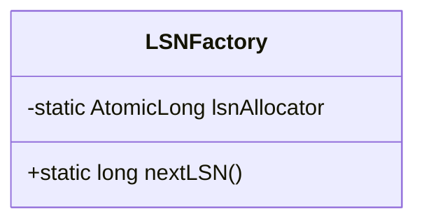
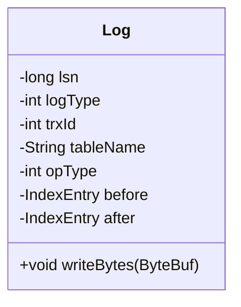
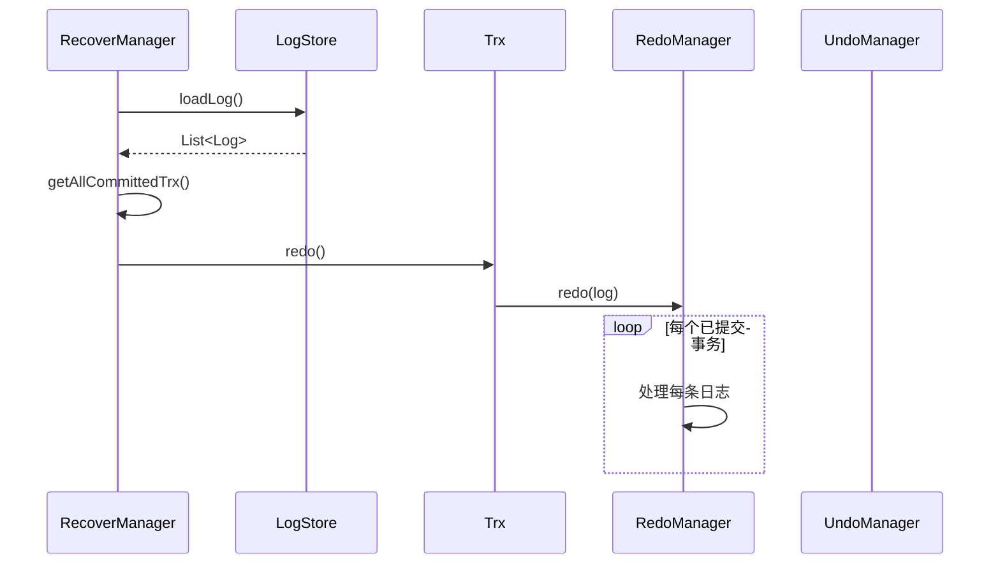
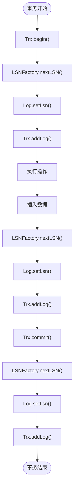

# LSN序列号管理

<cite>
**本文档引用的文件**  
- [LSNFactory.java](file://src/main/java/alchemystar/freedom/transaction/log/LSNFactory.java)
- [Log.java](file://src/main/java/alchemystar/freedom/transaction/log/Log.java)
- [RecoverManager.java](file://src/main/java/alchemystar/freedom/recovery/RecoverManager.java)
- [RedoManager.java](file://src/main/java/alchemystar/freedom/transaction/redo/RedoManager.java)
- [UndoManager.java](file://src/main/java/alchemystar/freedom/transaction/undo/UndoManager.java)
</cite>

## 目录
1. [引言](#引言)
2. [LSN生成机制](#lsn生成机制)
3. [LSN在日志管理中的作用](#lsn在日志管理中的作用)
4. [LSN在故障恢复中的关键角色](#lsn在故障恢复中的关键角色)
5. [高并发场景下的线程安全性与性能分析](#高并发场景下的线程安全性与性能分析)
6. [代码调用链路分析](#代码调用链路分析)
7. [总结](#总结)

## 引言
LSN（Log Sequence Number，日志序列号）是数据库系统中用于保证事务日志顺序性和幂等性的核心机制。在系统崩溃或异常重启后，LSN用于确定日志重放（redo）和回滚（undo）的正确顺序，确保数据一致性。本文将深入分析LSN的生成、管理及其在事务恢复中的关键作用。

## LSN生成机制

LSNFactory类负责全局唯一且单调递增的LSN分配。其核心实现依赖于Java的`AtomicLong`类，确保在多线程环境下生成的序列号既唯一又有序。

**图示来源**  
- [LSNFactory.java](file://src/main/java/alchemystar/freedom/transaction/log/LSNFactory.java#L6-L14)

**本节来源**  
- [LSNFactory.java](file://src/main/java/alchemystar/freedom/transaction/log/LSNFactory.java#L1-L15)

### 原子性保障
`AtomicLong`通过底层CAS（Compare-And-Swap）操作实现无锁并发控制，避免了传统`synchronized`带来的性能开销。每次调用`nextLSN()`方法时，`getAndIncrement()`确保返回当前值并原子性地递增，从而保证全局递增性。

### 初始化与递增
初始值为0，每次分配后递增1。这种设计简单高效，适用于高频率的日志写入场景。

## LSN在日志管理中的作用

每个日志记录（Log）都包含一个唯一的LSN，用于标识其在日志流中的位置。LSN在日志结构中起到以下关键作用：

**图示来源**  
- [Log.java](file://src/main/java/alchemystar/freedom/transaction/log/Log.java#L8-L150)

**本节来源**  
- [Log.java](file://src/main/java/alchemystar/freedom/transaction/log/Log.java#L1-L150)

### 顺序性保证
LSN的单调递增特性确保了日志记录的物理顺序与逻辑顺序一致。在日志持久化时，LSN作为日志条目的唯一标识，写入磁盘文件。

### 幂等性支持
在故障恢复过程中，系统可能重复应用某些日志。通过LSN可以判断某条日志是否已被处理，避免重复操作，从而实现幂等性。

### 日志结构设计
`Log`类封装了事务操作的完整上下文，包括操作类型（insert/delete/update）、表名、事务ID以及操作前后的数据状态（before/after）。LSN作为日志元数据的一部分，通过`writeBytes`方法序列化到字节流中，便于持久化存储。

## LSN在故障恢复中的关键角色

在系统崩溃后，LSN是恢复机制的核心依据。恢复流程分为两个阶段：redo（重做已提交事务）和undo（回滚未提交事务）。

### 故障恢复流程

**图示来源**  
- [RecoverManager.java](file://src/main/java/alchemystar/freedom/recovery/RecoverManager.java#L15-L62)
- [RedoManager.java](file://src/main/java/alchemystar/freedom/transaction/redo/RedoManager.java#L10-L32)

**本节来源**  
- [RecoverManager.java](file://src/main/java/alchemystar/freedom/recovery/RecoverManager.java#L1-L62)

### Redo过程
`RecoverManager`首先从`LogStore`加载所有日志，识别已提交的事务（通过COMMIT日志类型），然后调用`Trx.redo()`进行重做。`RedoManager.redo()`根据LSN顺序逐条应用日志，确保数据状态恢复到崩溃前的一致性状态。

### Undo过程
对于未提交的事务，系统调用`UndoManager.undo()`进行回滚。根据操作类型，执行逆向操作：
- insert → delete（使用after字段）
- delete → insert（使用before字段）
- update → 恢复旧值（使用before字段）

LSN在此过程中确保回滚操作按正确的逆序执行。

## 高并发场景下的线程安全性与性能分析

### 线程安全性
`LSNFactory`使用`AtomicLong`保证线程安全，无需加锁即可在多线程环境下安全调用`nextLSN()`。该设计避免了锁竞争，适合高并发事务处理。

### 性能表现
- **低延迟**：CAS操作在大多数情况下无需阻塞，生成LSN的开销极小。
- **高吞吐**：无锁设计支持高并发日志生成，适用于OLTP系统。
- **可扩展性**：`AtomicLong`在JVM层面优化良好，能充分利用多核CPU性能。

### 潜在瓶颈
在极端高并发场景下，`AtomicLong`的CAS可能因频繁冲突导致自旋开销增加。但实际应用中，日志生成通常受I/O限制而非CPU限制，因此影响有限。

## 代码调用链路分析

LSN的生成贯穿事务生命周期，主要调用链路如下：

**图示来源**  
- [LSNFactory.java](file://src/main/java/alchemystar/freedom/transaction/log/LSNFactory.java#L10-L14)
- [Log.java](file://src/main/java/alchemystar/freedom/transaction/log/Log.java#L50-L55)
- [Trx.java](file://src/main/java/alchemystar/freedom/transaction/Trx.java)

**本节来源**  
- [LSNFactory.java](file://src/main/java/alchemystar/freedom/transaction/log/LSNFactory.java#L10-L14)
- [Log.java](file://src/main/java/alchemystar/freedom/transaction/log/Log.java#L50-L55)

### 关键调用点
1. **事务开始**：生成TRX_START日志，分配LSN。
2. **数据操作**：每次insert/delete/update生成ROW日志，分配新LSN。
3. **事务提交**：生成COMMIT日志，分配最终LSN。

LSN的递增顺序严格对应事务操作的时间顺序，为恢复提供可靠依据。

## 总结
LSN机制通过`LSNFactory`的原子性递增设计，确保了日志序列的全局唯一性和顺序性。在故障恢复中，LSN作为redo和undo操作的排序依据，保障了数据一致性。其基于`AtomicLong`的实现兼顾了线程安全与高性能，适用于高并发数据库系统。整体设计简洁高效，是事务日志管理的核心基石。