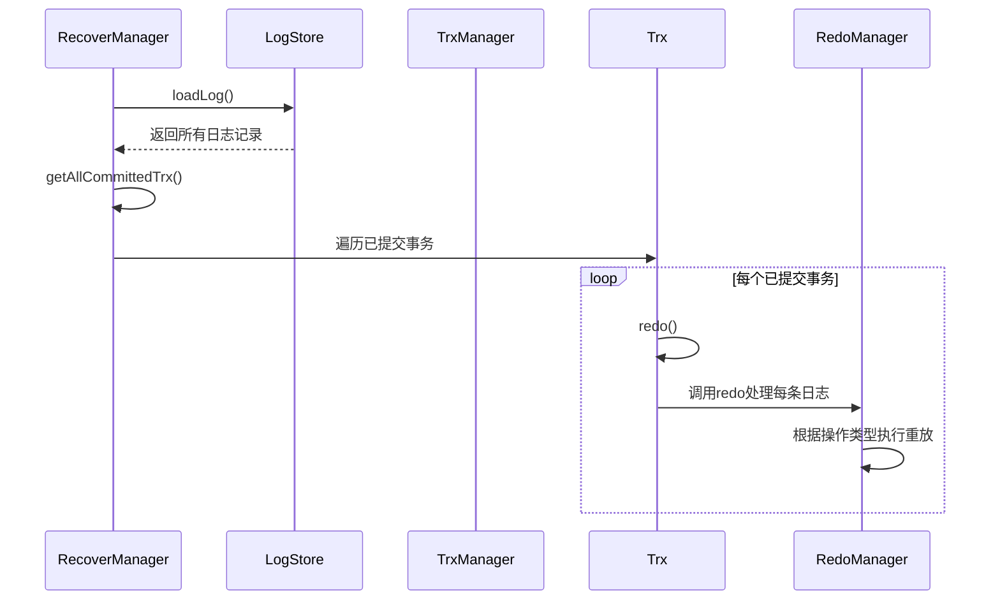
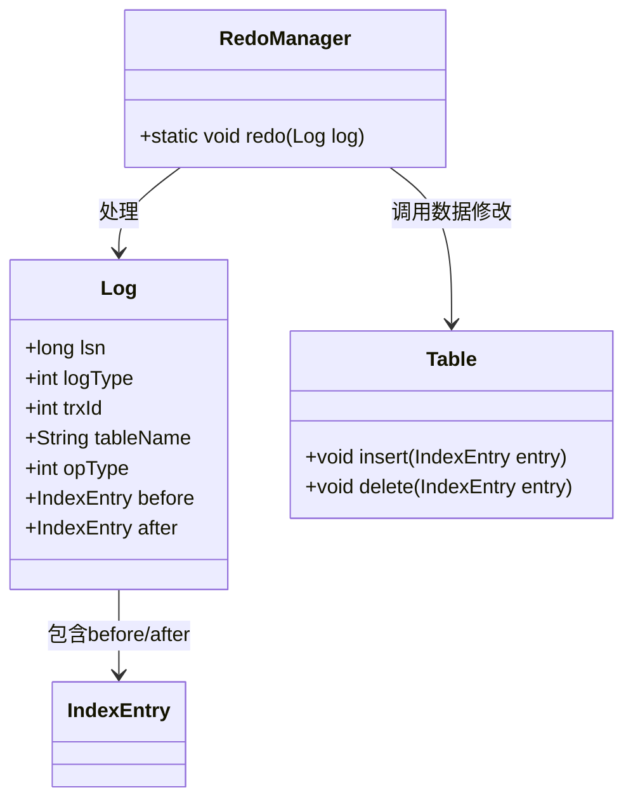
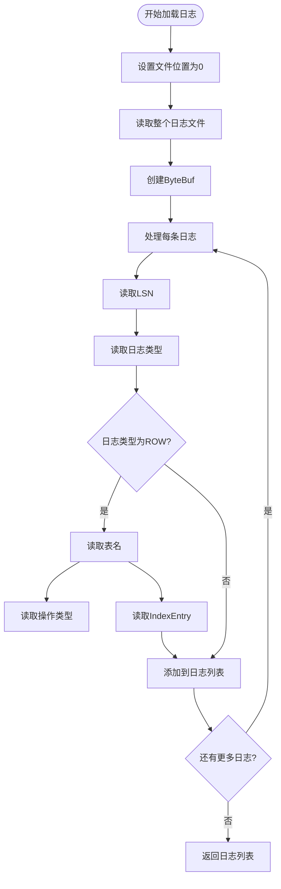
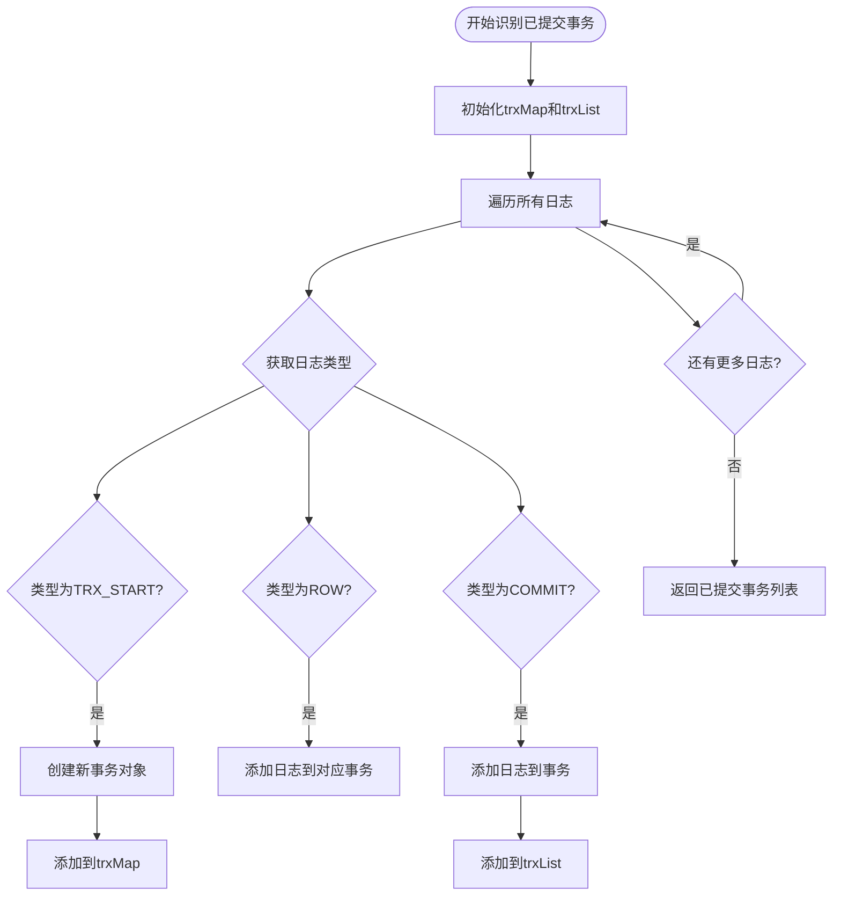
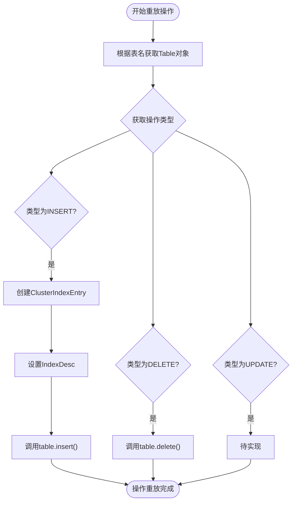
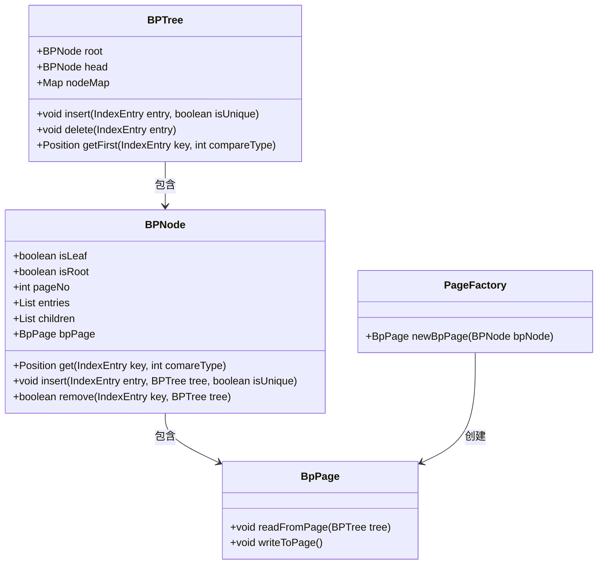
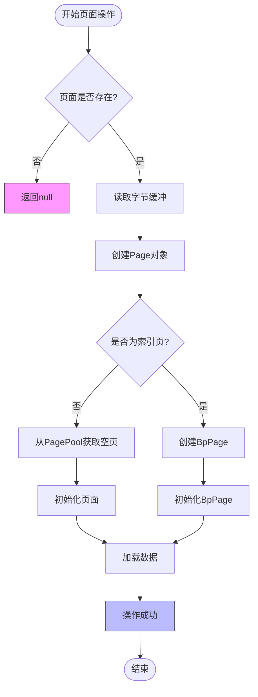
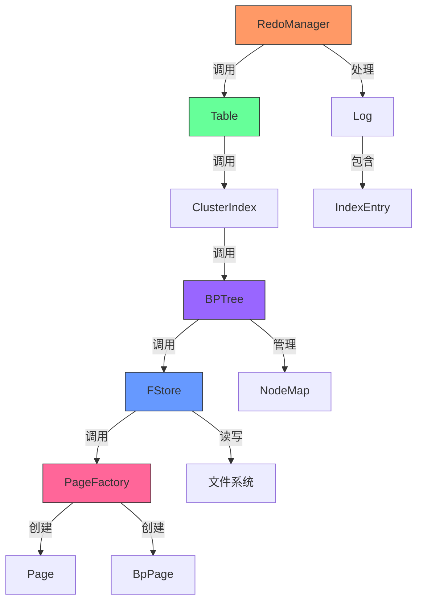

# Redo日志重放机制

<cite>
**本文档中引用的文件**   
- [RedoManager.java](file://src/main/java/alchemystar/freedom/transaction/redo/RedoManager.java)
- [LogStore.java](file://src/main/java/alchemystar/freedom/store/log/LogStore.java)
- [RecoverManager.java](file://src/main/java/alchemystar/freedom/recovery/RecoverManager.java)
- [Log.java](file://src/main/java/alchemystar/freedom/transaction/log/Log.java)
- [FStore.java](file://src/main/java/alchemystar/freedom/store/fs/FStore.java)
- [PageFactory.java](file://src/main/java/alchemystar/freedom/store/page/PageFactory.java)
- [BPTree.java](file://src/main/java/alchemystar/freedom/index/bp/BPTree.java)
- [Table.java](file://src/main/java/alchemystar/freedom/meta/Table.java)
</cite>

## 目录
1. [系统恢复流程概述](#系统恢复流程概述)
2. [RedoManager核心机制](#redomanager核心机制)
3. [日志读取与解析](#日志读取与解析)
4. [事务提交状态识别](#事务提交状态识别)
5. [数据变更操作重放](#数据变更操作重放)
6. [页面定位与BPTree交互](#页面定位与bptree交互)
7. [幂等性处理策略](#幂等性处理策略)
8. [页校验与异常处理](#页校验与异常处理)
9. [协同组件工作流程](#协同组件工作流程)

## 系统恢复流程概述

系统恢复过程始于数据库重启时，由RecoverManager主导整个恢复流程。该流程首先通过LogStore从持久化存储中加载所有日志记录，然后识别已提交的事务，并对这些事务执行redo操作以恢复数据一致性。整个恢复过程确保了在系统崩溃后能够将数据库恢复到最后一次一致状态。



**图示来源**
- [RecoverManager.java](file://src/main/java/alchemystar/freedom/recovery/RecoverManager.java#L15-L30)
- [LogStore.java](file://src/main/java/alchemystar/freedom/store/log/LogStore.java#L50-L65)

**本节来源**
- [RecoverManager.java](file://src/main/java/alchemystar/freedom/recovery/RecoverManager.java#L10-L40)

## RedoManager核心机制

RedoManager是实现redo日志重放的核心组件，负责处理单条日志记录的重放操作。其主要职责是根据日志中的操作类型（INSERT、DELETE、UPDATE）调用相应的数据修改方法，确保数据变更被正确应用到存储层。



**图示来源**
- [RedoManager.java](file://src/main/java/alchemystar/freedom/transaction/redo/RedoManager.java#L10-L30)
- [Log.java](file://src/main/java/alchemystar/freedom/transaction/log/Log.java#L10-L50)

**本节来源**
- [RedoManager.java](file://src/main/java/alchemystar/freedom/transaction/redo/RedoManager.java#L10-L30)

## 日志读取与解析

日志存储系统通过LogStore组件实现日志的持久化和读取功能。在系统恢复阶段，LogStore负责从文件系统中读取所有已持久化的redo日志记录，并按照LSN（日志序列号）顺序进行解析和重建。



**图示来源**
- [LogStore.java](file://src/main/java/alchemystar/freedom/store/log/LogStore.java#L60-L90)
- [Log.java](file://src/main/java/alchemystar/freedom/transaction/log/Log.java#L80-L120)

**本节来源**
- [LogStore.java](file://src/main/java/alchemystar/freedom/store/log/LogStore.java#L50-L95)

## 事务提交状态识别

在恢复过程中，准确识别已提交的事务至关重要。RecoverManager通过分析日志流中的事务开始、行操作和提交记录来确定哪些事务已经成功提交，仅对这些事务执行redo操作。



**图示来源**
- [RecoverManager.java](file://src/main/java/alchemystar/freedom/recovery/RecoverManager.java#L35-L60)
- [Log.java](file://src/main/java/alchemystar/freedom/transaction/log/Log.java#L50-L70)

**本节来源**
- [RecoverManager.java](file://src/main/java/alchemystar/freedom/recovery/RecoverManager.java#L35-L60)

## 数据变更操作重放

RedoManager根据日志中的操作类型执行相应的数据变更重放。对于INSERT操作，使用after字段中的数据创建新的索引条目；对于DELETE操作，使用before字段中的数据定位并删除记录。



**图示来源**
- [RedoManager.java](file://src/main/java/alchemystar/freedom/transaction/redo/RedoManager.java#L15-L30)
- [Table.java](file://src/main/java/alchemystar/freedom/meta/Table.java#L70-L85)

**本节来源**
- [RedoManager.java](file://src/main/java/alchemystar/freedom/transaction/redo/RedoManager.java#L15-L30)

## 页面定位与BPTree交互

在执行数据变更重放时，系统需要定位到对应的数据页并进行修改。这一过程通过BPTree索引结构实现，BPTree负责管理数据页的层次结构，并提供高效的页面定位和修改接口。



**图示来源**
- [BPTree.java](file://src/main/java/alchemystar/freedom/index/bp/BPTree.java#L50-L100)
- [BPNode.java](file://src/main/java/alchemystar/freedom/index/bp/BPNode.java#L50-L100)
- [PageFactory.java](file://src/main/java/alchemystar/freedom/store/page/PageFactory.java#L20-L30)

**本节来源**
- [BPTree.java](file://src/main/java/alchemystar/freedom/index/bp/BPTree.java#L50-L150)

## 幂等性处理策略

为确保恢复过程的可靠性，系统采用LSN（日志序列号）机制实现幂等性处理。每条日志记录都带有唯一的LSN，这保证了即使在恢复过程中发生中断，重新启动后也能正确处理日志而不会产生重复操作。

```mermaid
sequenceDiagram
participant Log as Log
participant Redo as RedoManager
participant Table as Table
participant BPTree as BPTree
Redo->>Log : 获取LSN
Note over Redo,Log : 使用LSN确保操作唯一性
Redo->>Table : 执行数据变更
Table->>BPTree : 调用索引操作
BPTree->>BPTree : 内部节点分裂/合并处理
BPTree-->>Table : 返回结果
Table-->>Redo : 返回结果
Redo-->> : 完成单条日志重放
Note over Redo : LSN确保相同操作不会重复执行
```

**图示来源**
- [Log.java](file://src/main/java/alchemystar/freedom/transaction/log/Log.java#L15-L25)
- [RedoManager.java](file://src/main/java/alchemystar/freedom/transaction/redo/RedoManager.java#L10-L30)

**本节来源**
- [Log.java](file://src/main/java/alchemystar/freedom/transaction/log/Log.java#L15-L30)

## 页校验与异常处理

系统在恢复过程中实施严格的页校验机制，确保数据页的完整性和一致性。同时，通过完善的异常处理策略应对各种潜在的错误情况，保障恢复过程的稳定执行。



**图示来源**
- [FStore.java](file://src/main/java/alchemystar/freedom/store/fs/FStore.java#L40-L70)
- [PageFactory.java](file://src/main/java/alchemystar/freedom/store/page/PageFactory.java#L20-L30)

**本节来源**
- [FStore.java](file://src/main/java/alchemystar/freedom/store/fs/FStore.java#L40-L80)

## 协同组件工作流程

Redo日志重放过程涉及多个组件的协同工作，包括PageFactory负责页面创建，FStore负责底层存储访问，以及各组件之间的紧密配合确保数据的一致性和完整性。



**图示来源**
- [RedoManager.java](file://src/main/java/alchemystar/freedom/transaction/redo/RedoManager.java)
- [Table.java](file://src/main/java/alchemystar/freedom/meta/Table.java)
- [BPTree.java](file://src/main/java/alchemystar/freedom/index/bp/BPTree.java)
- [FStore.java](file://src/main/java/alchemystar/freedom/store/fs/FStore.java)
- [PageFactory.java](file://src/main/java/alchemystar/freedom/store/page/PageFactory.java)

**本节来源**
- [Table.java](file://src/main/java/alchemystar/freedom/meta/Table.java#L70-L85)
- [BPTree.java](file://src/main/java/alchemystar/freedom/index/bp/BPTree.java#L150-L200)
- [FStore.java](file://src/main/java/alchemystar/freedom/store/fs/FStore.java#L30-L40)