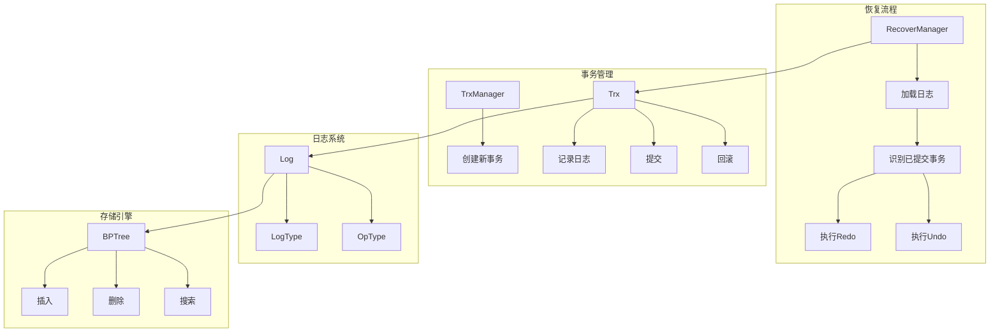
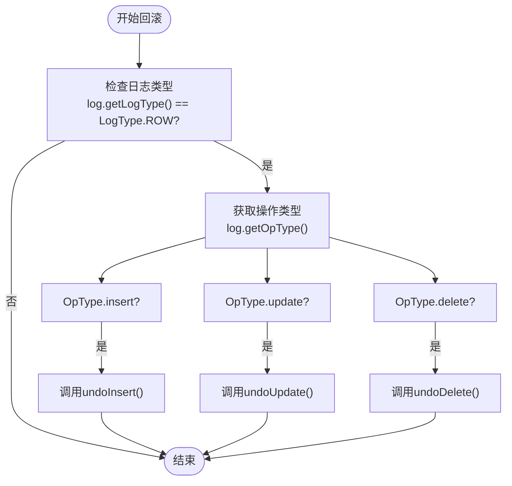
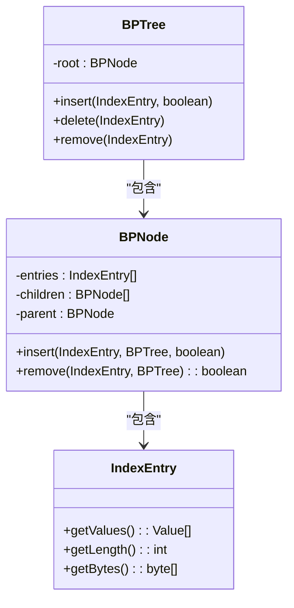
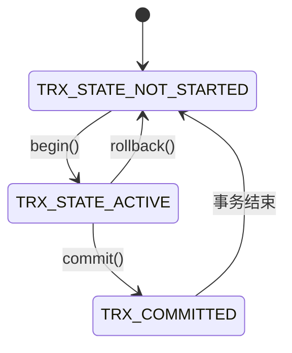
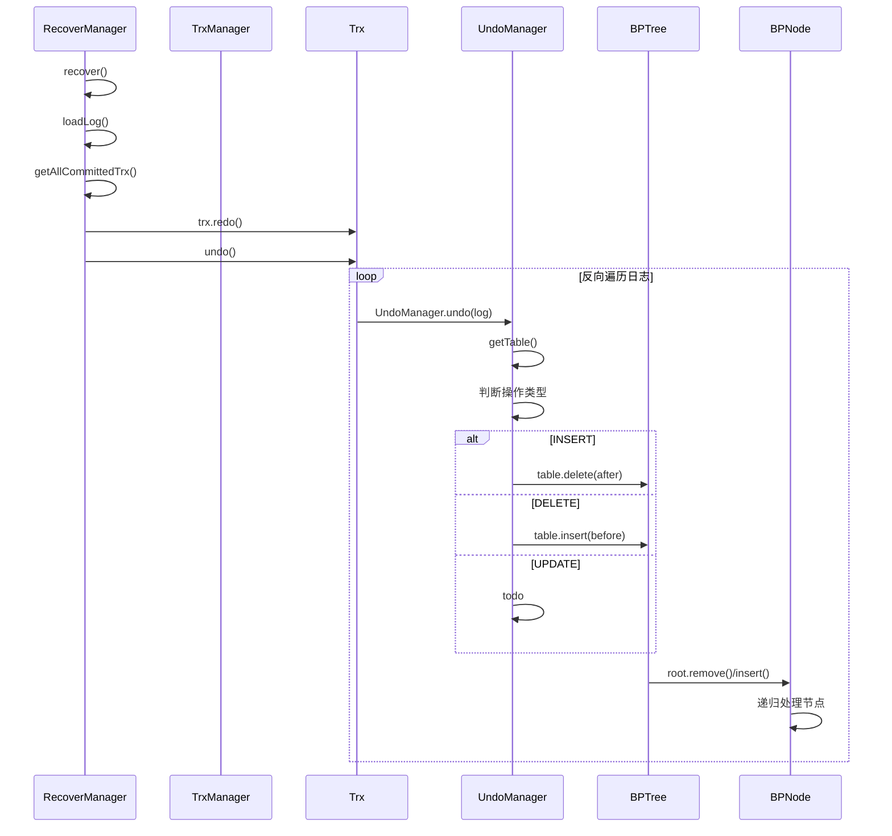
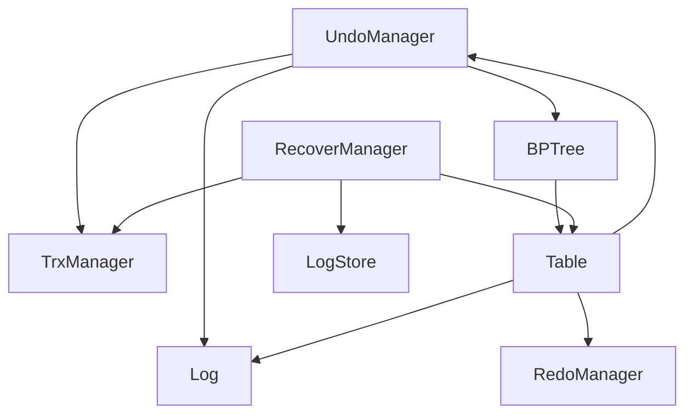

# Undo日志回滚机制

<cite>
**本文档引用文件**  
- [UndoManager.java](file://src/main/java/alchemystar/freedom/transaction/undo/UndoManager.java)
- [Trx.java](file://src/main/java/alchemystar/freedom/transaction/Trx.java)
- [BPTree.java](file://src/main/java/alchemystar/freedom/index/bp/BPTree.java)
- [TrxManager.java](file://src/main/java/alchemystar/freedom/transaction/TrxManager.java)
- [RecoverManager.java](file://src/main/java/alchemystar/freedom/recovery/RecoverManager.java)
- [Log.java](file://src/main/java/alchemystar/freedom/transaction/log/Log.java)
- [LogType.java](file://src/main/java/alchemystar/freedom/transaction/log/LogType.java)
- [OpType.java](file://src/main/java/alchemystar/freedom/transaction/OpType.java)
</cite>

## 目录
1. [引言](#引言)
2. [项目结构](#项目结构)
3. [核心组件](#核心组件)
4. [架构概览](#架构概览)
5. [详细组件分析](#详细组件分析)
6. [依赖分析](#依赖分析)
7. [性能考量](#性能考量)
8. [故障排查指南](#故障排查指南)
9. [结论](#结论)

## 引言
本文档深入解析UndoManager在数据库故障恢复阶段如何识别未提交事务，并利用undo日志中的before镜像数据执行逆向操作以恢复数据一致性。重点分析其从日志流中提取UNDO类型记录、解析旧值并定位对应数据项的机制，结合UndoManager.java的实现，说明其如何调用底层存储接口完成回滚操作，包括对BPTree节点的删除、插入或更新。同时探讨其与TrxManager的状态协同机制，确保仅对非提交事务执行回滚，并处理并发恢复场景下的资源竞争问题。

## 项目结构
项目采用典型的分层架构设计，主要模块包括事务管理、索引结构、日志系统和恢复机制。事务相关逻辑集中在`transaction`包下，其中`undo`子包包含UndoManager核心实现，`redo`子包负责重做日志处理，`log`子包定义日志结构和类型。索引结构基于B+树实现，位于`index/bp`包中。恢复管理器（RecoverManager）协调整个恢复流程。

**Section sources**
- [UndoManager.java](file://src/main/java/alchemystar/freedom/transaction/undo/UndoManager.java#L1-L45)
- [BPTree.java](file://src/main/java/alchemystar/freedom/index/bp/BPTree.java#L1-L278)

## 核心组件
核心组件包括UndoManager、Trx（事务对象）、BPTree（B+树索引）和RecoverManager。UndoManager负责解析日志并执行逆向操作；Trx维护事务状态和日志链表；BPTree提供索引的增删改查接口；RecoverManager协调恢复流程，识别已提交事务并触发重做与回滚。

**Section sources**
- [UndoManager.java](file://src/main/java/alchemystar/freedom/transaction/undo/UndoManager.java#L1-L45)
- [Trx.java](file://src/main/java/alchemystar/freedom/transaction/Trx.java#L1-L119)
- [BPTree.java](file://src/main/java/alchemystar/freedom/index/bp/BPTree.java#L1-L278)

## 架构概览
系统采用WAL（Write-Ahead Logging）协议保证数据持久性和一致性。所有数据修改必须先写日志再修改数据页。在故障恢复时，首先通过RecoverManager加载所有日志，识别已提交事务并执行redo操作，然后对未提交事务执行undo回滚。事务状态由TrxState管理，确保只有处于活动状态的事务才需要回滚。

**Diagram sources**
- [RecoverManager.java](file://src/main/java/alchemystar/freedom/recovery/RecoverManager.java#L1-L62)
- [Trx.java](file://src/main/java/alchemystar/freedom/transaction/Trx.java#L1-L119)

## 详细组件分析

### UndoManager回滚机制分析
UndoManager是故障恢复阶段执行数据回滚的核心组件。它通过静态方法`undo(Log log)`接收日志记录，根据操作类型执行相应的逆向操作。

#### 日志类型与操作识别
UndoManager首先通过`log.getLogType()`判断日志类型，仅处理`LogType.ROW`类型的日志。对于行级操作，根据`log.getOpType()`区分INSERT、UPDATE和DELETE三种操作，分别调用`undoInsert`、`undoUpdate`和`undoDelete`方法。

**Diagram sources**
- [UndoManager.java](file://src/main/java/alchemystar/freedom/transaction/undo/UndoManager.java#L1-L45)

#### 逆向操作执行
- **插入回滚**：`undoInsert`方法将INSERT操作的逆向视为DELETE操作，调用`table.delete(log.getAfter())`删除已插入的记录。
- **删除回滚**：`undoDelete`方法将DELETE操作的逆向视为INSERT操作，调用`table.insert(log.getBefore())`重新插入被删除的记录。
- **更新回滚**：`undoUpdate`方法待实现，其逻辑应为使用`log.getBefore()`中的旧值替换当前值。

**Section sources**
- [UndoManager.java](file://src/main/java/alchemystar/freedom/transaction/undo/UndoManager.java#L1-L45)

### B+树索引回滚操作分析
BPTree作为底层索引结构，提供了`insert`和`delete`接口供UndoManager调用。当执行回滚时，这些操作最终会传递到BPTree的根节点，由BPNode递归处理。

#### 插入与删除操作
- `BPTree.insert()`方法调用`root.insert()`，从根节点开始查找合适的叶子节点进行插入。
- `BPTree.delete()`方法调用`root.remove()`，从根节点开始查找并删除指定键值。

**Diagram sources**
- [BPTree.java](file://src/main/java/alchemystar/freedom/index/bp/BPTree.java#L1-L278)
- [BPNode.java](file://src/main/java/alchemystar/freedom/index/bp/BPNode.java#L1-L916)

### 事务状态协同机制
UndoManager与TrxManager通过事务状态协同工作，确保仅对未提交事务执行回滚。Trx对象维护`state`字段，状态值定义在`TrxState`中。

#### 事务生命周期
1. **开始**：调用`begin()`方法，状态变为`TRX_STATE_ACTIVE`
2. **操作**：执行SQL操作，生成日志并添加到`logs`列表
3. **提交**：调用`commit()`方法，写入COMMIT日志，状态变为`TRX_COMMITTED`，清空日志列表
4. **回滚**：调用`rollback()`方法，触发`undo()`，状态重置为`TRX_STATE_NOT_STARTED`，清空日志列表

**Diagram sources**
- [Trx.java](file://src/main/java/alchemystar/freedom/transaction/Trx.java#L1-L119)
- [TrxState.java](file://src/main/java/alchemystar/freedom/transaction/TrxState.java)

### 恢复流程调用链分析
从日志解析到数据回滚的完整调用链如下：

**Diagram sources**
- [RecoverManager.java](file://src/main/java/alchemystar/freedom/recovery/RecoverManager.java#L1-L62)
- [Trx.java](file://src/main/java/alchemystar/freedom/transaction/Trx.java#L1-L119)
- [UndoManager.java](file://src/main/java/alchemystar/freedom/transaction/undo/UndoManager.java#L1-L45)

**Section sources**
- [RecoverManager.java](file://src/main/java/alchemystar/freedom/recovery/RecoverManager.java#L1-L62)
- [Trx.java](file://src/main/java/alchemystar/freedom/transaction/Trx.java#L1-L119)
- [UndoManager.java](file://src/main/java/alchemystar/freedom/transaction/undo/UndoManager.java#L1-L45)

## 依赖分析
系统各组件间存在紧密依赖关系。UndoManager依赖TableManager获取表实例，依赖Log对象获取日志信息。Trx对象依赖UndoManager执行回滚，依赖RedoManager执行重做。BPTree作为底层存储结构，被Table直接调用。RecoverManager协调整个恢复流程，依赖LogStore加载日志，依赖TrxManager创建事务对象。

**Diagram sources**
- [UndoManager.java](file://src/main/java/alchemystar/freedom/transaction/undo/UndoManager.java#L1-L45)
- [Trx.java](file://src/main/java/alchemystar/freedom/transaction/Trx.java#L1-L119)
- [RecoverManager.java](file://src/main/java/alchemystar/freedom/recovery/RecoverManager.java#L1-L62)

## 性能考量
UndoManager的设计考虑了性能因素：
1. **内存加速**：Trx对象在内存中维护`logs`列表，避免每次回滚都从磁盘读取日志。
2. **反向遍历**：`undo()`方法从后往前遍历日志，符合事务操作的逆序逻辑。
3. **直接调用**：通过Table接口直接调用BPTree的增删方法，减少中间层开销。
4. **批量处理**：虽然当前实现为逐条处理，但架构支持批量回滚优化。

## 故障排查指南
常见问题及解决方案：
- **日志解析失败**：检查`Log.writeBytes()`序列化逻辑与反序列化是否匹配。
- **回滚不完整**：确认`undo()`方法是否正确处理了所有操作类型，特别是UPDATE。
- **索引损坏**：验证BPTree节点分裂与合并逻辑的正确性，确保`flushToDisk()`持久化元数据。
- **事务状态混乱**：检查`commit()`和`rollback()`后是否正确清空日志列表和设置状态。

**Section sources**
- [Log.java](file://src/main/java/alchemystar/freedom/transaction/log/Log.java#L1-L118)
- [Trx.java](file://src/main/java/alchemystar/freedom/transaction/Trx.java#L1-L119)
- [BPTree.java](file://src/main/java/alchemystar/freedom/index/bp/BPTree.java#L1-L278)

## 结论
UndoManager通过解析undo日志中的before镜像数据，结合BPTree索引结构的增删接口，实现了高效的事务回滚机制。其与TrxManager的状态协同确保了仅对未提交事务执行回滚，保证了数据一致性。尽管当前`undoUpdate`方法尚未实现，但整体架构清晰，为后续功能扩展奠定了良好基础。未来可优化方向包括实现更新回滚、支持批量处理和引入检查点机制以提升恢复效率。