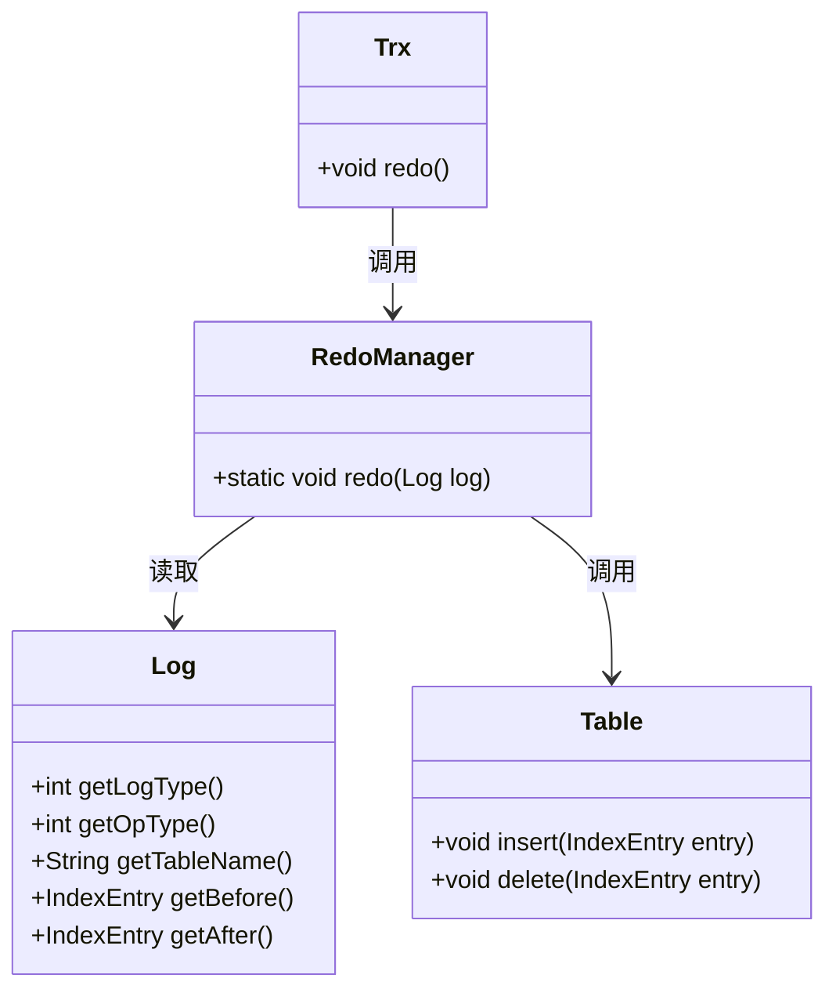
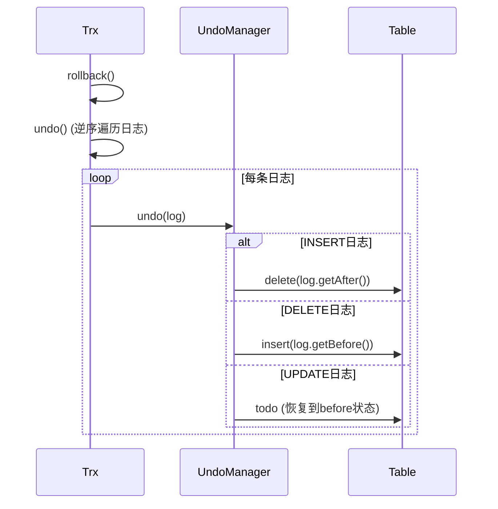

# 基于WAL的故障恢复

<cite>
**本文档引用文件**  
- [RecoverManager.java](file://src/main/java/alchemystar/freedom/recovery/RecoverManager.java)
- [RedoManager.java](file://src/main/java/alchemystar/freedom/transaction/redo/RedoManager.java)
- [UndoManager.java](file://src/main/java/alchemystar/freedom/transaction/undo/UndoManager.java)
- [Log.java](file://src/main/java/alchemystar/freedom/transaction/log/Log.java)
- [LogStore.java](file://src/main/java/alchemystar/freedom/store/log/LogStore.java)
- [Trx.java](file://src/main/java/alchemystar/freedom/transaction/Trx.java)
- [README.md](file://README.md)
</cite>

## 目录
1. [引言](#引言)
2. [恢复流程总览](#恢复流程总览)
3. [日志加载与事务识别](#日志加载与事务识别)
4. [重做管理器：数据页状态重建](#重做管理器数据页状态重建)
5. [回滚管理器：未完成事务处理](#回滚管理器未完成事务处理)
6. [恢复过程中的关键检查点与边界条件](#恢复过程中的关键检查点与边界条件)
7. [总结](#总结)

## 引言
数据库系统在运行过程中可能因硬件故障、断电或软件崩溃等原因发生宕机。为确保数据的一致性和持久性，现代数据库普遍采用预写式日志（Write-Ahead Logging, WAL）机制来实现故障恢复。本文档基于Freedom项目，系统阐述其如何利用WAL日志进行崩溃后的数据恢复。重点分析`RecoverManager`如何加载日志并识别已提交事务，`RedoManager`如何根据ROW日志重放操作以重建数据页状态，以及`UndoManager`如何利用before镜像对未完成事务进行回滚，最终恢复数据一致性。

## 恢复流程总览
根据`README.md`中的描述，Freedom数据库在宕机后通过WAL协议记录的redo/undo日志来恢复所有数据。其恢复流程遵循经典的ARIES（Algorithm for Recovery and Isolation Exploiting Semantics）算法思想，主要分为两个阶段：**重做（Redo）** 和 **回滚（Undo）**。

在系统重启时，`RecoverManager`作为恢复的入口，首先从磁盘加载所有日志记录。它通过扫描日志流，识别出所有已提交的事务（以COMMIT日志为标志），并按照提交顺序构建事务列表。随后，系统对这些已提交的事务执行重做操作，确保所有已提交的修改都被重新应用到数据页上。对于未提交的事务，系统则通过回滚操作，利用日志中的before镜像将数据恢复到事务开始前的状态。

```mermaid
flowchart TD
A[系统启动] --> B[RecoverManager.recover()]
B --> C[LogStore.loadLog()]
C --> D[加载所有日志]
D --> E[RecoverManager.getAllCommittedTrx()]
E --> F[识别COMMIT日志]
F --> G[构建已提交事务列表]
G --> H[遍历事务列表]
H --> I[Trx.redo()]
I --> J[RedoManager.redo(log)]
J --> K[重放INSERT/DELETE]
K --> L[数据页状态重建]
M[未提交事务] --> N[Trx.undo()]
N --> O[UndoManager.undo(log)]
O --> P[利用before镜像回滚]
P --> Q[数据一致性恢复]
```

**Diagram sources**
- [RecoverManager.java](file://src/main/java/alchemystar/freedom/recovery/RecoverManager.java#L15-L30)
- [README.md](file://README.md#L100-L110)

**Section sources**
- [README.md](file://README.md#L100-L110)

## 日志加载与事务识别
恢复过程的第一步是将所有持久化的日志记录从磁盘加载到内存中。这一任务由`LogStore`类的`loadLog()`方法完成。该方法打开日志文件，从文件起始位置读取全部内容，并通过`readAllLog()`方法将二进制数据反序列化为`Log`对象列表。

`RecoverManager`的`recover()`方法调用`logStore.loadLog()`获取日志列表后，便进入事务识别阶段。其核心逻辑在`getAllCommittedTrx()`方法中实现。该方法遍历日志列表，利用一个`HashMap`来跟踪每个事务（以`trxId`为键）的状态。处理逻辑如下：
- 当遇到`TRX_START`日志时，创建一个新的`Trx`对象并放入`HashMap`。
- 当遇到`ROW`日志时，将其添加到对应`trxId`的事务对象中。
- 当遇到`COMMIT`日志时，表明该事务已成功提交。此时，将该事务从`HashMap`中取出，并按其提交顺序（即在日志流中出现的顺序）添加到`trxList`结果列表中。

最终，`getAllCommittedTrx()`返回一个按提交顺序排列的已提交事务列表，为后续的重做阶段提供了明确的操作序列。

**Section sources**
- [RecoverManager.java](file://src/main/java/alchemystar/freedom/recovery/RecoverManager.java#L15-L60)
- [LogStore.java](file://src/main/java/alchemystar/freedom/store/log/LogStore.java#L80-L110)

## 重做管理器：数据页状态重建
重做阶段的目标是确保所有已提交事务的修改都反映在数据库的当前状态中，即使这些修改在宕机前尚未写入磁盘。`RedoManager`类负责执行具体的重做操作。

`RecoverManager`在获取已提交事务列表后，会遍历该列表并调用每个事务的`redo()`方法。`Trx.redo()`方法会遍历该事务所包含的所有日志（`logs`列表），对于每一条`ROW`类型的日志，调用`RedoManager.redo(log)`进行重放。

`RedoManager.redo()`方法根据日志中的`opType`字段执行相应的操作：
- **INSERT操作**：从日志的`after`字段（即after镜像）中提取数据，构造一个新的`ClusterIndexEntry`，然后调用`Table.insert()`方法将其插入到对应的表中。
- **DELETE操作**：从日志的`before`字段（即before镜像）中提取数据，调用`Table.delete()`方法将该记录从表中删除。
- **UPDATE操作**：目前代码中标记为`todo`，但其逻辑应结合`before`和`after`镜像，先删除旧记录，再插入新记录。

通过这种方式，`RedoManager`能够精确地重放所有已提交的修改，从而将数据页的状态恢复到宕机前的正确状态。



**Diagram sources**
- [RedoManager.java](file://src/main/java/alchemystar/freedom/transaction/redo/RedoManager.java#L10-L30)
- [Trx.java](file://src/main/java/alchemystar/freedom/transaction/Trx.java#L90-L95)

**Section sources**
- [RedoManager.java](file://src/main/java/alchemystar/freedom/transaction/redo/RedoManager.java#L10-L30)
- [Trx.java](file://src/main/java/alchemystar/freedom/transaction/Trx.java#L90-L95)

## 回滚管理器：未完成事务处理
除了重做已提交的事务，恢复过程还必须处理那些在宕机时尚未完成的事务（即没有`COMMIT`日志的事务）。这些事务的修改必须被撤销，以保证数据库的原子性。`UndoManager`类负责执行回滚操作。

在`Trx`类中，`rollback()`方法用于回滚一个事务。它调用私有的`undo()`方法，该方法从日志列表的末尾开始，逆序遍历所有日志。这种逆序处理确保了操作的逻辑正确性（例如，先撤销后发生的更新）。

`UndoManager.undo()`方法根据日志类型和操作类型执行相应的回滚逻辑：
- **INSERT操作的回滚**：INSERT操作的回滚等价于DELETE。`undoInsert()`方法调用`Table.delete()`，并传入日志的`after`字段（即被插入的记录）。
- **DELETE操作的回滚**：DELETE操作的回滚等价于INSERT。`undoDelete()`方法调用`Table.insert()`，并传入日志的`before`字段（即被删除的记录）。
- **UPDATE操作的回滚**：目前代码中标记为`todo`，但其逻辑应是将记录恢复到`before`镜像的状态。

通过利用日志中的before镜像，`UndoManager`能够精确地将数据恢复到事务开始前的状态，从而撤销未完成事务的所有影响。



**Diagram sources**
- [UndoManager.java](file://src/main/java/alchemystar/freedom/transaction/undo/UndoManager.java#L10-L40)
- [Trx.java](file://src/main/java/alchemystar/freedom/transaction/Trx.java#L100-L110)

**Section sources**
- [UndoManager.java](file://src/main/java/alchemystar/freedom/transaction/undo/UndoManager.java#L10-L40)
- [Trx.java](file://src/main/java/alchemystar/freedom/transaction/Trx.java#L100-L110)

## 恢复过程中的关键检查点与边界条件
根据`README.md`的描述和代码分析，Freedom的恢复机制存在一些关键的检查点和边界条件：

1.  **日志完整性检查**：`LogStore.loadLog()`从文件起始位置读取所有字节，这意味着它假设日志文件是完整且连续的。如果日志文件因异常写入而损坏，恢复过程可能会失败或产生错误结果。
2.  **LSN检查点机制的缺失**：`README.md`明确指出，“由于时间和精力所限，笔者并没有实现基于LSN的检查点机制”。这意味着每次恢复都需要扫描整个日志文件，从第一条记录开始重做，这在日志文件很大时会严重影响恢复性能。一个成熟的系统会定期创建检查点，只重做检查点之后的日志。
3.  **事务状态的判定**：系统通过是否存在`COMMIT`日志来判断事务是否已提交。这是一个简单而有效的机制，但依赖于`COMMIT`日志在事务提交时被成功刷盘。如果`COMMIT`日志的写入在刷盘前系统就崩溃了，该事务将被视为未提交并被回滚，这符合原子性要求。
4.  **日志的幂等性**：重做操作（Redo）必须是幂等的，即多次执行同一个重做操作不会改变最终结果。例如，对一个已存在的记录再次执行INSERT可能会导致主键冲突。Freedom的实现依赖于底层B+树的插入逻辑来处理这种情况，但代码中并未显式处理。
5.  **并发与恢复**：`README.md`提到“当前Freedom并没有保证并发”，因此恢复过程是单线程执行的，无需考虑恢复期间与其他操作的并发问题。

**Section sources**
- [README.md](file://README.md#L105-L110)
- [RecoverManager.java](file://src/main/java/alchemystar/freedom/recovery/RecoverManager.java#L15-L30)

## 总结
Freedom数据库通过实现一个基于WAL的故障恢复机制，确保了在系统宕机后数据的持久性和一致性。`RecoverManager`作为恢复的总控，负责加载日志并识别已提交的事务。`RedoManager`通过重放`COMMIT`日志之后的所有`ROW`日志，重建了数据页的最终状态。`UndoManager`则利用日志中的before镜像，对未提交的事务执行回滚，撤销了其对数据库的修改。尽管该实现缺少检查点等高级优化，但其核心流程清晰地展示了WAL协议在数据库恢复中的应用，为理解数据库底层原理提供了宝贵的实践案例。