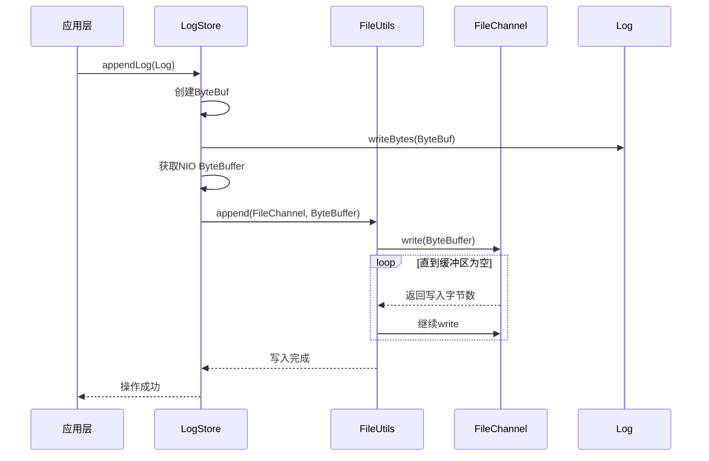
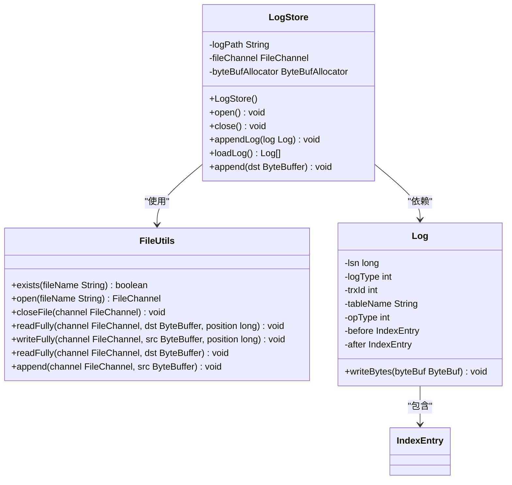
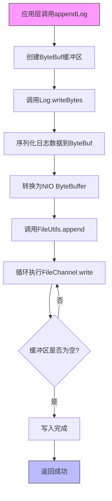

# 日志存储与持久化

<cite>
**本文档引用的文件**   
- [LogStore.java](file://src/main/java/alchemystar/freedom/store/log/LogStore.java)
- [FileUtils.java](file://src/main/java/alchemystar/freedom/store/fs/FileUtils.java)
- [SystemConfig.java](file://src/main/java/alchemystar/freedom/config/SystemConfig.java)
- [Log.java](file://src/main/java/alchemystar/freedom/transaction/log/Log.java)
- [IndexEntry.java](file://src/main/java/alchemystar/freedom/meta/IndexEntry.java)
- [RecoverManager.java](file://src/main/java/alchemystar/freedom/recovery/RecoverManager.java)
- [LogTest.java](file://src/main/java/alchemystar/freedom/test/LogTest.java)
</cite>

## 目录
1. [简介](#简介)
2. [日志文件路径配置](#日志文件路径配置)
3. [日志文件操作流程](#日志文件操作流程)
4. [append方法与FileChannel顺序写入机制](#append方法与filechannel顺序写入机制)
5. [Netty ByteBuf与NIO ByteBuffer转换机制](#netty-bytebuf与nio-bytebuffer转换机制)
6. [异常处理策略](#异常处理策略)
7. [FileUtils工具类的安全性保障](#fileutils工具类的安全性保障)
8. [日志持久化流程图解](#日志持久化流程图解)
9. [日志加载与恢复机制](#日志加载与恢复机制)
10. [结论](#结论)

## 简介
本文档深入分析Freedom数据库系统中日志持久化到磁盘文件的实现机制。重点讲解LogStore组件如何通过FileChannel实现高效的顺序写操作，详细说明日志文件的打开、追加写入和关闭过程。同时，分析Netty ByteBuf与NIO ByteBuffer之间的转换机制，探讨日志文件路径配置和异常处理策略，并结合FileUtils工具类说明底层文件操作的安全性保障措施。

## 日志文件路径配置
日志文件路径通过SystemConfig接口中的FREEDOM_LOG_FILE_NAME常量进行配置。该常量定义了日志文件的完整路径，由RELATION_FILE_PRE_FIX前缀和"/log/log"后缀组成，最终形成"/Users/alchemystar/var/freedom/log/log"的完整路径。这种集中式配置方式便于统一管理和维护日志文件位置。

**Section sources**
- [SystemConfig.java](file://src/main/java/alchemystar/freedom/config/SystemConfig.java#L25-L26)

## 日志文件操作流程
LogStore类负责管理日志文件的整个生命周期，包括文件的打开、写入和关闭操作。在LogStore的构造函数中，首先初始化日志路径和ByteBuf分配器，然后调用open()方法打开文件通道。文件关闭操作通过close()方法完成，该方法委托给FileUtils工具类进行资源释放。

日志文件的打开过程使用RandomAccessFile以"rw"模式打开文件，获取FileChannel对象。这种模式允许对文件进行读写操作，满足日志系统追加写入的需求。文件关闭时，确保FileChannel被正确关闭，防止资源泄漏。

**Section sources**
- [LogStore.java](file://src/main/java/alchemystar/freedom/store/log/LogStore.java#L25-L45)

## append方法与FileChannel顺序写入机制
append方法是日志持久化的核心，它利用FileChannel的write方法实现高效的顺序写操作。当调用append(ByteBuffer dst)方法时，系统会循环调用channel.write(src)直到缓冲区中的所有数据都被写入文件。由于FileChannel的写入位置会自动递增，这种机制天然支持追加写入，无需显式设置文件指针位置。

这种顺序写入方式具有显著的性能优势：首先，避免了随机写入的磁盘寻道开销；其次，操作系统和磁盘控制器可以对连续的写入操作进行优化；最后，减少了文件碎片，提高了后续读取效率。

**Diagram sources**
- [LogStore.java](file://src/main/java/alchemystar/freedom/store/log/LogStore.java#L52-L58)
- [FileUtils.java](file://src/main/java/alchemystar/freedom/store/fs/FileUtils.java#L67-L73)

## Netty ByteBuf与NIO ByteBuffer转换机制
日志持久化过程中涉及Netty ByteBuf与NIO ByteBuffer之间的转换。Log对象的writeBytes方法接收ByteBuf参数，将日志内容序列化到Netty的缓冲区中。随后，通过byteBuf.nioBuffer()方法将ByteBuf转换为标准的NIO ByteBuffer，以便与FileChannel的write方法兼容。

这种转换机制充分利用了Netty ByteBuf的高效内存管理和零拷贝特性，同时保持了与Java NIO标准API的兼容性。ByteBufAllocator负责缓冲区的分配和回收，UnpooledByteBufAllocator实现确保了缓冲区的直接内存使用，减少了JVM堆内存的压力。

**Section sources**
- [LogStore.java](file://src/main/java/alchemystar/freedom/store/log/LogStore.java#L47-L52)
- [Log.java](file://src/main/java/alchemystar/freedom/transaction/log/Log.java#L74-L95)

## 异常处理策略
系统采用统一的异常处理策略，将底层IO异常封装为运行时异常。在FileUtils的文件操作方法中，捕获IOException等检查异常，并将其包装为RuntimeException重新抛出。这种设计简化了上层调用代码的异常处理逻辑，使开发者可以专注于业务逻辑而非繁琐的异常处理。

对于关键的文件操作，如打开、读取和写入，系统都实现了完整的异常捕获和处理机制。特别是在读取操作中，当遇到文件末尾时抛出EOFException，确保数据完整性验证。这种异常处理模式既保证了系统的健壮性，又保持了代码的简洁性。

**Section sources**
- [FileUtils.java](file://src/main/java/alchemystar/freedom/store/fs/FileUtils.java#L15-L73)

## FileUtils工具类的安全性保障
FileUtils工具类提供了安全的底层文件操作封装，确保资源的正确释放和异常的适当处理。open方法负责创建FileChannel，closeFile方法确保通道被正确关闭，即使在关闭过程中发生异常也不会导致资源泄漏。

工具类中的readFully和writeFully方法保证了数据的完整读写，通过循环操作直到缓冲区为空或文件末尾，防止部分读写导致的数据不一致。append方法专门用于追加写入，确保日志的顺序性和完整性。这些工具方法共同构成了安全可靠的文件操作基础。

**Diagram sources**
- [FileUtils.java](file://src/main/java/alchemystar/freedom/store/fs/FileUtils.java#L10-L73)
- [LogStore.java](file://src/main/java/alchemystar/freedom/store/log/LogStore.java#L15-L15)
- [Log.java](file://src/main/java/alchemystar/freedom/transaction/log/Log.java#L10-L10)

## 日志持久化流程图解
日志持久化过程从应用层调用appendLog方法开始，经过多个组件的协作，最终将日志数据写入磁盘文件。整个流程体现了分层设计的思想，各组件职责分明，协同工作。

**Diagram sources**
- [LogStore.java](file://src/main/java/alchemystar/freedom/store/log/LogStore.java#L47-L58)
- [FileUtils.java](file://src/main/java/alchemystar/freedom/store/fs/FileUtils.java#L67-L73)

## 日志加载与恢复机制
系统提供了完整的日志加载和恢复机制，支持数据库重启后的状态恢复。loadLog方法从文件起始位置读取所有日志数据，通过readAllLog方法解析二进制数据为Log对象列表。RecoverManager利用这些日志执行恢复操作，确保数据一致性。

日志加载过程首先将文件指针定位到0位置，读取文件全部内容到ByteBuffer，然后逐条解析日志记录。每条日志包含LSN、日志类型、事务ID等元数据，以及操作前后的数据状态，为恢复操作提供完整信息。

**Section sources**
- [LogStore.java](file://src/main/java/alchemystar/freedom/store/log/LogStore.java#L53-L70)
- [RecoverManager.java](file://src/main/java/alchemystar/freedom/recovery/RecoverManager.java#L15-L30)

## 结论
Freedom数据库的日志持久化机制通过LogStore组件实现了高效可靠的日志存储。系统利用FileChannel的顺序写入特性，结合Netty的缓冲区管理，实现了高性能的日志写入。FileUtils工具类提供了安全的底层文件操作封装，确保资源的正确管理和异常的适当处理。集中的配置管理和完整的恢复机制进一步增强了系统的可靠性和可维护性。这种设计模式为数据库系统的稳定运行提供了坚实的基础。