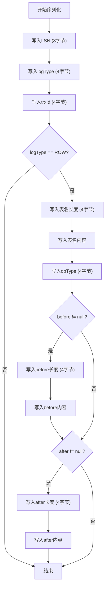
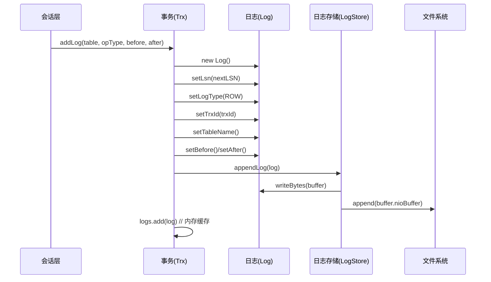

# 日志生成机制

<cite>
**本文档中引用的文件**  
- [Trx.java](file://src/main/java/alchemystar/freedom/transaction/Trx.java)
- [Log.java](file://src/main/java/alchemystar/freedom/transaction/log/Log.java)
- [LogType.java](file://src/main/java/alchemystar/freedom/transaction/log/LogType.java)
- [LSNFactory.java](file://src/main/java/alchemystar/freedom/transaction/log/LSNFactory.java)
- [LogStore.java](file://src/main/java/alchemystar/freedom/store/log/LogStore.java)
- [IndexEntry.java](file://src/main/java/alchemystar/freedom/meta/IndexEntry.java)
</cite>

## 目录
1. [事务日志生成流程](#事务日志生成流程)
2. [Log对象的创建与属性设置](#log对象的创建与属性设置)
3. [日志类型定义与触发时机](#日志类型定义与触发时机)
4. [日志写入内存与持久化机制](#日志写入内存与持久化机制)
5. [日志序列化为字节流过程](#日志序列化为字节流过程)
6. [核心组件交互流程图](#核心组件交互流程图)

## 事务日志生成流程

在事务执行INSERT、DELETE等数据操作时，系统通过`Trx`类管理事务上下文，并在关键阶段自动生成对应的日志记录。事务开始时调用`begin()`方法，生成类型为`TRX_START`的日志；在执行行级变更时，通过`addLog(Table, opType, before, after)`方法创建包含前后镜像的ROW日志；事务提交时调用`commit()`方法生成COMMIT日志，标志事务成功结束。

**本节来源**  
- [Trx.java](file://src/main/java/alchemystar/freedom/transaction/Trx.java#L20-L118)

## Log对象的创建与属性设置

当事务执行数据变更操作时，`Trx.addLog()`方法负责创建`Log`对象并填充关键字段：
- **LSN（日志序列号）**：通过`LSNFactory.nextLSN()`获取全局唯一递增序列号，确保日志幂等性
- **事务ID（trxId）**：设置当前事务的唯一标识符
- **操作类型（opType）**：标识INSERT、DELETE等具体操作类型
- **表名（tableName）**：记录操作涉及的数据表名称
- **前后镜像（before/after）**：分别保存变更前后的`IndexEntry`数据快照

所有镜像数据必须为`ClusterIndexEntry`类型，以保证日志一致性。

**本节来源**  
- [Trx.java](file://src/main/java/alchemystar/freedom/transaction/Trx.java#L50-L80)
- [Log.java](file://src/main/java/alchemystar/freedom/transaction/log/Log.java#L5-L149)

## 日志类型定义与触发时机

日志类型由`LogType`接口定义，各类型用途及触发时机如下：

| 日志类型 | 数值 | 触发时机 | 用途 |
|---------|-----|---------|-----|
| `TRX_START` | 0 | 调用`Trx.begin()`时 | 标记事务开始，用于恢复时识别事务边界 |
| `ROLL_BACK` | 1 | 事务回滚时（当前未完全实现） | 记录事务回滚动作 |
| `COMMIT` | 2 | 调用`Trx.commit()`时 | 标记事务成功提交，决定是否保留undo日志 |
| `ROW` | 3 | 执行INSERT/DELETE等行操作时 | 记录具体数据变更的前后镜像，用于redo和undo |

**本节来源**  
- [LogType.java](file://src/main/java/alchemystar/freedom/transaction/log/LogType.java#L5-L14)
- [Trx.java](file://src/main/java/alchemystar/freedom/transaction/Trx.java#L20-L118)

## 日志写入内存与持久化机制

日志通过`addLog`方法实现双路径写入：
1. **内存缓存**：将`Log`对象添加至`Trx.logs`列表，用于事务回滚时快速执行`undo()`操作
2. **持久化存储**：调用`Database.getInstance().getLogStore().appendLog(log)`将日志同步写入磁盘文件

持久化流程如下：
- 创建`ByteBuf`缓冲区
- 调用`Log.writeBytes()`序列化日志内容
- 将字节缓冲提交至`LogStore.append()`写入文件通道

此机制确保即使系统崩溃，仍可通过日志恢复数据一致性。

**本节来源**  
- [Trx.java](file://src/main/java/alchemystar/freedom/transaction/Trx.java#L75-L80)
- [LogStore.java](file://src/main/java/alchemystar/freedom/store/log/LogStore.java#L24-L112)

## 日志序列化为字节流过程

`Log.writeBytes(ByteBuf)`方法将日志对象序列化为字节流，结构如下：

**图示来源**  
- [Log.java](file://src/main/java/alchemystar/freedom/transaction/log/Log.java#L90-L110)
- [IndexEntry.java](file://src/main/java/alchemystar/freedom/meta/IndexEntry.java#L100-L120)

## 核心组件交互流程图

**图示来源**  
- [Trx.java](file://src/main/java/alchemystar/freedom/transaction/Trx.java#L50-L80)
- [Log.java](file://src/main/java/alchemystar/freedom/transaction/log/Log.java#L90-L110)
- [LogStore.java](file://src/main/java/alchemystar/freedom/store/log/LogStore.java#L40-L45)