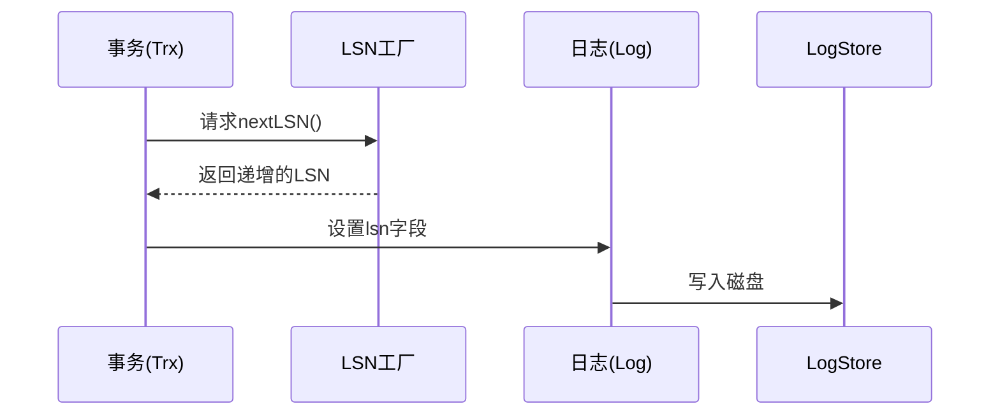
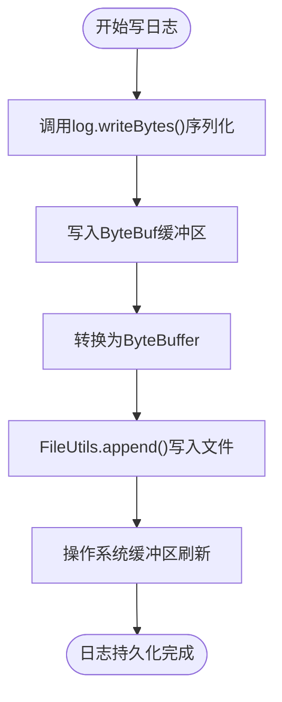
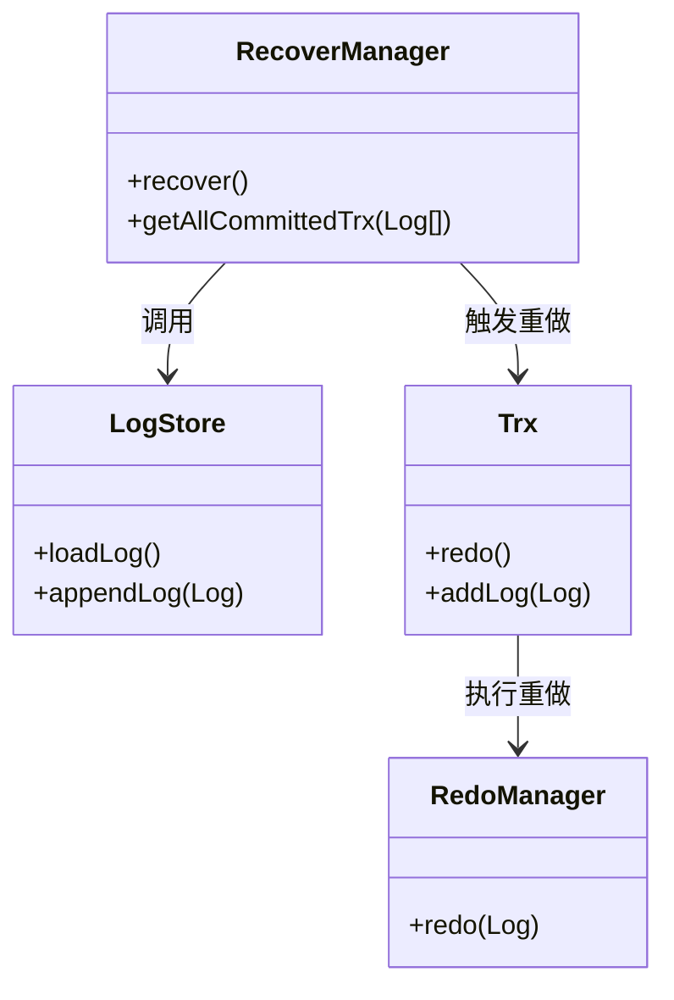

# 预写式日志（WAL）机制

<cite>
**本文档引用的文件**  
- [Log.java](file://src/main/java/alchemystar/freedom/transaction/log/Log.java)
- [LogType.java](file://src/main/java/alchemystar/freedom/transaction/log/LogType.java)
- [LSNFactory.java](file://src/main/java/alchemystar/freedom/transaction/log/LSNFactory.java)
- [LogStore.java](file://src/main/java/alchemystar/freedom/store/log/LogStore.java)
- [RecoverManager.java](file://src/main/java/alchemystar/freedom/recovery/RecoverManager.java)
- [Trx.java](file://src/main/java/alchemystar/freedom/transaction/Trx.java)
</cite>

## 目录
1. [简介](#简介)
2. [核心组件](#核心组件)
3. [LSN生成机制](#lsn生成机制)
4. [日志结构与类型](#日志结构与类型)
5. [日志刷盘流程](#日志刷盘流程)
6. [日志文件管理](#日志文件管理)
7. [恢复机制](#恢复机制)
8. [性能优化分析](#性能优化分析)
9. [总结](#总结)

## 简介
预写式日志（Write-Ahead Logging, WAL）是数据库系统中确保数据持久性和一致性的关键技术。在任何数据页修改之前，必须先将对应的日志记录持久化到磁盘。本项目通过 `LogStore` 实现了WAL协议，结合 `LSNFactory`、`Log`、`Trx` 等组件，构建了一套完整的事务日志管理系统。该机制不仅保障了崩溃恢复能力，还为事务的原子性与持久性提供了底层支持。

## 核心组件
系统围绕日志管理构建了多个关键类，各司其职，协同完成日志的生成、存储与恢复。

**Section sources**
- [Log.java](file://src/main/java/alchemystar/freedom/transaction/log/Log.java#L1-L151)
- [LogStore.java](file://src/main/java/alchemystar/freedom/store/log/LogStore.java#L1-L114)
- [Trx.java](file://src/main/java/alchemystar/freedom/transaction/Trx.java#L1-L120)

## LSN生成机制
LSN（Log Sequence Number）是日志序列号，用于唯一标识每条日志记录，保证日志的顺序性和幂等性。系统使用 `LSNFactory` 类实现全局递增的LSN分配。

`LSNFactory` 内部采用 `AtomicLong` 实现线程安全的自增计数器，确保在高并发环境下LSN的唯一性和有序性。每当需要生成新日志时，调用 `nextLSN()` 方法获取下一个可用的LSN值。

LSN在事务的开始、操作记录和提交阶段均被写入日志，作为恢复过程中判断日志顺序和重做依据的核心字段。



**Diagram sources**
- [LSNFactory.java](file://src/main/java/alchemystar/freedom/transaction/log/LSNFactory.java#L1-L16)
- [Trx.java](file://src/main/java/alchemystar/freedom/transaction/Trx.java#L30-L40)

## 日志结构与类型
日志对象 `Log` 封装了事务操作的所有元信息，其结构设计兼顾通用性与扩展性。

### 日志字段说明
- **lsn**: 日志序列号，由LSNFactory生成
- **logType**: 日志类型，区分不同事务阶段
- **trxId**: 所属事务ID
- **tableName**: 操作涉及的表名（仅行级日志）
- **opType**: 操作类型（插入、删除等）
- **before**: 修改前的记录（用于undo）
- **after**: 修改后的记录（用于redo）

### 日志类型分类
通过 `LogType` 接口定义了四种基本日志类型：

```java
public interface LogType {
    int TRX_START = 0;
    int ROLL_BACK = 1;
    int COMMIT = 2;
    int ROW = 3;
}
```

| 日志类型 | 数值 | 用途 |
|---------|------|------|
| TRX_START | 0 | 标记事务开始 |
| ROLL_BACK | 1 | 标记事务回滚（当前未使用） |
| COMMIT | 2 | 标记事务提交 |
| ROW | 3 | 记录具体的数据行变更 |

其中，`ROW` 类型日志携带完整的表名、操作类型及前后像数据，是实现redo与undo的核心。

**Section sources**
- [Log.java](file://src/main/java/alchemystar/freedom/transaction/log/Log.java#L10-L151)
- [LogType.java](file://src/main/java/alchemystar/freedom/transaction/log/LogType.java#L1-L16)

## 日志刷盘流程
日志刷盘是WAL协议的核心环节，确保在数据页修改前日志已落盘。

### 刷盘触发时机
在 `Trx` 类中，以下操作会触发日志写入：
- `begin()`: 写入TRX_START日志
- `addLog(...)`: 写入ROW类型日志
- `commit()`: 写入COMMIT日志

每次调用均通过 `Database.getInstance().getLogStore().appendLog(log)` 将日志立即写入文件通道。

### 写入过程
`LogStore.appendLog(Log log)` 方法执行以下步骤：
1. 创建Netty的 `ByteBuf` 缓冲区
2. 调用 `log.writeBytes(byteBuf)` 序列化日志内容
3. 转换为 `ByteBuffer` 并调用 `append()` 写入文件通道

日志写入采用追加模式（append），保证顺序写入的高性能特性。



**Diagram sources**
- [LogStore.java](file://src/main/java/alchemystar/freedom/store/log/LogStore.java#L40-L50)
- [Trx.java](file://src/main/java/alchemystar/freedom/transaction/Trx.java#L30-L40)

## 日志文件管理
`LogStore` 负责日志文件的全生命周期管理，包括打开、写入、读取和关闭。

### 文件路径与配置
日志文件路径由 `SystemConfig.FREEDOM_LOG_FILE_NAME` 静态常量定义，确保配置集中管理。

### 文件操作封装
所有文件操作通过 `FileUtils` 工具类完成：
- `open()`: 打开文件通道
- `append()`: 追加写入数据
- `readFully()`: 完整读取文件内容
- `closeFile()`: 安全关闭通道

日志文件在启动时从头读取（position=0），用于恢复阶段加载全部日志。

### 日志加载
`loadLog()` 方法将整个日志文件加载到内存，返回 `List<Log>`。该操作在数据库启动恢复时调用，为后续分析已提交事务做准备。

**Section sources**
- [LogStore.java](file://src/main/java/alchemystar/freedom/store/log/LogStore.java#L1-L114)
- [FileUtils.java](file://src/main/java/alchemystar/freedom/store/fs/FileUtils.java)

## 恢复机制
系统通过 `RecoverManager` 实现崩溃后的自动恢复，核心流程包括日志重放（redo）。

### 恢复流程
1. 调用 `logStore.loadLog()` 加载所有日志
2. 解析出所有已提交的事务（COMMIT日志标记）
3. 对每个已提交事务执行 `trx.redo()`

### 事务状态重建
`getAllCommittedTrx()` 方法遍历日志流，使用 `Map<Integer, Trx>` 临时缓存进行中的事务，遇到COMMIT日志时将其加入结果列表。

### 重做执行
`Trx.redo()` 遍历其日志列表，对每条ROW类型日志调用 `RedoManager.redo(log)` 执行物理重做操作，重建数据页状态。



**Diagram sources**
- [RecoverManager.java](file://src/main/java/alchemystar/freedom/recovery/RecoverManager.java#L1-L63)
- [Trx.java](file://src/main/java/alchemystar/freedom/transaction/Trx.java#L80-L90)

## 性能优化分析
系统在日志管理方面采用了多项优化策略：

### 顺序写入
日志文件采用追加写（append-only），避免随机I/O，充分发挥磁盘顺序写性能优势。

### 缓冲区设计
使用Netty的 `ByteBuf` 作为中间缓冲，减少直接操作 `ByteBuffer` 的复杂度，并支持动态扩容。

### 原子性保障
虽然未显式调用 `force()` 同步到磁盘，但依赖操作系统页缓存与定期刷盘机制。在生产环境中可结合 `FileChannel.force()` 增强持久性。

### 内存加速Undo
事务在内存中维护 `logs` 列表，用于快速执行回滚操作，避免重复解析日志文件。

## 总结
本系统通过 `LogStore`、`Log`、`LSNFactory` 和 `RecoverManager` 等组件，完整实现了预写式日志（WAL）机制。LSN保证了日志的全局顺序性，多种日志类型支持事务生命周期管理，顺序写入策略提升了性能，而恢复机制确保了系统的崩溃安全性。整体设计简洁高效，为数据库的ACID特性提供了坚实基础。