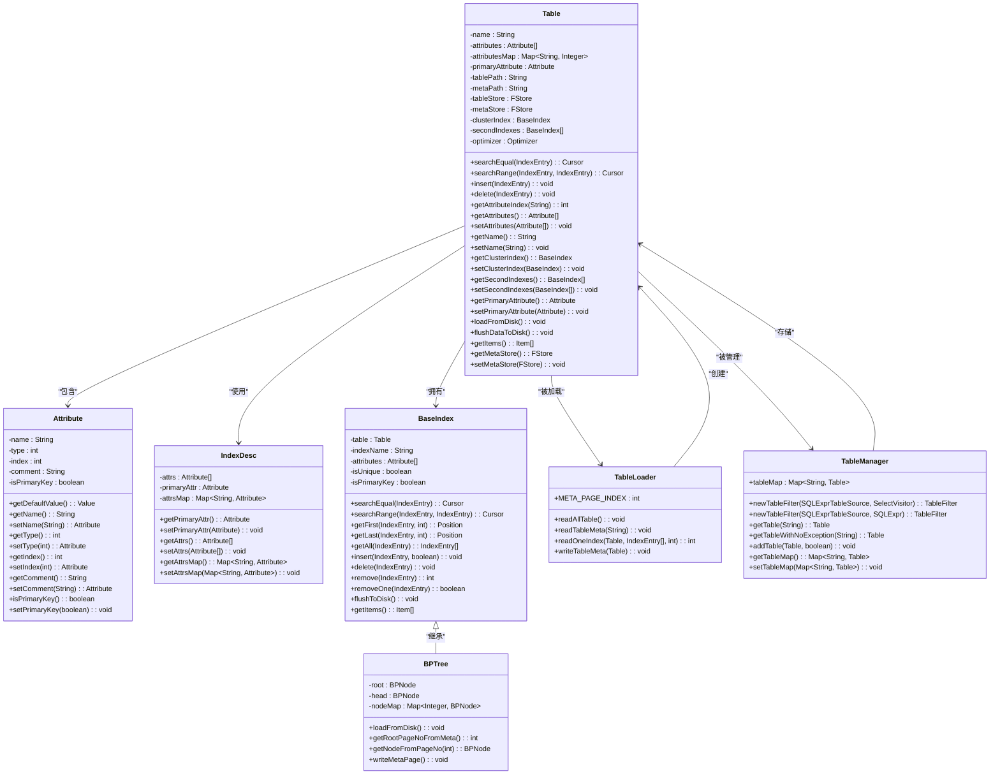

# 元数据管理

<cite>
**本文档中引用的文件**   
- [Table.java](file://src/main/java/alchemystar/freedom/meta/Table.java)
- [TableLoader.java](file://src/main/java/alchemystar/freedom/meta/TableLoader.java)
- [Attribute.java](file://src/main/java/alchemystar/freedom/meta/Attribute.java)
- [IndexDesc.java](file://src/main/java/alchemystar/freedom/meta/IndexDesc.java)
- [CreateExecutor.java](file://src/main/java/alchemystar/freedom/sql/CreateExecutor.java)
- [TableManager.java](file://src/main/java/alchemystar/freedom/meta/TableManager.java)
- [CreateVisitor.java](file://src/main/java/alchemystar/freedom/sql/parser/CreateVisitor.java)
- [FStore.java](file://src/main/java/alchemystar/freedom/store/fs/FStore.java)
- [PageLoader.java](file://src/main/java/alchemystar/freedom/store/page/PageLoader.java)
- [BPTree.java](file://src/main/java/alchemystar/freedom/index/bp/BPTree.java)
</cite>

## 目录
1. [简介](#简介)
2. [核心元数据类](#核心元数据类)
3. [Table类结构与功能](#table类结构与功能)
4. [属性与索引定义](#属性与索引定义)
5. [元数据持久化存储格式](#元数据持久化存储格式)
6. [TableLoader元数据加载机制](#tableloader元数据加载机制)
7. [DDL语句处理与元数据创建](#ddl语句处理与元数据创建)
8. [内存表示与磁盘存储的同步](#内存表示与磁盘存储的同步)
9. [Table对象UML类图](#table对象uml类图)

## 简介
本系统通过`Table`类及其相关组件实现数据库表结构信息的元数据管理。系统将表的逻辑结构（包括列、主键、索引等）在内存中进行对象化表示，并通过`TableLoader`从磁盘持久化存储中加载和初始化这些元数据对象。元数据的磁盘存储采用基于页的文件存储格式，通过`FStore`和`PageLoader`进行读写操作。当执行`CREATE TABLE`等DDL语句时，系统通过`CreateVisitor`解析SQL，创建相应的`Table`对象，并通过`TableManager`将其注册到全局元数据管理器中。

## 核心元数据类

**Section sources**
- [Table.java](file://src/main/java/alchemystar/freedom/meta/Table.java#L1-L172)
- [Attribute.java](file://src/main/java/alchemystar/freedom/meta/Attribute.java#L1-L96)
- [IndexDesc.java](file://src/main/java/alchemystar/freedom/meta/IndexDesc.java#L1-L54)

## Table类结构与功能
`Table`类是元数据管理的核心，用于表示一个逻辑表的完整结构。它不仅包含表的基本信息，还维护了数据存储和索引结构。

### 基本属性
`Table`类包含以下核心字段：
- `name`: 表名
- `attributes`: 表的列（属性）数组
- `attributesMap`: 列名到索引的映射，用于快速查找
- `primaryAttribute`: 主键列
- `tablePath` 和 `metaPath`: 数据文件和元数据文件的存储路径
- `tableStore` 和 `metaStore`: 对应的文件存储对象
- `clusterIndex`: 聚簇索引（主键索引）
- `secondIndexes`: 二级索引列表
- `optimizer`: 查询优化器，用于选择合适的索引

### CRUD操作
`Table`类提供了对数据的基本操作接口：
- `insert(IndexEntry entry)`: 将数据插入聚簇索引和所有二级索引
- `delete(IndexEntry entry)`: 从聚簇索引和所有二级索引中删除数据
- `searchEqual(IndexEntry entry)`: 根据查询条件选择合适的索引进行等值查找
- `searchRange(IndexEntry lowKey, IndexEntry upKey)`: 根据查询条件选择合适的索引进行范围查找

### 元数据管理
`Table`类还提供了元数据管理方法：
- `setAttributes(Attribute[] attributes)`: 设置表的列，并自动构建`attributesMap`和确定`primaryAttribute`
- `setName(String name)`: 设置表名，并根据表名自动生成`metaPath`和`tablePath`
- `flushDataToDisk()`: 将索引数据刷新到磁盘
- `getItems()`: 将表的元数据转换为可存储的`Item`列表

**Section sources**
- [Table.java](file://src/main/java/alchemystar/freedom/meta/Table.java#L23-L171)

## 属性与索引定义

### Attribute类
`Attribute`类表示表的一个列，包含列名、类型、在元组中的位置和注释等信息。它还提供了`getDefaultValue()`方法，根据列类型返回默认值（如字符串返回空字符串，整数返回0等）。`isPrimaryKey`字段标识该列是否为主键。

### IndexDesc类
`IndexDesc`类描述了索引的结构，包含：
- `attrs`: 索引涉及的列数组
- `primaryAttr`: 主键列
- `attrsMap`: 列名到列对象的映射，用于快速查找

**Section sources**
- [Attribute.java](file://src/main/java/alchemystar/freedom/meta/Attribute.java#L1-L96)
- [IndexDesc.java](file://src/main/java/alchemystar/freedom/meta/IndexDesc.java#L1-L54)

## 元数据持久化存储格式
元数据的持久化存储采用基于页的文件格式，每个表的元数据存储在一个单独的文件中。

### 存储结构
元数据文件的第一页（`META_PAGE_INDEX = 0`）存储了完整的表结构信息，其布局如下：
1. 第一个`IndexEntry`: 除索引外的元数据大小（整数）
2. 第二个`IndexEntry`: 表名（字符串）
3. 接下来的N个`IndexEntry`: 表的列定义
4. 一个`IndexEntry`: 索引总数（整数）
5. 每个索引的定义：
   - 索引大小（整数）
   - 索引名（字符串）
   - 是否唯一（布尔值）
   - 是否为主键（布尔值）
   - 索引涉及的列定义

### 存储实现
`FStore`类负责文件的底层读写操作，它封装了`FileChannel`，提供了按页读写的功能。`PageLoader`类负责从`Page`对象中加载`IndexEntry`列表，它读取页头信息，然后根据指针逐个读取页中的元组。

**Section sources**
- [TableLoader.java](file://src/main/java/alchemystar/freedom/meta/TableLoader.java#L22-L108)
- [FStore.java](file://src/main/java/alchemystar/freedom/store/fs/FStore.java#L1-L97)
- [PageLoader.java](file://src/main/java/alchemystar/freedom/store/page/PageLoader.java#L1-L59)

## TableLoader元数据加载机制
`TableLoader`是元数据加载的核心组件，负责从磁盘加载所有表的元数据。

### 加载流程
1. `readAllTable()`: 遍历`FREEDOM_REL_META_PATH`目录下的所有文件，对每个文件调用`readTableMeta()`
2. `readTableMeta(String path)`: 
   - 创建`FStore`对象打开元数据文件
   - 使用`PageLoader`从第一页读取`IndexEntry`列表
   - 读取元数据大小和表名
   - 读取所有列定义并创建`Attribute`数组
   - 读取索引总数，然后循环调用`readOneIndex()`读取每个索引
   - 将创建的`Table`对象添加到`TableManager`中
3. `readOneIndex()`: 
   - 读取索引的大小、名称、唯一性、是否为主键等信息
   - 读取索引涉及的列
   - 创建`BPTree`对象
   - 如果是第一个索引，则设置为聚簇索引；否则添加到二级索引列表

### 元数据写入
`writeTableMeta(Table table)`方法负责将`Table`对象的元数据写入磁盘：
1. 创建一个新的`Page`
2. 写入元数据大小、表名和所有列的元数据
3. 写入索引总数
4. 写入聚簇索引和所有二级索引的元数据
5. 将`Page`写入元数据文件的第一页

**Section sources**
- [TableLoader.java](file://src/main/java/alchemystar/freedom/meta/TableLoader.java#L22-L108)

## DDL语句处理与元数据创建
当执行`CREATE TABLE`语句时，系统通过以下流程创建和注册元数据：

### 解析阶段
`CreateVisitor`继承自`SQLASTVisitorAdapter`，负责解析`CREATE TABLE`语句：
1. `visit(SQLCreateTableStatement x)`: 
   - 检查表是否已存在
   - 创建新的`Table`对象并设置表名
   - 调用`getAttributes()`解析列定义
   - 创建聚簇索引（基于主键）
   - 调用`buildSecondIndexes()`创建二级索引
2. `getAttributes()`: 
   - 遍历`SQLTableElement`列表
   - 对`SQLColumnDefinition`创建`Attribute`对象
   - 对`MySqlPrimaryKey`确定主键列
   - 对`MySqlKey`收集二级索引信息
3. `buildOneSecondIndex()`: 
   - 为二级索引创建`Attribute`数组
   - 包含索引列和主键列（作为rowId）
   - 创建`BPTree`对象

### 执行阶段
`CreateExecutor`负责执行创建操作：
1. `init()`: 创建`CreateVisitor`并接受`SQLStatement`进行解析
2. `execute()`: 调用`TableManager.addTable()`将解析得到的`Table`对象添加到全局管理器中

**Section sources**
- [CreateVisitor.java](file://src/main/java/alchemystar/freedom/sql/parser/CreateVisitor.java#L1-L126)
- [CreateExecutor.java](file://src/main/java/alchemystar/freedom/sql/CreateExecutor.java#L1-L32)
- [TableManager.java](file://src/main/java/alchemystar/freedom/meta/TableManager.java#L15-L70)

## 内存表示与磁盘存储的同步
系统通过`TableManager`和`TableLoader`协同工作，确保内存中的元数据与磁盘存储保持一致。

### 同步机制
1. **启动时加载**: 系统启动时，`TableLoader.readAllTable()`从磁盘加载所有表的元数据，构建内存中的`Table`对象
2. **创建时持久化**: 当创建新表时，`TableManager.addTable(table, true)`会先调用`writeTableMeta()`将元数据写入磁盘，然后才将其添加到`tableMap`中
3. **更新时刷新**: `Table.flushDataToDisk()`方法会将所有索引的更改刷新到磁盘

### 全局管理
`TableManager`使用静态`tableMap`存储所有表的引用，提供以下功能：
- `addTable(Table table, boolean isPersist)`: 添加表，可选择是否持久化
- `getTable(String tableName)`: 获取表，不存在时抛出异常
- `getTableWithNoException(String tableName)`: 获取表，不存在时返回null
- `newTableFilter()`: 创建表过滤器，用于查询执行

**Section sources**
- [TableManager.java](file://src/main/java/alchemystar/freedom/meta/TableManager.java#L15-L70)
- [Table.java](file://src/main/java/alchemystar/freedom/meta/Table.java#L150-L160)

## Table对象UML类图

**Diagram sources**
- [Table.java](file://src/main/java/alchemystar/freedom/meta/Table.java#L23-L171)
- [Attribute.java](file://src/main/java/alchemystar/freedom/meta/Attribute.java#L1-L96)
- [IndexDesc.java](file://src/main/java/alchemystar/freedom/meta/IndexDesc.java#L1-L54)
- [BaseIndex.java](file://src/main/java/alchemystar/freedom/index/BaseIndex.java#L1-L100)
- [BPTree.java](file://src/main/java/alchemystar/freedom/index/bp/BPTree.java#L1-L278)
- [TableLoader.java](file://src/main/java/alchemystar/freedom/meta/TableLoader.java#L1-L110)
- [TableManager.java](file://src/main/java/alchemystar/freedom/meta/TableManager.java#L1-L72)