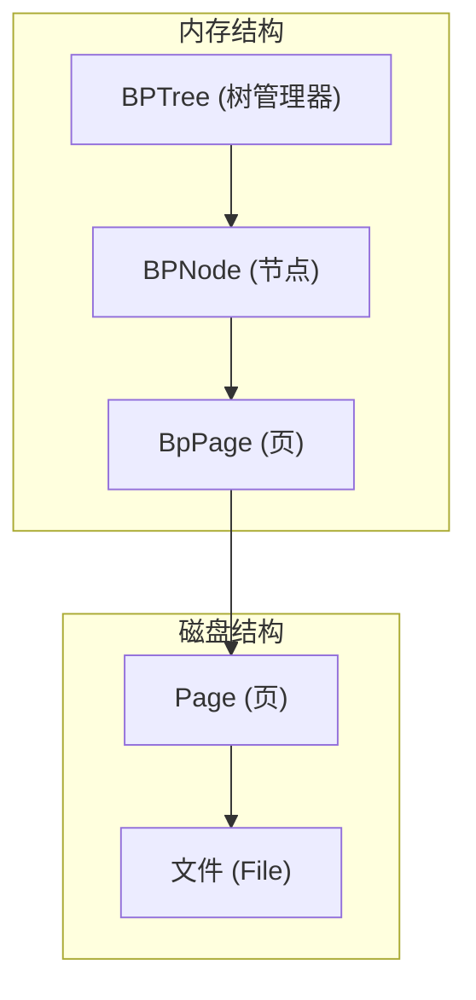
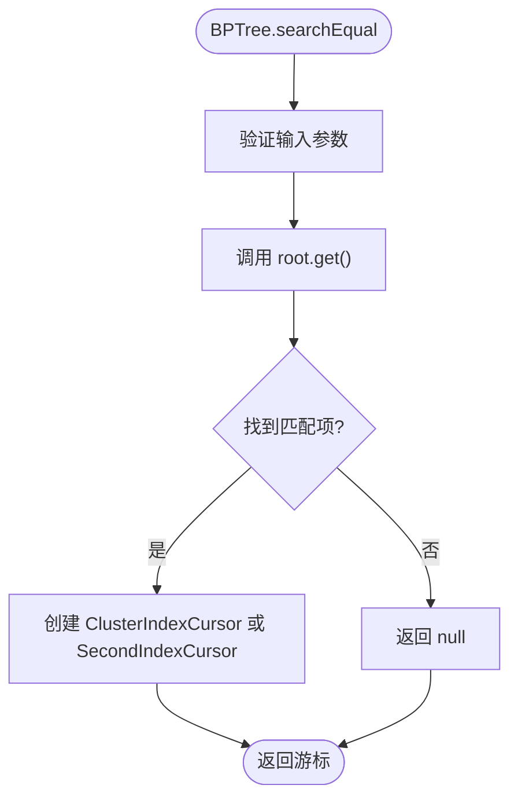
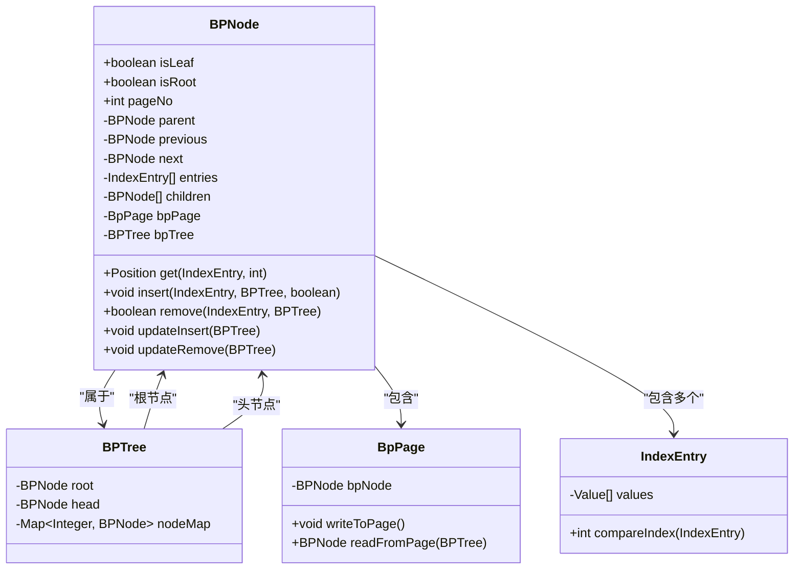
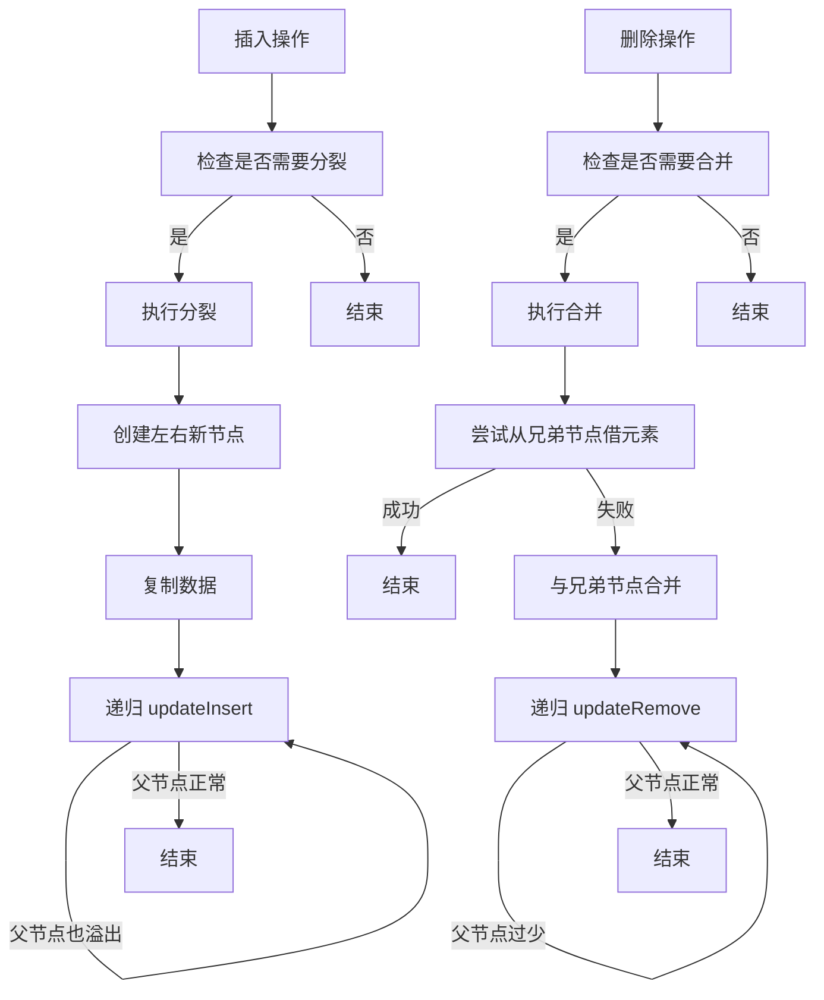
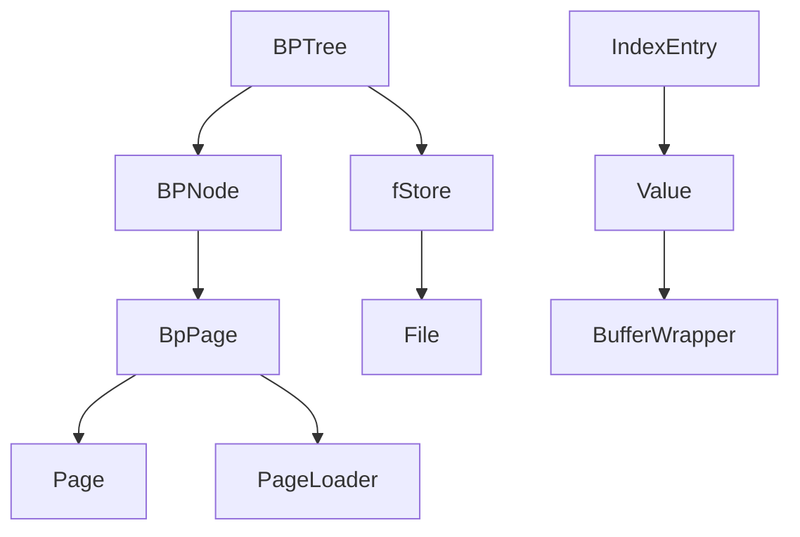

# B+树索引

<cite>
**本文档中引用的文件**   
- [BPTree.java](file://src/main/java/alchemystar/freedom/index/bp/BPTree.java)
- [BPNode.java](file://src/main/java/alchemystar/freedom/index/bp/BPNode.java)
- [BpPage.java](file://src/main/java/alchemystar/freedom/index/bp/BpPage.java)
- [IndexEntry.java](file://src/main/java/alchemystar/freedom/meta/IndexEntry.java)
- [CompareType.java](file://src/main/java/alchemystar/freedom/index/CompareType.java)
- [README.md](file://README.md)
</cite>

## 目录
1. [简介](#简介)
2. [项目结构](#项目结构)
3. [核心组件](#核心组件)
4. [架构概述](#架构概述)
5. [详细组件分析](#详细组件分析)
6. [依赖分析](#依赖分析)
7. [性能考虑](#性能考虑)
8. [故障排除指南](#故障排除指南)
9. [结论](#结论)

## 简介
本文档详细阐述了Freedom数据库中B+树索引的实现机制，重点分析`BPTree.java`和`BPNode.java`两个核心类。B+树作为数据库的核心索引结构，支持高效的数据插入、删除、查找和范围扫描操作。文档将深入探讨其内存与磁盘的映射关系、节点的组织方式以及在事务操作中的行为。

## 项目结构
B+树索引相关的代码位于`src/main/java/alchemystar/freedom/index/bp/`目录下，主要包括`BPTree`、`BPNode`、`BpPage`等核心类，它们与`meta`包中的`IndexEntry`和`CompareType`接口协同工作，共同构成了完整的索引系统。

**Section sources**
- [BPTree.java](file://src/main/java/alchemystar/freedom/index/bp/BPTree.java#L1-L277)
- [BPNode.java](file://src/main/java/alchemystar/freedom/index/bp/BPNode.java#L1-L799)

## 核心组件
B+树索引的核心由`BPTree`和`BPNode`两个类构成。`BPTree`是B+树的顶层管理类，负责维护根节点、头节点和节点映射。`BPNode`则代表树中的单个节点，区分叶子节点和非叶子节点，并管理其子节点、父节点以及前后兄弟节点的链表。

**Section sources**
- [BPTree.java](file://src/main/java/alchemystar/freedom/index/bp/BPTree.java#L1-L277)
- [BPNode.java](file://src/main/java/alchemystar/freedom/index/bp/BPNode.java#L1-L799)

## 架构概述
B+树在内存中以`BPNode`对象的形式存在，每个节点通过`BpPage`与磁盘上的数据页进行映射。`BPTree`作为管理器，协调所有节点的操作。当数据需要持久化时，`BPNode`会将其内容序列化到`BpPage`中，再由存储层写入磁盘。

**Diagram sources**
- [BPTree.java](file://src/main/java/alchemystar/freedom/index/bp/BPTree.java#L1-L277)
- [BPNode.java](file://src/main/java/alchemystar/freedom/index/bp/BPNode.java#L1-L799)
- [BpPage.java](file://src/main/java/alchemystar/freedom/index/bp/BpPage.java#L1-L204)

## 详细组件分析

### BPTree 分析
`BPTree`类继承自`BaseIndex`，是B+树的入口。它维护了根节点（`root`）和叶子节点链表的头节点（`head`），并通过`nodeMap`缓存所有已加载的节点，避免重复从磁盘读取。

#### 核心方法

**Diagram sources**
- [BPTree.java](file://src/main/java/alchemystar/freedom/index/bp/BPTree.java#L1-L277)

**Section sources**
- [BPTree.java](file://src/main/java/alchemystar/freedom/index/bp/BPTree.java#L1-L277)

### BPNode 分析
`BPNode`是B+树的基石，其行为根据是否为叶子节点（`isLeaf`）和根节点（`isRoot`）而有所不同。

#### 节点组织与查找

**Diagram sources**
- [BPNode.java](file://src/main/java/alchemystar/freedom/index/bp/BPNode.java#L1-L799)
- [BPTree.java](file://src/main/java/alchemystar/freedom/index/bp/BPTree.java#L1-L277)
- [BpPage.java](file://src/main/java/alchemystar/freedom/index/bp/BpPage.java#L1-L204)
- [IndexEntry.java](file://src/main/java/alchemystar/freedom/meta/IndexEntry.java#L1-L181)

#### 节点分裂与合并算法
B+树通过节点分裂和合并来维持平衡。当插入导致节点溢出时，会触发分裂；当删除导致节点过少时，会尝试从兄弟节点借元素或与兄弟节点合并。

**Diagram sources**
- [BPNode.java](file://src/main/java/alchemystar/freedom/index/bp/BPNode.java#L1-L799)

**Section sources**
- [BPNode.java](file://src/main/java/alchemystar/freedom/index/bp/BPNode.java#L1-L799)

### 内存与磁盘页的映射
`BpPage`类是内存`BPNode`与磁盘数据页之间的桥梁。它定义了节点在磁盘上的二进制结构，并提供了`writeToPage`和`readFromPage`方法来实现序列化和反序列化。

**Section sources**
- [BpPage.java](file://src/main/java/alchemystar/freedom/index/bp/BpPage.java#L1-L204)

### 索引条目与比较逻辑
`IndexEntry`是B+树中存储的基本单元，它封装了键值对。`CompareType`接口定义了三种比较类型：`EQUAL`（精确匹配）、`LOW`（范围下界）和`UP`（范围上界），这些类型在`getFirst`和`getLast`方法中被使用，以支持高效的范围查询。

**Section sources**
- [IndexEntry.java](file://src/main/java/alchemystar/freedom/meta/IndexEntry.java#L1-L181)
- [CompareType.java](file://src/main/java/alchemystar/freedom/index/CompareType.java#L1-L13)

## 依赖分析
B+树索引系统高度依赖于底层的存储管理。`BPTree`和`BPNode`通过`fStore`与文件系统交互，`BpPage`则依赖于`Page`和`PageLoader`来处理页的读写。`IndexEntry`利用`Value`类型来处理不同数据类型的序列化。

**Diagram sources**
- [BPTree.java](file://src/main/java/alchemystar/freedom/index/bp/BPTree.java#L1-L277)
- [BPNode.java](file://src/main/java/alchemystar/freedom/index/bp/BPNode.java#L1-L799)
- [BpPage.java](file://src/main/java/alchemystar/freedom/index/bp/BpPage.java#L1-L204)
- [IndexEntry.java](file://src/main/java/alchemystar/freedom/meta/IndexEntry.java#L1-L181)

**Section sources**
- [BPTree.java](file://src/main/java/alchemystar/freedom/index/bp/BPTree.java#L1-L277)
- [BPNode.java](file://src/main/java/alchemystar/freedom/index/bp/BPNode.java#L1-L799)

## 性能考虑
B+树的设计旨在优化磁盘I/O。通过将节点大小设置为页大小，减少了随机读取的次数。叶子节点的双向链表支持高效的范围扫描。然而，当前实现中缺乏锁机制，这在高并发环境下可能导致数据不一致。

## 故障排除指南
从磁盘加载B+树的流程始于`BPTree.loadFromDisk`方法。该方法首先从元数据页（pageNo=0）读取根节点的页号，然后调用`getNodeFromPageNo`递归地将整个树结构从磁盘重建到内存中。如果加载失败，应检查元数据页是否损坏或根节点页号是否有效。

**Section sources**
- [BPTree.java](file://src/main/java/alchemystar/freedom/index/bp/BPTree.java#L1-L277)
- [README.md](file://README.md#L1-L133)

## 结论
Freedom的B+树索引实现了一个功能完整的索引结构，支持基本的CRUD操作和范围查询。其通过`BpPage`实现了内存与磁盘的高效映射。然而，如`README.md`所述，该实现缺乏并发控制和WAL日志，这意味着它在并发访问下存在潜在问题，且在系统崩溃后无法保证数据的持久性和一致性。这是一个用于学习和理解数据库原理的优秀示例，但在生产环境中需要进一步完善。