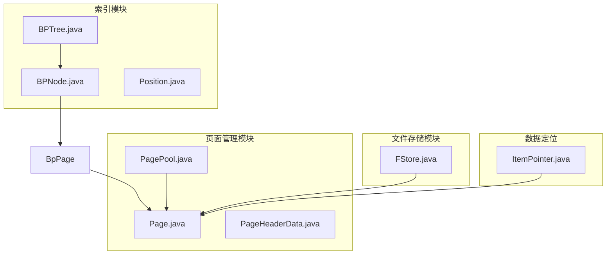
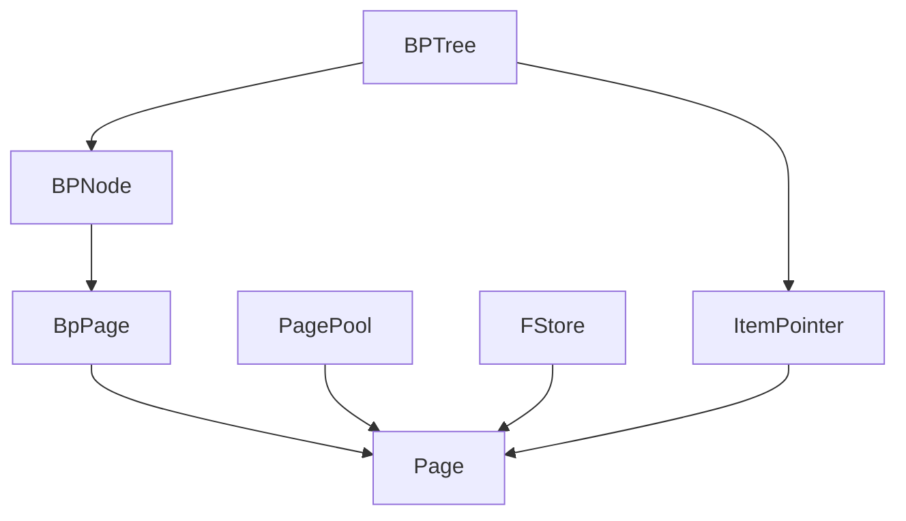
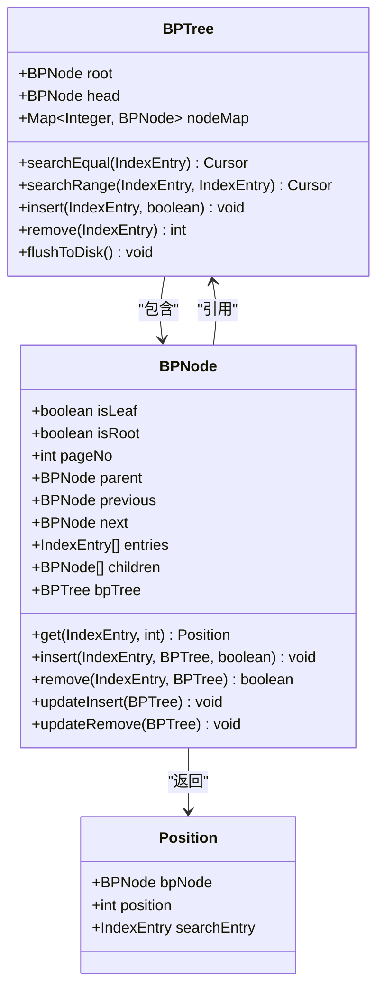
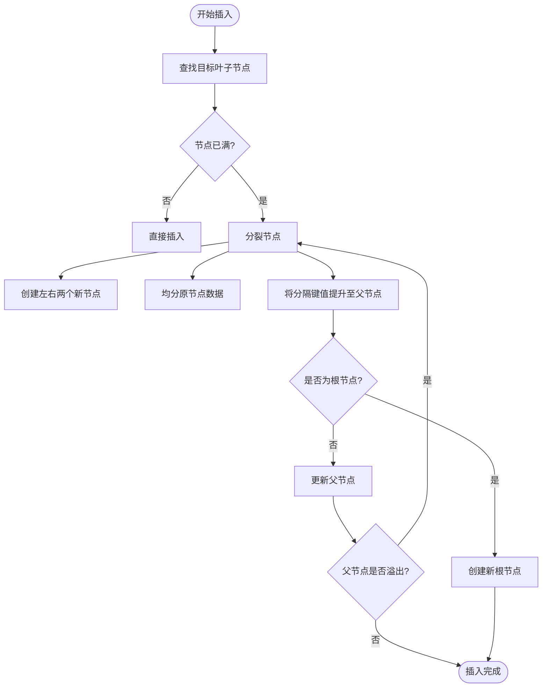
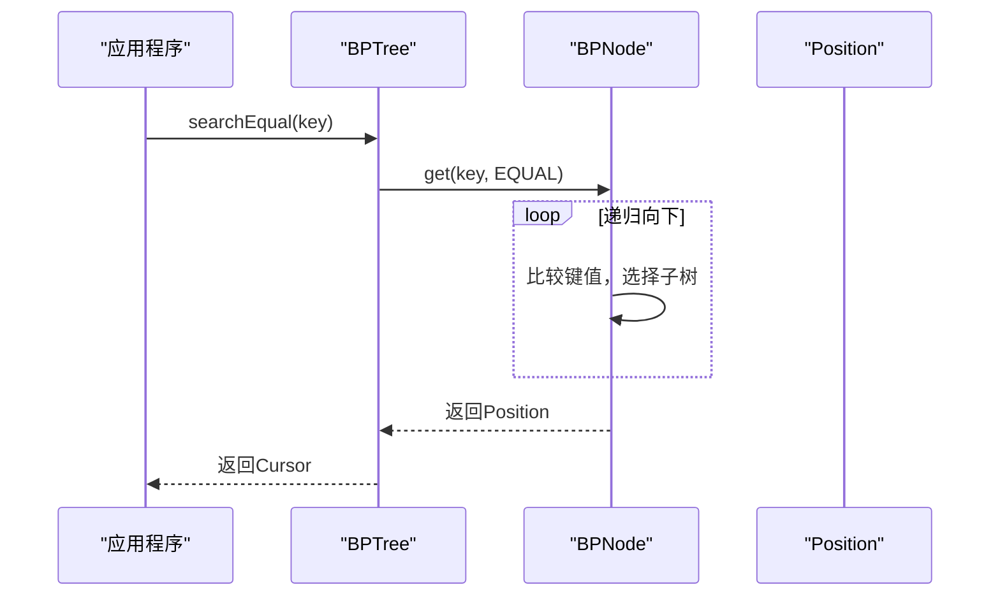
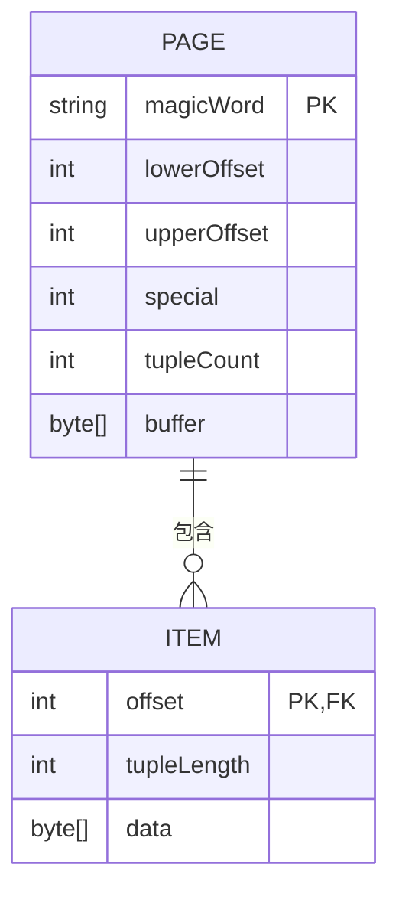
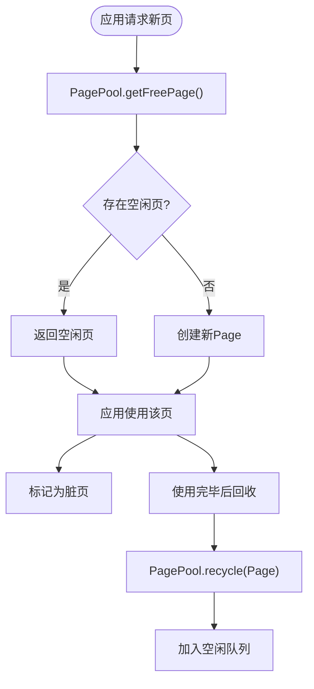
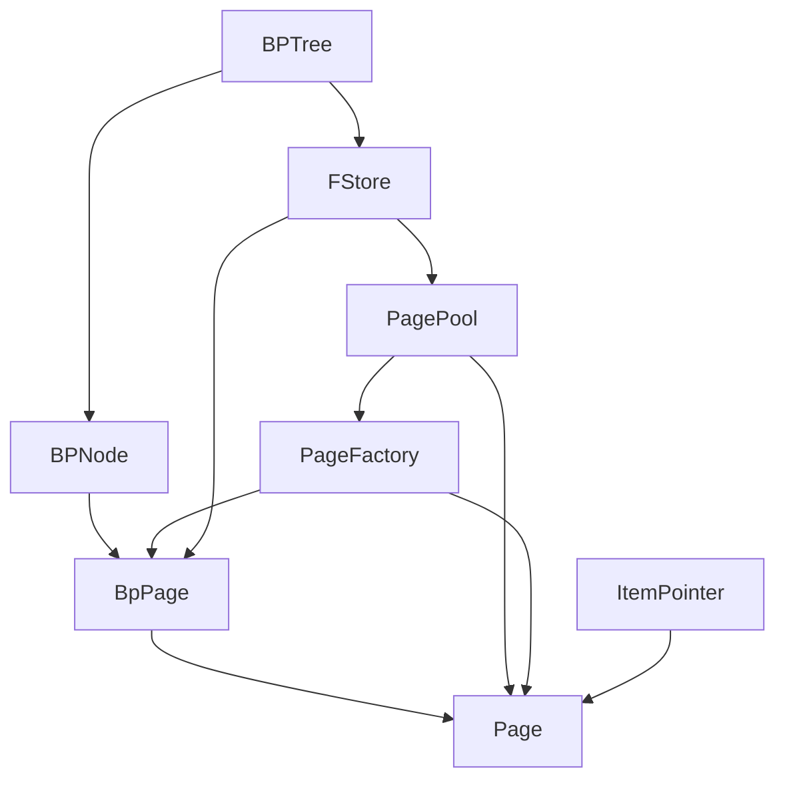

# 存储引擎

<cite>
**本文档中引用的文件**  
- [BPTree.java](file://src/main/java/alchemystar/freedom/index/bp/BPTree.java)
- [BPNode.java](file://src/main/java/alchemystar/freedom/index/bp/BPNode.java)
- [Page.java](file://src/main/java/alchemystar/freedom/store/page/Page.java)
- [PagePool.java](file://src/main/java/alchemystar/freedom/store/page/PagePool.java)
- [FStore.java](file://src/main/java/alchemystar/freedom/store/fs/FStore.java)
- [ItemPointer.java](file://src/main/java/alchemystar/freedom/store/item/ItemPointer.java)
- [PageHeaderData.java](file://src/main/java/alchemystar/freedom/store/page/PageHeaderData.java)
- [SystemConfig.java](file://src/main/java/alchemystar/freedom/config/SystemConfig.java)
- [Position.java](file://src/main/java/alchemystar/freedom/index/bp/Position.java)
- [BpPage.java](file://src/main/java/alchemystar/freedom/index/bp/BpPage.java)
</cite>

## 目录
1. [简介](#简介)
2. [项目结构](#项目结构)
3. [核心组件](#核心组件)
4. [架构概述](#架构概述)
5. [详细组件分析](#详细组件分析)
6. [依赖分析](#依赖分析)
7. [性能考虑](#性能考虑)
8. [故障排除指南](#故障排除指南)
9. [结论](#结论)

## 简介
本文档详细阐述了存储引擎的核心机制，重点聚焦于B+树索引和页面管理。文档将深入解析B+树如何支持高效的数据检索与范围查询，包括节点的分裂与合并算法；说明页面如何在内存中被管理并通过FStore持久化到磁盘；并解释ItemPointer如何精确定位数据记录。通过流程图和架构图，全面展示B+树在插入、查询时的执行流程及其在内存与磁盘间的交互策略。

## 项目结构
存储引擎的代码组织清晰，主要分为索引、页面管理和文件存储三大模块。索引模块（`index/bp`）实现了B+树的核心逻辑；页面管理模块（`store/page`）负责内存页的分配与回收；文件存储模块（`store/fs`）则处理页的持久化。这种分层设计确保了各功能模块的高内聚与低耦合。

**图示来源**
- [BPTree.java](file://src/main/java/alchemystar/freedom/index/bp/BPTree.java)
- [BPNode.java](file://src/main/java/alchemystar/freedom/index/bp/BPNode.java)
- [Page.java](file://src/main/java/alchemystar/freedom/store/page/Page.java)
- [PagePool.java](file://src/main/java/alchemystar/freedom/store/page/PagePool.java)
- [FStore.java](file://src/main/java/alchemystar/freedom/store/fs/FStore.java)
- [ItemPointer.java](file://src/main/java/alchemystar/freedom/store/item/ItemPointer.java)

**本节来源**
- [BPTree.java](file://src/main/java/alchemystar/freedom/index/bp/BPTree.java)
- [Page.java](file://src/main/java/alchemystar/freedom/store/page/Page.java)
- [FStore.java](file://src/main/java/alchemystar/freedom/store/fs/FStore.java)

## 核心组件
存储引擎的核心由B+树索引（BPTree）、内存页（Page）、页池（PagePool）和文件存储（FStore）构成。BPTree作为数据组织的主干，利用BPNode实现树的节点逻辑。Page是内存中的基本存储单元，其生命周期由PagePool统一管理。FStore则负责将内存页的变更同步到磁盘文件，确保数据的持久性。ItemPointer作为数据记录的指针，是连接索引与实际数据的关键。

**本节来源**
- [BPTree.java](file://src/main/java/alchemystar/freedom/index/bp/BPTree.java#L1-L50)
- [Page.java](file://src/main/java/alchemystar/freedom/store/page/Page.java#L1-L50)
- [PagePool.java](file://src/main/java/alchemystar/freedom/store/page/PagePool.java#L1-L20)
- [FStore.java](file://src/main/java/alchemystar/freedom/store/fs/FStore.java#L1-L20)

## 架构概述
整个存储引擎采用经典的三层架构：最上层是B+树索引，负责高效的数据组织与查询；中间层是内存页管理，通过Page和PagePool实现内存的高效利用；最底层是文件系统接口，由FStore提供持久化能力。BPTree通过BPNode操作BpPage，BpPage继承自Page，PagePool为所有Page的创建和回收提供支持，而FStore则完成Page到文件的读写。

**图示来源**
- [BPTree.java](file://src/main/java/alchemystar/freedom/index/bp/BPTree.java#L1-L100)
- [BPNode.java](file://src/main/java/alchemystar/freedom/index/bp/BPNode.java#L1-L50)
- [Page.java](file://src/main/java/alchemystar/freedom/store/page/Page.java#L1-L50)
- [PagePool.java](file://src/main/java/alchemystar/freedom/store/page/PagePool.java#L1-L20)
- [FStore.java](file://src/main/java/alchemystar/freedom/store/fs/FStore.java#L1-L20)

## 详细组件分析

### B+树索引分析
B+树是存储引擎实现高效数据检索的核心数据结构。`BPTree`类是B+树的顶层管理器，维护根节点（`root`）和叶子链表头节点（`head`）。`BPNode`类代表树的节点，区分叶子节点和非叶子节点，并通过`entries`列表存储索引项，通过`children`列表链接子节点。

#### B+树类图

**图示来源**
- [BPTree.java](file://src/main/java/alchemystar/freedom/index/bp/BPTree.java#L1-L100)
- [BPNode.java](file://src/main/java/alchemystar/freedom/index/bp/BPNode.java#L1-L100)
- [Position.java](file://src/main/java/alchemystar/freedom/index/bp/Position.java#L1-L20)

#### B+树插入流程
当向B+树插入一条新记录时，流程从根节点开始，递归向下查找合适的叶子节点。如果目标叶子节点空间不足，则触发分裂操作。分裂会创建两个新节点，将原节点的数据大致均分，并将一个分隔键值提升到父节点。如果父节点也因此溢出，则递归向上分裂，必要时会创建新的根节点。

**图示来源**
- [BPNode.java](file://src/main/java/alchemystar/freedom/index/bp/BPNode.java#L200-L400)
- [BPTree.java](file://src/main/java/alchemystar/freedom/index/bp/BPTree.java#L150-L200)

#### B+树查询流程
B+树的查询分为等值查询和范围查询。等值查询从根节点出发，根据键值比较结果选择子树，直至到达叶子节点。在叶子节点中找到匹配项后，返回一个`Position`对象，该对象包含了指向该记录的指针。范围查询则先找到范围的起始位置，然后利用叶子节点间的双向链表（`previous`和`next`指针）进行顺序遍历。

**图示来源**
- [BPTree.java](file://src/main/java/alchemystar/freedom/index/bp/BPTree.java#L50-L100)
- [BPNode.java](file://src/main/java/alchemystar/freedom/index/bp/BPNode.java#L100-L150)
- [Position.java](file://src/main/java/alchemystar/freedom/index/bp/Position.java#L1-L20)

**本节来源**
- [BPTree.java](file://src/main/java/alchemystar/freedom/index/bp/BPTree.java#L1-L277)
- [BPNode.java](file://src/main/java/alchemystar/freedom/index/bp/BPNode.java#L1-L799)
- [Position.java](file://src/main/java/alchemystar/freedom/index/bp/Position.java#L1-L51)

### 页面管理分析
页面管理是连接内存与磁盘的桥梁。`Page`类代表一个固定大小的内存页，其大小由`SystemConfig.DEFAULT_PAGE_SIZE`（4096字节）定义。`PageHeaderData`管理页头信息，包括空闲空间的起始（`lowerOffset`）和结束（`upperOffset`）偏移量。`PagePool`作为页池，预先创建并缓存一定数量的空闲页（默认8页），通过`getFreePage()`和`recycle()`方法实现页的高效复用，避免了频繁的内存分配与释放。

#### 页面结构图

**图示来源**
- [Page.java](file://src/main/java/alchemystar/freedom/store/page/Page.java#L1-L50)
- [PageHeaderData.java](file://src/main/java/alchemystar/freedom/store/page/PageHeaderData.java#L1-L50)
- [ItemPointer.java](file://src/main/java/alchemystar/freedom/store/item/ItemPointer.java#L1-L20)

#### 页池工作流程

**图示来源**
- [PagePool.java](file://src/main/java/alchemystar/freedom/store/page/PagePool.java#L1-L52)
- [Page.java](file://src/main/java/alchemystar/freedom/store/page/Page.java#L1-L50)

**本节来源**
- [Page.java](file://src/main/java/alchemystar/freedom/store/page/Page.java#L1-L207)
- [PagePool.java](file://src/main/java/alchemystar/freedom/store/page/PagePool.java#L1-L52)
- [PageHeaderData.java](file://src/main/java/alchemystar/freedom/store/page/PageHeaderData.java#L1-L129)
- [SystemConfig.java](file://src/main/java/alchemystar/freedom/config/SystemConfig.java#L1-L38)

### 文件存储分析
`FStore`类负责将内存中的页持久化到文件系统。它通过`FileChannel`与磁盘文件交互。`readPageFromFile()`方法根据页号（`pageIndex`）计算文件偏移量，从文件中读取指定页的数据，并根据是否为索引页创建相应的`Page`或`BpPage`对象。`writePageToFile()`方法则将内存中的页数据写回文件的指定位置。`BPTree`在启动时通过`loadFromDisk()`加载根节点页号，并递归加载整个B+树结构；在关闭时通过`flushToDisk()`将所有脏页写回磁盘。

**本节来源**
- [FStore.java](file://src/main/java/alchemystar/freedom/store/fs/FStore.java#L1-L96)
- [BPTree.java](file://src/main/java/alchemystar/freedom/index/bp/BPTree.java#L50-L70)

### 数据定位分析
`ItemPointer`类是定位数据记录的关键。它包含两个字段：`offset`（记录在页内的偏移量）和`tupleLength`（记录的长度）。当一个`Item`（数据项）被写入`Page`时，`ItemPointer`会先将自身的`offset`和`length`写入页的指针区域，并更新页头的`lowerOffset`。通过`ItemPointer`，系统可以快速定位到页内任意一条记录的起始位置和长度，从而高效地读取数据。

**本节来源**
- [ItemPointer.java](file://src/main/java/alchemystar/freedom/store/item/ItemPointer.java#L1-L48)
- [Page.java](file://src/main/java/alchemystar/freedom/store/page/Page.java#L1-L50)

## 依赖分析
各核心组件之间形成了清晰的依赖关系。`BPTree`依赖`BPNode`来构建树结构，并通过`FStore`进行持久化。`BPNode`依赖`BpPage`来存储其数据，而`BpPage`是`Page`的子类。`Page`的创建和回收依赖`PagePool`，而`PagePool`又依赖`PageFactory`来生成新的`Page`实例。`FStore`在读取页时，会根据情况调用`PagePool`获取空页或直接创建`BpPage`。`ItemPointer`在写入时直接操作`Page`的底层字节缓冲区。

**图示来源**
- [BPTree.java](file://src/main/java/alchemystar/freedom/index/bp/BPTree.java)
- [BPNode.java](file://src/main/java/alchemystar/freedom/index/bp/BPNode.java)
- [Page.java](file://src/main/java/alchemystar/freedom/store/page/Page.java)
- [PagePool.java](file://src/main/java/alchemystar/freedom/store/page/PagePool.java)
- [PageFactory.java](file://src/main/java/alchemystar/freedom/store/page/PageFactory.java)
- [FStore.java](file://src/main/java/alchemystar/freedom/store/fs/FStore.java)
- [ItemPointer.java](file://src/main/java/alchemystar/freedom/store/item/ItemPointer.java)

**本节来源**
- [BPTree.java](file://src/main/java/alchemystar/freedom/index/bp/BPTree.java)
- [BPNode.java](file://src/main/java/alchemystar/freedom/index/bp/BPNode.java)
- [Page.java](file://src/main/java/alchemystar/freedom/store/page/Page.java)
- [PagePool.java](file://src/main/java/alchemystar/freedom/store/page/PagePool.java)
- [PageFactory.java](file://src/main/java/alchemystar/freedom/store/page/PageFactory.java)
- [FStore.java](file://src/main/java/alchemystar/freedom/store/fs/FStore.java)

## 性能考虑
该存储引擎的设计在性能方面有诸多考量。B+树的平衡性保证了O(log n)的查询和插入时间复杂度。页池（`PagePool`）通过对象复用显著减少了GC压力。固定大小的页（4KB）与现代文件系统的块大小对齐，优化了I/O效率。叶子节点间的双向链表使得范围查询可以高效地进行顺序扫描。然而，节点分裂和合并算法较为复杂，且在高并发场景下可能成为瓶颈。此外，页池大小固定为8页，对于大型数据库可能不足以有效缓存热点数据。

## 故障排除指南
- **B+树插入失败**：检查`Item`的大小是否超过页初始空闲空间的1/3（由`getBorrowKeyLength(entry) > bpPage.getInitFreeSpace() / 3`判断），过大的键值会导致插入异常。
- **数据无法持久化**：确认`BPTree.flushToDisk()`方法被正确调用，该方法负责将内存中的B+树结构写回磁盘。
- **内存泄漏**：检查`PagePool.recycle()`方法是否在页使用完毕后被调用，未回收的页会导致内存持续增长。
- **文件读取错误**：检查`FStore`的`filePath`配置是否正确，以及文件系统是否有足够的读写权限。

**本节来源**
- [BPNode.java](file://src/main/java/alchemystar/freedom/index/bp/BPNode.java#L200-L220)
- [BPTree.java](file://src/main/java/alchemystar/freedom/index/bp/BPTree.java#L250-L270)
- [PagePool.java](file://src/main/java/alchemystar/freedom/store/page/PagePool.java#L50-L52)
- [FStore.java](file://src/main/java/alchemystar/freedom/store/fs/FStore.java#L1-L20)

## 结论
本文档全面解析了存储引擎的核心机制。B+树索引通过`BPTree`和`BPNode`的协同工作，实现了高效的数据组织与查询。页面管理通过`Page`、`PagePool`和`PageHeaderData`的配合，有效地管理了内存资源。`FStore`作为持久化层，确保了数据的可靠性。`ItemPointer`则提供了精确的数据定位能力。整体设计层次分明，职责清晰，为构建高性能的数据库系统奠定了坚实的基础。