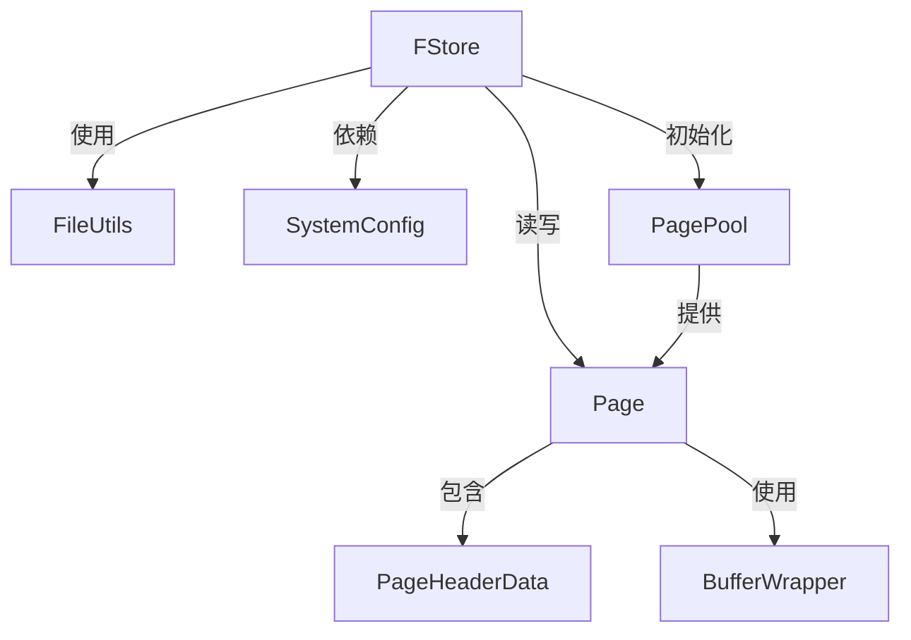
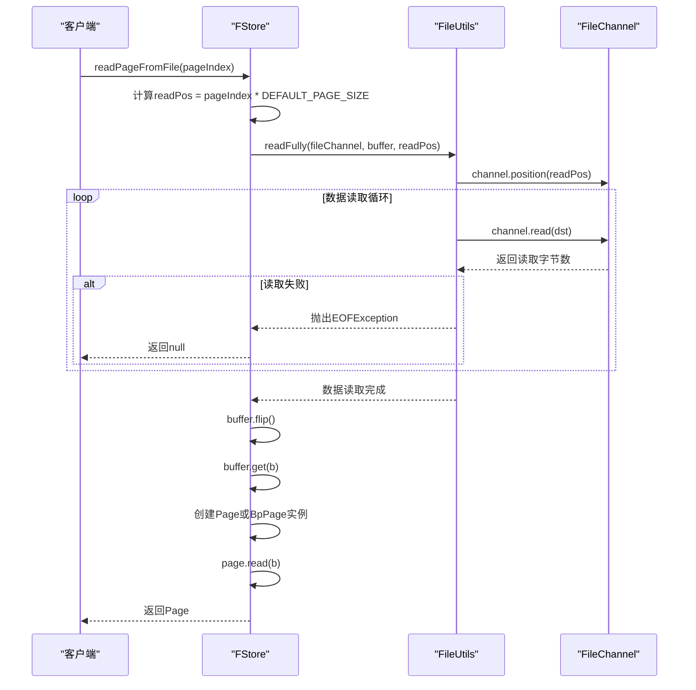
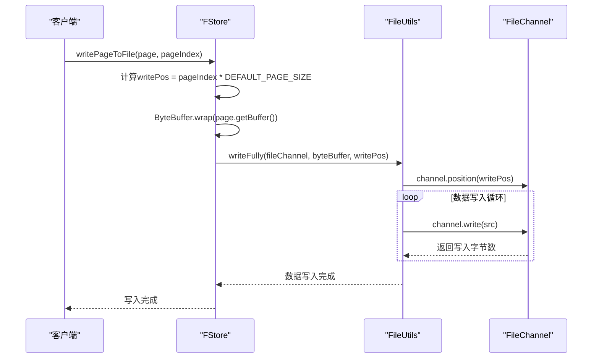
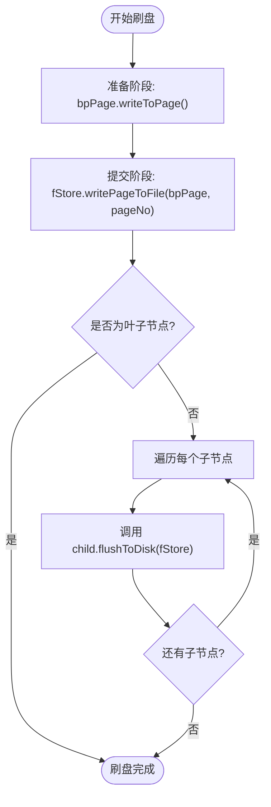

# 文件存储

<cite>
**本文档中引用的文件**  
- [FStore.java](file://src/main/java/alchemystar/freedom/store/fs/FStore.java)
- [SystemConfig.java](file://src/main/java/alchemystar/freedom/config/SystemConfig.java)
- [FileUtils.java](file://src/main/java/alchemystar/freedom/store/fs/FileUtils.java)
- [Page.java](file://src/main/java/alchemystar/freedom/store/page/Page.java)
- [PageHeaderData.java](file://src/main/java/alchemystar/freedom/store/page/PageHeaderData.java)
- [PagePool.java](file://src/main/java/alchemystar/freedom/store/page/PagePool.java)
</cite>

## 目录
1. [简介](#简介)
2. [核心组件与架构](#核心组件与架构)
3. [FStore读写机制](#fstore读写机制)
4. [页号到文件偏移量的映射](#页号到文件偏移量的映射)
5. [双阶段提交式刷盘策略](#双阶段提交式刷盘策略)
6. [存储格式的可配置性](#存储格式的可配置性)
7. [FileUtils底层辅助功能](#fileutils底层辅助功能)
8. [崩溃恢复中的角色](#崩溃恢复中的角色)
9. [局限性分析](#局限性分析)

## 简介
本文档详细描述了Freedom数据库系统中文件存储层的设计与实现，重点聚焦于`FStore.java`类如何将内存中的`Page`对象持久化到本地文件系统。文档涵盖基于`RandomAccessFile`的读写机制、页号（pageNo）到文件偏移量的映射算法、写入时的双阶段提交式刷盘策略、存储格式的可配置性、`FileUtils`提供的底层辅助功能、在崩溃恢复中的角色以及当前实现的局限性。

## 核心组件与架构
文件存储层由多个核心组件构成，协同完成数据的持久化任务。主要组件包括：
- **FStore**: 负责与文件系统交互，提供读写页面的接口。
- **Page**: 内存中的数据页模型，包含数据和元数据。
- **PageHeaderData**: 页面头部信息，管理页面的空闲空间和元组计数。
- **SystemConfig**: 提供系统级配置参数，如页面大小。
- **FileUtils**: 提供底层文件操作工具，如打开、读取、写入和关闭文件通道。
- **PagePool**: 页面池，用于高效地分配和回收页面对象。

**图示来源**
- [FStore.java](file://src/main/java/alchemystar/freedom/store/fs/FStore.java)
- [Page.java](file://src/main/java/alchemystar/freedom/store/page/Page.java)
- [PageHeaderData.java](file://src/main/java/alchemystar/freedom/store/page/PageHeaderData.java)
- [SystemConfig.java](file://src/main/java/alchemystar/freedom/config/SystemConfig.java)
- [FileUtils.java](file://src/main/java/alchemystar/freedom/store/fs/FileUtils.java)
- [PagePool.java](file://src/main/java/alchemystar/freedom/store/page/PagePool.java)

## FStore读写机制
`FStore`类通过`java.nio.channels.FileChannel`实现对文件的随机访问读写。其核心方法包括`readPageFromFile`和`writePageToFile`。

### 读取页面
`readPageFromFile`方法根据页号计算文件偏移量，使用`FileChannel`从指定位置读取一个完整页面的数据。读取过程使用`FileUtils.readFully`确保数据完整性，即使底层读取操作可能分多次完成。

**图示来源**
- [FStore.java](file://src/main/java/alchemystar/freedom/store/fs/FStore.java#L41-L77)
- [FileUtils.java](file://src/main/java/alchemystar/freedom/store/fs/FileUtils.java#L38-L52)

### 写入页面
`writePageToFile`方法将内存中的`Page`对象写入文件。它首先获取页面的字节缓冲区，然后通过`FileUtils.writeFully`将数据写入指定的文件偏移位置。

**图示来源**
- [FStore.java](file://src/main/java/alchemystar/freedom/store/fs/FStore.java#L78-L95)
- [FileUtils.java](file://src/main/java/alchemystar/freedom/store/fs/FileUtils.java#L54-L65)

## 页号到文件偏移量的映射
页号（pageNo）到文件偏移量的映射采用简单的线性计算方式。每个页面的大小固定为`SystemConfig.DEFAULT_PAGE_SIZE`（默认4096字节），因此页号`n`对应的文件偏移量为`n * DEFAULT_PAGE_SIZE`。

该映射算法在`FStore`的`readPageFromFile`和`writePageToFile`方法中直接实现：
- 读取时：`int readPos = pageIndex * SystemConfig.DEFAULT_PAGE_SIZE;`
- 写入时：`int writePos = pageIndex * SystemConfig.DEFAULT_PAGE_SIZE;`

这种设计保证了页面在文件中的连续性和可预测性，简化了寻址逻辑。

**节来源**
- [FStore.java](file://src/main/java/alchemystar/freedom/store/fs/FStore.java#L45-L46)
- [FStore.java](file://src/main/java/alchemystar/freedom/store/fs/FStore.java#L80-L81)

## 双阶段提交式刷盘策略
尽管`FStore`的`writePageToFile`方法本身是一个原子性的写入操作，但整个系统的持久化流程体现了双阶段提交的思想，尤其是在索引树（B+树）的刷新过程中。

### 刷盘流程
1. **准备阶段（Prepare Phase）**:
   - 在内存中构建或修改`BPNode`（B+树节点）。
   - 调用`bpPage.writeToPage()`方法，将节点的所有元数据（如`isLeaf`、`isRoot`、子节点指针等）和数据条目（`IndexEntry`）序列化到其关联的`BpPage`对象的缓冲区中。这一步确保了页面的内存状态是完整且一致的。

2. **提交阶段（Commit Phase）**:
   - 调用`FStore.writePageToFile(bpPage, pageNo)`，将准备好的`BpPage`对象一次性写入磁盘的指定位置。
   - 由于`FileUtils.writeFully`保证了数据被完整写入，这个操作可以被视为“提交”。

### 递归刷盘
对于非叶子节点，`BPNode.flushToDisk(FStore)`方法会递归地先刷新其所有子节点，然后再刷新自身。这确保了在磁盘上，父节点总是指向已经持久化的子节点，维护了树结构的完整性。

**图示来源**
- [BPNode.java](file://src/main/java/alchemystar/freedom/index/bp/BPNode.java#L891-L916)
- [BpPage.java](file://src/main/java/alchemystar/freedom/index/bp/BpPage.java#L98-L137)

## 存储格式的可配置性
存储格式的可配置性主要通过`SystemConfig`接口中的常量来实现，这使得系统具有良好的灵活性和可调优性。

### 关键配置项
- **DEFAULT_PAGE_SIZE**: 定义了每个页面的大小，默认为4096字节。这个值直接影响`Page`、`PageHeaderData`和`BpPage`的构造。
- **DEFAULT_SPECIAL_POINT_LENGTH**: 定义了页面中“特殊空间”（special space）的大小，默认为64字节。`PageHeaderData`在初始化时使用此值来计算`upperOffset`，即数据区的起始位置。

### 配置项的使用
- `PageHeaderData`的构造函数使用`SystemConfig.DEFAULT_SPECIAL_POINT_LENGTH`来设置`upperOffset = size - SystemConfig.DEFAULT_SPECIAL_POINT_LENGTH`，从而动态地为特殊空间预留空间。
- 所有涉及页面大小的计算，如页号到偏移量的映射，都直接引用`SystemConfig.DEFAULT_PAGE_SIZE`，确保了配置的一致性。

**节来源**
- [SystemConfig.java](file://src/main/java/alchemystar/freedom/config/SystemConfig.java#L6-L7)
- [PageHeaderData.java](file://src/main/java/alchemystar/freedom/store/page/PageHeaderData.java#L30-L33)

## FileUtils底层辅助功能
`FileUtils`类封装了`java.nio`包中复杂的文件I/O操作，为上层组件提供了简洁、安全的接口。

### 核心功能
- **open(String fileName)**: 使用`RandomAccessFile`以读写模式（"rw"）打开文件，并返回其`FileChannel`。这为`FStore`提供了进行随机访问的基础。
- **closeFile(FileChannel channel)**: 安全地关闭文件通道，捕获并处理可能的异常。
- **readFully(FileChannel, ByteBuffer, long)**: 保证从指定位置读取指定数量的字节，直到缓冲区满或到达文件末尾。它通过循环调用`channel.read`来实现，处理了`EOFException`。
- **writeFully(FileChannel, ByteBuffer, long)**: 保证将缓冲区中的所有字节写入指定位置。它通过循环调用`channel.write`来实现，确保数据完整性。

这些方法屏蔽了`NIO` API的复杂性，使得`FStore`的读写逻辑更加清晰和健壮。

**节来源**
- [FileUtils.java](file://src/main/java/alchemystar/freedom/store/fs/FileUtils.java#L14-L65)

## 崩溃恢复中的角色
`FStore`在崩溃恢复过程中扮演着基础数据加载的角色。当数据库重启时，`RecoverManager`需要从磁盘重新构建内存中的数据结构。

### 恢复流程
1. **加载日志**: `RecoverManager`首先通过`LogStore`加载所有持久化的日志记录。
2. **识别已提交事务**: 分析日志，找出所有已成功提交的事务（`COMMIT`日志）。
3. **重做（Redo）操作**: 对每个已提交的事务，执行其`redo()`操作。`redo()`操作通常需要从磁盘读取受影响的页面，应用日志中的更改，然后将修改后的页面重新写回磁盘。

在这个流程中，`FStore`的`readPageFromFile`方法是`redo`操作的基础，它负责将崩溃前的页面状态从磁盘加载回内存，作为应用日志更改的起点。

**节来源**
- [FStore.java](file://src/main/java/alchemystar/freedom/store/fs/FStore.java#L41-L77)
- [RecoverManager.java](file://src/main/java/alchemystar/freedom/recovery/RecoverManager.java#L15-L35)

## 局限性分析
当前的`FStore`实现存在一些重要的局限性，主要体现在数据完整性和持久性保证方面。

### 缺少校验和（Checksum）
- **问题**: 页面在写入磁盘或从磁盘读取时，没有计算或验证校验和。这使得系统无法检测到由于硬件故障（如磁盘坏道）或I/O错误导致的数据损坏。
- **影响**: 可能导致“静默数据损坏”（Silent Data Corruption），即数据库使用了错误的数据而不知情，最终可能导致数据不一致或查询结果错误。

### 缺少预写式日志（WAL）
- **问题**: `FStore`的写入是直接的、无日志的。当一个页面被修改并写入时，旧版本的数据没有被记录。
- **影响**:
  - **原子性**: 如果一个事务修改了多个页面，而系统在写入过程中崩溃，可能会导致部分页面更新而部分未更新，破坏了事务的原子性。
  - **恢复能力**: `RecoverManager`依赖于独立的`LogStore`，但`FStore`本身不参与日志的写入。如果`LogStore`的日志写入和`FStore`的数据写入不同步，可能会导致恢复时应用了日志但数据页未更新，或反之，造成数据不一致。
  - **性能**: 缺少WAL意味着无法利用日志的顺序写入来优化性能，所有数据修改都必须直接写入其最终位置。

综上所述，虽然`FStore`实现了基本的持久化功能，但为了达到生产级别的可靠性和一致性，未来需要引入校验和机制和一个与`FStore`紧密集成的WAL系统。

**节来源**
- [FStore.java](file://src/main/java/alchemystar/freedom/store/fs/FStore.java)
- [RecoverManager.java](file://src/main/java/alchemystar/freedom/recovery/RecoverManager.java)