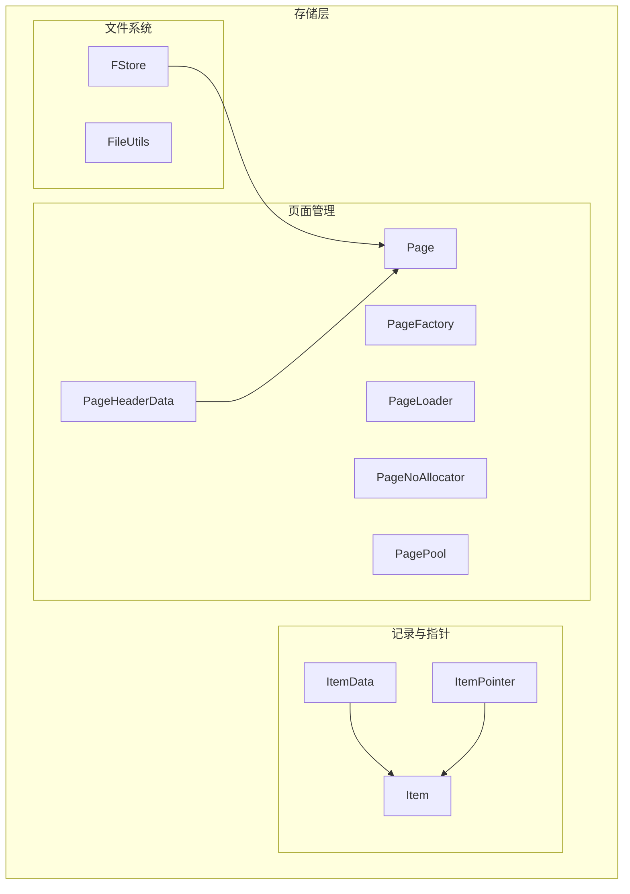
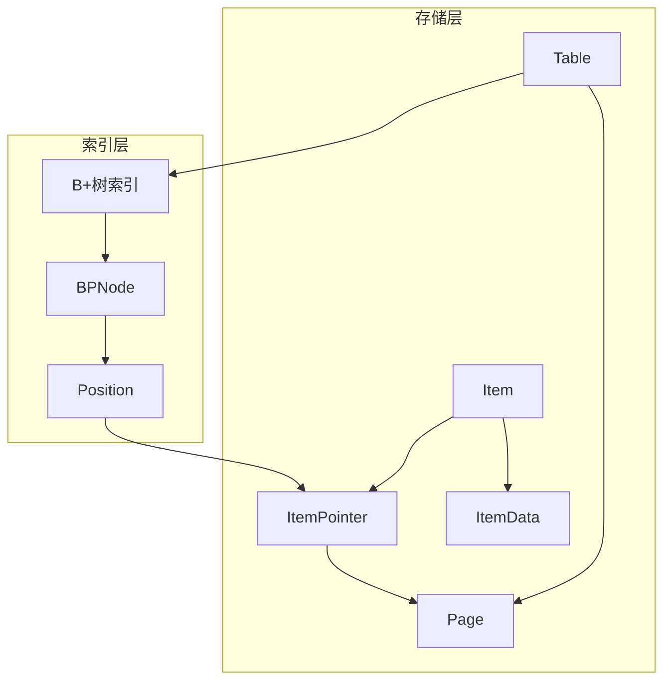
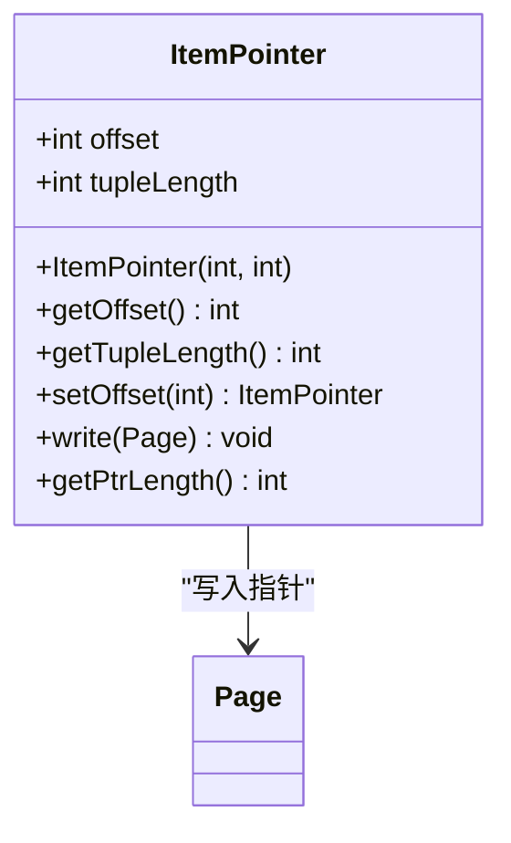
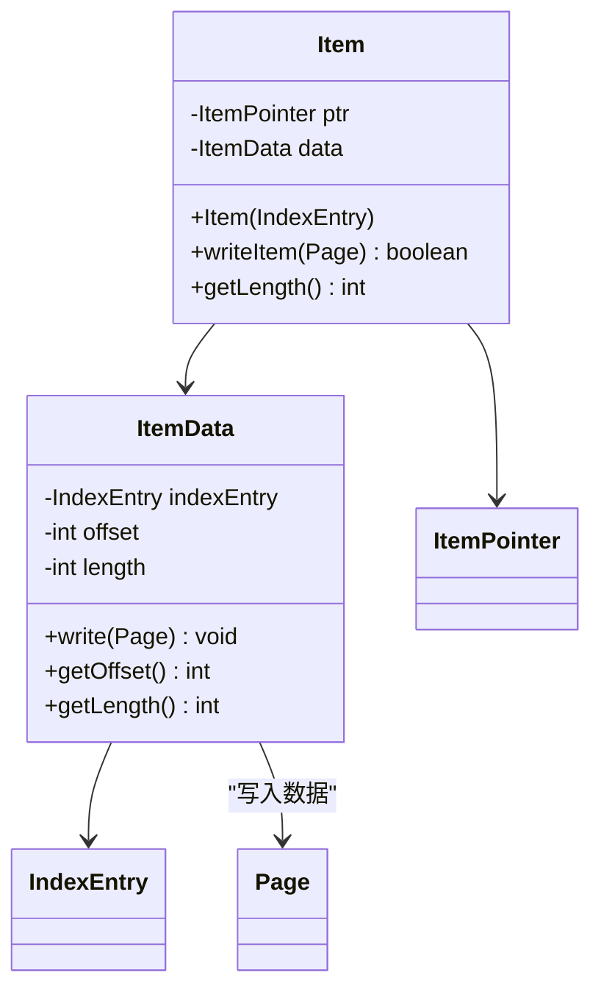
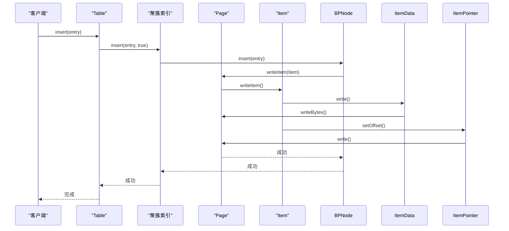
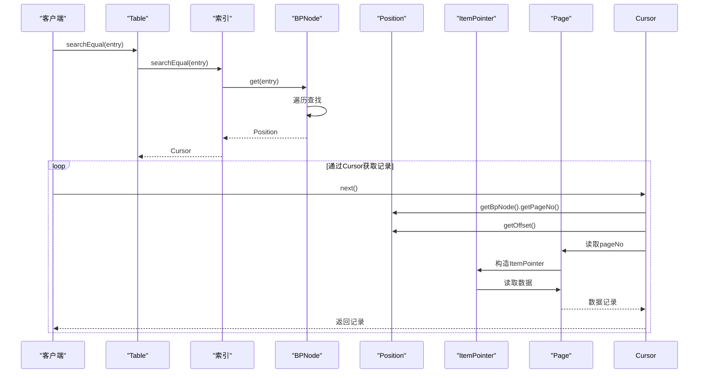
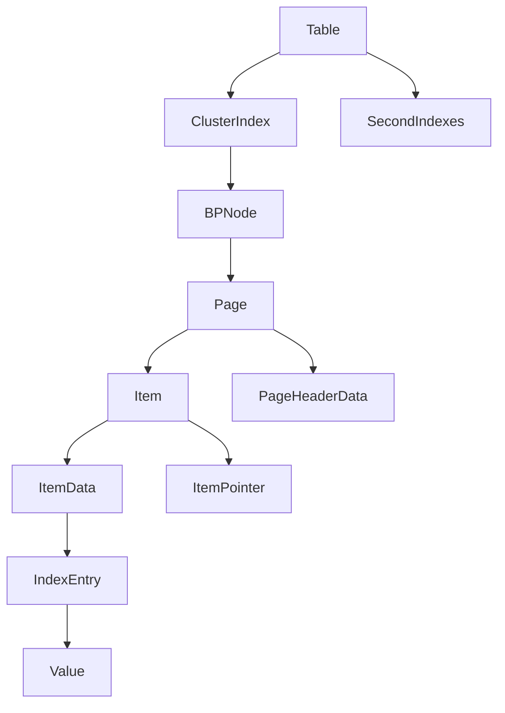

# 记录定位

<cite>
**本文档引用的文件**  
- [ItemPointer.java](file://src/main/java/alchemystar/freedom/store/item/ItemPointer.java)
- [Item.java](file://src/main/java/alchemystar/freedom/store/item/Item.java)
- [ItemData.java](file://src/main/java/alchemystar/freedom/store/item/ItemData.java)
- [Page.java](file://src/main/java/alchemystar/freedom/store/page/Page.java)
- [PageHeaderData.java](file://src/main/java/alchemystar/freedom/store/page/PageHeaderData.java)
- [Table.java](file://src/main/java/alchemystar/freedom/meta/Table.java)
- [BPNode.java](file://src/main/java/alchemystar/freedom/index/bp/BPNode.java)
- [IndexEntry.java](file://src/main/java/alchemystar/freedom/meta/IndexEntry.java)
</cite>

## 目录
1. [引言](#引言)
2. [项目结构](#项目结构)
3. [核心组件](#核心组件)
4. [架构概述](#架构概述)
5. [详细组件分析](#详细组件分析)
6. [依赖分析](#依赖分析)
7. [性能考虑](#性能考虑)
8. [故障排除指南](#故障排除指南)
9. [结论](#结论)

## 引言
本文档旨在深入解析数据库系统中记录定位机制的实现原理，重点阐述`ItemPointer`如何通过`(pageNo, offset)`二元组精确定位数据记录在文件中的物理位置。文档将详细说明`Item`类如何封装实际数据内容及其在页面内的布局策略，并结合`Table`类中的表结构信息，展示记录定位在INSERT、UPDATE、DELETE等操作中的应用流程。通过具体示例，说明当B+树索引指向某条记录时，系统如何通过`ItemPointer`快速跳转到对应页面并提取数据，体现索引与存储层的协同工作机制。

## 项目结构
本项目采用分层架构设计，主要分为访问层、配置层、常量层、引擎层、索引层、元数据层、优化器、恢复管理、SQL解析与执行、存储层、事务管理及工具类等模块。存储层是本文档关注的核心，其结构如下：

**图示来源**  
- [FStore.java](file://src/main/java/alchemystar/freedom/store/fs/FStore.java)
- [Item.java](file://src/main/java/alchemystar/freedom/store/item/Item.java)
- [ItemPointer.java](file://src/main/java/alchemystar/freedom/store/item/ItemPointer.java)
- [Page.java](file://src/main/java/alchemystar/freedom/store/page/Page.java)
- [PageHeaderData.java](file://src/main/java/alchemystar/freedom/store/page/PageHeaderData.java)

**本节来源**  
- [项目结构信息](file://project_structure)

## 核心组件
本节分析记录定位机制中的三个核心组件：`ItemPointer`、`Item`和`Table`。

**本节来源**  
- [ItemPointer.java](file://src/main/java/alchemystar/freedom/store/item/ItemPointer.java)
- [Item.java](file://src/main/java/alchemystar/freedom/store/item/Item.java)
- [Table.java](file://src/main/java/alchemystar/freedom/meta/Table.java)

## 架构概述
系统采用B+树索引与堆表存储相结合的架构。B+树的叶子节点存储完整的数据记录（聚簇索引）或指向数据记录的指针（二级索引）。数据记录以`Item`的形式存储在`Page`中，`ItemPointer`提供从逻辑记录到物理位置的映射。

**图示来源**  
- [BPNode.java](file://src/main/java/alchemystar/freedom/index/bp/BPNode.java)
- [Position.java](file://src/main/java/alchemystar/freedom/index/bp/Position.java)
- [Table.java](file://src/main/java/alchemystar/freedom/meta/Table.java)
- [Page.java](file://src/main/java/alchemystar/freedom/store/page/Page.java)
- [Item.java](file://src/main/java/alchemystar/freedom/store/item/Item.java)
- [ItemPointer.java](file://src/main/java/alchemystar/freedom/store/item/ItemPointer.java)

## 详细组件分析

### ItemPointer分析
`ItemPointer`类是记录定位的核心，它通过`(offset, tupleLength)`二元组描述一条记录在页面内的物理位置。

**图示来源**  
- [ItemPointer.java](file://src/main/java/alchemystar/freedom/store/item/ItemPointer.java#L1-L48)
- [Page.java](file://src/main/java/alchemystar/freedom/store/page/Page.java)

**本节来源**  
- [ItemPointer.java](file://src/main/java/alchemystar/freedom/store/item/ItemPointer.java#L1-L48)

### Item与ItemData分析
`Item`类封装了一条完整的数据记录，由`ItemData`和`ItemPointer`两部分组成。`ItemData`负责管理数据内容的序列化与反序列化。

**图示来源**  
- [Item.java](file://src/main/java/alchemystar/freedom/store/item/Item.java#L1-L44)
- [ItemData.java](file://src/main/java/alchemystar/freedom/store/item/ItemData.java#L1-L57)
- [IndexEntry.java](file://src/main/java/alchemystar/freedom/meta/IndexEntry.java)

**本节来源**  
- [Item.java](file://src/main/java/alchemystar/freedom/store/item/Item.java#L1-L44)
- [ItemData.java](file://src/main/java/alchemystar/freedom/store/item/ItemData.java#L1-L57)

### Table与记录定位流程分析
`Table`类作为元数据管理的核心，协调索引与存储层的操作。在CRUD操作中，`ItemPointer`发挥着关键作用。

#### INSERT操作流程

**图示来源**  
- [Table.java](file://src/main/java/alchemystar/freedom/meta/Table.java#L1-L172)
- [BPNode.java](file://src/main/java/alchemystar/freedom/index/bp/BPNode.java)
- [Page.java](file://src/main/java/alchemystar/freedom/store/page/Page.java)
- [Item.java](file://src/main/java/alchemystar/freedom/store/item/Item.java)

#### 索引查找与记录定位流程

**图示来源**  
- [Table.java](file://src/main/java/alchemystar/freedom/meta/Table.java#L1-L172)
- [BPNode.java](file://src/main/java/alchemystar/freedom/index/bp/BPNode.java)
- [Position.java](file://src/main/java/alchemystar/freedom/index/bp/Position.java)
- [ItemPointer.java](file://src/main/java/alchemystar/freedom/store/item/ItemPointer.java)
- [Page.java](file://src/main/java/alchemystar/freedom/store/page/Page.java)

**本节来源**  
- [Table.java](file://src/main/java/alchemystar/freedom/meta/Table.java#L1-L172)
- [BPNode.java](file://src/main/java/alchemystar/freedom/index/bp/BPNode.java)
- [Position.java](file://src/main/java/alchemystar/freedom/index/bp/Position.java)

## 依赖分析
各组件之间的依赖关系清晰，形成了一个从高层应用到底层存储的调用链。

**图示来源**  
- [Table.java](file://src/main/java/alchemystar/freedom/meta/Table.java)
- [BPNode.java](file://src/main/java/alchemystar/freedom/index/bp/BPNode.java)
- [Page.java](file://src/main/java/alchemystar/freedom/store/page/Page.java)
- [Item.java](file://src/main/java/alchemystar/freedom/store/item/Item.java)
- [ItemData.java](file://src/main/java/alchemystar/freedom/store/item/ItemData.java)
- [ItemPointer.java](file://src/main/java/alchemystar/freedom/store/item/ItemPointer.java)
- [IndexEntry.java](file://src/main/java/alchemystar/freedom/meta/IndexEntry.java)

**本节来源**  
- [Table.java](file://src/main/java/alchemystar/freedom/meta/Table.java)
- [BPNode.java](file://src/main/java/alchemystar/freedom/index/bp/BPNode.java)
- [Page.java](file://src/main/java/alchemystar/freedom/store/page/Page.java)
- [Item.java](file://src/main/java/alchemystar/freedom/store/item/Item.java)

## 性能考虑
记录定位机制的设计充分考虑了性能因素：
- **空间效率**：`ItemPointer`仅占用8字节，开销极小。
- **时间效率**：通过`offset`直接定位，避免了数据扫描。
- **缓存友好**：连续的数据布局有利于磁盘预读和内存缓存。
- **并发控制**：`Page`的脏页标记机制减少了不必要的I/O。

## 故障排除指南
在使用记录定位机制时，可能遇到以下问题：

1. **定位失败**：检查`ItemPointer`的`offset`是否超出页面范围。
2. **数据损坏**：验证`PageHeaderData`中的`magicWord`是否正确。
3. **插入失败**：确认页面剩余空间是否足够容纳新记录。
4. **索引不一致**：确保在`INSERT`/`DELETE`操作后，聚簇索引和二级索引同步更新。

**本节来源**  
- [Page.java](file://src/main/java/alchemystar/freedom/store/page/Page.java)
- [Item.java](file://src/main/java/alchemystar/freedom/store/item/Item.java)
- [ItemPointer.java](file://src/main/java/alchemystar/freedom/store/item/ItemPointer.java)

## 结论
本文档详细解析了基于`ItemPointer`的记录定位机制。该机制通过`(pageNo, offset)`二元组实现了从逻辑记录到物理位置的高效映射，是连接索引层与存储层的桥梁。`Item`类的封装设计保证了数据的一致性和完整性，而`Table`类则协调了整个CRUD流程。这一设计体现了清晰的分层架构和高效的性能优化，为数据库系统的稳定运行提供了坚实基础。