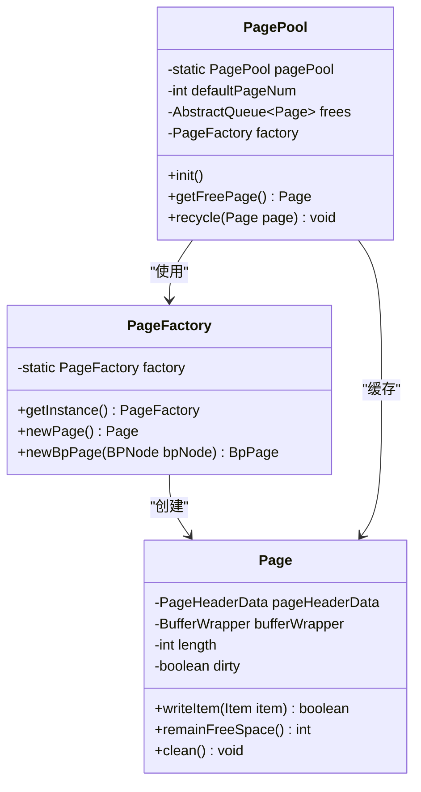
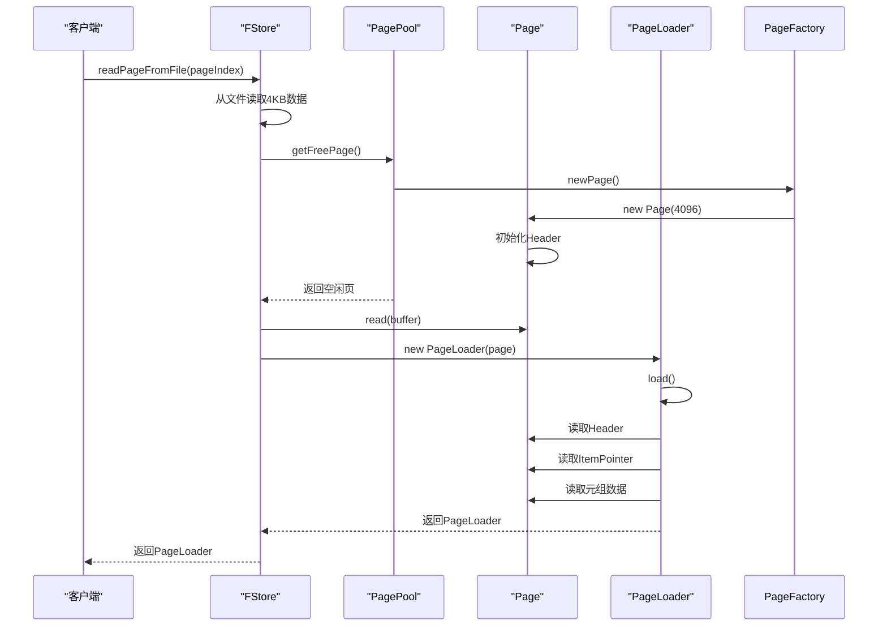
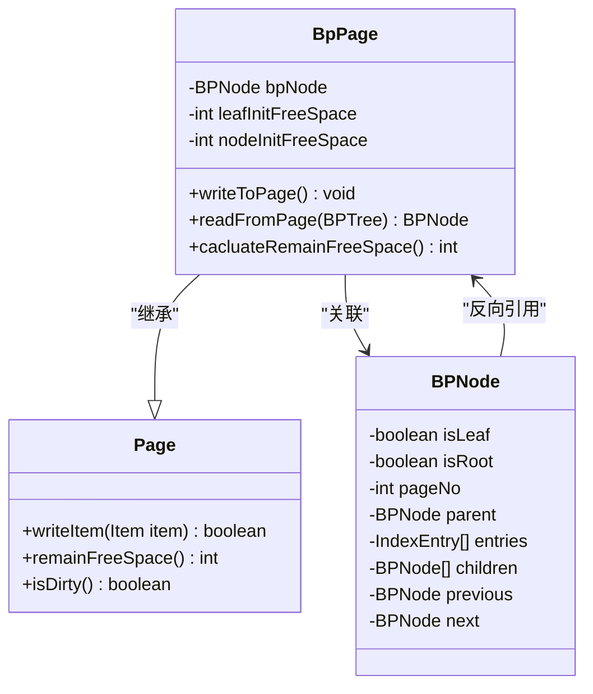
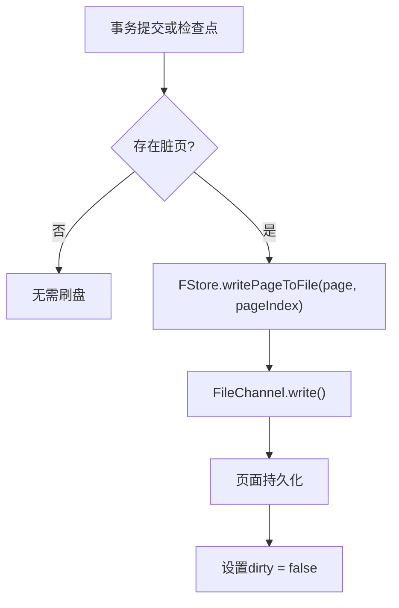

# 页面管理

<cite>
**本文档引用的文件**
- [Page.java](file://src/main/java/alchemystar/freedom/store/page/Page.java)
- [PagePool.java](file://src/main/java/alchemystar/freedom/store/page/PagePool.java)
- [PageFactory.java](file://src/main/java/alchemystar/freedom/store/page/PageFactory.java)
- [PageLoader.java](file://src/main/java/alchemystar/freedom/store/page/PageLoader.java)
- [PageHeaderData.java](file://src/main/java/alchemystar/freedom/store/page/PageHeaderData.java)
- [BpPage.java](file://src/main/java/alchemystar/freedom/index/bp/BpPage.java)
- [SystemConfig.java](file://src/main/java/alchemystar/freedom/config/SystemConfig.java)
- [FStore.java](file://src/main/java/alchemystar/freedom/store/fs/FStore.java)
- [BufferWrapper.java](file://src/main/java/alchemystar/freedom/util/BufferWrapper.java)
- [Item.java](file://src/main/java/alchemystar/freedom/store/item/Item.java)
</cite>

## 目录
1. [引言](#引言)
2. [页面结构与封装机制](#页面结构与封装机制)
3. [页面池与内存复用](#页面池与内存复用)
4. [页面创建与加载协作机制](#页面创建与加载协作机制)
5. [页面头元信息管理](#页面头元信息管理)
6. [索引页扩展机制](#索引页扩展机制)
7. [页面生命周期管理](#页面生命周期管理)
8. [数据同步与刷盘机制](#数据同步与刷盘机制)
9. [总结](#总结)

## 引言

页面管理子系统是数据库存储引擎的核心组件，负责管理固定大小的数据页（默认4KB）在内存与磁盘之间的映射与同步。本系统通过Page类封装数据页，利用PagePool实现内存页的缓存与复用，有效减少垃圾回收（GC）压力。PageFactory与PageLoader协同完成页面的创建与加载，而PageHeaderData维护关键元信息如脏页标记与引用计数。BpPage继承Page类，为B+树索引提供扩展功能。本文档深入分析这些组件的设计与协作机制，帮助开发者理解页面生命周期管理与数据同步策略。

## 页面结构与封装机制

`Page`类是数据页的核心封装，固定大小为4KB（由`SystemConfig.DEFAULT_PAGE_SIZE`定义），采用双指针结构管理空闲空间。页面内部由`PageHeaderData`、元组数据区和特殊区域（special space）组成。`BufferWrapper`封装底层字节数组，提供类型安全的读写操作。

页面采用双向增长的空闲空间管理策略：
- **lowerOffset**：从页面头部向后增长，用于存储变长数据
- **upperOffset**：从页面尾部向前增长，用于存储元组指针
- **remainFreeSpace()**：计算`upperOffset - lowerOffset`，判断是否有足够空间插入新元组

当插入元组时，`writeItem()`方法检查空闲空间，若足够则写入并标记页面为脏页（dirty=true），触发后续持久化。

**Section sources**
- [Page.java](file://src/main/java/alchemystar/freedom/store/page/Page.java#L1-L207)
- [SystemConfig.java](file://src/main/java/alchemystar/freedom/config/SystemConfig.java#L1-L38)
- [BufferWrapper.java](file://src/main/java/alchemystar/freedom/util/BufferWrapper.java)

## 页面池与内存复用

`PagePool`实现内存页的缓存与复用，显著降低GC压力。其核心设计如下：

- **对象池模式**：使用`ConcurrentLinkedQueue<Page>`维护可用页面队列
- **预分配机制**：初始化时预创建8个页面（`defaultPageNum = 8`）
- **获取策略**：`getFreePage()`优先从池中获取空闲页，若池空则新建
- **回收机制**：`recycle(Page page)`调用`page.clean()`重置状态后归还至池

该设计避免了频繁创建/销毁Page对象，尤其在高并发场景下有效控制内存波动。



**Diagram sources**
- [PagePool.java](file://src/main/java/alchemystar/freedom/store/page/PagePool.java#L1-L52)
- [PageFactory.java](file://src/main/java/alchemystar/freedom/store/page/PageFactory.java#L1-L31)
- [Page.java](file://src/main/java/alchemystar/freedom/store/page/Page.java#L1-L207)

## 页面创建与加载协作机制

`PageFactory`与`PageLoader`在页面生命周期中协同工作，分别负责创建与反序列化。

### 页面创建流程
1. `PageFactory.getInstance().newPage()`调用`new Page(DEFAULT_PAGE_SIZE)`
2. `Page`构造函数初始化`PageHeaderData`和`BufferWrapper`
3. `PageHeaderData.write(this)`将元信息写入页面头部

### 页面加载流程
1. `FStore.readPageFromFile()`从磁盘读取字节数组
2. `Page.read(byte[] buffer)`重置`BufferWrapper`
3. `PageLoader.load()`解析页面内容：
   - 读取`PageHeaderData`获取元组数量
   - 遍历`ItemPointer`数组定位每个元组
   - 跳过`tupleLength = -1`的已删除元组
   - 构建`IndexEntry[]`数组供上层使用



**Diagram sources**
- [PageFactory.java](file://src/main/java/alchemystar/freedom/store/page/PageFactory.java#L1-L31)
- [PageLoader.java](file://src/main/java/alchemystar/freedom/store/page/PageLoader.java#L1-L58)
- [FStore.java](file://src/main/java/alchemystar/freedom/store/fs/FStore.java#L1-L96)

## 页面头元信息管理

`PageHeaderData`封装页面的元信息，结构如下：

| 字段 | 偏移 | 说明 |
|------|------|------|
| magicWord | 0 | 标识符"Freedom" |
| lowerOffset | 8 | 空闲空间起始偏移 |
| upperOffset | 12 | 空闲空间结束偏移 |
| special | 16 | 特殊区域起始偏移 |
| tupleCount | 20 | 元组数量 |

关键特性：
- **原子更新**：`modifyLowerOffset()`等方法直接修改页面字节数组，保证元数据一致性
- **引用计数**：`tupleCount`记录有效元组数，`addTupleCount()`/`decTupleCount()`通过`readIntPos()`和`writeIntPos()`原子操作
- **脏页标记**：`Page.dirty`字段标识页面是否被修改，决定是否需要刷盘

**Section sources**
- [PageHeaderData.java](file://src/main/java/alchemystar/freedom/store/page/PageHeaderData.java#L1-L129)
- [Page.java](file://src/main/java/alchemystar/freedom/store/page/Page.java#L1-L207)

## 索引页扩展机制

`BpPage`继承`Page`，为B+树索引节点提供专用功能。其结构在基础页面上扩展：

```
PageHeaderData
isLeaf (int)
isRoot (int)
pageNo (int)
parentPageNo (int)
entryCount (int)
entries... (IndexEntry)
childCount (int)
childPageNos... (int)
previousPageNo (int)
nextPageNo (int)
```

关键扩展功能：
- **初始化空间计算**：`leafInitFreeSpace`和`nodeInitFreeSpace`预计算可用空间
- **节点序列化**：`writeToPage()`将`BPNode`状态写入页面
- **节点反序列化**：`readFromPage()`从页面重建`BPNode`对象图
- **空间管理**：`cacluateRemainFreeSpace()`基于元组长度动态计算剩余空间



**Diagram sources**
- [BpPage.java](file://src/main/java/alchemystar/freedom/index/bp/BpPage.java#L1-L204)
- [Page.java](file://src/main/java/alchemystar/freedom/store/page/Page.java#L1-L207)

## 页面生命周期管理

页面生命周期包含创建、使用、回收三个阶段，核心管理策略如下：

### 空闲空间计算
- `remainFreeSpace()` = `upperOffset - lowerOffset`
- 插入前调用`spaceEnough(IndexEntry)`预检空间
- 删除操作通过`writeIntPos(-1, position)`标记元组为已删除，不立即释放空间

### 读写指针维护
- `modifyLowerOffset(i)`：更新lower指针，通常在写入变长数据后调用
- `modifyUpperOffset(i)`：更新upper指针，通常在写入元组指针后调用
- 指针修改直接写入页面字节数组，保证崩溃一致性

### 引用计数
- `tupleCount`精确记录有效元组数
- `addTupleCount()`/`decTupleCount()`通过页内原子操作维护
- `PageLoader`过滤`tupleLength = -1`的已删除元组

**Section sources**
- [Page.java](file://src/main/java/alchemystar/freedom/store/page/Page.java#L1-L207)
- [PageHeaderData.java](file://src/main/java/alchemystar/freedom/store/page/PageHeaderData.java#L1-L129)

## 数据同步与刷盘机制

数据同步通过脏页标记与刷盘策略实现：

### 脏页标记
- `Page.dirty`字段初始为`false`
- 任何修改操作（`writeItem()`、`delete()`）设置`dirty = true`
- `clean()`方法重置`dirty = false`

### 刷盘触发条件
1. **事务提交**：事务日志持久化后触发关联页面刷盘
2. **检查点（Checkpoint）**：定期将所有脏页写入磁盘
3. **缓冲区满**：`PagePool`无法提供空闲页时强制刷盘

### 刷盘流程


**Section sources**
- [Page.java](file://src/main/java/alchemystar/freedom/store/page/Page.java#L1-L207)
- [FStore.java](file://src/main/java/alchemystar/freedom/store/fs/FStore.java#L1-L96)

## 总结

页面管理子系统通过精心设计的组件协作，实现了高效、可靠的内存与磁盘数据管理。`Page`类以4KB为单位封装数据，`PagePool`通过对象池减少GC压力，`PageFactory`与`PageLoader`分离创建与加载逻辑。`PageHeaderData`维护关键元信息，`BpPage`扩展基础功能支持索引结构。通过双指针空闲空间管理、原子元数据更新和脏页标记机制，系统确保了数据一致性与高性能。开发者应理解页面生命周期各阶段的管理策略，合理利用API避免内存泄漏与性能瓶颈。