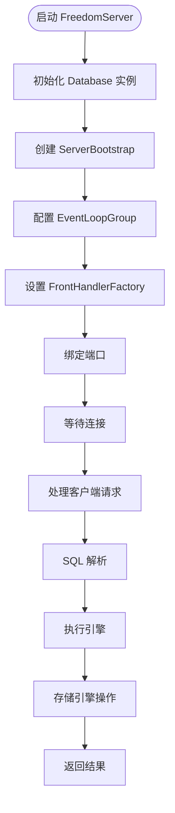
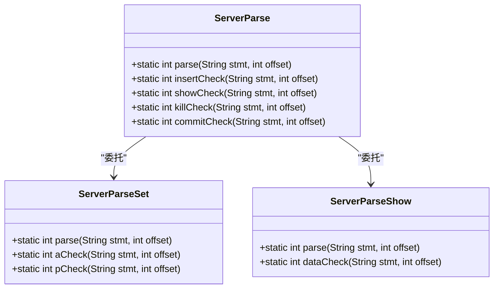

# 开发者指南

<cite>
**本文档中引用的文件**  
- [pom.xml](file://pom.xml)
- [README.md](file://README.md)
- [FreedomServer.java](file://src/main/java/alchemystar/freedom/engine/server/FreedomServer.java)
- [ServerParse.java](file://src/main/java/alchemystar/freedom/engine/parser/ServerParse.java)
- [ServerParseSet.java](file://src/main/java/alchemystar/freedom/engine/parser/ServerParseSet.java)
- [ServerParseShow.java](file://src/main/java/alchemystar/freedom/engine/parser/ServerParseShow.java)
- [CharsetUtil.java](file://src/main/java/alchemystar/freedom/engine/net/proto/util/CharsetUtil.java)
</cite>

## 目录
1. [简介](#简介)
2. [开发环境搭建](#开发环境搭建)
3. [代码风格与提交规范](#代码风格与提交规范)
4. [依赖管理与构建生命周期](#依赖管理与构建生命周期)
5. [调试技巧](#调试技巧)
6. [贡献流程](#贡献流程)
7. [社区贡献指引](#社区贡献指引)

## 简介
Freedom 是一个基于 Java 实现的 SQL 执行引擎，支持 MySQL 协议交互，具备完整的 SQL 解析、执行、事务处理和 B+ 树存储功能。本指南旨在为开发者提供完整的贡献指导，涵盖环境配置、代码规范、调试方法和社区协作流程。

## 开发环境搭建

### JDK 版本要求
根据 `pom.xml` 文件中的编译插件配置，项目要求使用 **JDK 1.6** 或兼容版本进行编译。请确保本地安装了 JDK 1.6 并正确配置 `JAVA_HOME` 环境变量。

```xml
<source>1.6</source>
<target>1.6</target>
```

### Maven 配置
项目使用 Maven 进行依赖管理和构建。建议使用 Maven 3.x 版本。

1. 安装 Maven 并配置环境变量
2. 确保 Maven 能够访问中央仓库或配置合适的镜像源
3. 项目根目录下运行 `mvn clean compile` 即可完成编译

### IDE 导入说明
#### IntelliJ IDEA
1. 打开 IDEA，选择 "Open" 项目
2. 选择项目根目录下的 `pom.xml`
3. IDEA 会自动识别为 Maven 项目并导入依赖
4. 确保项目 SDK 设置为 JDK 1.6

#### Eclipse
项目已配置 `maven-eclipse-plugin` 插件，可直接生成 Eclipse 项目文件：
```bash
mvn eclipse:eclipse
```
然后在 Eclipse 中通过 "Import Existing Projects" 导入即可。

**Section sources**
- [pom.xml](file://pom.xml#L150-L155)

## 代码风格与提交规范

### 代码风格
- 使用 UTF-8 编码
- 缩进使用 4 个空格
- 遵循 Java 标准命名规范（驼峰命名法）
- 注释使用英文，保持简洁清晰
- 类和方法必须包含 Javadoc 注释

### 提交规范
- 提交信息应使用英文
- 格式：`[模块] 简要描述`
- 示例：`[parser] Add support for SET TRANSACTION ISOLATION LEVEL`
- 对于重大变更，应在提交信息中详细说明变更原因和影响

### Pull Request 流程
1. Fork 项目仓库
2. 创建特性分支（feature branch）
3. 实现功能并编写测试
4. 提交 Pull Request
5. 等待代码审查
6. 根据反馈修改代码
7. 合并到主分支

**Section sources**
- [README.md](file://README.md#L1-L134)

## 依赖管理与构建生命周期

### 依赖管理
项目通过 `pom.xml` 管理依赖，主要依赖包括：

- **Netty 5.0.0.Alpha1**：网络通信框架
- **Druid 1.1.11**：SQL 解析器
- **Logback 1.1.2**：日志框架
- **Commons-lang 2.6**：常用工具类
- **JUnit 4.12**：单元测试框架

```xml
<dependency>
    <groupId>io.netty</groupId>
    <artifactId>netty-all</artifactId>
    <version>5.0.0.Alpha1</version>
</dependency>
```

### 构建生命周期
项目构建包含以下主要阶段：

1. **compile**：编译主代码
2. **test-compile**：编译测试代码
3. **test**：运行单元测试
4. **package**：打包成 JAR 文件
5. **install**：安装到本地仓库

构建插件配置了源码编码、资源文件处理和源码打包等功能。

**Section sources**
- [pom.xml](file://pom.xml#L20-L150)

## 调试技巧

### 启动 FreedomServer
`FreedomServer` 是项目的主入口类，位于 `alchemystar.freedom.engine.server` 包中。

```java
public static void main(String[] args) {
    FreedomServer server = new FreedomServer();
    try {
        server.start();
        while (true) {
            try {
                Thread.sleep(1000 * 300);
            } catch (Exception e) {
                // just ignore it
            }
        }
    } catch (Exception e) {
        e.printStackTrace();
    }
}
```

### IDE 中断点调试步骤
1. 在 `FreedomServer.java` 的 `main` 方法中设置断点
2. 配置运行配置，主类为 `alchemystar.freedom.engine.server.FreedomServer`
3. 以调试模式（Debug Mode）启动
4. 可以在 `ServerBootstrap` 配置、`FrontHandlerFactory` 初始化等关键位置设置断点
5. 使用 MySQL 客户端连接 `localhost:端口` 进行测试

### 调试建议
- 关注 `engine.net.handler.frontend` 包中的处理器类
- 在 SQL 解析阶段，可调试 `ServerParse` 类的解析逻辑
- 事务处理逻辑位于 `transaction` 包中
- 存储引擎相关代码在 `store` 和 `index` 包中



**Diagram sources**
- [FreedomServer.java](file://src/main/java/alchemystar/freedom/engine/server/FreedomServer.java#L26-L76)

**Section sources**
- [FreedomServer.java](file://src/main/java/alchemystar/freedom/engine/server/FreedomServer.java#L26-L76)

## 贡献流程

### 代码解析支持
项目通过 `ServerParse` 系列类实现 SQL 解析，支持以下语句：



**Diagram sources**
- [ServerParse.java](file://src/main/java/alchemystar/freedom/engine/parser/ServerParse.java#L77-L411)
- [ServerParseSet.java](file://src/main/java/alchemystar/freedom/engine/parser/ServerParseSet.java#L576-L684)
- [ServerParseShow.java](file://src/main/java/alchemystar/freedom/engine/parser/ServerParseShow.java#L22-L59)

### 字符集支持
项目支持多种字符集，通过 `CharsetUtil` 类进行管理：

```java
public static final String[] INDEX_TO_CHARSET = new String[256];
```

**Section sources**
- [CharsetUtil.java](file://src/main/java/alchemystar/freedom/engine/net/proto/util/CharsetUtil.java#L38-L70)

## 社区贡献指引

### 需要帮助的领域
1. **文档完善**：补充 API 文档、使用示例和架构说明
2. **新功能开发**：
   - 实现 MVCC（多版本并发控制）
   - 添加锁机制支持
   - 支持更多 SQL 语法
3. **性能优化**：
   - B+ 树并发访问优化
   - 查询执行计划优化
   - 内存管理优化
4. **测试增强**：
   - 增加边界条件测试
   - 添加压力测试用例
   - 完善事务一致性测试

### 贡献建议
- 优先修复已知的 corner case 问题
- 参考 `bptest` 和 `sqltest` 包中的测试用例编写新测试
- 在实现新功能前，建议先提交 issue 讨论设计方案
- 保持代码简洁，遵循单一职责原则
- 确保新增代码有相应的单元测试

**Section sources**
- [README.md](file://README.md#L1-L134)