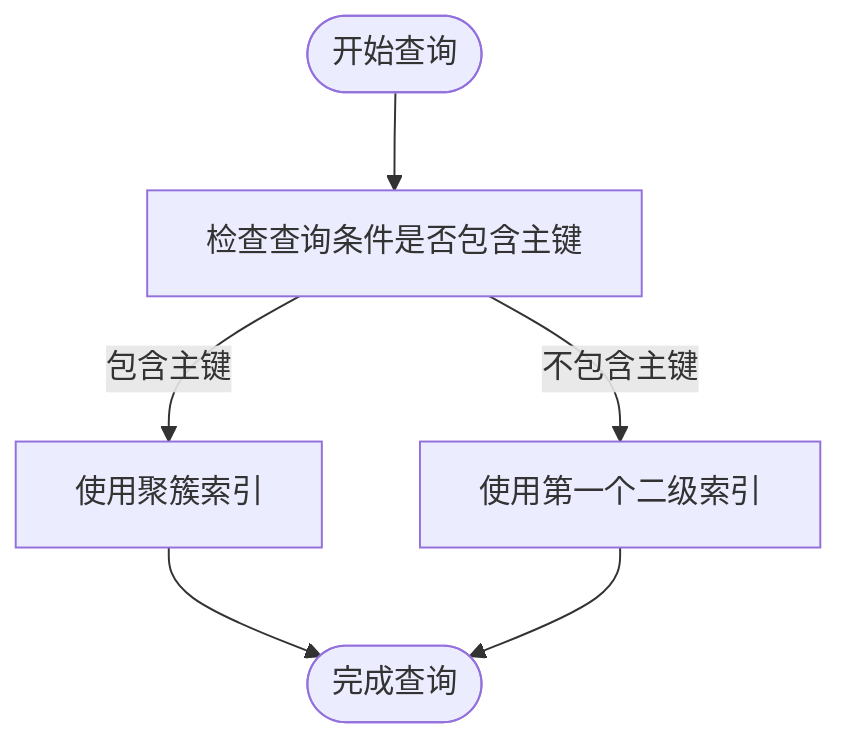

# 性能优化

<cite>
**本文档中引用的文件**
- [Optimizer.java](file://src/main/java/alchemystar/freedom/optimizer/Optimizer.java)
- [BPTree.java](file://src/main/java/alchemystar/freedom/index/bp/BPTree.java)
- [PagePool.java](file://src/main/java/alchemystar/freedom/store/page/PagePool.java)
- [Table.java](file://src/main/java/alchemystar/freedom/meta/Table.java)
- [TableFilter.java](file://src/main/java/alchemystar/freedom/sql/select/TableFilter.java)
- [SelectVisitor.java](file://src/main/java/alchemystar/freedom/sql/parser/SelectVisitor.java)
</cite>

## 目录
1. [引言](#引言)
2. [查询优化策略](#查询优化策略)
3. [B+树索引优化](#b+树索引优化)
4. [内存与I/O优化](#内存与i/o优化)
5. [未来优化方向](#未来优化方向)
6. [结论](#结论)

## 引言
本指南旨在深入分析Freedom数据库系统的性能优化机制，重点探讨查询优化、索引结构、内存管理和I/O操作等方面的优化策略。通过分析核心组件的实现逻辑，为开发者提供性能调优的最佳实践和未来改进方向。

## 查询优化策略

### 查询优化器实现
系统通过`Optimizer.java`实现基本的索引选择逻辑。优化器根据查询条件中的键值是否包含主键来决定使用聚簇索引还是二级索引。

**图示来源**
- [Optimizer.java](file://src/main/java/alchemystar/freedom/optimizer/Optimizer.java#L15-L34)

**本节来源**
- [Optimizer.java](file://src/main/java/alchemystar/freedom/optimizer/Optimizer.java#L15-L34)
- [Table.java](file://src/main/java/alchemystar/freedom/meta/Table.java#L40-L47)

### 执行计划生成
查询执行计划的生成主要在`TableFilter.java`中完成。系统通过解析WHERE条件来确定查询的上下界，从而优化B+树的扫描范围。

**图示来源**
- [TableFilter.java](file://src/main/java/alchemystar/freedom/sql/select/TableFilter.java#L100-L180)
- [SelectVisitor.java](file://src/main/java/alchemystar/freedom/sql/parser/SelectVisitor.java#L30-L50)

**本节来源**
- [TableFilter.java](file://src/main/java/alchemystar/freedom/sql/select/TableFilter.java#L100-L180)
- [SelectVisitor.java](file://src/main/java/alchemystar/freedom/sql/parser/SelectVisitor.java#L30-L50)

## B+树索引优化

### B+树结构与访问
系统采用B+树作为主要的索引结构，通过`BPTree.java`实现。B+树的叶子节点通过链表连接，支持高效的范围查询。

**图示来源**
- [BPTree.java](file://src/main/java/alchemystar/freedom/index/bp/BPTree.java#L30-L50)
- [BPNode.java](file://src/main/java/alchemystar/freedom/index/bp/BPNode.java)

**本节来源**
- [BPTree.java](file://src/main/java/alchemystar/freedom/index/bp/BPTree.java#L30-L50)
- [BPNode.java](file://src/main/java/alchemystar/freedom/index/bp/BPNode.java)

### 索引创建最佳实践
1. **主键索引**：系统自动为表创建聚簇索引，基于主键属性
2. **二级索引**：通过`CreateVisitor.java`中的`buildOneSecondIndex`方法创建
3. **复合索引**：支持多列组合的索引创建

**图示来源**
- [CreateVisitor.java](file://src/main/java/alchemystar/freedom/sql/parser/CreateVisitor.java#L58-L73)
- [Table.java](file://src/main/java/alchemystar/freedom/meta/Table.java#L85-L95)

**本节来源**
- [CreateVisitor.java](file://src/main/java/alchemystar/freedom/sql/parser/CreateVisitor.java#L58-L73)
- [Table.java](file://src/main/java/alchemystar/freedom/meta/Table.java#L85-L95)

## 内存与I/O优化

### 页池管理
`PagePool.java`实现了内存页的池化管理，通过对象复用减少GC压力。

**图示来源**
- [PagePool.java](file://src/main/java/alchemystar/freedom/store/page/PagePool.java#L15-L51)
- [PageFactory.java](file://src/main/java/alchemystar/freedom/store/page/PageFactory.java)
- [Page.java](file://src/main/java/alchemystar/freedom/store/page/Page.java)

**本节来源**
- [PagePool.java](file://src/main/java/alchemystar/freedom/store/page/PagePool.java#L15-L51)
- [PageFactory.java](file://src/main/java/alchemystar/freedom/store/page/PageFactory.java)
- [Page.java](file://src/main/java/alchemystar/freedom/store/page/Page.java)

### I/O优化策略
1. **延迟写入**：仅当页被标记为脏页时才进行写入操作
2. **批量刷新**：通过`flushToDisk`方法批量将索引数据写入磁盘
3. **元数据页**：使用固定的页号0存储B+树根节点信息

**图示来源**
- [BPTree.java](file://src/main/java/alchemystar/freedom/index/bp/BPTree.java#L250-L270)
- [PagePool.java](file://src/main/java/alchemystar/freedom/store/page/PagePool.java#L45-L51)

**本节来源**
- [BPTree.java](file://src/main/java/alchemystar/freedom/index/bp/BPTree.java#L250-L270)
- [PagePool.java](file://src/main/java/alchemystar/freedom/store/page/PagePool.java#L45-L51)

## 未来优化方向

### 索引选择优化
当前优化器仅支持简单的索引选择策略，未来可改进的方向包括：
- 基于统计信息的成本估算
- 多索引的组合使用
- 索引选择的动态调整

**本节来源**
- [Optimizer.java](file://src/main/java/alchemystar/freedom/optimizer/Optimizer.java#L25-L30)

### 执行计划缓存
建议实现执行计划缓存机制，避免重复解析相同查询。

**本节来源**
- [Table.java](file://src/main/java/alchemystar/freedom/meta/Table.java#L40-L47)
- [TableFilter.java](file://src/main/java/alchemystar/freedom/sql/select/TableFilter.java)

## 结论
Freedom数据库系统已经实现了基本的性能优化机制，包括B+树索引、页池管理和简单的查询优化。通过合理使用现有优化策略，可以显著提升系统性能。未来可通过引入更智能的优化器、执行计划缓存等高级特性进一步提升系统性能。