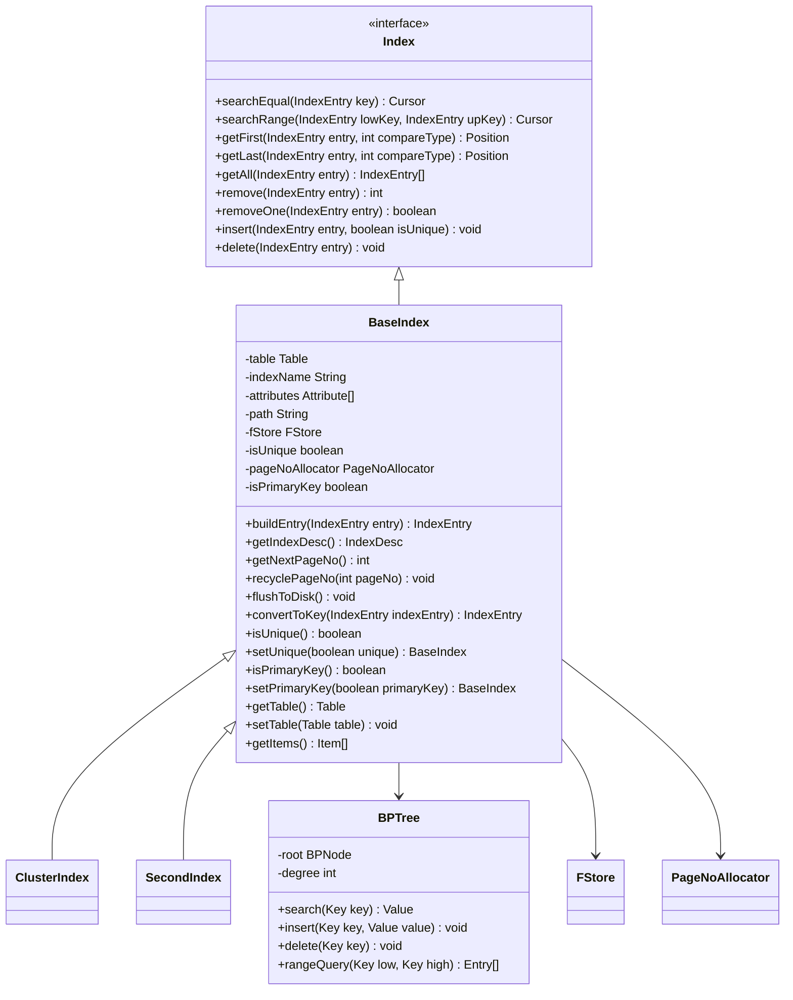

# 扩展与集成

<cite>
**本文档中引用的文件**  
- [ServerParse.java](file://src/main/java/alchemystar/freedom/engine/parser/ServerParse.java)
- [SqlExecutor.java](file://src/main/java/alchemystar/freedom/sql/SqlExecutor.java)
- [Database.java](file://src/main/java/alchemystar/freedom/engine/Database.java)
- [TrxManager.java](file://src/main/java/alchemystar/freedom/transaction/TrxManager.java)
- [BaseIndex.java](file://src/main/java/alchemystar/freedom/index/BaseIndex.java)
- [Index.java](file://src/main/java/alchemystar/freedom/index/Index.java)
- [Table.java](file://src/main/java/alchemystar/freedom/meta/Table.java)
- [FrontendConnection.java](file://src/main/java/alchemystar/freedom/engine/net/handler/frontend/FrontendConnection.java)
- [Session.java](file://src/main/java/alchemystar/freedom/engine/session/Session.java)
</cite>

## 目录
1. [简介](#简介)
2. [项目结构](#项目结构)
3. [核心组件](#核心组件)
4. [架构概述](#架构概述)
5. [详细组件分析](#详细组件分析)
6. [依赖分析](#依赖分析)
7. [性能考虑](#性能考虑)
8. [故障排除指南](#故障排除指南)
9. [结论](#结论)

## 简介
本文档旨在为开发者提供基于Freedom数据库系统的二次开发扩展与集成指南。内容涵盖如何扩展SQL语法支持、集成自定义存储后端、添加新的索引类型，以及与现有Java应用（如通过JDBC）的集成方式。同时，强调在扩展过程中必须遵守的核心组件约束，以确保功能的稳定性与一致性。

## 项目结构
Freedom项目采用典型的Java模块化结构，主要分为以下几个核心模块：
- `engine`：核心引擎，包含网络协议解析、会话管理、数据库实例等
- `sql`：SQL解析与执行模块，负责语句的解析与执行器调度
- `index`：索引管理模块，提供B+树索引的实现与扩展接口
- `meta`：元数据管理，包含表、属性、索引描述等
- `transaction`：事务管理模块，支持ACID特性
- `store`：存储层，负责数据的持久化与页管理

**Section sources**
- [ServerParse.java](file://src/main/java/alchemystar/freedom/engine/parser/ServerParse.java#L1-L450)
- [SqlExecutor.java](file://src/main/java/alchemystar/freedom/sql/SqlExecutor.java#L1-L51)
- [Database.java](file://src/main/java/alchemystar/freedom/engine/Database.java#L1-L79)

## 核心组件
Freedom的核心组件包括SQL解析器、执行引擎、数据库单例、事务管理器和索引系统。这些组件共同构成了数据库的核心功能，开发者在进行扩展时需要深入理解其交互机制。

**Section sources**
- [SqlExecutor.java](file://src/main/java/alchemystar/freedom/sql/SqlExecutor.java#L1-L51)
- [Database.java](file://src/main/java/alchemystar/freedom/engine/Database.java#L1-L79)
- [TrxManager.java](file://src/main/java/alchemystar/freedom/transaction/TrxManager.java#L1-L23)

## 架构概述
Freedom采用分层架构设计，从上至下分为网络层、解析层、执行层、事务层、存储层和索引层。各层之间通过清晰的接口进行通信，保证了系统的可扩展性和可维护性。

**Diagram sources**
- [ServerParse.java](file://src/main/java/alchemystar/freedom/engine/parser/ServerParse.java#L1-L450)
- [SqlExecutor.java](file://src/main/java/alchemystar/freedom/sql/SqlExecutor.java#L1-L51)
- [Table.java](file://src/main/java/alchemystar/freedom/meta/Table.java#L1-L172)

## 详细组件分析

### SQL语法扩展
要扩展SQL语法支持，主要涉及两个核心组件：`ServerParse`和`SqlExecutor`。

#### ServerParse扩展
`ServerParse`类负责初步的SQL语句类型识别。通过修改其`parse`方法，可以添加新的SQL命令类型。该类使用字符匹配的方式快速判断SQL语句类型，开发者可以参照现有模式添加新的解析逻辑。

**Diagram sources**
- [ServerParse.java](file://src/main/java/alchemystar/freedom/engine/parser/ServerParse.java#L1-L450)

#### SqlExecutor扩展
`SqlExecutor`是SQL执行的调度中心。要支持新的SQL语句，需要在`execute`方法中添加相应的执行器实例化逻辑。新的执行器应继承自`SqlExecutor`并实现具体的执行逻辑。

**Diagram sources**
- [SqlExecutor.java](file://src/main/java/alchemystar/freedom/sql/SqlExecutor.java#L1-L51)

### 自定义存储后端集成
Freedom的存储层通过`FStore`接口与上层解耦，允许集成自定义的存储后端。开发者需要实现`FStore`接口，并在`Table`和`BaseIndex`的构造过程中注入自定义的存储实例。

**Section sources**
- [FStore.java](file://src/main/java/alchemystar/freedom/store/fs/FStore.java)
- [Table.java](file://src/main/java/alchemystar/freedom/meta/Table.java#L1-L172)
- [BaseIndex.java](file://src/main/java/alchemystar/freedom/index/BaseIndex.java#L1-L182)

### 新索引类型添加
Freedom的索引系统基于`Index`接口设计，支持扩展新的索引类型。

#### 索引接口设计
`Index`接口定义了索引的基本操作，包括搜索、插入、删除等。新的索引类型需要实现此接口。

**Diagram sources**
- [Index.java](file://src/main/java/alchemystar/freedom/index/Index.java#L1-L35)
- [BaseIndex.java](file://src/main/java/alchemystar/freedom/index/BaseIndex.java#L1-L182)

### JDBC集成
Freedom通过实现MySQL协议支持JDBC连接。开发者可以通过标准的JDBC驱动连接Freedom数据库，执行SQL语句。

**Diagram sources**
- [FrontendConnection.java](file://src/main/java/alchemystar/freedom/engine/net/handler/frontend/FrontendConnection.java)
- [FrontendQueryHandler.java](file://src/main/java/alchemystar/freedom/engine/net/handler/frontend/FrontendQueryHandler.java#L1-L12)
- [SqlExecutor.java](file://src/main/java/alchemystar/freedom/sql/SqlExecutor.java#L1-L51)

## 依赖分析
Freedom各组件之间存在明确的依赖关系，扩展开发时必须注意这些依赖，避免破坏系统的稳定性。

**Diagram sources**
- [Database.java](file://src/main/java/alchemystar/freedom/engine/Database.java#L1-L79)
- [Table.java](file://src/main/java/alchemystar/freedom/meta/Table.java#L1-L172)
- [BaseIndex.java](file://src/main/java/alchemystar/freedom/index/BaseIndex.java#L1-L182)
- [SqlExecutor.java](file://src/main/java/alchemystar/freedom/sql/SqlExecutor.java#L1-L51)

## 性能考虑
在进行扩展开发时，需要考虑以下性能因素：
- 索引操作的复杂度，B+树的查找、插入、删除操作应保持O(log n)的时间复杂度
- 存储层的I/O性能，合理使用页缓存和预读机制
- 事务管理的开销，避免长时间持有锁
- SQL解析的效率，ServerParse采用字符匹配而非完整语法分析，保证了高性能

## 故障排除指南
在扩展开发过程中可能遇到的常见问题及解决方案：

**Section sources**
- [ServerParse.java](file://src/main/java/alchemystar/freedom/engine/parser/ServerParse.java#L1-L450)
- [SqlExecutor.java](file://src/main/java/alchemystar/freedom/sql/SqlExecutor.java#L1-L51)
- [Database.java](file://src/main/java/alchemystar/freedom/engine/Database.java#L1-L79)

## 结论
Freedom数据库系统提供了良好的扩展性，通过理解其核心组件和架构设计，开发者可以有效地进行二次开发。在扩展过程中，应特别注意数据库单例、事务管理器等核心组件的约束，确保扩展功能的稳定性和一致性。同时，遵循模块化设计原则，保持代码的可维护性和可测试性。