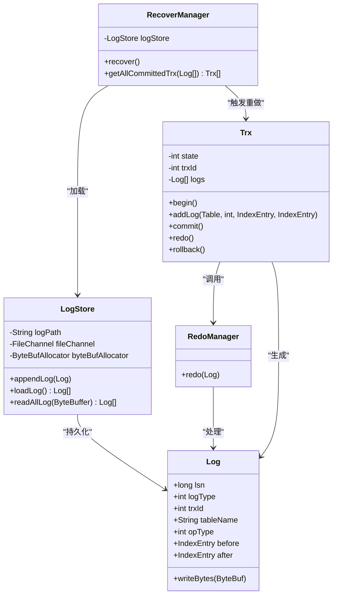
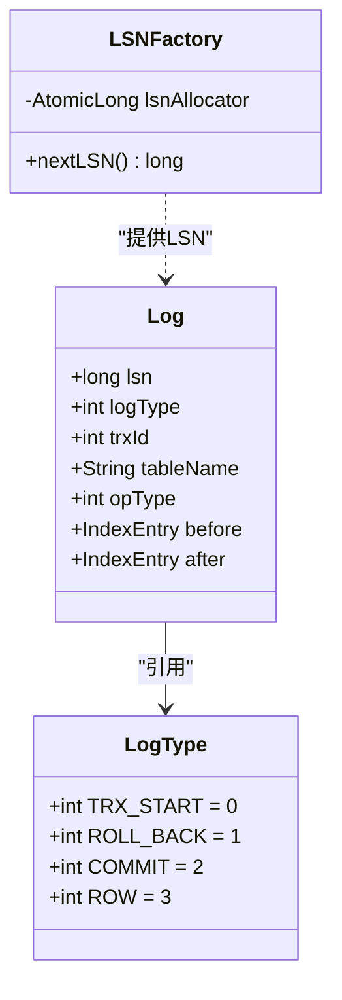
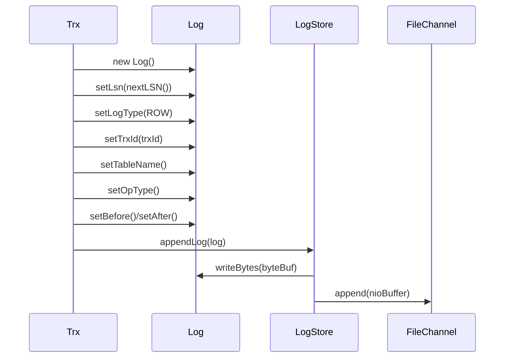
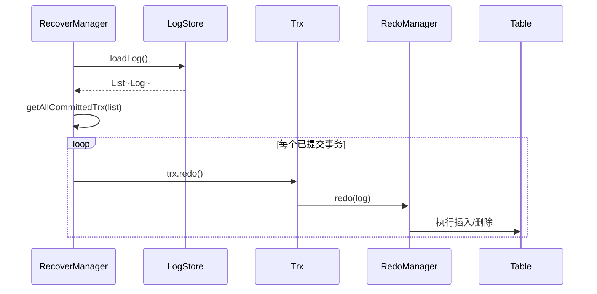
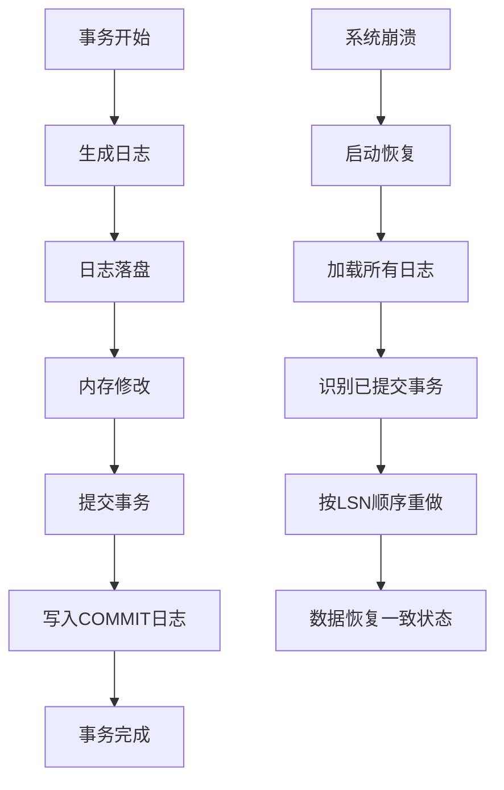
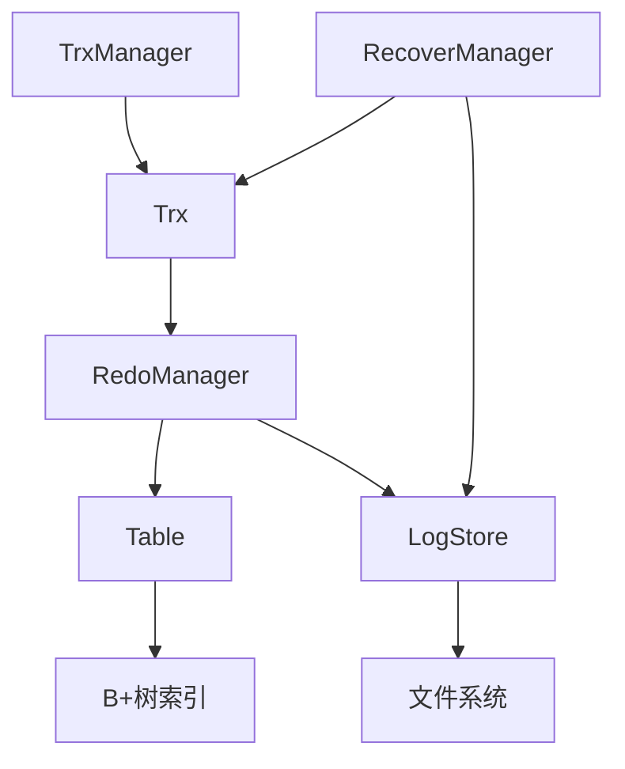

# Redo日志

<cite>
**本文档中引用的文件**  
- [RedoManager.java](file://src/main/java/alchemystar/freedom/transaction/redo/RedoManager.java)
- [Log.java](file://src/main/java/alchemystar/freedom/transaction/log/Log.java)
- [LogType.java](file://src/main/java/alchemystar/freedom/transaction/log/LogType.java)
- [LSNFactory.java](file://src/main/java/alchemystar/freedom/transaction/log/LSNFactory.java)
- [LogStore.java](file://src/main/java/alchemystar/freedom/store/log/LogStore.java)
- [Trx.java](file://src/main/java/alchemystar/freedom/transaction/Trx.java)
- [RecoverManager.java](file://src/main/java/alchemystar/freedom/recovery/RecoverManager.java)
</cite>

## 目录
1. [简介](#简介)
2. [Redo日志子系统架构](#redo日志子系统架构)
3. [Log对象结构设计](#log对象结构设计)
4. [Redo日志写入流程](#redo日志写入流程)
5. [崩溃恢复机制](#崩溃恢复机制)
6. [与WAL协议的契合性](#与wal协议的契合性)
7. [与其他模块的交互](#与其他模块的交互)
8. [日志刷盘策略与性能影响](#日志刷盘策略与性能影响)
9. [总结](#总结)

## 简介
Redo日志是数据库系统中确保数据持久性和崩溃恢复能力的核心机制。本系统通过RedoManager、Log、LogStore等组件协同工作，实现了基于预写式日志（WAL）协议的事务日志管理。Redo日志记录了事务对数据页的修改操作，在系统崩溃后可通过重放日志恢复已提交事务的变更，从而保证数据的一致性和持久性。

## Redo日志子系统架构
Redo日志子系统由多个关键组件构成，包括日志记录（Log）、日志管理器（RedoManager）、日志存储（LogStore）、事务对象（Trx）以及恢复管理器（RecoverManager）。这些组件协同工作，形成完整的日志生命周期管理。

**图示来源**  
- [Log.java](file://src/main/java/alchemystar/freedom/transaction/log/Log.java#L1-L150)
- [LogStore.java](file://src/main/java/alchemystar/freedom/store/log/LogStore.java#L1-L113)
- [RedoManager.java](file://src/main/java/alchemystar/freedom/transaction/redo/RedoManager.java#L1-L32)
- [Trx.java](file://src/main/java/alchemystar/freedom/transaction/Trx.java#L1-L119)
- [RecoverManager.java](file://src/main/java/alchemystar/freedom/recovery/RecoverManager.java#L1-L62)

**本节来源**  
- [Log.java](file://src/main/java/alchemystar/freedom/transaction/log/Log.java#L1-L150)
- [LogStore.java](file://src/main/java/alchemystar/freedom/store/log/LogStore.java#L1-L113)
- [RedoManager.java](file://src/main/java/alchemystar/freedom/transaction/redo/RedoManager.java#L1-L32)
- [Trx.java](file://src/main/java/alchemystar/freedom/transaction/Trx.java#L1-L119)
- [RecoverManager.java](file://src/main/java/alchemystar/freedom/recovery/RecoverManager.java#L1-L62)

## Log对象结构设计
Log对象是Redo日志的基本单元，封装了事务操作的关键信息。其核心字段包括：

- **lsn**：日志序列号（Log Sequence Number），由LSNFactory全局唯一分配，用于标识日志条目的顺序和幂等性。
- **logType**：日志类型，定义于LogType接口，包括TRX_START、ROLL_BACK、COMMIT、ROW四种类型，区分不同类型的日志记录。
- **trxId**：事务ID，标识该日志所属的事务。
- **tableName**：操作涉及的表名。
- **opType**：操作类型，如插入、删除、更新。
- **before/after**：操作前后的索引条目（IndexEntry），用于记录数据变更的前后状态。

**图示来源**  
- [Log.java](file://src/main/java/alchemystar/freedom/transaction/log/Log.java#L1-L150)
- [LogType.java](file://src/main/java/alchemystar/freedom/transaction/log/LogType.java#L1-L15)
- [LSNFactory.java](file://src/main/java/alchemystar/freedom/transaction/log/LSNFactory.java#L1-L15)

**本节来源**  
- [Log.java](file://src/main/java/alchemystar/freedom/transaction/log/Log.java#L1-L150)
- [LogType.java](file://src/main/java/alchemystar/freedom/transaction/log/LogType.java#L1-L15)
- [LSNFactory.java](file://src/main/java/alchemystar/freedom/transaction/log/LSNFactory.java#L1-L15)

## Redo日志写入流程
Redo日志的写入流程从事务操作开始，最终持久化到磁盘文件。完整路径如下：

1. 事务（Trx）执行数据操作（如插入、删除）时，调用`addLog`方法创建Log对象。
2. Log对象被写入内存缓冲区，并通过`LogStore.appendLog`方法立即写入磁盘文件。
3. 日志内容通过`writeBytes`方法序列化为字节流，写入FileChannel。

**图示来源**  
- [Trx.java](file://src/main/java/alchemystar/freedom/transaction/Trx.java#L39-L74)
- [Log.java](file://src/main/java/alchemystar/freedom/transaction/log/Log.java#L74-L118)
- [LogStore.java](file://src/main/java/alchemystar/freedom/store/log/LogStore.java#L53-L70)

**本节来源**  
- [Trx.java](file://src/main/java/alchemystar/freedom/transaction/Trx.java#L39-L74)
- [Log.java](file://src/main/java/alchemystar/freedom/transaction/log/Log.java#L74-L118)
- [LogStore.java](file://src/main/java/alchemystar/freedom/store/log/LogStore.java#L53-L70)

## 崩溃恢复机制
系统崩溃后，通过RecoverManager执行恢复流程：

1. 调用`LogStore.loadLog()`从磁盘加载所有日志。
2. `RecoverManager.getAllCommittedTrx()`解析日志流，重建已提交的事务对象。
3. 对每个已提交事务调用`Trx.redo()`方法，触发RedoManager重放日志。

**图示来源**  
- [RecoverManager.java](file://src/main/java/alchemystar/freedom/recovery/RecoverManager.java#L1-L62)
- [Trx.java](file://src/main/java/alchemystar/freedom/transaction/Trx.java#L76-L118)
- [RedoManager.java](file://src/main/java/alchemystar/freedom/transaction/redo/RedoManager.java#L1-L32)

**本节来源**  
- [RecoverManager.java](file://src/main/java/alchemystar/freedom/recovery/RecoverManager.java#L1-L62)
- [Trx.java](file://src/main/java/alchemystar/freedom/transaction/Trx.java#L76-L118)
- [RedoManager.java](file://src/main/java/alchemystar/freedom/transaction/redo/RedoManager.java#L1-L32)

## 与WAL协议的契合性
本系统的Redo日志机制完全符合预写式日志（Write-Ahead Logging, WAL）协议的核心原则：

1. **先写日志原则**：在`Trx.addLog`方法中，日志必须先通过`LogStore.appendLog`持久化到磁盘，然后才在内存中记录（`logs.add(log)`），确保日志先于数据页写入。
2. **原子性保证**：通过COMMIT日志标记事务提交，只有包含COMMIT日志的事务才会在恢复时被重做。
3. **持久性保障**：LSN序列号保证日志顺序，崩溃恢复时按LSN顺序重做，确保数据一致性。

**图示来源**  
- [Trx.java](file://src/main/java/alchemystar/freedom/transaction/Trx.java#L39-L74)
- [RecoverManager.java](file://src/main/java/alchemystar/freedom/recovery/RecoverManager.java#L1-L62)

**本节来源**  
- [Trx.java](file://src/main/java/alchemystar/freedom/transaction/Trx.java#L39-L74)
- [RecoverManager.java](file://src/main/java/alchemystar/freedom/recovery/RecoverManager.java#L1-L62)

## 与其他模块的交互
Redo日志子系统与存储层、B+树索引等模块紧密协作：

- **与存储层交互**：LogStore通过FileUtils与文件系统交互，实现日志的持久化存储。
- **与B+树交互**：RedoManager在重做时调用Table的insert/delete方法，直接操作B+树索引结构。
- **与事务管理器交互**：TrxManager负责创建事务对象，Trx对象持有日志列表并控制日志生命周期。

**图示来源**  
- [RedoManager.java](file://src/main/java/alchemystar/freedom/transaction/redo/RedoManager.java#L1-L32)
- [LogStore.java](file://src/main/java/alchemystar/freedom/store/log/LogStore.java#L1-L113)
- [Trx.java](file://src/main/java/alchemystar/freedom/transaction/Trx.java#L1-L119)
- [RecoverManager.java](file://src/main/java/alchemystar/freedom/recovery/RecoverManager.java#L1-L62)

**本节来源**  
- [RedoManager.java](file://src/main/java/alchemystar/freedom/transaction/redo/RedoManager.java#L1-L32)
- [LogStore.java](file://src/main/java/alchemystar/freedom/store/log/LogStore.java#L1-L113)
- [Trx.java](file://src/main/java/alchemystar/freedom/transaction/Trx.java#L1-L119)
- [RecoverManager.java](file://src/main/java/alchemystar/freedom/recovery/RecoverManager.java#L1-L62)

## 日志刷盘策略与性能影响
系统采用同步刷盘策略，在`appendLog`时立即调用`FileUtils.append`将日志写入文件通道。这种策略确保了最高的数据安全性，但可能带来性能开销：

- **优点**：每次日志写入都持久化，即使系统崩溃也不会丢失已提交事务。
- **缺点**：频繁的磁盘I/O可能成为性能瓶颈，特别是在高并发场景下。
- **优化方向**：可引入日志缓冲和批量刷盘机制，在安全性和性能之间取得平衡。

**本节来源**  
- [LogStore.java](file://src/main/java/alchemystar/freedom/store/log/LogStore.java#L53-L70)
- [FileUtils.java](file://src/main/java/alchemystar/freedom/store/fs/FileUtils.java)

## 总结
Redo日志子系统通过Log、LogStore、RedoManager、Trx和RecoverManager等组件的协同工作，实现了高效可靠的事务日志管理。系统严格遵循WAL协议，确保数据的持久性和一致性。日志结构设计合理，包含LSN、事务ID、操作类型等关键字段，支持精确的崩溃恢复。尽管当前采用同步刷盘策略保证安全性，未来可通过引入缓冲机制进一步优化性能。