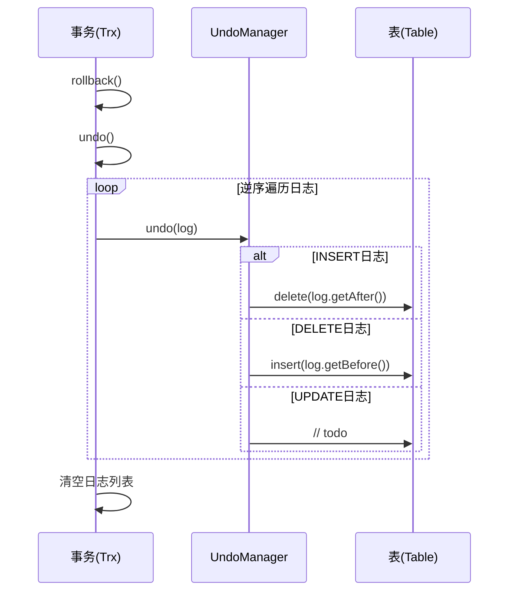
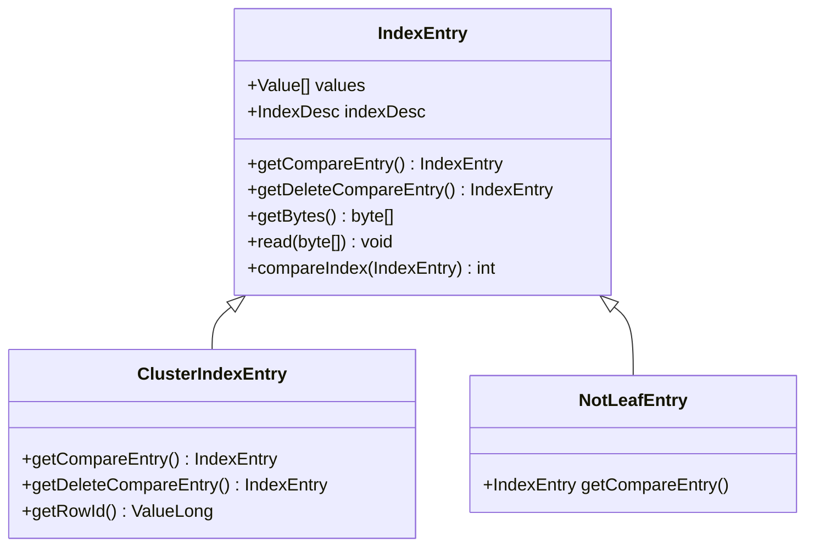
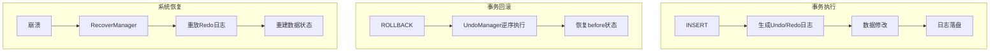

# Undo日志

<cite>
**本文档引用文件**  
- [UndoManager.java](file://src/main/java/alchemystar/freedom/transaction/undo/UndoManager.java)
- [Trx.java](file://src/main/java/alchemystar/freedom/transaction/Trx.java)
- [Log.java](file://src/main/java/alchemystar/freedom/transaction/log/Log.java)
- [ClusterIndexEntry.java](file://src/main/java/alchemystar/freedom/meta/ClusterIndexEntry.java)
- [IndexEntry.java](file://src/main/java/alchemystar/freedom/meta/IndexEntry.java)
- [Table.java](file://src/main/java/alchemystar/freedom/meta/Table.java)
- [RedoManager.java](file://src/main/java/alchemystar/freedom/transaction/redo/RedoManager.java)
- [OpType.java](file://src/main/java/alchemystar/freedom/transaction/OpType.java)
- [LogType.java](file://src/main/java/alchemystar/freedom/transaction/log/LogType.java)
- [TableManager.java](file://src/main/java/alchemystar/freedom/meta/TableManager.java)
</cite>

## 目录
1. [引言](#引言)
2. [核心组件分析](#核心组件分析)
3. [Undo日志的生成与结构](#undo日志的生成与结构)
4. [回滚机制实现](#回滚机制实现)
5. [索引变更的回滚处理](#索引变更的回滚处理)
6. [Undo与Redo日志的协同机制](#undo与redo日志的协同机制)
7. [MVCC实现路径探讨](#mvcc实现路径探讨)
8. [结论](#结论)

## 引言
Undo日志是数据库事务系统中保障原子性的关键机制。在事务执行过程中，任何对数据的修改操作都会被记录为Undo日志，以便在事务回滚时能够恢复到事务开始前的状态。本文档以`UndoManager`为核心，深入解析该系统中Undo日志的实现原理、作用机制及其与索引、事务管理的协同工作方式。

## 核心组件分析

`UndoManager`是事务回滚操作的核心执行者，负责根据日志内容逆向执行数据修改。`Trx`类代表一个事务实例，维护事务状态和日志列表。`Log`类封装了日志的元数据和操作前后数据镜像。`IndexEntry`和`ClusterIndexEntry`是索引元组的抽象，用于表示数据行。`Table`类提供数据表的CRUD接口。`RedoManager`负责重做操作，与UndoManager形成日志协同机制。

**本节来源**  
- [UndoManager.java](file://src/main/java/alchemystar/freedom/transaction/undo/UndoManager.java#L1-L45)
- [Trx.java](file://src/main/java/alchemystar/freedom/transaction/Trx.java#L1-L120)
- [Log.java](file://src/main/java/alchemystar/freedom/transaction/log/Log.java#L1-L151)
- [IndexEntry.java](file://src/main/java/alchemystar/freedom/meta/IndexEntry.java#L1-L182)
- [Table.java](file://src/main/java/alchemystar/freedom/meta/Table.java#L1-L173)

## Undo日志的生成与结构

Undo日志在事务执行数据修改操作时生成。当执行INSERT、UPDATE或DELETE操作时，`Trx`类的`addLog`方法会被调用，创建一个`Log`实例并记录操作类型、表名以及操作前后的数据状态（before image和after image）。日志类型由`LogType`接口定义，包括`TRX_START`、`ROLL_BACK`、`COMMIT`和`ROW`。操作类型由`OpType`接口定义，包括`insert`、`update`和`delete`。

日志结构包含以下关键字段：
- `lsn`：日志序列号，用于保证幂等性
- `logType`：日志类型
- `trxId`：事务ID
- `tableName`：表名
- `opType`：操作类型
- `before`：操作前的数据状态（旧值）
- `after`：操作后的数据状态（新值）

日志生成后，会通过`Database`实例的`LogStore`持久化到磁盘，同时保留在事务的内存日志列表中，以便快速执行回滚。

**本节来源**  
- [Trx.java](file://src/main/java/alchemystar/freedom/transaction/Trx.java#L50-L85)
- [Log.java](file://src/main/java/alchemystar/freedom/transaction/log/Log.java#L1-L151)
- [OpType.java](file://src/main/java/alchemystar/freedom/transaction/OpType.java#L1-L14)
- [LogType.java](file://src/main/java/alchemystar/freedom/transaction/log/LogType.java#L1-L16)

## 回滚机制实现

当事务收到ROLLBACK指令时，`Trx`类的`rollback`方法被调用。该方法首先调用`undo`方法执行回滚操作，然后将事务状态重置为未开始，并清空内存中的日志列表。

`undo`方法的核心逻辑是**逆序遍历**事务日志列表，对每条日志调用`UndoManager.undo`方法。逆序执行确保了操作的原子性，即所有修改按与执行时相反的顺序撤销。

`UndoManager.undo`方法根据日志的操作类型分发处理：
- 对于`INSERT`操作，执行`undoInsert`，即删除`after`字段记录的新数据
- 对于`DELETE`操作，执行`undoDelete`，即重新插入`before`字段记录的旧数据
- 对于`UPDATE`操作，目前实现为待办（todo），但逻辑上应是将数据恢复为`before`状态

**图示来源**  
- [Trx.java](file://src/main/java/alchemystar/freedom/transaction/Trx.java#L100-L115)
- [UndoManager.java](file://src/main/java/alchemystar/freedom/transaction/undo/UndoManager.java#L1-L45)

## 索引变更的回滚处理

在处理索引变更的回滚时，系统通过`IndexEntry`及其子类`ClusterIndexEntry`来管理索引元组。`IndexEntry`是索引元组的基本抽象，包含值数组`values`和索引描述`indexDesc`。`ClusterIndexEntry`是聚簇索引项，其主键值通过`getRowId`方法获取。

当执行回滚操作时，`Table`类的`insert`和`delete`方法会同时操作聚簇索引和二级索引。例如，在`undoDelete`中，调用`table.insert(log.getBefore())`会：
1. 将数据重新插入聚簇索引
2. 遍历所有二级索引，将数据重新插入

这种设计确保了索引的一致性。`IndexEntry`的`getCompareEntry`方法用于构建比较键，在B+树索引的查找和删除操作中起关键作用。

**图示来源**  
- [IndexEntry.java](file://src/main/java/alchemystar/freedom/meta/IndexEntry.java#L1-L182)
- [ClusterIndexEntry.java](file://src/main/java/alchemystar/freedom/meta/ClusterIndexEntry.java#L1-L37)
- [Table.java](file://src/main/java/alchemystar/freedom/meta/Table.java#L1-L173)

## Undo与Redo日志的协同机制

Undo日志与Redo日志在事务系统中协同工作，共同保障数据的持久性和一致性。`RedoManager`负责在系统恢复时重做已提交事务的操作。

`RedoManager.redo`方法的逻辑与`UndoManager.undo`对称：
- 对于`INSERT`操作，重新插入`after`字段的数据
- 对于`DELETE`操作，删除`before`字段的数据
- 对于`UPDATE`操作，目前为待办

在`Trx`类的`redo`方法中，事务会遍历其日志列表，对每条`ROW`类型日志调用`RedoManager.redo`。这种设计使得系统在崩溃恢复时能够重建内存状态。

协同机制的关键在于日志的持久化顺序和事务状态管理。`begin`、`commit`和`rollback`操作都会生成特定类型的日志并立即落盘，确保恢复时能够准确判断事务的最终状态。

**图示来源**  
- [RedoManager.java](file://src/main/java/alchemystar/freedom/transaction/redo/RedoManager.java#L1-L32)
- [Trx.java](file://src/main/java/alchemystar/freedom/transaction/Trx.java#L90-L95)
- [UndoManager.java](file://src/main/java/alchemystar/freedom/transaction/undo/UndoManager.java#L1-L45)

## MVCC实现路径探讨

当前实现为单版本系统，但通过扩展Undo日志机制，可实现MVCC（多版本并发控制）。潜在的实现路径包括：

1. **版本链构建**：每个`IndexEntry`可维护一个指向旧版本的指针，形成版本链。Undo日志中的`before`字段可作为旧版本数据。
2. **事务快照**：在事务开始时记录全局LSN，读取时根据LSN判断版本可见性。
3. **垃圾回收**：通过后台线程清理不再被任何事务引用的旧版本数据。

具体实现可在`IndexEntry`中增加版本号和前向指针字段，并修改`Table`的读取逻辑，使其根据事务的隔离级别和快照LSN选择合适的版本。

虽然当前代码未实现MVCC，但`Log`类中完整的前后镜像记录为MVCC提供了良好的基础。

**本节来源**  
- [Log.java](file://src/main/java/alchemystar/freedom/transaction/log/Log.java#L1-L151)
- [IndexEntry.java](file://src/main/java/alchemystar/freedom/meta/IndexEntry.java#L1-L182)
- [Trx.java](file://src/main/java/alchemystar/freedom/transaction/Trx.java#L1-L120)

## 结论
Undo日志机制通过记录操作前的数据状态（before image），在事务回滚时逆向执行操作，有效保障了事务的原子性。`UndoManager`作为核心组件，与`Trx`、`Log`、`Table`等类协同工作，实现了高效的回滚功能。系统通过`IndexEntry`和`ClusterIndexEntry`统一处理索引变更的回滚。当前实现已具备Undo/Redo协同的基础，为未来实现MVCC等高级特性提供了良好的扩展性。