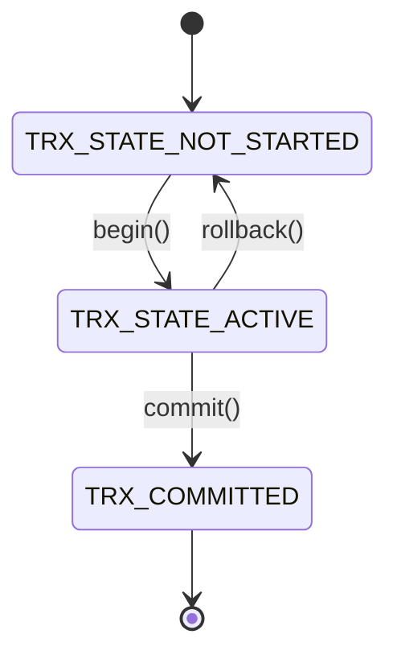
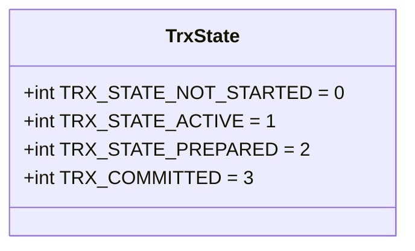
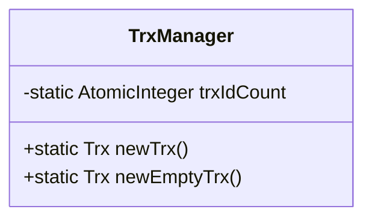
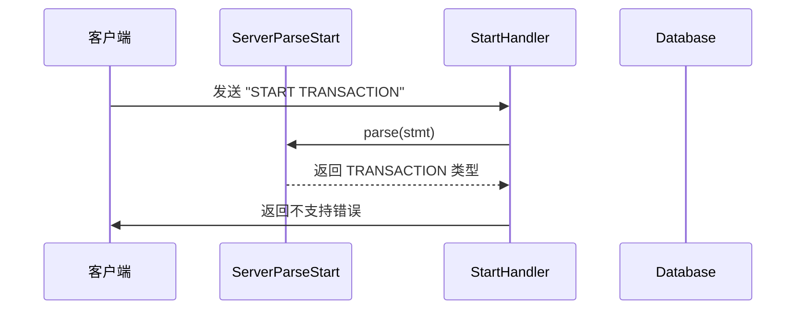
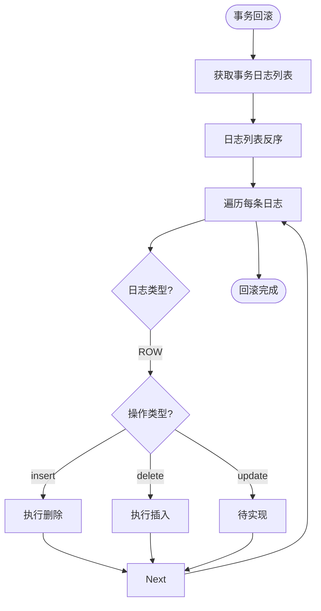

# 事务模型

<cite>
**本文档引用的文件**  
- [Trx.java](file://src/main/java/alchemystar/freedom/transaction/Trx.java)
- [TrxState.java](file://src/main/java/alchemystar/freedom/transaction/TrxState.java)
- [TrxManager.java](file://src/main/java/alchemystar/freedom/transaction/TrxManager.java)
- [ServerParseStart.java](file://src/main/java/alchemystar/freedom/engine/parser/ServerParseStart.java)
- [StartHandler.java](file://src/main/java/alchemystar/freedom/engine/net/handler/frontend/StartHandler.java)
- [Log.java](file://src/main/java/alchemystar/freedom/transaction/log/Log.java)
- [LogStore.java](file://src/main/java/alchemystar/freedom/store/log/LogStore.java)
- [UndoManager.java](file://src/main/java/alchemystar/freedom/transaction/undo/UndoManager.java)
- [RedoManager.java](file://src/main/java/alchemystar/freedom/transaction/redo/RedoManager.java)
- [Database.java](file://src/main/java/alchemystar/freedom/engine/Database.java)
</cite>

## 目录
1. [引言](#引言)
2. [事务生命周期管理](#事务生命周期管理)
3. [事务状态模型](#事务状态模型)
4. [事务ID生成与事务工厂](#事务id生成与事务工厂)
5. [SQL语法解析与事务初始化](#sql语法解析与事务初始化)
6. [事务日志机制](#事务日志机制)
7. [回滚与重做机制](#回滚与重做机制)
8. [并发控制与扩展性分析](#并发控制与扩展性分析)
9. [总结](#总结)

## 引言
本文深入解析Freedom数据库系统中事务模型的实现机制，以`Trx`类为核心，详细阐述事务的创建、开启、提交与回滚等状态转换过程。结合事务状态接口、事务管理器、日志系统及SQL解析模块，全面揭示事务控制的内部流程与设计逻辑。

## 事务生命周期管理

事务的生命周期由`Trx`类管理，包含四个核心阶段：创建、开启（begin）、提交（commit）和回滚（rollback）。事务初始状态为“未开始”，通过调用`begin()`方法进入“进行中”状态，最终通过`commit()`或`rollback()`完成状态终结。

- **创建**：由`TrxManager`通过工厂方法生成新事务实例。
- **开启**：调用`begin()`方法，记录事务开始日志并更新状态。
- **提交**：调用`commit()`方法，记录提交日志，释放事务资源。
- **回滚**：调用`rollback()`方法，触发反向回滚操作，恢复数据一致性。

**Diagram sources**  
- [Trx.java](file://src/main/java/alchemystar/freedom/transaction/Trx.java#L15-L30)
- [TrxState.java](file://src/main/java/alchemystar/freedom/transaction/TrxState.java#L5-L15)

**Section sources**  
- [Trx.java](file://src/main/java/alchemystar/freedom/transaction/Trx.java#L1-L119)

## 事务状态模型

事务状态由`TrxState`接口定义，采用整型常量表示不同状态，确保状态转换的清晰与可维护性：

- `TRX_STATE_NOT_STARTED`（0）：事务尚未开始，初始状态。
- `TRX_STATE_ACTIVE`（1）：事务已开启，处于执行中。
- `TRX_COMMITTED`（3）：事务已成功提交。

当前实现未启用两阶段提交（2PC）相关状态（如`TRX_STATE_PREPARED`），表明系统目前支持本地事务而非分布式事务。

**Diagram sources**  
- [TrxState.java](file://src/main/java/alchemystar/freedom/transaction/TrxState.java#L5-L18)

**Section sources**  
- [TrxState.java](file://src/main/java/alchemystar/freedom/transaction/TrxState.java#L1-L18)

## 事务ID生成与事务工厂

`TrxManager`类负责事务实例的创建与事务ID的全局唯一性保障。其核心机制如下：

- 使用`AtomicInteger`作为计数器，确保多线程环境下ID生成的原子性。
- 初始值为1，每次递增获取新ID，避免重复。
- 提供`newTrx()`工厂方法，自动分配ID并返回初始化事务对象。

该设计简洁高效，适用于单机环境下的事务ID管理，但在分布式场景下需引入全局ID服务（如Snowflake算法）进行扩展。

**Diagram sources**  
- [TrxManager.java](file://src/main/java/alchemystar/freedom/transaction/TrxManager.java#L5-L15)

**Section sources**  
- [TrxManager.java](file://src/main/java/alchemystar/freedom/transaction/TrxManager.java#L1-L22)

## SQL语法解析与事务初始化

事务的初始化由SQL语句`START TRANSACTION`触发，其解析流程如下：

1. **语法识别**：`ServerParseStart.java`通过字符匹配识别`START TRANSACTION`关键字。
2. **命令分发**：`StartHandler.java`接收到解析结果后，若为`TRANSACTION`类型，则返回“不支持”错误（当前未实现）。
3. **执行代理**：其他情况交由默认执行器处理。

当前实现中，`START TRANSACTION`语句虽能被识别，但实际处理逻辑尚未完成，仅返回错误提示，表明事务功能处于部分实现状态。

**Diagram sources**  
- [ServerParseStart.java](file://src/main/java/alchemystar/freedom/engine/parser/ServerParseStart.java#L1-L57)
- [StartHandler.java](file://src/main/java/alchemystar/freedom/engine/net/handler/frontend/StartHandler.java#L1-L25)

**Section sources**  
- [ServerParseStart.java](file://src/main/java/alchemystar/freedom/engine/parser/ServerParseStart.java#L1-L57)
- [StartHandler.java](file://src/main/java/alchemystar/freedom/engine/net/handler/frontend/StartHandler.java#L1-L25)

## 事务日志机制

事务日志（Log）是实现ACID特性的核心组件，其结构包含：

- **LSN**（日志序列号）：由`LSNFactory`生成，保证日志顺序性。
- **TrxId**：关联所属事务。
- **LogType**：区分事务控制日志（如开始、提交）与数据变更日志（ROW）。
- **Before/After**：记录操作前后数据状态，用于回滚与重做。

日志通过`LogStore`持久化到文件系统，确保崩溃恢复能力。每次日志写入均立即落盘，防止数据丢失。

**Section sources**  
- [Log.java](file://src/main/java/alchemystar/freedom/transaction/log/Log.java#L1-L150)
- [LogStore.java](file://src/main/java/alchemystar/freedom/store/log/LogStore.java#L1-L113)

## 回滚与重做机制

### 回滚（Undo）
- 由`UndoManager`实现，按日志逆序执行。
- `insert`操作回滚为`delete`，`delete`操作回滚为`insert`。
- `update`操作暂未实现。

### 重做（Redo）
- 由`RedoManager`实现，用于崩溃恢复。
- 重放所有已提交事务的日志，确保持久性。

**Diagram sources**  
- [UndoManager.java](file://src/main/java/alchemystar/freedom/transaction/undo/UndoManager.java#L1-L45)
- [RedoManager.java](file://src/main/java/alchemystar/freedom/transaction/redo/RedoManager.java#L1-L32)

**Section sources**  
- [UndoManager.java](file://src/main/java/alchemystar/freedom/transaction/undo/UndoManager.java#L1-L45)
- [RedoManager.java](file://src/main/java/alchemystar/freedom/transaction/redo/RedoManager.java#L1-L32)

## 并发控制与扩展性分析

当前事务模型未显式实现并发控制机制（如锁管理或多版本并发控制MVCC），主要体现在：

- 无行级或表级锁的申请与释放逻辑。
- 无隔离级别（READ UNCOMMITTED, REPEATABLE READ等）的配置与处理。
- `START TRANSACTION`语句未真正开启事务上下文。

**扩展可能性**：
1. **引入锁管理器**：在`Trx`中维护锁列表，支持行锁与表锁。
2. **支持MVCC**：通过版本号实现非阻塞读。
3. **完善2PC**：启用`TRX_STATE_PREPARED`状态，支持分布式事务。
4. **增强SQL支持**：完整实现`BEGIN`、`COMMIT`、`ROLLBACK`等语句。

**Section sources**  
- [Trx.java](file://src/main/java/alchemystar/freedom/transaction/Trx.java#L1-L119)
- [Database.java](file://src/main/java/alchemystar/freedom/engine/Database.java#L1-L78)

## 总结

Freedom数据库的事务模型以`Trx`为核心，通过状态机管理生命周期，利用日志实现持久性与原子性。`TrxManager`确保事务ID的唯一性，而`UndoManager`与`RedoManager`保障数据一致性。尽管当前`START TRANSACTION`语法已可识别，但实际事务控制逻辑尚未完全启用，且缺乏并发控制机制。未来可通过引入锁机制、MVCC及完善分布式事务支持，进一步提升系统的事务处理能力。