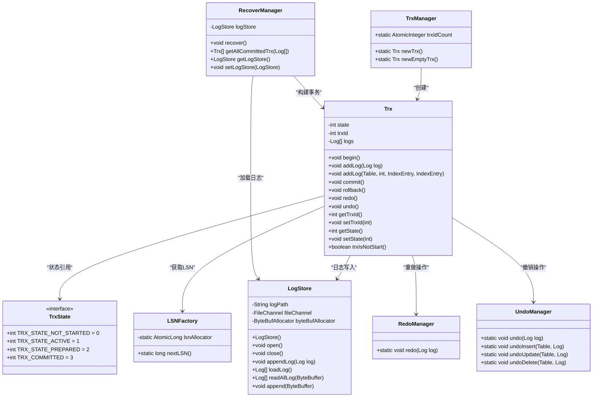
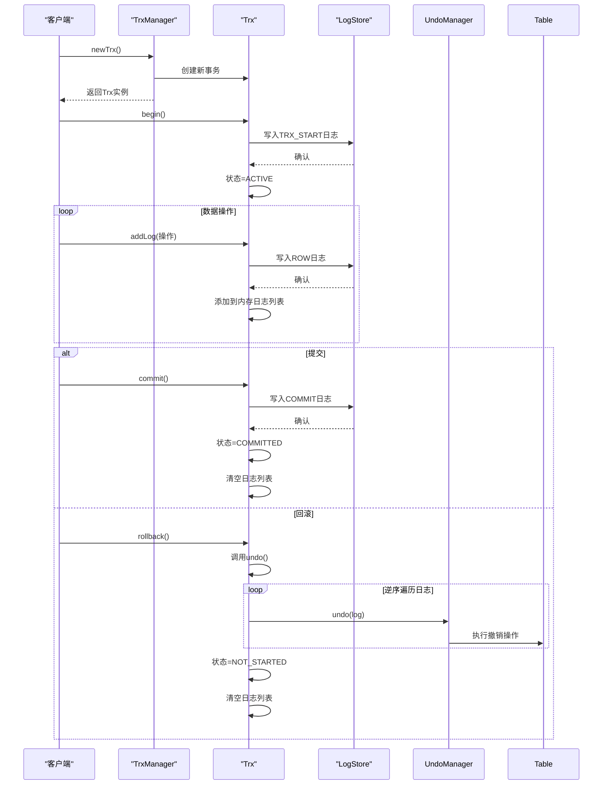
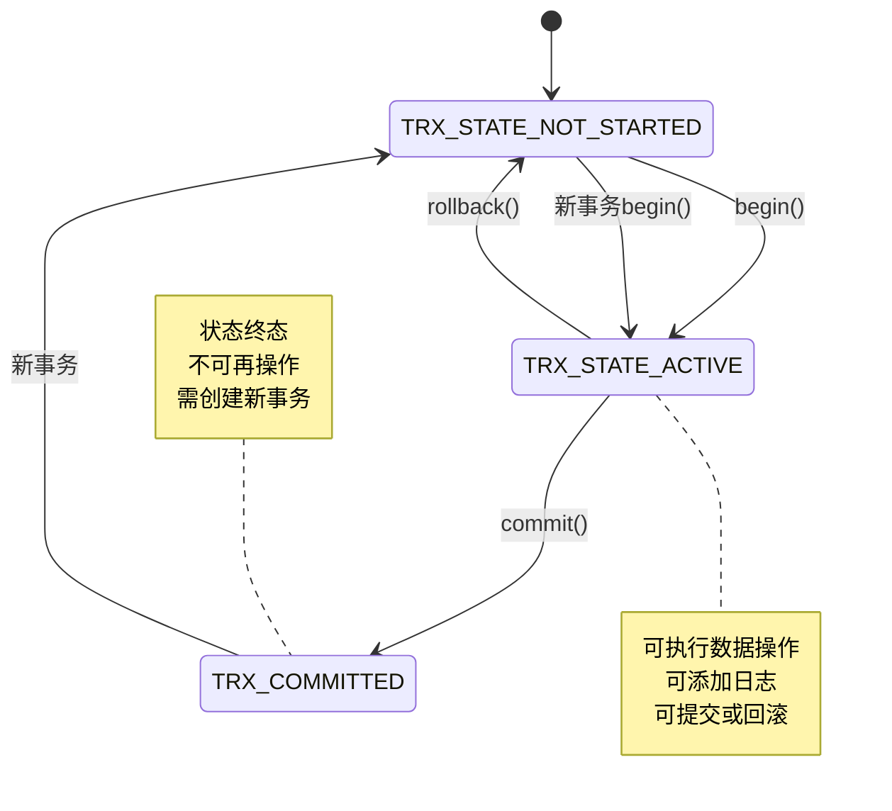
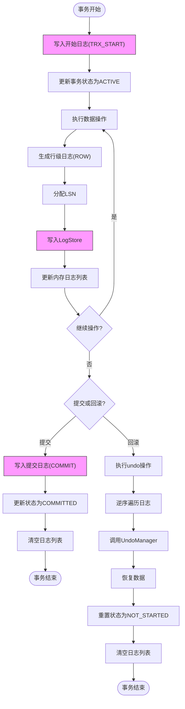

# 事务管理

<cite>
**本文档中引用的文件**  
- [TrxManager.java](file://src/main/java/alchemystar/freedom/transaction/TrxManager.java)
- [Trx.java](file://src/main/java/alchemystar/freedom/transaction/Trx.java)
- [TrxState.java](file://src/main/java/alchemystar/freedom/transaction/TrxState.java)
- [LogStore.java](file://src/main/java/alchemystar/freedom/store/log/LogStore.java)
- [LSNFactory.java](file://src/main/java/alchemystar/freedom/transaction/log/LSNFactory.java)
- [RecoverManager.java](file://src/main/java/alchemystar/freedom/recovery/RecoverManager.java)
- [RedoManager.java](file://src/main/java/alchemystar/freedom/transaction/redo/RedoManager.java)
- [UndoManager.java](file://src/main/java/alchemystar/freedom/transaction/undo/UndoManager.java)
- [Log.java](file://src/main/java/alchemystar/freedom/transaction/log/Log.java)
- [Isolations.java](file://src/main/java/alchemystar/freedom/engine/net/proto/util/Isolations.java)
</cite>

## 目录
1. [引言](#引言)
2. [事务管理核心组件](#事务管理核心组件)
3. [事务生命周期管理](#事务生命周期管理)
4. [事务状态转换机制](#事务状态转换机制)
5. [日志系统与WAL协议](#日志系统与wal协议)
6. [LSN与检查点机制](#lsn与检查点机制)
7. [恢复流程分析](#恢复流程分析)
8. [事务隔离级别支持](#事务隔离级别支持)
9. [两阶段提交扩展路径](#两阶段提交扩展路径)
10. [死锁与超时处理](#死锁与超时处理)
11. [总结](#总结)

## 引言
事务管理子系统是数据库系统的核心组件之一，负责确保数据操作的ACID（原子性、一致性、隔离性、持久性）特性。本文档深入解析以TrxManager为核心的事务管理机制，详细说明事务的创建、提交、回滚生命周期，以及redo/undo日志、WAL协议、LSN分配等关键技术的实现原理。

## 事务管理核心组件

事务管理子系统由多个核心组件构成，包括事务管理器（TrxManager）、事务对象（Trx）、日志存储（LogStore）、恢复管理器（RecoverManager）等。这些组件协同工作，共同实现完整的事务处理能力。



**图示来源**  
- [TrxManager.java](file://src/main/java/alchemystar/freedom/transaction/TrxManager.java)
- [Trx.java](file://src/main/java/alchemystar/freedom/transaction/Trx.java)
- [TrxState.java](file://src/main/java/alchemystar/freedom/transaction/TrxState.java)
- [LogStore.java](file://src/main/java/alchemystar/freedom/store/log/LogStore.java)
- [LSNFactory.java](file://src/main/java/alchemystar/freedom/transaction/log/LSNFactory.java)
- [RecoverManager.java](file://src/main/java/alchemystar/freedom/recovery/RecoverManager.java)
- [RedoManager.java](file://src/main/java/alchemystar/freedom/transaction/redo/RedoManager.java)
- [UndoManager.java](file://src/main/java/alchemystar/freedom/transaction/undo/UndoManager.java)

**本节来源**  
- [TrxManager.java](file://src/main/java/alchemystar/freedom/transaction/TrxManager.java#L1-L22)
- [Trx.java](file://src/main/java/alchemystar/freedom/transaction/Trx.java#L1-L119)
- [TrxState.java](file://src/main/java/alchemystar/freedom/transaction/TrxState.java#L1-L18)

## 事务生命周期管理

事务的生命周期由TrxManager统一管理，通过newTrx()方法创建新事务实例，并分配唯一事务ID。事务的典型生命周期包括开始（begin）、执行操作、提交（commit）或回滚（rollback）三个阶段。

当调用Trx.begin()方法时，系统会生成一条事务开始日志（TRX_START），并将其持久化到日志文件中，同时将事务状态从TRX_STATE_NOT_STARTED转变为TRX_STATE_ACTIVE。事务在执行过程中产生的所有数据变更都会被记录为行级日志（ROW log）。

事务提交时，会生成一条提交日志（COMMIT），并将其写入日志文件，确保持久性。提交后事务状态变为TRX_COMMITTED，内存中的日志列表会被清空，因为此时所有变更已经持久化，不再需要用于回滚。

事务回滚时，系统会调用undo()方法，按照日志的逆序执行撤销操作，恢复数据到事务开始前的状态。回滚完成后，事务状态重置为TRX_STATE_NOT_STARTED，日志列表同样被清空。



**图示来源**  
- [TrxManager.java](file://src/main/java/alchemystar/freedom/transaction/TrxManager.java#L1-L22)
- [Trx.java](file://src/main/java/alchemystar/freedom/transaction/Trx.java#L1-L119)
- [LogStore.java](file://src/main/java/alchemystar/freedom/store/log/LogStore.java#L1-L113)

**本节来源**  
- [TrxManager.java](file://src/main/java/alchemystar/freedom/transaction/TrxManager.java#L1-L22)
- [Trx.java](file://src/main/java/alchemystar/freedom/transaction/Trx.java#L1-L119)

## 事务状态转换机制

事务状态由TrxState接口定义，采用整型常量表示不同状态。事务的状态转换遵循严格的规则，确保事务处理的正确性和一致性。



事务初始状态为TRX_STATE_NOT_STARTED（0），表示事务尚未开始。调用begin()方法后，事务进入TRX_STATE_ACTIVE（1）状态，可以执行各种数据操作并记录日志。在此状态下，事务可以选择提交或回滚。

提交操作会将事务状态转换为TRX_COMMITTED（3），这是一个终态，表示事务已成功完成且所有变更已持久化。回滚操作会将事务状态重置为TRX_STATE_NOT_STARTED，表示事务已取消，数据恢复到初始状态。

值得注意的是，系统预留了TRX_STATE_PREPARED（2）状态，为未来支持两阶段提交（2PC/XA）协议做准备，目前尚未使用。

**图示来源**  
- [TrxState.java](file://src/main/java/alchemystar/freedom/transaction/TrxState.java#L1-L18)
- [Trx.java](file://src/main/java/alchemystar/freedom/transaction/Trx.java#L1-L119)

**本节来源**  
- [TrxState.java](file://src/main/java/alchemystar/freedom/transaction/TrxState.java#L1-L18)
- [Trx.java](file://src/main/java/alchemystar/freedom/transaction/Trx.java#L1-L119)

## 日志系统与WAL协议

日志系统是实现事务持久性和原子性的关键，采用Write-Ahead Logging（WAL）协议。所有数据变更必须先写入日志，然后才能应用到数据文件，确保在系统崩溃时能够通过日志恢复数据。

LogStore组件负责日志的持久化存储，将日志记录追加写入指定的日志文件。日志记录包括LSN（日志序列号）、事务ID、日志类型、操作类型以及变更前后的数据等信息。



**图示来源**  
- [LogStore.java](file://src/main/java/alchemystar/freedom/store/log/LogStore.java#L1-L113)
- [Trx.java](file://src/main/java/alchemystar/freedom/transaction/Trx.java#L1-L119)
- [LSNFactory.java](file://src/main/java/alchemystar/freedom/transaction/log/LSNFactory.java#L1-L15)

**本节来源**  
- [LogStore.java](file://src/main/java/alchemystar/freedom/store/log/LogStore.java#L1-L113)
- [Trx.java](file://src/main/java/alchemystar/freedom/transaction/Trx.java#L1-L119)
- [LSNFactory.java](file://src/main/java/alchemystar/freedom/transaction/log/LSNFactory.java#L1-L15)

## LSN与检查点机制

LSN（Log Sequence Number，日志序列号）是日志记录的唯一标识，采用单调递增的方式分配，确保日志的顺序性。LSNFactory使用AtomicLong实现线程安全的LSN分配，保证全局唯一性和顺序性。

```mermaid
classDiagram
class LSNFactory {
-static AtomicLong lsnAllocator
+static long nextLSN()
}
class Log {
-long lsn
-int trxId
-int logType
-int opType
-String tableName
-IndexEntry before
-IndexEntry after
+void setLsn(long)
+long getLsn()
+void writeBytes(ByteBuf)
}
LSNFactory --> Log : "分配LSN"
LogStore --> Log : "序列化写入"
note right of LSNFactory
全局单调递增
线程安全分配
崩溃后继续递增
end note
```

**图示来源**  
- [LSNFactory.java](file://src/main/java/alchemystar/freedom/transaction/log/LSNFactory.java#L1-L15)
- [Log.java](file://src/main/java/alchemystar/freedom/transaction/log/Log.java)

**本节来源**  
- [LSNFactory.java](file://src/main/java/alchemystar/freedom/transaction/log/LSNFactory.java#L1-L15)
- [Log.java](file://src/main/java/alchemystar/freedom/transaction/log/Log.java)

## 恢复流程分析

系统重启时，RecoverManager负责执行恢复流程，确保数据库恢复到一致状态。恢复过程分为两个阶段：分析阶段和重做阶段。

```mermaid
sequenceDiagram
participant RecoverManager as "RecoverManager"
participant LogStore as "LogStore"
participant Trx as "Trx"
participant RedoManager as "RedoManager"
RecoverManager->>LogStore : loadLog()
LogStore-->>RecoverManager : 返回所有日志
RecoverManager->>RecoverManager : getAllCommittedTrx()
loop 遍历日志
RecoverManager->>RecoverManager : 识别TRX_START日志
RecoverManager->>TrxManager : newEmptyTrx()
RecoverManager->>Trx : setTrxId()
RecoverManager->>Trx : addLog()
alt ROW日志
RecoverManager->>Trx : addLog()
else COMMIT日志
RecoverManager->>Trx : addLog()
RecoverManager->>RecoverManager : 添加到已提交事务列表
end
end
RecoverManager-->>RecoverManager : 获取已提交事务列表
loop 遍历已提交事务
RecoverManager->>Trx : redo()
Trx->>Trx : 遍历日志
loop 遍历ROW日志
Trx->>RedoManager : redo(log)
RedoManager->>Table : 执行重做操作
end
end
RecoverManager-->> : 恢复完成
```

**图示来源**  
- [RecoverManager.java](file://src/main/java/alchemystar/freedom/recovery/RecoverManager.java#L1-L62)
- [LogStore.java](file://src/main/java/alchemystar/freedom/store/log/LogStore.java#L1-L113)
- [Trx.java](file://src/main/java/alchemystar/freedom/transaction/Trx.java#L1-L119)
- [RedoManager.java](file://src/main/java/alchemystar/freedom/transaction/redo/RedoManager.java#L1-L32)

**本节来源**  
- [RecoverManager.java](file://src/main/java/alchemystar/freedom/recovery/RecoverManager.java#L1-L62)
- [LogStore.java](file://src/main/java/alchemystar/freedom/store/log/LogStore.java#L1-L113)

## 事务隔离级别支持

系统支持多种事务隔离级别，通过Isolations接口定义。当前实现支持读未提交（READ_UNCOMMITTED）、读已提交（READ_COMMITTED）、可重复读（REPEATED_READ）和串行化（SERIALIZABLE）四种标准隔离级别。

```mermaid
erDiagram
ISOLATION_LEVELS {
int LEVEL_ID PK
string LEVEL_NAME
string DESCRIPTION
int READ_UNCOMMITTED = 1
int READ_COMMITTED = 2
int REPEATED_READ = 3
int SERIALIZABLE = 4
}
SESSION {
int SESSION_ID PK
int CURRENT_ISOLATION_LEVEL FK
boolean AUTOCOMMIT
int CURRENT_TRX_ID FK
}
TRANSACTION {
int TRX_ID PK
int STATE
long START_TIME
int ISOLATION_LEVEL
}
ISOLATION_LEVELS ||--o{ SESSION : "定义"
SESSION ||--o{ TRANSACTION : "包含"
```

客户端通过SET TRANSACTION ISOLATION LEVEL语句设置隔离级别，由SetHandler处理并调用FrontendConnection.setTxIsolation()方法更新会话的隔离级别设置。解析器ServerParseSet负责解析SQL语句中的隔离级别关键字。

**图示来源**  
- [Isolations.java](file://src/main/java/alchemystar/freedom/engine/net/proto/util/Isolations.java#L1-L14)
- [SetHandler.java](file://src/main/java/alchemystar/freedom/engine/net/handler/frontend/SetHandler.java#L1-L61)
- [ServerParseSet.java](file://src/main/java/alchemystar/freedom/engine/parser/ServerParseSet.java)

**本节来源**  
- [Isolations.java](file://src/main/java/alchemystar/freedom/engine/net/proto/util/Isolations.java#L1-L14)
- [SetHandler.java](file://src/main/java/alchemystar/freedom/engine/net/handler/frontend/SetHandler.java#L1-L61)

## 两阶段提交扩展路径

虽然当前系统未实现两阶段提交（2PC），但在TrxState中预留了TRX_STATE_PREPARED状态，为未来扩展分布式事务处理能力提供了基础。两阶段提交的潜在扩展路径包括：

1. **准备阶段**：事务协调者向所有参与者发送准备请求，参与者执行事务操作并写入日志，但不提交，进入PREPARED状态。
2. **提交阶段**：协调者收集所有参与者的响应，如果全部准备成功，则发送提交请求；否则发送回滚请求。
3. **状态持久化**：PREPARED状态必须持久化，确保系统崩溃后能够恢复并完成事务。
4. **超时处理**：为PREPARED状态设置超时机制，避免长时间挂起。

这种设计可以支持XA分布式事务标准，实现跨多个数据库实例的原子性操作。

**本节来源**  
- [TrxState.java](file://src/main/java/alchemystar/freedom/transaction/TrxState.java#L1-L18)

## 死锁与超时处理

当前代码中未直接实现死锁检测算法，但提供了事务超时处理的基础框架。可以通过以下方式实现死锁与超时处理：

1. **超时机制**：为每个事务设置最大执行时间，超过时限则自动回滚。
2. **等待图检测**：维护事务等待图，定期检测环路以发现死锁。
3. **优先级继承**：为事务分配优先级，避免低优先级事务长时间阻塞高优先级事务。
4. **锁超时**：在获取锁时设置超时，避免无限等待。

这些机制可以有效防止系统因死锁或长时间运行的事务而陷入不可用状态。

**本节来源**  
- [Trx.java](file://src/main/java/alchemystar/freedom/transaction/Trx.java#L1-L119)

## 总结
事务管理子系统通过TrxManager、Trx、LogStore等核心组件，实现了完整的ACID特性支持。系统采用WAL协议确保持久性，通过redo/undo日志实现原子性和一致性，利用LSN保证日志顺序性，并通过RecoverManager实现崩溃恢复。当前支持多种事务隔离级别，为未来扩展两阶段提交留下了设计空间。整体架构清晰，组件职责明确，为数据库的可靠运行提供了坚实基础。