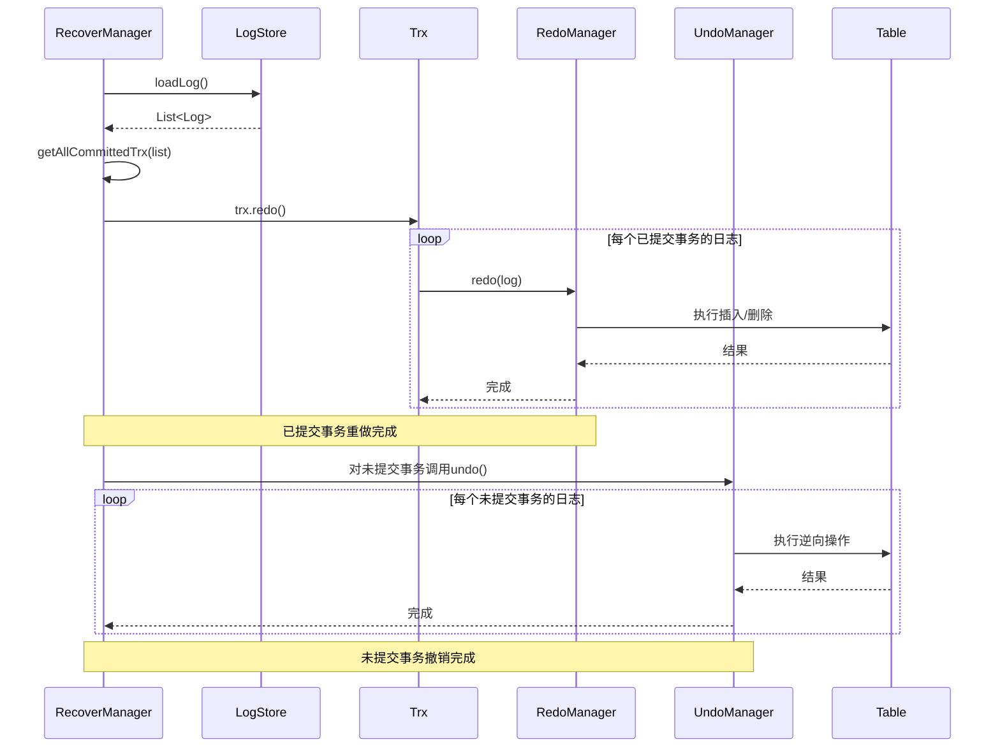
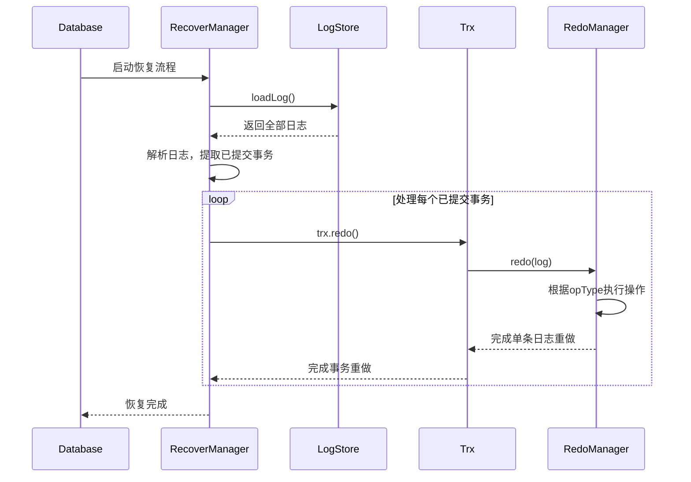

# 恢复管理

<cite>
**本文档引用文件**  
- [RecoverManager.java](file://src/main/java/alchemystar/freedom/recovery/RecoverManager.java)
- [LogStore.java](file://src/main/java/alchemystar/freedom/store/log/LogStore.java)
- [LSNFactory.java](file://src/main/java/alchemystar/freedom/transaction/log/LSNFactory.java)
- [RedoManager.java](file://src/main/java/alchemystar/freedom/transaction/redo/RedoManager.java)
- [UndoManager.java](file://src/main/java/alchemystar/freedom/transaction/undo/UndoManager.java)
- [Log.java](file://src/main/java/alchemystar/freedom/transaction/log/Log.java)
- [Trx.java](file://src/main/java/alchemystar/freedom/transaction/Trx.java)
</cite>

## 目录
1. [引言](#引言)
2. [恢复流程总览](#恢复流程总览)
3. [分析阶段](#分析阶段)
4. [重做阶段（Redo）](#重做阶段redo)
5. [撤销阶段（Undo）](#撤销阶段undo)
6. [关键组件协作机制](#关键组件协作机制)
7. [恢复时序图](#恢复时序图)
8. [性能优化策略](#性能优化策略)
9. [结论](#结论)

## 引言
数据库系统在发生崩溃后重启时，必须确保数据的一致性和持久性。为此，本系统实现了基于日志的恢复机制，以 `RecoverManager` 为核心控制器，协调 `LogStore`、`RedoManager` 和 `UndoManager` 等组件完成完整的故障恢复流程。该机制保障了已提交事务的持久性以及未提交事务的原子性回滚。

## 恢复流程总览
数据库重启时的恢复过程分为三个阶段：
1. **分析阶段**：解析日志文件，识别最后检查点信息，确定哪些事务已提交、哪些未完成。
2. **重做阶段（Redo）**：重新执行所有已提交事务的操作，确保其修改被持久化到数据页中。
3. **撤销阶段（Undo）**：回滚所有未提交事务的操作，撤销其对数据库的中间影响。

整个流程由 `RecoverManager` 主导，通过加载日志并调度重做与撤销操作，实现系统状态的一致性恢复。

**Section sources**
- [RecoverManager.java](file://src/main/java/alchemystar/freedom/recovery/RecoverManager.java#L15-L62)

## 分析阶段
在恢复开始时，`RecoverManager` 调用 `LogStore` 的 `loadLog()` 方法，从持久化日志文件中读取全部日志记录。日志文件位于由 `SystemConfig.FREEDOM_LOG_FILE_NAME` 指定的路径，通过 `FileChannel` 进行顺序读取。

日志记录包括事务开始（TRX_START）、行级操作（ROW）和事务提交（COMMIT）等类型。`RecoverManager` 遍历所有日志条目，使用 `TrxManager.newEmptyTrx()` 创建事务对象，并根据日志类型构建事务上下文。最终，仅将已收到 `COMMIT` 日志的事务加入待重做列表。

此阶段的关键是准确识别已提交事务，避免对未完成事务执行重做操作。

**Section sources**
- [RecoverManager.java](file://src/main/java/alchemystar/freedom/recovery/RecoverManager.java#L15-L47)
- [LogStore.java](file://src/main/java/alchemystar/freedom/store/log/LogStore.java#L45-L65)

## 重做阶段（Redo）
对于每一个已提交的事务，调用其 `redo()` 方法触发重做逻辑。该方法内部遍历该事务关联的所有日志记录，并交由 `RedoManager.redo(Log log)` 静态方法处理。

`RedoManager` 根据日志中的操作类型（`OpType`）执行相应操作：
- **插入操作（insert）**：构造 `ClusterIndexEntry` 并调用表的 `insert()` 方法重新插入数据。
- **删除操作（delete）**：调用表的 `delete()` 方法删除指定记录。
- **更新操作（update）**：当前未实现，预留扩展。

重做过程确保即使在崩溃前未写入磁盘的数据变更，也能通过日志重新应用，从而保证事务的持久性。

**Section sources**
- [RedoManager.java](file://src/main/java/alchemystar/freedom/transaction/redo/RedoManager.java#L10-L32)
- [Trx.java](file://src/main/java/alchemystar/freedom/transaction/Trx.java#L120-L130)

## 撤销阶段（Undo）
尽管当前 `RecoverManager` 实现中尚未显式调用撤销逻辑，但系统已具备完整的 `UndoManager` 支持。`UndoManager.undo(Log log)` 方法可根据日志类型执行逆向操作：
- **插入的撤销**：执行删除操作（`table.delete(log.getAfter())`）。
- **删除的撤销**：执行插入操作（`table.insert(log.getBefore())`）。
- **更新的撤销**：需恢复旧值，当前未实现。

在完整实现中，撤销阶段应在重做之后执行，用于回滚所有未提交事务的影响，确保数据库状态回到一致性点。

**Section sources**
- [UndoManager.java](file://src/main/java/alchemystar/freedom/transaction/undo/UndoManager.java#L10-L45)
- [Trx.java](file://src/main/java/alchemystar/freedom/transaction/Trx.java#L140-L150)

## 关键组件协作机制
恢复过程中各核心组件协同工作，形成完整的恢复链条：

**Diagram sources**
- [RecoverManager.java](file://src/main/java/alchemystar/freedom/recovery/RecoverManager.java#L15-L62)
- [LogStore.java](file://src/main/java/alchemystar/freedom/store/log/LogStore.java#L45-L65)
- [RedoManager.java](file://src/main/java/alchemystar/freedom/transaction/redo/RedoManager.java#L10-L32)
- [UndoManager.java](file://src/main/java/alchemystar/freedom/transaction/undo/UndoManager.java#L10-L45)

### LSNFactory 的作用
`LSNFactory` 使用 `AtomicLong` 提供全局唯一的日志序列号（LSN），确保每条日志具有单调递增的标识。这在恢复时可用于判断日志顺序，支持基于检查点的快速定位，提升恢复效率。

**Section sources**
- [LSNFactory.java](file://src/main/java/alchemystar/freedom/transaction/log/LSNFactory.java#L8-L15)

## 恢复时序图
以下时序图展示了从数据库启动到恢复完成的完整流程：

**Diagram sources**
- [RecoverManager.java](file://src/main/java/alchemystar/freedom/recovery/RecoverManager.java#L15-L62)
- [LogStore.java](file://src/main/java/alchemystar/freedom/store/log/LogStore.java#L45-L65)

## 性能优化策略
为提高恢复性能，可采取以下优化措施：
1. **日志批量加载**：`LogStore.loadLog()` 一次性读取整个日志文件，减少I/O次数。
2. **LSN索引加速定位**：引入LSN索引结构，跳过早期已检查点的日志，直接从最近检查点开始分析。
3. **并行重做**：对不同表的操作可并行执行 `RedoManager.redo()`，利用多核优势。
4. **日志压缩与归档**：定期归档旧日志，减少恢复时需处理的日志总量。
5. **内存映射文件**：使用 `MappedByteBuffer` 替代普通 `ByteBuffer`，提升大日志文件读取效率。

当前实现为简化版本，未来可通过上述策略进一步提升大规模场景下的恢复速度。

**Section sources**
- [LogStore.java](file://src/main/java/alchemystar/freedom/store/log/LogStore.java#L45-L65)
- [LSNFactory.java](file://src/main/java/alchemystar/freedom/transaction/log/LSNFactory.java#L8-L15)

## 结论
本文系统性地阐述了以 `RecoverManager` 为核心的数据库恢复机制。通过分析、重做和撤销三个阶段，结合 `LogStore` 的日志加载、`LSNFactory` 的序列管理、`RedoManager` 与 `UndoManager` 的操作执行，构建了一套完整的故障恢复体系。尽管当前实现侧重于重做路径，但整体架构已支持完整的ACID恢复语义。未来可通过引入检查点机制和并行处理进一步提升恢复性能。