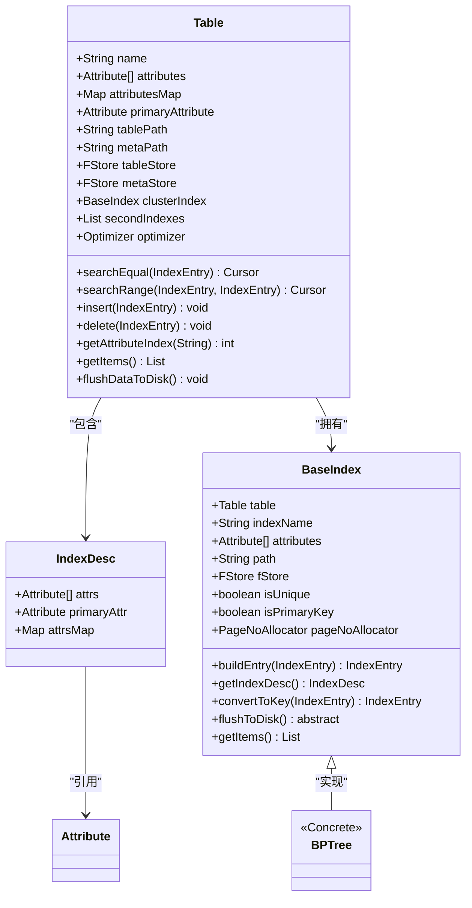
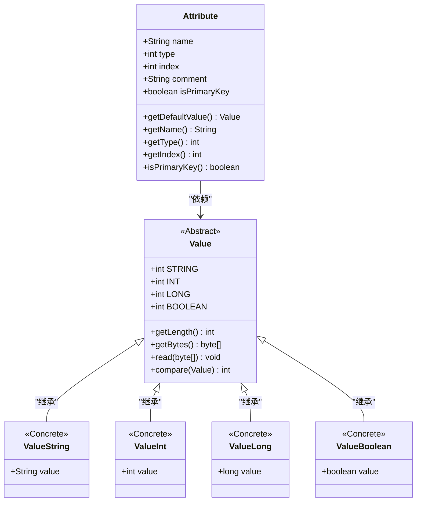
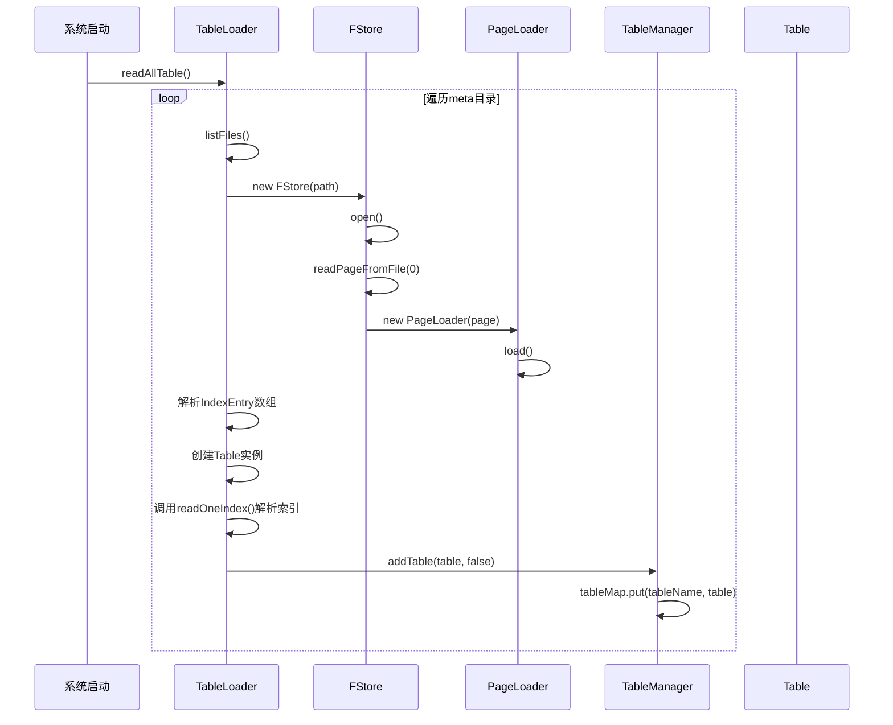
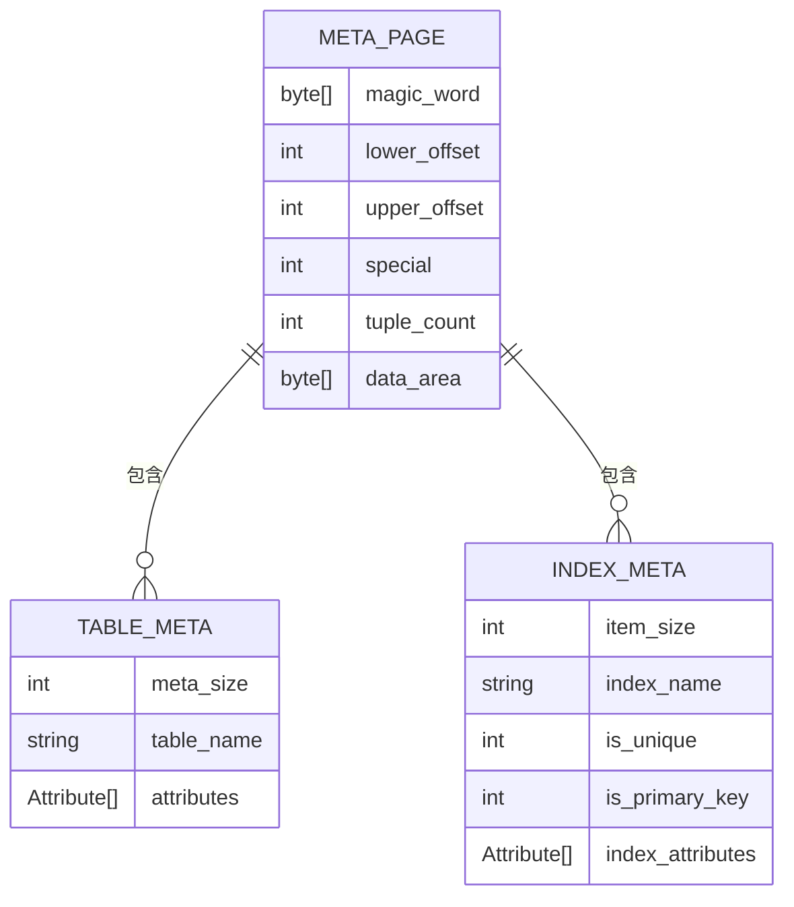

# 元数据管理

<cite>
**本文档中引用的文件**
- [Table.java](file://src/main/java/alchemystar/freedom/meta/Table.java)
- [IndexDesc.java](file://src/main/java/alchemystar/freedom/meta/IndexDesc.java)
- [TableLoader.java](file://src/main/java/alchemystar/freedom/meta/TableLoader.java)
- [TableManager.java](file://src/main/java/alchemystar/freedom/meta/TableManager.java)
- [Attribute.java](file://src/main/java/alchemystar/freedom/meta/Attribute.java)
- [BaseIndex.java](file://src/main/java/alchemystar/freedom/index/BaseIndex.java)
- [CreateVisitor.java](file://src/main/java/alchemystar/freedom/sql/parser/CreateVisitor.java)
- [FStore.java](file://src/main/java/alchemystar/freedom/store/fs/FStore.java)
- [Page.java](file://src/main/java/alchemystar/freedom/store/page/Page.java)
- [SystemConfig.java](file://src/main/java/alchemystar/freedom/config/SystemConfig.java)
</cite>

## 目录
1. [引言](#引言)
2. [表结构与索引定义](#表结构与索引定义)
3. [属性信息管理](#属性信息管理)
4. [元数据加载与全局视图维护](#元数据加载与全局视图维护)
5. [元数据持久化与存储格式](#元数据持久化与存储格式)
6. [元数据变更与事务保证](#元数据变更与事务保证)
7. [缓存一致性策略](#缓存一致性策略)
8. [版本管理与动态Schema支持](#版本管理与动态Schema支持)
9. [结论](#结论)

## 引言
本文档旨在详细阐述Freedom数据库系统中元数据管理模块的架构设计。重点分析表结构、索引定义和属性信息在内存与持久化层面的管理机制。通过核心类Table和IndexDesc，说明数据库对象逻辑结构的表示方式。深入探讨TableLoader如何从存储介质加载元数据，以及TableManager如何维护元数据的全局视图。同时，分析Attribute类对列约束和数据类型的定义，以及元数据变更的事务性保证和缓存一致性策略。最后，提供元数据存储格式设计和版本管理方案，并讨论对动态Schema变更的支持能力。

## 表结构与索引定义

在Freedom系统中，`Table`类是表示数据库表的核心数据结构，封装了表的名称、列属性、主键、存储路径以及索引信息。每个表包含一个聚簇索引（`clusterIndex`）和多个二级索引（`secondIndexes`），这些索引均继承自`BaseIndex`抽象类。`IndexDesc`类用于描述索引的元数据，包含构成索引的`Attribute`数组和主键属性。

表的逻辑结构通过`Attribute[] attributes`数组定义，该数组在`Table`对象初始化时通过`setAttributes`方法设置。此方法会构建一个`attributesMap`哈希表，用于快速通过列名查找其在数组中的索引位置，并识别出主键列。

索引的创建由SQL解析器`CreateVisitor`触发。当解析`CREATE TABLE`语句时，`CreateVisitor`会创建`Table`实例，并根据表定义中的主键和索引信息，分别创建`BPTree`实例作为聚簇索引和二级索引。对于二级索引，其`IndexDesc`中的属性数组由用户指定的列和一个指向主键的“rowId”列组成，以支持回表查询。

**图示来源**
- [Table.java](file://src/main/java/alchemystar/freedom/meta/Table.java#L15-L172)
- [IndexDesc.java](file://src/main/java/alchemystar/freedom/meta/IndexDesc.java#L15-L53)
- [BaseIndex.java](file://src/main/java/alchemystar/freedom/index/BaseIndex.java#L15-L182)

**本节来源**
- [Table.java](file://src/main/java/alchemystar/freedom/meta/Table.java#L15-L172)
- [IndexDesc.java](file://src/main/java/alchemystar/freedom/meta/IndexDesc.java#L15-L53)
- [BaseIndex.java](file://src/main/java/alchemystar/freedom/index/BaseIndex.java#L15-L182)
- [CreateVisitor.java](file://src/main/java/alchemystar/freedom/sql/parser/CreateVisitor.java#L15-L125)

## 属性信息管理

`Attribute`类是元数据管理的基础单元，用于定义表中每一列的约束和数据类型。其核心属性包括：
- `name`：列的名称。
- `type`：列的数据类型，通过`Value`类的常量（如`Value.INT`, `Value.STRING`）来表示。
- `index`：该列在`IndexEntry`元组中的位置索引。
- `comment`：列的注释信息。
- `isPrimaryKey`：布尔标志，指示该列是否为主键。

`Attribute`类提供了`getDefaultValue()`方法，根据其`type`返回对应类型的默认值（如整型为0，字符串为空字符串）。这在插入数据时，对于未指定值的列，可以提供默认填充。

`Attribute`对象的创建和类型映射由`CreateVisitor`类完成。在解析`CREATE TABLE`语句时，`CreateVisitor`会遍历`SQLColumnDefinition`列表，根据列的数据类型字符串（如"int", "varchar"）调用`getType()`方法将其转换为内部的类型常量，并创建相应的`Attribute`实例。主键的识别则通过解析`MySqlPrimaryKey`元素来完成。

**图示来源**
- [Attribute.java](file://src/main/java/alchemystar/freedom/meta/Attribute.java#L15-L95)
- [Value.java](file://src/main/java/alchemystar/freedom/meta/value/Value.java)
- [ValueString.java](file://src/main/java/alchemystar/freedom/meta/value/ValueString.java)
- [ValueInt.java](file://src/main/java/alchemystar/freedom/meta/value/ValueInt.java)
- [ValueLong.java](file://src/main/java/alchemystar/freedom/meta/value/ValueLong.java)
- [ValueBoolean.java](file://src/main/java/alchemystar/freedom/meta/value/ValueBoolean.java)

**本节来源**
- [Attribute.java](file://src/main/java/alchemystar/freedom/meta/Attribute.java#L15-L95)
- [CreateVisitor.java](file://src/main/java/alchemystar/freedom/sql/parser/CreateVisitor.java#L15-L125)

## 元数据加载与全局视图维护

元数据的加载和全局视图的维护由`TableLoader`和`TableManager`两个核心类协同完成。

`TableLoader`负责从持久化存储中加载元数据。其`readAllTable()`方法会扫描`SystemConfig.FREEDOM_REL_META_PATH`目录下的所有文件，对每个文件调用`readTableMeta()`方法。`readTableMeta()`方法通过`FStore`读取元数据文件的第一页（`META_PAGE_INDEX = 0`），并使用`PageLoader`解析出`IndexEntry`数组。解析过程严格按照预定义的格式进行：第一个`IndexEntry`的值表示后续非索引元数据的条目数，第二个是表名，接着是`size`个`Attribute`条目，然后是索引数量，最后是每个索引的详细信息（通过`readOneIndex()`方法解析）。解析完成后，`TableLoader`会创建`Table`对象并将其注册到`TableManager`中。

`TableManager`则负责维护一个全局的`Map<String, Table>`，即`tableMap`，它以表名为键，存储所有已加载的`Table`对象，从而提供对元数据的全局访问。`TableManager`提供了`getTable()`和`getTableWithNoException()`等静态方法，供其他模块（如SQL解析器`SelectVisitor`）根据表名快速获取`Table`实例。`addTable()`方法是向全局视图注册新表的入口，它确保了表名的唯一性，并可以选择是否将元数据持久化。

**图示来源**
- [TableLoader.java](file://src/main/java/alchemystar/freedom/meta/TableLoader.java#L15-L109)
- [FStore.java](file://src/main/java/alchemystar/freedom/store/fs/FStore.java#L15-L96)
- [PageLoader.java](file://src/main/java/alchemystar/freedom/store/page/PageLoader.java)
- [TableManager.java](file://src/main/java/alchemystar/freedom/meta/TableManager.java#L15-L71)

**本节来源**
- [TableLoader.java](file://src/main/java/alchemystar/freedom/meta/TableLoader.java#L15-L109)
- [TableManager.java](file://src/main/java/alchemystar/freedom/meta/TableManager.java#L15-L71)

## 元数据持久化与存储格式

元数据的持久化存储遵循一种紧凑的、基于页的格式。每张表的元数据被设计为仅占用一个数据页（`DEFAULT_PAGE_SIZE = 4096`字节），存储在`FREEDOM_REL_META_PATH`目录下以表名命名的文件中。

`TableLoader`的`writeTableMeta()`方法负责将`Table`对象序列化并写入磁盘。其存储格式如下：
1.  **元数据大小**：一个`ValueInt`，表示后续非索引元数据的条目总数。
2.  **表名**：一个`ValueString`。
3.  **列属性**：`size`个`Item`，每个`Item`包含一个由`ValueConvertUtil.convertAttr()`生成的`IndexEntry`，序列化了`Attribute`的所有信息。
4.  **索引数量**：一个`ValueInt`，等于`1 + secondIndexes.size()`。
5.  **索引信息**：首先写入聚簇索引的`Items`，然后依次写入每个二级索引的`Items`。每个索引的`Items`由`BaseIndex.getItems()`方法生成，包含索引名、属性数量、是否唯一、是否为主键以及构成索引的每个`Attribute`。

`FStore`类作为文件存储的抽象层，使用`FileChannel`进行底层I/O操作。`writePageToFile()`方法将内存中的`Page`对象（通过`PagePool`获取）写入文件的指定页码位置。`Page`对象内部通过`PageHeaderData`管理页头信息（如上下偏移量），并使用`BufferWrapper`进行字节的读写。

**图示来源**
- [TableLoader.java](file://src/main/java/alchemystar/freedom/meta/TableLoader.java#L87-L108)
- [BaseIndex.java](file://src/main/java/alchemystar/freedom/index/BaseIndex.java#L15-L182)
- [FStore.java](file://src/main/java/alchemystar/freedom/store/fs/FStore.java#L15-L96)
- [Page.java](file://src/main/java/alchemystar/freedom/store/page/Page.java#L15-L207)
- [SystemConfig.java](file://src/main/java/alchemystar/freedom/config/SystemConfig.java#L15-L38)

**本节来源**
- [TableLoader.java](file://src/main/java/alchemystar/freedom/meta/TableLoader.java#L87-L108)
- [BaseIndex.java](file://src/main/java/alchemystar/freedom/index/BaseIndex.java#L15-L182)
- [FStore.java](file://src/main/java/alchemystar/freedom/store/fs/FStore.java#L15-L96)

## 元数据变更与事务保证

当前Freedom系统对元数据变更的事务性保证较为基础。根据`README.md`中的描述，系统通过WAL（Write-Ahead Logging）协议来保证数据的原子性和持久性，但主要针对的是数据行的修改（INSERT, UPDATE, DELETE），而非元数据本身的变更。

从代码分析来看，`TableManager.addTable()`方法在`isPersist`参数为`true`时，会先调用`Database.getInstance().getTableLoader().writeTableMeta(table)`将元数据落盘，然后才将其加入`tableMap`。这个“先落盘，再写入内存”的顺序，提供了一种简单的持久化保证，可以防止在系统崩溃时出现内存中有表而磁盘无元数据的不一致状态。

然而，对于更复杂的元数据变更（如`ALTER TABLE`），当前代码库中并未实现。`Table`类的`loadFromDisk()`方法被标记为`// todo 先不考虑持久化`，这表明元数据的加载和持久化机制可能还在开发中。此外，没有看到针对元数据操作的undo/redo日志记录，这意味着元数据变更本身不具备回滚能力。因此，目前的元数据变更可以看作是“准事务性”的，它依赖于文件系统写入的原子性来保证持久化，但缺乏完整的ACID事务支持。

**本节来源**
- [TableManager.java](file://src/main/java/alchemystar/freedom/meta/TableManager.java#L60-L68)
- [Table.java](file://src/main/java/alchemystar/freedom/meta/Table.java#L150-L153)
- [README.md](file://README.md#L72-L87)

## 缓存一致性策略

Freedom系统通过`TableManager`的`tableMap`实现了元数据的内存缓存。`TableLoader`在系统启动时一次性加载所有表的元数据到`tableMap`中，之后所有对元数据的访问都直接从这个全局的`HashMap`中获取，避免了频繁的磁盘I/O，极大地提高了查询性能。

该缓存策略的核心是**单次加载、长期驻留**。在系统运行期间，`tableMap`中的元数据对象是静态的，不会被主动更新或失效。这种策略简单高效，适用于元数据不频繁变更的场景。

当需要创建新表时，`TableManager.addTable()`方法会将新创建的`Table`对象放入`tableMap`。由于`Table`对象在创建时已经包含了完整的内存结构（如`attributesMap`），因此新表的元数据可以立即被系统其他部分使用。

然而，这种策略也存在局限性：它不支持运行时的元数据变更（如`ALTER TABLE`），因为变更后的元数据无法自动同步到内存缓存中。如果未来要支持动态Schema，就需要引入更复杂的缓存失效和更新机制，例如在`ALTER TABLE`成功后，更新`tableMap`中的`Table`对象，并可能需要通知所有相关的会话或执行计划进行刷新。

**本节来源**
- [TableManager.java](file://src/main/java/alchemystar/freedom/meta/TableManager.java#L15-L71)
- [TableLoader.java](file://src/main/java/alchemystar/freedom/meta/TableLoader.java#L15-L109)

## 版本管理与动态Schema支持

当前Freedom系统的元数据管理模块**不支持**版本管理和动态Schema变更。

1.  **版本管理**：从代码和存储格式来看，元数据文件中没有包含任何版本号或时间戳信息。每次`writeTableMeta()`都会覆盖旧的元数据文件。系统没有提供查询历史元数据版本或回滚到旧版本的功能。`README.md`中提到的事务支持是针对数据行的WAL日志，而非元数据的版本控制。

2.  **动态Schema支持**：代码库中缺少处理`ALTER TABLE`、`DROP TABLE`等DDL语句的解析器和执行器。`Table`类的设计是静态的，一旦创建，其`attributes`数组和索引结构就无法修改。`TableManager`的`tableMap`虽然可以`remove`表，但没有提供修改现有表结构的接口。`TableLoader`的`readTableMeta()`方法在解析时假设元数据格式是固定的，没有考虑向后兼容的版本升级。

综上所述，当前的元数据管理设计是为静态Schema场景优化的。要支持动态Schema，需要在`sql/parser`和`sql/executor`包中增加对`ALTER TABLE`等语句的支持，设计元数据的版本化存储格式，并实现`Table`对象的动态更新和缓存一致性维护机制。

**本节来源**
- [TableManager.java](file://src/main/java/alchemystar/freedom/meta/TableManager.java#L15-L71)
- [TableLoader.java](file://src/main/java/alchemystar/freedom/meta/TableLoader.java#L15-L109)
- [CreateVisitor.java](file://src/main/java/alchemystar/freedom/sql/parser/CreateVisitor.java#L15-L125)
- [README.md](file://README.md#L72-L87)

## 结论

Freedom数据库的元数据管理模块通过`Table`、`IndexDesc`、`Attribute`等核心类，清晰地定义了数据库对象的逻辑结构。`TableLoader`和`TableManager`协同工作，实现了元数据从持久化存储到内存全局视图的加载和维护。元数据以紧凑的页格式存储，通过`FStore`和`Page`机制进行I/O操作。

该设计的优点在于结构清晰、实现简单，通过内存缓存`tableMap`保证了高效的元数据访问。然而，其局限性也十分明显：元数据变更缺乏完整的事务性保证，不支持版本管理，且完全不支持动态Schema变更。当前的实现更侧重于系统启动时的元数据初始化，而非运行时的灵活管理。

未来若要增强系统的灵活性和健壮性，应重点在元数据的事务性、版本化和动态变更支持方面进行扩展，例如引入元数据日志、设计版本化的存储格式，并实现`ALTER TABLE`等DDL语句的完整生命周期管理。