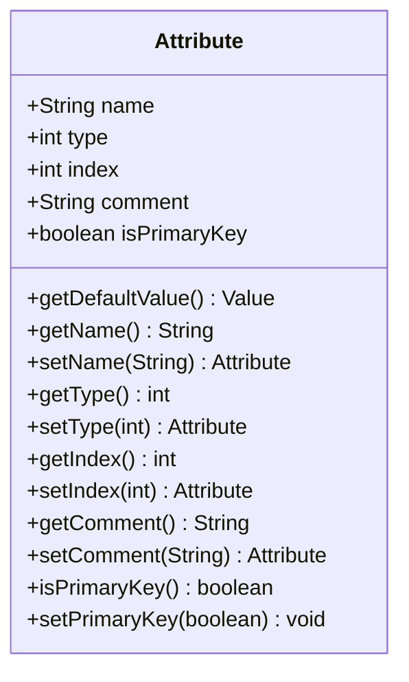
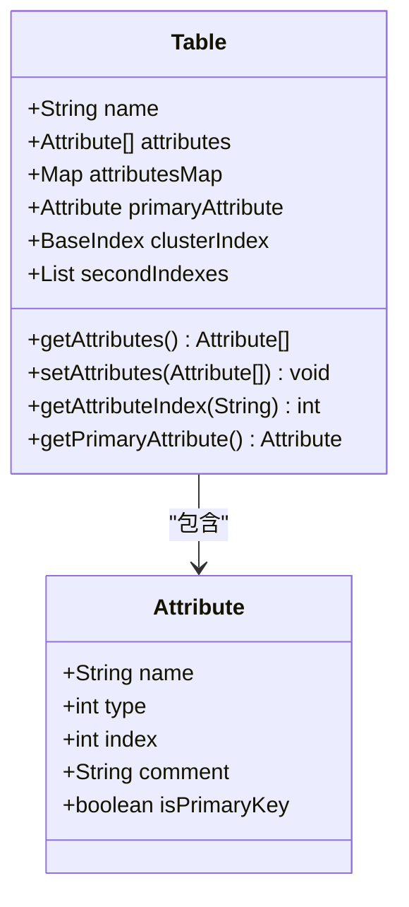
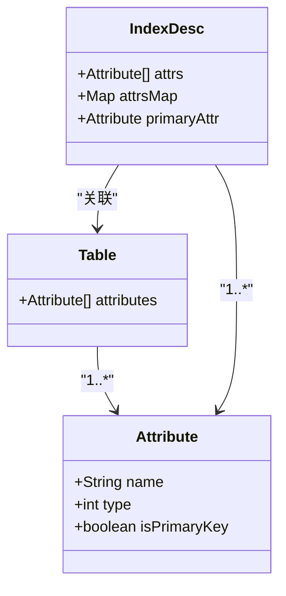
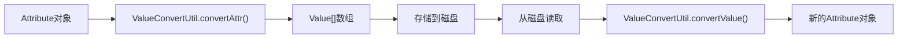
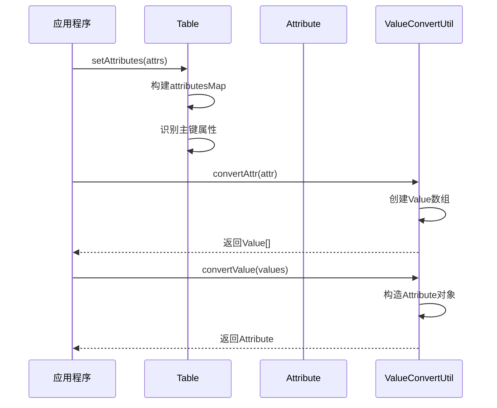

# 属性定义

<cite>
**本文档引用的文件**
- [Attribute.java](file://src/main/java/alchemystar/freedom/meta/Attribute.java)
- [Table.java](file://src/main/java/alchemystar/freedom/meta/Table.java)
- [IndexDesc.java](file://src/main/java/alchemystar/freedom/meta/IndexDesc.java)
- [ValueConvertUtil.java](file://src/main/java/alchemystar/freedom/util/ValueConvertUtil.java)
- [Value.java](file://src/main/java/alchemystar/freedom/meta/value/Value.java)
</cite>

## 目录
1. [属性类概述](#属性类概述)
2. [属性核心字段详解](#属性核心字段详解)
3. [数据类型定义与默认值机制](#数据类型定义与默认值机制)
4. [属性在表结构中的作用](#属性在表结构中的作用)
5. [与Table和IndexDesc的关联关系](#与table和indexdesc的关联关系)
6. [属性元数据的序列化存储格式](#属性元数据的序列化存储格式)
7. [属性的创建、查询与验证过程](#属性的创建查询与验证过程)
8. [属性类型扩展实现方案](#属性类型扩展实现方案)

## 属性类概述

`Attribute`类是数据库元数据系统中的核心组件，用于表示表的列信息。该类封装了列的名称、数据类型、位置索引、注释以及主键标志等关键属性，为表结构定义、索引构建和数据校验提供了基础支持。

**Section sources**
- [Attribute.java](file://src/main/java/alchemystar/freedom/meta/Attribute.java#L1-L10)

## 属性核心字段详解

`Attribute`类包含以下核心字段：

- **name**: 属性名称，表示列的标识符
- **type**: 属性类型，定义列的数据类型（如STRING、INT等）
- **index**: 位置索引，表示该属性在元组描述中的位置
- **comment**: 注释信息，提供对列的描述性说明
- **isPrimaryKey**: 主键标志，指示该列是否为主键

这些字段通过getter和setter方法提供访问接口，支持链式调用设置属性值。



**Diagram sources**
- [Attribute.java](file://src/main/java/alchemystar/freedom/meta/Attribute.java#L12-L95)

**Section sources**
- [Attribute.java](file://src/main/java/alchemystar/freedom/meta/Attribute.java#L12-L95)

## 数据类型定义与默认值机制

系统定义了多种数据类型，通过`Value`类的静态常量进行标识：

- **STRING**: 字符串类型，对应值为1
- **INT**: 整数类型，对应值为2
- **LONG**: 长整型，对应值为3
- **BOOLEAN**: 布尔类型，对应值为4

`getDefaultValue()`方法根据属性类型返回相应的默认值：
- STRING类型返回空字符串""
- INT类型返回0
- LONG类型返回0
- BOOLEAN类型返回false

当遇到不支持的类型时，会抛出运行时异常。

```mermaid
flowchart TD
Start([开始]) --> CheckType["判断属性类型"]
CheckType --> |STRING| ReturnString["返回 new ValueString(\"\")"]
CheckType --> |INT| ReturnInt["返回 new ValueInt(0)"]
CheckType --> |LONG| ReturnLong["返回 new ValueLong(0)"]
CheckType --> |BOOLEAN| ReturnBoolean["返回 new ValueBoolean(false)"]
CheckType --> |其他| ThrowException["抛出运行时异常"]
ReturnString --> End([结束])
ReturnInt --> End
ReturnLong --> End
ReturnBoolean --> End
ThrowException --> End
```

**Diagram sources**
- [Attribute.java](file://src/main/java/alchemystar/freedom/meta/Attribute.java#L45-L58)
- [Value.java](file://src/main/java/alchemystar/freedom/meta/value/Value.java#L3-L7)

**Section sources**
- [Attribute.java](file://src/main/java/alchemystar/freedom/meta/Attribute.java#L45-L58)
- [Value.java](file://src/main/java/alchemystar/freedom/meta/value/Value.java#L3-L7)

## 属性在表结构中的作用

`Attribute`类在表结构定义中扮演着关键角色。`Table`类通过`attributes`数组维护表的所有列信息，并使用`attributesMap`映射列名到索引位置，实现快速查找。在设置属性数组时，会自动识别主键属性并设置`primaryAttribute`字段。

属性信息还用于生成索引条目和执行数据校验，确保数据的一致性和完整性。



**Diagram sources**
- [Table.java](file://src/main/java/alchemystar/freedom/meta/Table.java#L20-L45)
- [Attribute.java](file://src/main/java/alchemystar/freedom/meta/Attribute.java)

**Section sources**
- [Table.java](file://src/main/java/alchemystar/freedom/meta/Table.java#L20-L45)

## 与Table和IndexDesc的关联关系

`Attribute`类与`Table`和`IndexDesc`类存在紧密的关联关系。`Table`类持有`Attribute`数组，表示表的列集合。`IndexDesc`类同样持有`Attribute`数组，用于描述索引的属性结构，并通过`attrsMap`提供按名称查找属性的能力。

在创建`IndexDesc`实例时，会遍历属性数组，建立名称到属性的映射关系，并识别主键属性。



**Diagram sources**
- [Table.java](file://src/main/java/alchemystar/freedom/meta/Table.java#L20-L22)
- [IndexDesc.java](file://src/main/java/alchemystar/freedom/meta/IndexDesc.java#L10-L18)

**Section sources**
- [Table.java](file://src/main/java/alchemystar/freedom/meta/Table.java#L20-L22)
- [IndexDesc.java](file://src/main/java/alchemystar/freedom/meta/IndexDesc.java#L10-L18)

## 属性元数据的序列化存储格式

属性元数据通过`ValueConvertUtil`工具类进行序列化和反序列化。序列化过程将`Attribute`对象转换为`Value`数组，包含以下五个元素：

1. 名称（ValueString）
2. 类型（ValueInt）
3. 索引（ValueInt）
4. 注释（ValueString）
5. 主键标志（ValueInt，1表示true，0表示false）

反序列化过程则将`Value`数组重新构造成`Attribute`对象。



**Diagram sources**
- [ValueConvertUtil.java](file://src/main/java/alchemystar/freedom/util/ValueConvertUtil.java#L15-L35)

**Section sources**
- [ValueConvertUtil.java](file://src/main/java/alchemystar/freedom/util/ValueConvertUtil.java#L15-L35)

## 属性的创建、查询与验证过程

属性的创建通常通过构造函数完成，指定名称、类型、索引和注释。查询操作通过`Table`类的`getAttributeIndex()`方法实现，根据列名快速定位索引位置。

数据验证主要体现在默认值生成和类型检查两个方面。`getDefaultValue()`方法确保每种类型都有合理的默认值，而类型系统通过`Value`的继承体系保证操作的类型安全。



**Diagram sources**
- [Table.java](file://src/main/java/alchemystar/freedom/meta/Table.java#L100-L115)
- [ValueConvertUtil.java](file://src/main/java/alchemystar/freedom/util/ValueConvertUtil.java)

**Section sources**
- [Table.java](file://src/main/java/alchemystar/freedom/meta/Table.java#L100-L115)
- [ValueConvertUtil.java](file://src/main/java/alchemystar/freedom/util/ValueConvertUtil.java)

## 属性类型扩展实现方案

要扩展新的属性类型，需要在`Value`类中添加新的类型常量，并实现对应的`Value`子类。例如，添加FLOAT类型需要：
1. 在`Value`类中定义`public static final byte FLOAT = 5;`
2. 创建`ValueFloat`类继承`Value`，实现抽象方法
3. 在`Attribute.getDefaultValue()`方法中添加对FLOAT类型的处理分支

这种设计保证了类型系统的可扩展性，同时保持了接口的一致性。

**Section sources**
- [Value.java](file://src/main/java/alchemystar/freedom/meta/value/Value.java#L3-L7)
- [Attribute.java](file://src/main/java/alchemystar/freedom/meta/Attribute.java#L45-L58)