# 索引元数据

<cite>
**本文档中引用的文件**  
- [IndexDesc.java](file://src/main/java/alchemystar/freedom/meta/IndexDesc.java)
- [Table.java](file://src/main/java/alchemystar/freedom/meta/Table.java)
- [BaseIndex.java](file://src/main/java/alchemystar/freedom/index/BaseIndex.java)
- [IndexEntry.java](file://src/main/java/alchemystar/freedom/meta/IndexEntry.java)
- [ClusterIndexEntry.java](file://src/main/java/alchemystar/freedom/meta/ClusterIndexEntry.java)
- [BPTree.java](file://src/main/java/alchemystar/freedom/index/bp/BPTree.java)
- [Attribute.java](file://src/main/java/alchemystar/freedom/meta/Attribute.java)
</cite>

## 目录
1. [引言](#引言)
2. [核心组件分析](#核心组件分析)
3. [IndexDesc类详解](#indexdesc类详解)
4. [Table与索引的协作关系](#table与索引的协作关系)
5. [索引元数据的内存组织](#索引元数据的内存组织)
6. [聚簇索引与二级索引的元数据差异](#聚簇索引与二级索引的元数据差异)
7. [约束信息的存储机制](#约束信息的存储机制)
8. [序列化格式与存储布局](#序列化格式与存储布局)
9. [索引元数据的构建与操作](#索引元数据的构建与操作)
10. [版本控制策略](#版本控制策略)

## 引言
本文档详细阐述了数据库系统中索引元数据的管理机制，以IndexDesc类为核心，深入分析了索引属性集合、主键属性和字段映射关系的描述方式。文档详细说明了IndexDesc与Table、BaseIndex之间的协作关系，探讨了索引元数据在内存中的组织方式，以及聚簇索引和二级索引的元数据差异。同时，文档还介绍了唯一性、主键等约束信息的存储机制，提供了索引元数据的序列化格式设计，并解释了其在B+树节点中的存储布局。

## 核心组件分析
系统中的索引元数据管理涉及多个核心组件，包括IndexDesc、Table、BaseIndex、IndexEntry等。这些组件协同工作，实现了索引的创建、查询、修改和持久化功能。

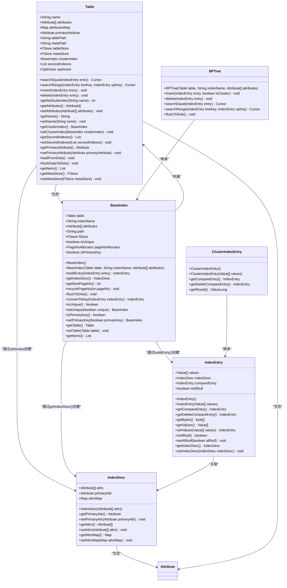

**图示来源**  
- [IndexDesc.java](file://src/main/java/alchemystar/freedom/meta/IndexDesc.java)
- [Table.java](file://src/main/java/alchemystar/freedom/meta/Table.java)
- [BaseIndex.java](file://src/main/java/alchemystar/freedom/index/BaseIndex.java)
- [IndexEntry.java](file://src/main/java/alchemystar/freedom/meta/IndexEntry.java)
- [ClusterIndexEntry.java](file://src/main/java/alchemystar/freedom/meta/ClusterIndexEntry.java)
- [BPTree.java](file://src/main/java/alchemystar/freedom/index/bp/BPTree.java)

## IndexDesc类详解
IndexDesc类是索引元数据的核心，用于描述索引的属性集合、主键属性和字段映射关系。

### 属性集合管理
IndexDesc类通过`attrs`数组存储索引的所有属性，并通过`attrsMap`哈希表实现属性名到属性对象的快速查找。

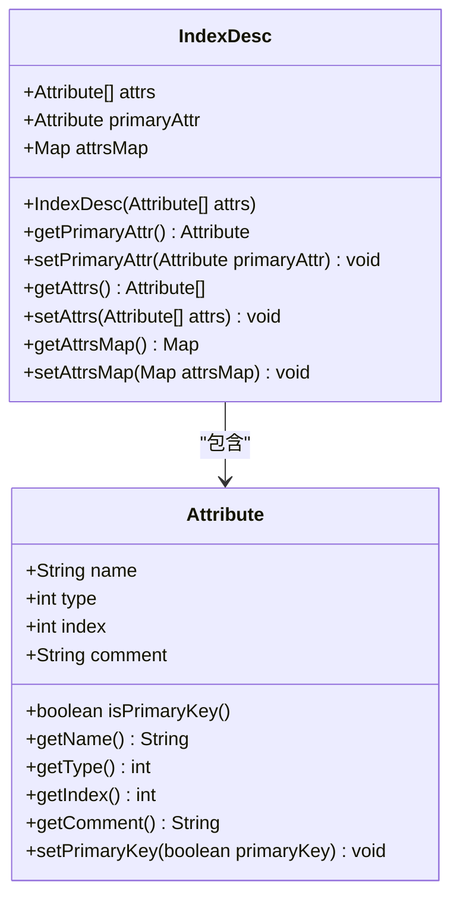

**图示来源**  
- [IndexDesc.java](file://src/main/java/alchemystar/freedom/meta/IndexDesc.java#L10-L52)
- [Attribute.java](file://src/main/java/alchemystar/freedom/meta/Attribute.java)

### 主键属性处理
IndexDesc类在构造函数中遍历所有属性，自动识别并设置主键属性。

```java
public IndexDesc(Attribute[] attrs) {
    this.attrs = attrs;
    attrsMap = new HashMap<String, Attribute>();
    for (Attribute attr : attrs) {
        attrsMap.put(attr.getName(), attr);
        if (attr.isPrimaryKey()) {
            primaryAttr = attr;
        }
    }
}
```

**代码来源**  
- [IndexDesc.java](file://src/main/java/alchemystar/freedom/meta/IndexDesc.java#L15-L24)

### 字段映射关系
IndexDesc类通过`attrsMap`维护属性名到属性对象的映射关系，支持通过属性名快速查找。

```java
public Map<String, Attribute> getAttrsMap() {
    return attrsMap;
}
```

**代码来源**  
- [IndexDesc.java](file://src/main/java/alchemystar/freedom/meta/IndexDesc.java#L43-L46)

## Table与索引的协作关系
Table类与BaseIndex类之间存在紧密的协作关系，Table管理着聚簇索引和二级索引的生命周期。

### 聚簇索引管理
Table类通过`clusterIndex`字段管理聚簇索引，所有数据插入和删除操作都会首先作用于聚簇索引。

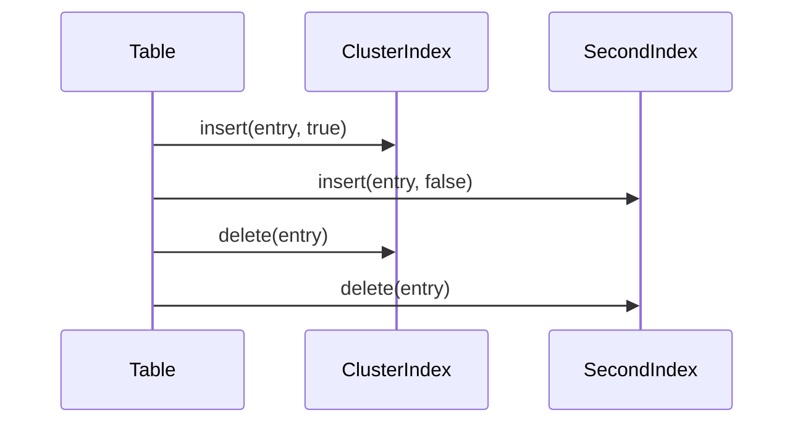

**图示来源**  
- [Table.java](file://src/main/java/alchemystar/freedom/meta/Table.java#L65-L78)

### 二级索引管理
Table类通过`secondIndexes`列表管理所有二级索引，确保数据一致性。

```java
public void insert(IndexEntry entry) {
    // 插入聚集索引
    clusterIndex.insert(entry, true);
    // 二级索引的插入
    for (BaseIndex secondIndex : secondIndexes) {
        secondIndex.insert(entry, false);
    }
}
```

**代码来源**  
- [Table.java](file://src/main/java/alchemystar/freedom/meta/Table.java#L65-L74)

### 查询优化器
Table类内置Optimizer，用于选择最优的索引进行查询。

```java
public Cursor searchEqual(IndexEntry entry) {
    // choose index by entry
    Index chooseIndex = optimizer.chooseIndex(entry);
    return chooseIndex.searchEqual(entry);
}
```

**代码来源**  
- [Table.java](file://src/main/java/alchemystar/freedom/meta/Table.java#L50-L55)

## 索引元数据的内存组织
索引元数据在内存中通过层次化的对象结构进行组织，确保高效访问和管理。

### 内存结构图
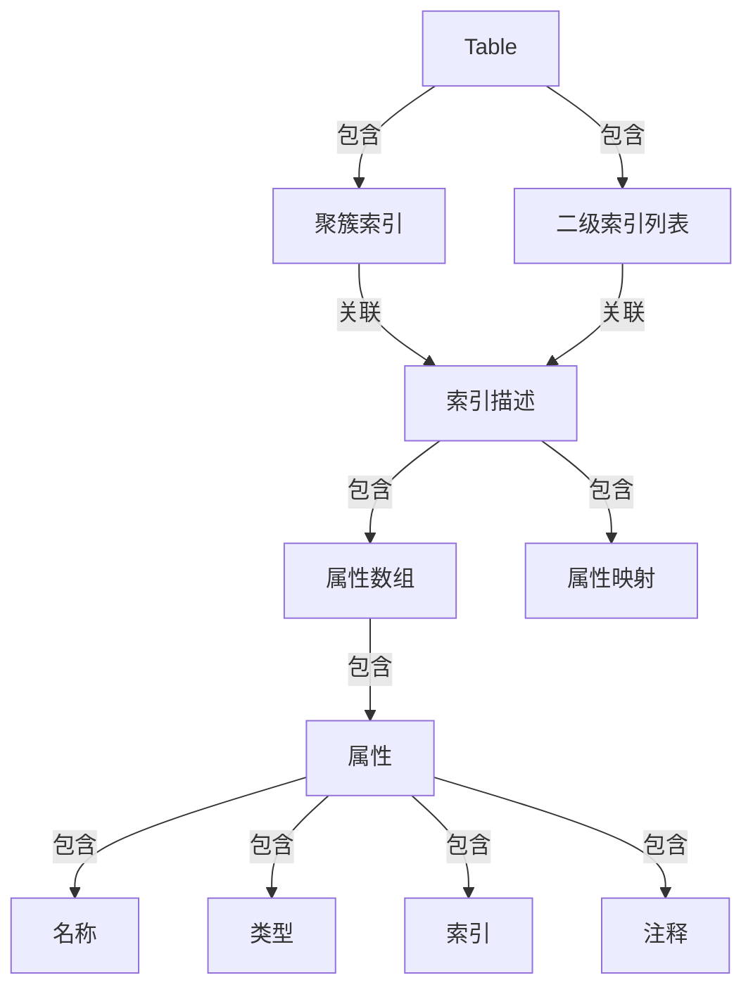

**图示来源**  
- [Table.java](file://src/main/java/alchemystar/freedom/meta/Table.java)
- [BaseIndex.java](file://src/main/java/alchemystar/freedom/index/BaseIndex.java)
- [IndexDesc.java](file://src/main/java/alchemystar/freedom/meta/IndexDesc.java)

### 对象关系
内存中的对象关系通过引用和组合实现，形成清晰的层次结构。

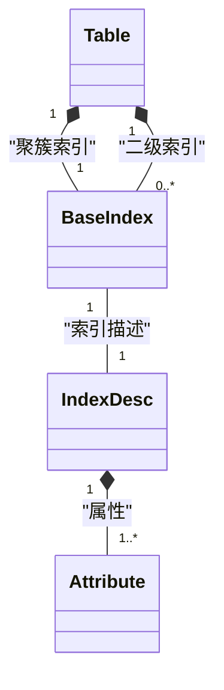

**图示来源**  
- [Table.java](file://src/main/java/alchemystar/freedom/meta/Table.java)
- [BaseIndex.java](file://src/main/java/alchemystar/freedom/index/BaseIndex.java)
- [IndexDesc.java](file://src/main/java/alchemystar/freedom/meta/IndexDesc.java)

## 聚簇索引与二级索引的元数据差异
聚簇索引和二级索引在元数据组织上存在显著差异，主要体现在数据存储方式和索引结构上。

### 元数据差异对比
| 特性 | 聚簇索引 | 二级索引 |
| --- | --- | --- |
| **数据存储** | 包含所有列数据 | 只包含索引列和主键 |
| **主键处理** | 主键作为索引键 | 主键作为行标识符 |
| **索引描述** | 使用表的所有属性 | 使用索引列和主键 |
| **唯一性** | 自动唯一 | 可配置唯一性 |
| **插入性能** | 较慢（需维护所有数据） | 较快（只维护索引） |

**表格来源**  
- [BaseIndex.java](file://src/main/java/alchemystar/freedom/index/BaseIndex.java#L94-L114)
- [Table.java](file://src/main/java/alchemystar/freedom/meta/Table.java)

### 聚簇索引元数据
聚簇索引的元数据包含表的所有属性，索引项包含完整的行数据。

```java
public IndexDesc getIndexDesc() {
    // cluster的entry包含所有的属性
    indexDesc = new IndexDesc(table.getAttributes());
}
```

**代码来源**  
- [BaseIndex.java](file://src/main/java/alchemystar/freedom/index/BaseIndex.java#L107-L109)

### 二级索引元数据
二级索引的元数据只包含索引列和主键，最后一个是rowId。

```java
public IndexDesc getIndexDesc() {
    // 非主键,最后一个是rowId
    indexDesc = new IndexDesc(attributes);
    indexDesc.setPrimaryAttr(attributes[attributes.length - 1]);
}
```

**代码来源**  
- [BaseIndex.java](file://src/main/java/alchemystar/freedom/index/BaseIndex.java#L102-L105)

## 约束信息的存储机制
系统通过多种机制存储和管理索引的约束信息，包括唯一性和主键约束。

### 唯一性约束
唯一性约束通过`isUnique`字段进行标记和管理。

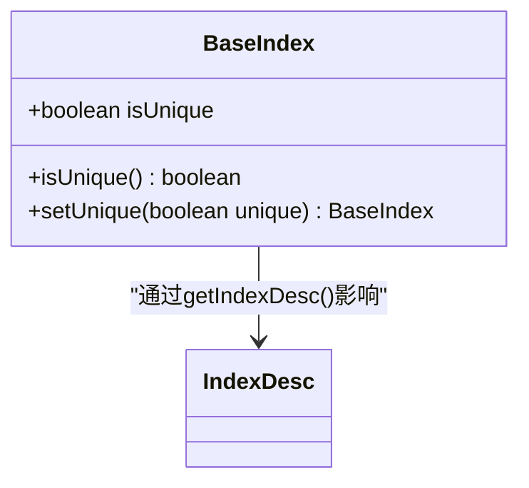

**图示来源**  
- [BaseIndex.java](file://src/main/java/alchemystar/freedom/index/BaseIndex.java#L38-L42)

### 主键约束
主键约束通过`isPrimaryKey`字段进行标记，并自动设置为唯一。

```java
public BaseIndex setPrimaryKey(boolean primaryKey) {
    isPrimaryKey = primaryKey;
    if (isPrimaryKey) {
        isUnique = true;
    }
    return this;
}
```

**代码来源**  
- [BaseIndex.java](file://src/main/java/alchemystar/freedom/index/BaseIndex.java#L130-L136)

### 约束信息持久化
约束信息在序列化时被持久化存储。

```java
public List<Item> getItems() {
    // ...
    int isUnique = isUnique() ? 1 : 0;
    int isPrimaryKey = isPrimaryKey() ? 1 : 0;
    Item isUniqueItem = new Item(new IndexEntry(new Value[] {new ValueInt(isUnique)}));
    Item isPrimaryKeyItem = new Item(new IndexEntry(new Value[] {new ValueInt(isPrimaryKey)}));
    // ...
}
```

**代码来源**  
- [BaseIndex.java](file://src/main/java/alchemystar/freedom/index/BaseIndex.java#L155-L162)

## 序列化格式与存储布局
索引元数据的序列化格式设计考虑了存储效率和访问性能。

### 序列化格式
序列化格式包含索引名称、属性信息和约束标志。

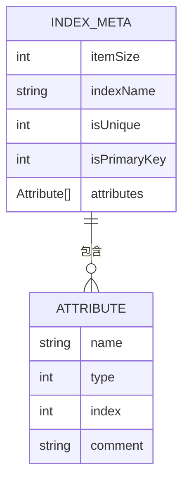

**图示来源**  
- [BaseIndex.java](file://src/main/java/alchemystar/freedom/index/BaseIndex.java#L149-L181)

### B+树节点存储布局
B+树节点中的存储布局优化了空间利用率和访问效率。

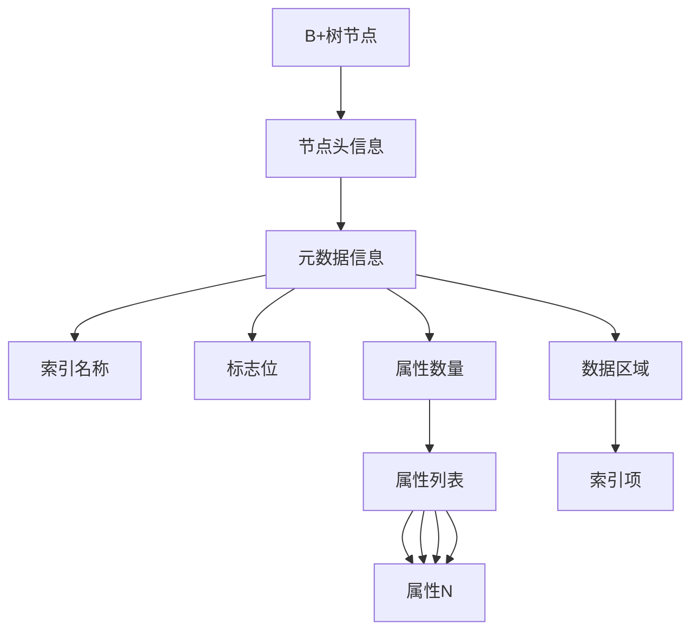

**流程图来源**  
- [BaseIndex.java](file://src/main/java/alchemystar/freedom/index/BaseIndex.java#L149-L181)

## 索引元数据的构建与操作
索引元数据的构建和操作涉及多个步骤和组件的协作。

### 构建过程
索引元数据的构建过程从表定义开始，逐步创建索引结构。

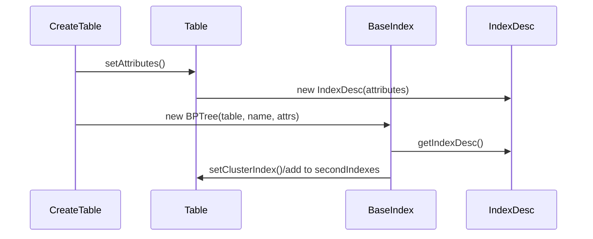

**序列图来源**  
- [Table.java](file://src/main/java/alchemystar/freedom/meta/Table.java)
- [BaseIndex.java](file://src/main/java/alchemystar/freedom/index/BaseIndex.java)

### 查询过程
索引元数据的查询过程通过优化器选择最优索引。

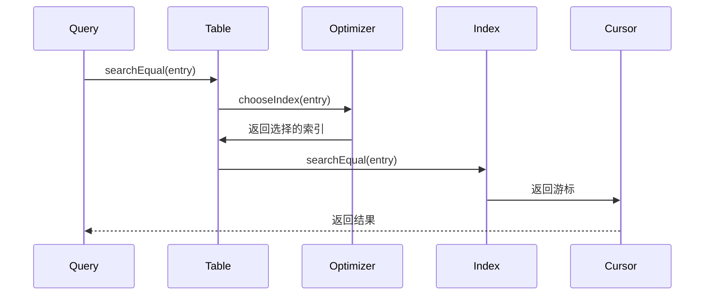

**序列图来源**  
- [Table.java](file://src/main/java/alchemystar/freedom/meta/Table.java#L50-L55)

### 修改过程
索引元数据的修改需要维护数据一致性。

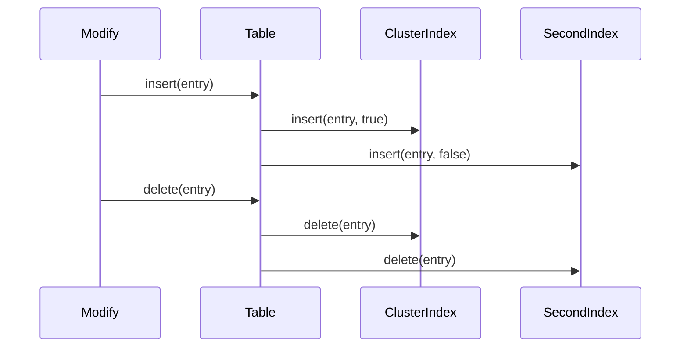

**序列图来源**  
- [Table.java](file://src/main/java/alchemystar/freedom/meta/Table.java#L65-L78)

## 版本控制策略
系统通过多种机制实现索引元数据的版本控制，确保数据一致性和并发安全。

### 版本控制机制
版本控制主要通过事务管理和日志记录实现。

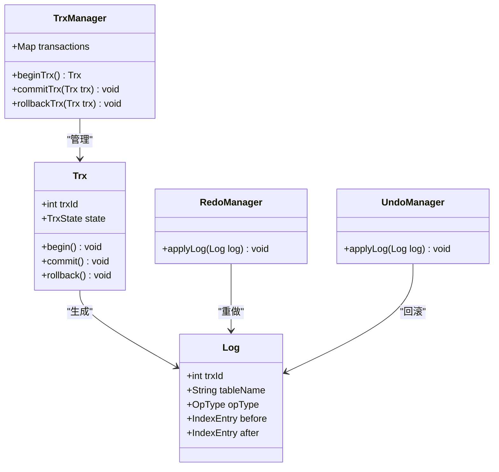

**图示来源**  
- [transaction/Trx.java](file://src/main/java/alchemystar/freedom/transaction/Trx.java)
- [transaction/log/Log.java](file://src/main/java/alchemystar/freedom/transaction/log/Log.java)
- [transaction/TrxManager.java](file://src/main/java/alchemystar/freedom/transaction/TrxManager.java)
- [transaction/redo/RedoManager.java](file://src/main/java/alchemystar/freedom/transaction/redo/RedoManager.java)
- [transaction/undo/UndoManager.java](file://src/main/java/alchemystar/freedom/transaction/undo/UndoManager.java)

### 并发控制
并发控制通过锁机制和事务隔离级别实现。

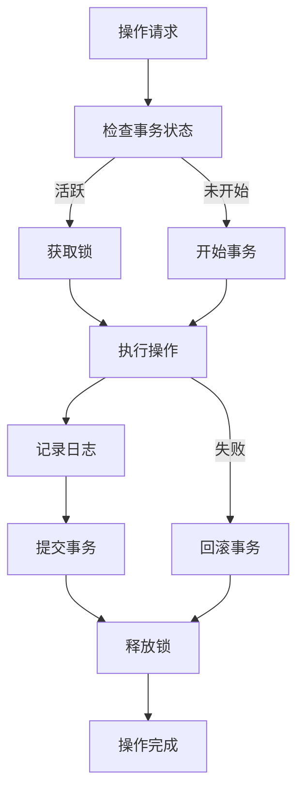

**流程图来源**  
- [transaction/Trx.java](file://src/main/java/alchemystar/freedom/transaction/Trx.java)
- [transaction/TrxManager.java](file://src/main/java/alchemystar/freedom/transaction/TrxManager.java)