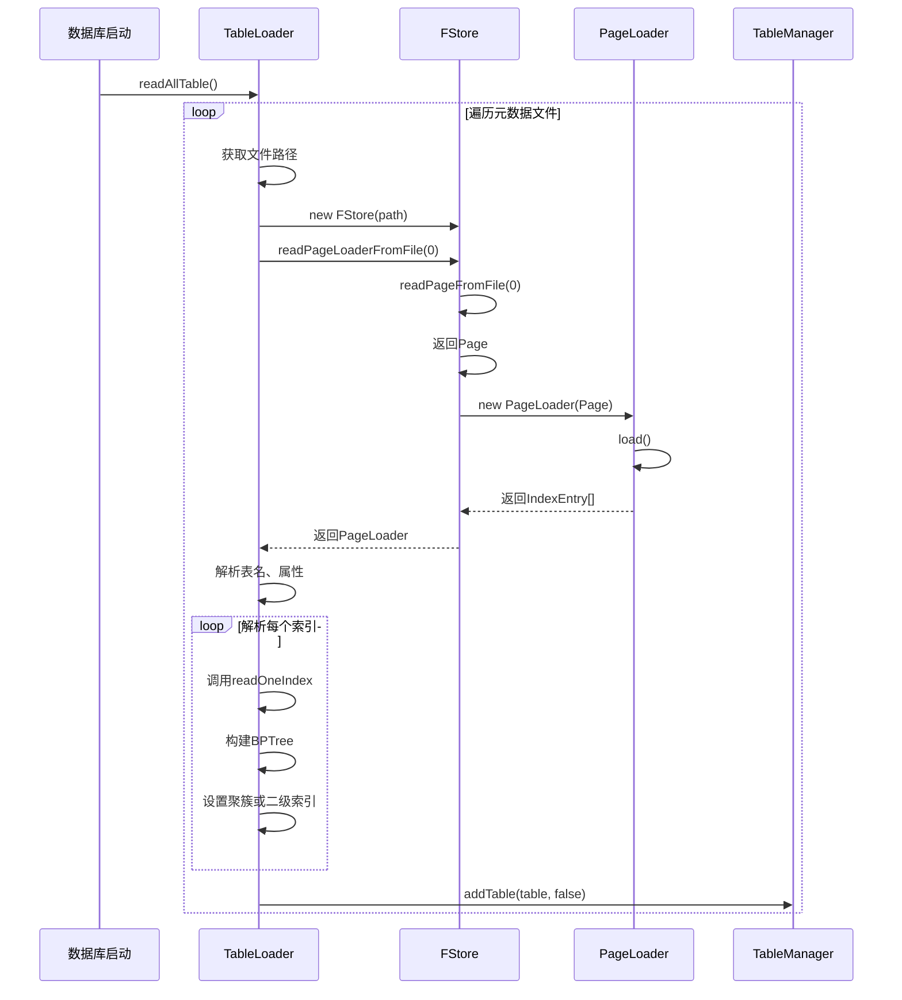
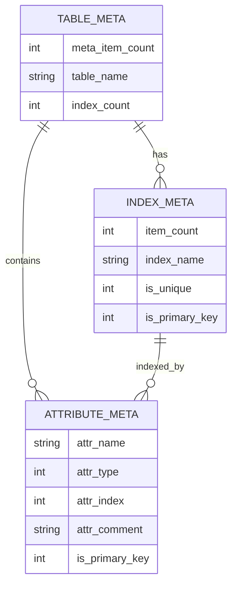
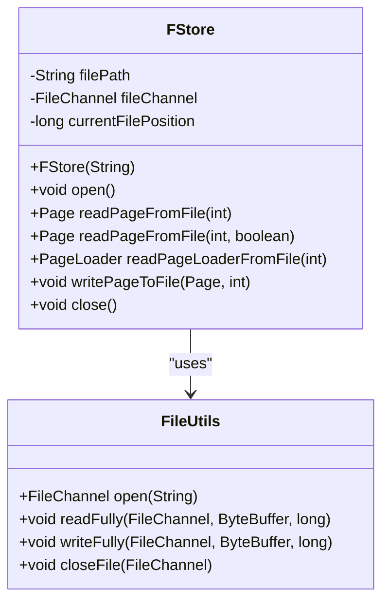
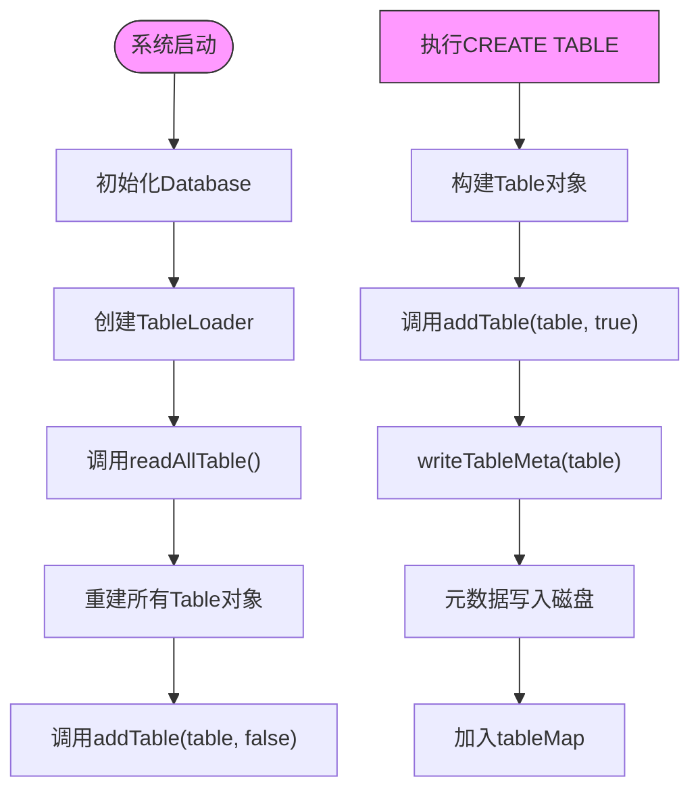
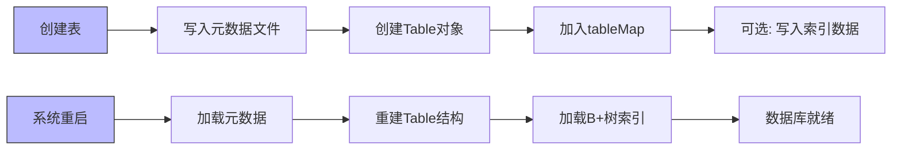

# 元数据持久化

<cite>
**本文档引用的文件**  
- [TableLoader.java](file://src/main/java/alchemystar/freedom/meta/TableLoader.java)
- [FStore.java](file://src/main/java/alchemystar/freedom/store/fs/FStore.java)
- [Table.java](file://src/main/java/alchemystar/freedom/meta/Table.java)
- [Attribute.java](file://src/main/java/alchemystar/freedom/meta/Attribute.java)
- [IndexDesc.java](file://src/main/java/alchemystar/freedom/meta/IndexDesc.java)
- [TableManager.java](file://src/main/java/alchemystar/freedom/meta/TableManager.java)
- [Page.java](file://src/main/java/alchemystar/freedom/store/page/Page.java)
- [PageLoader.java](file://src/main/java/alchemystar/freedom/store/page/PageLoader.java)
- [Item.java](file://src/main/java/alchemystar/freedom/store/item/Item.java)
- [ValueConvertUtil.java](file://src/main/java/alchemystar/freedom/util/ValueConvertUtil.java)
</cite>

## 目录
1. [引言](#引言)
2. [元数据持久化机制概述](#元数据持久化机制概述)
3. [TableLoader 的加载流程](#tableloader-的加载流程)
4. [元数据的存储格式设计](#元数据的存储格式设计)
5. [FStore 文件读写机制](#fstore-文件读写机制)
6. [TableLoader 的调用时机](#tableloader-的调用时机)
7. [错误恢复与一致性保障](#错误恢复与一致性保障)
8. [元数据加载与保存流程示例](#元数据加载与保存流程示例)
9. [与B+树索引持久化的一致性策略](#与b树索引持久化的一致性策略)
10. [结论](#结论)

## 引言
在数据库系统中，元数据的持久化是确保系统重启后能够正确重建表结构和索引信息的关键机制。本文档详细描述了 `TableLoader` 如何在数据库启动时从磁盘文件加载表的元数据，并重建内存中的 `Table` 对象结构。同时，分析了元数据的存储格式设计、`FStore` 的文件读写机制、`TableLoader` 的调用时机以及持久化过程中的错误恢复机制。最后，结合代码逻辑说明元数据持久化与 B+ 树索引持久化之间的一致性保障策略。

## 元数据持久化机制概述
元数据持久化机制的核心目标是将数据库中的表结构（包括属性、主键、索引等）以特定格式写入磁盘，并在系统重启时能够准确地从磁盘读取并重建这些结构。该机制涉及多个关键组件：
- `Table`：表示一个逻辑表，包含属性数组、主键索引和二级索引。
- `Attribute`：描述表中每一列的名称、类型、是否为主键等信息。
- `IndexDesc`：描述索引所包含的属性集合。
- `TableLoader`：负责从磁盘加载元数据并构建 `Table` 对象。
- `FStore`：提供对底层文件的读写能力。
- `Page` 和 `PageLoader`：管理页面级别的数据读写与解析。
- `Item`：表示页面中的一条记录项。

**Section sources**
- [Table.java](file://src/main/java/alchemystar/freedom/meta/Table.java#L1-L173)
- [Attribute.java](file://src/main/java/alchemystar/freedom/meta/Attribute.java#L1-L96)
- [IndexDesc.java](file://src/main/java/alchemystar/freedom/meta/IndexDesc.java#L1-L54)

## TableLoader 的加载流程
`TableLoader` 是元数据加载的核心类，其主要功能是扫描指定目录下的所有元数据文件，并逐个解析以重建 `Table` 对象。

### 加载入口：readAllTable
`readAllTable()` 方法是批量加载所有表元数据的入口。它读取配置中定义的元数据路径（`SystemConfig.FREEDOM_REL_META_PATH`），遍历该目录下的所有文件，并对每个文件调用 `readTableMeta(path)` 方法进行解析。

### 单表加载：readTableMeta
`readTableMeta(String path)` 方法负责加载单个表的元数据。其流程如下：
1. 创建 `FStore` 实例，指向当前表的元数据文件。
2. 调用 `FStore.readPageLoaderFromFile(0)` 读取第一页（元数据仅占用一页）。
3. 使用 `PageLoader` 解析页面内容，获取 `IndexEntry[]` 数组。
4. 从 `IndexEntry[0]` 读取除索引外的元数据项数量 `size`。
5. 从 `IndexEntry[1]` 读取表名。
6. 循环读取 `IndexEntry[2]` 到 `IndexEntry[size]`，使用 `ValueConvertUtil.convertValue()` 将 `Value[]` 转换为 `Attribute` 对象，并添加到列表中。
7. 从 `IndexEntry[size + 1]` 读取索引数量 `indexCount`。
8. 从 `IndexEntry[size + 2]` 开始，循环调用 `readOneIndex()` 方法解析每个索引。

### 索引解析：readOneIndex
`readOneIndex()` 方法解析一个索引的元数据：
1. 读取该索引的元数据项数量 `primaryItemSize`。
2. 读取索引名称、是否唯一、是否为主键。
3. 循环读取后续的 `primaryItemSize - 3` 个 `IndexEntry`，转换为 `Attribute` 数组。
4. 使用这些信息创建 `BPTree` 实例。
5. 如果 `Table` 尚未设置聚簇索引，则将其设为聚簇索引；否则添加到二级索引列表中。
6. 返回下一个索引的起始位置。

**Diagram sources**
- [TableLoader.java](file://src/main/java/alchemystar/freedom/meta/TableLoader.java#L15-L109)

**Section sources**
- [TableLoader.java](file://src/main/java/alchemystar/freedom/meta/TableLoader.java#L15-L109)

## 元数据的存储格式设计
元数据的存储格式设计决定了如何将复杂的对象结构序列化为适合页面存储的二进制格式。

### 序列化结构
每个表的元数据存储在单独的文件中，且仅占用一个页面。其序列化结构如下：
1. **元数据项数量**：`IndexEntry`，包含一个 `ValueInt`，表示后续非索引元数据项的数量（属性数量 + 1）。
2. **表名**：`IndexEntry`，包含一个 `ValueString`。
3. **属性列表**：`N` 个 `IndexEntry`，每个包含5个 `Value`（名称、类型、索引、注释、是否主键）。
4. **索引数量**：`IndexEntry`，包含一个 `ValueInt`。
5. **索引信息**：对于每个索引：
   - **元数据项数量**：`ValueInt`
   - **索引名称**：`ValueString`
   - **是否唯一**：`ValueInt` (1为true)
   - **是否主键**：`ValueInt` (1为true)
   - **索引属性列表**：`M` 个 `IndexEntry`，每个包含5个 `Value`。

### ValueConvertUtil 的转换逻辑
`ValueConvertUtil` 类负责 `Attribute` 与 `Value[]` 之间的转换：
- `convertAttr(Attribute)`：将 `Attribute` 的字段依次转换为 `ValueString`, `ValueInt`, `ValueInt`, `ValueString`, `ValueInt`。
- `convertValue(Value[])`：从 `Value[]` 数组中提取字段，重建 `Attribute` 对象。

**Diagram sources**
- [TableLoader.java](file://src/main/java/alchemystar/freedom/meta/TableLoader.java#L45-L95)
- [ValueConvertUtil.java](file://src/main/java/alchemystar/freedom/util/ValueConvertUtil.java#L15-L38)

**Section sources**
- [TableLoader.java](file://src/main/java/alchemystar/freedom/meta/TableLoader.java#L45-L95)
- [ValueConvertUtil.java](file://src/main/java/alchemystar/freedom/util/ValueConvertUtil.java#L15-L38)

## FStore 文件读写机制
`FStore` 类封装了对底层文件的读写操作，是元数据持久化的基础。

### 文件打开与关闭
`FStore` 在构造时接收文件路径，并调用 `open()` 方法通过 `FileUtils.open()` 获取 `FileChannel`。`close()` 方法负责关闭通道。

### 页面读取
`readPageFromFile(int pageIndex)` 方法根据页号计算偏移量，使用 `FileUtils.readFully()` 将整个页面读入 `ByteBuffer`，然后转换为字节数组。根据 `isIndex` 参数决定返回普通 `Page` 还是 `BpPage`。

### 页面写入
`writePageToFile(Page page, int pageIndex)` 方法将 `Page` 的字节缓冲区包装成 `ByteBuffer`，通过 `FileUtils.writeFully()` 写入文件的指定位置。

**Diagram sources**
- [FStore.java](file://src/main/java/alchemystar/freedom/store/fs/FStore.java#L1-L97)

**Section sources**
- [FStore.java](file://src/main/java/alchemystar/freedom/store/fs/FStore.java#L1-L97)

## TableLoader 的调用时机
`TableLoader` 在两个关键时机被调用：

### 系统初始化时
在数据库启动过程中，`Database` 实例会初始化 `TableLoader`，并通过 `readAllTable()` 方法加载所有已存在的表元数据。这确保了系统重启后内存中的表结构与磁盘上的一致。

### 表创建时
当执行 `CREATE TABLE` 语句时，`SqlExecutor` 会调用 `TableManager.addTable(table, true)`。如果 `isPersist` 参数为 `true`，`TableManager` 会先调用 `Database.getInstance().getTableLoader().writeTableMeta(table)` 将元数据写入磁盘，然后再将其加入全局 `tableMap` 中。

**Diagram sources**
- [TableLoader.java](file://src/main/java/alchemystar/freedom/meta/TableLoader.java#L15-L35)
- [TableManager.java](file://src/main/java/alchemystar/freedom/meta/TableManager.java#L55-L65)

**Section sources**
- [TableLoader.java](file://src/main/java/alchemystar/freedom/meta/TableLoader.java#L15-L35)
- [TableManager.java](file://src/main/java/alchemystar/freedom/meta/TableManager.java#L55-L65)

## 错误恢复与一致性保障
虽然当前代码中没有显式的事务日志或检查点机制来保障元数据写入的原子性，但其设计仍具备一定的容错能力：

### 读取时的容错
`FStore.readPageFromFile()` 在发生 `EOFException` 时返回 `null`，允许上层逻辑处理不完整的页面。`PageLoader.load()` 在读取 `ItemPointer` 时会检查 `tupleLength` 是否为 `-1`（表示已删除），从而跳过无效条目。

### 写入时的保障
`writeTableMeta()` 方法在写入前会从 `PagePool` 获取一个空闲页面，并在内存中完成所有元数据的写入操作。只有当所有数据都成功写入内存页面后，才会调用 `writePageToFile()` 一次性写入磁盘。这减少了部分写入的风险。

### 潜在风险
当前机制的主要风险在于，如果在 `writePageToFile()` 过程中发生崩溃，可能导致元数据文件处于不一致状态。未来可通过引入 WAL（Write-Ahead Logging）机制，在写入元数据前先记录日志，以实现崩溃恢复。

**Section sources**
- [FStore.java](file://src/main/java/alchemystar/freedom/store/fs/FStore.java#L50-L60)
- [PageLoader.java](file://src/main/java/alchemystar/freedom/store/page/PageLoader.java#L25-L45)

## 元数据加载与保存流程示例
以下是一个简化的元数据加载与保存流程示例：

### 保存流程 (writeTableMeta)
1. 创建 `Item` 存储表名。
2. 创建 `Item` 存储属性数量。
3. 从 `Table.getItems()` 获取所有属性的 `Item` 列表。
4. 创建 `Item` 存储索引数量。
5. 获取聚簇索引和所有二级索引的 `Item` 列表。
6. 从 `PagePool` 获取一个空闲页面。
7. 按顺序将所有 `Item` 写入页面。
8. 调用 `metaStore.writePageToFile(page, 0)` 将页面写入磁盘。

### 加载流程 (readTableMeta)
1. 调用 `metaStore.readPageLoaderFromFile(0)` 读取元数据页。
2. `PageLoader.load()` 解析页面，生成 `IndexEntry[]`。
3. 从 `IndexEntry[0]` 读取属性数量。
4. 从 `IndexEntry[1]` 读取表名。
5. 循环解析后续 `IndexEntry` 为 `Attribute` 数组。
6. 读取索引数量。
7. 循环调用 `readOneIndex` 解析每个索引。
8. 调用 `TableManager.addTable()` 将 `Table` 注册到全局管理器。

**Section sources**
- [TableLoader.java](file://src/main/java/alchemystar/freedom/meta/TableLoader.java#L85-L109)
- [Table.java](file://src/main/java/alchemystar/freedom/meta/Table.java#L135-L155)

## 与B+树索引持久化的一致性策略
元数据持久化与 B+ 树索引持久化是两个独立但相关的机制：

### 分离的持久化路径
- **元数据**：通过 `TableLoader.writeTableMeta()` 和 `readTableMeta()` 管理，存储在独立的元数据文件中。
- **索引数据**：通过 `BPTree.flushToDisk()` 和 `BPTree.loadFromDisk()` 管理，存储在数据文件中。

### 一致性保障
1. **创建时的一致性**：在创建表时，先将元数据写入磁盘，再将 `Table` 对象加入内存。这确保了如果元数据写入成功，即使系统在后续步骤崩溃，重启时也能正确加载该表。
2. **运行时的一致性**：`Table.flushDataToDisk()` 方法会依次调用聚簇索引和二级索引的 `flushToDisk()`，确保所有索引数据在检查点时被持久化。
3. **恢复时的一致性**：系统重启时，先加载元数据重建 `Table` 结构，再加载 B+ 树索引数据。由于元数据中包含了索引的定义，可以确保内存结构与磁盘数据匹配。

**Diagram sources**
- [Table.java](file://src/main/java/alchemystar/freedom/meta/Table.java#L125-L133)
- [TableLoader.java](file://src/main/java/alchemystar/freedom/meta/TableLoader.java#L85-L109)

**Section sources**
- [Table.java](file://src/main/java/alchemystar/freedom/meta/Table.java#L125-L133)

## 结论
本文档详细分析了 Freedom 数据库的元数据持久化机制。`TableLoader` 通过 `FStore` 从磁盘文件加载元数据，利用 `Page` 和 `PageLoader` 解析页面内容，并通过 `ValueConvertUtil` 将序列化的 `Value` 数组重建为 `Table`、`Attribute` 和 `Index` 对象。该机制在系统初始化和表创建时被调用，确保了元数据在内存和磁盘之间的一致性。尽管当前实现缺乏完善的崩溃恢复机制，但其清晰的分离设计为未来引入 WAL 或检查点提供了良好的基础。元数据持久化与 B+ 树索引持久化的分离策略，既保证了各自的灵活性，又通过统一的加载流程确保了整体的一致性。