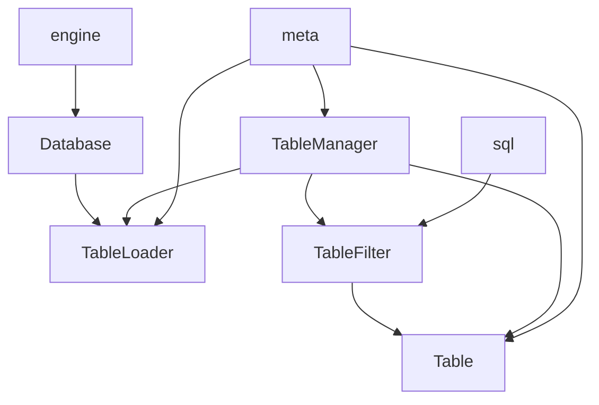
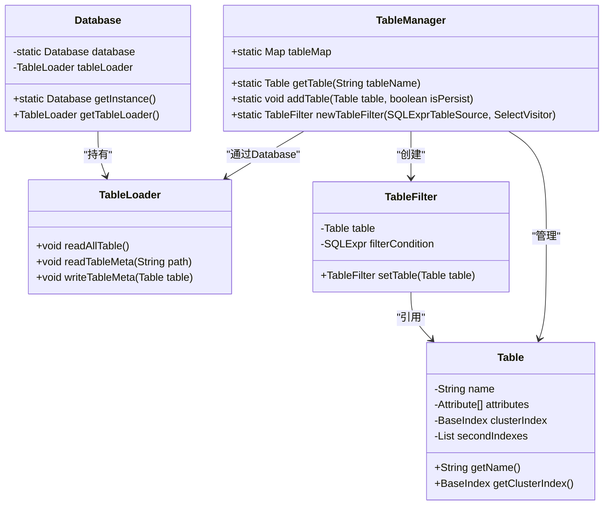
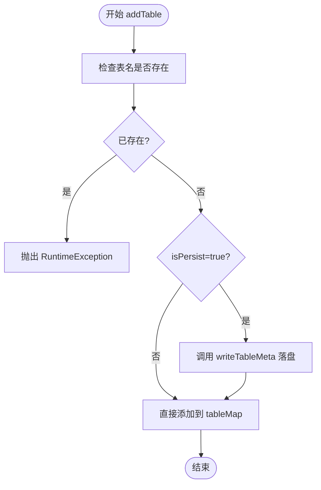
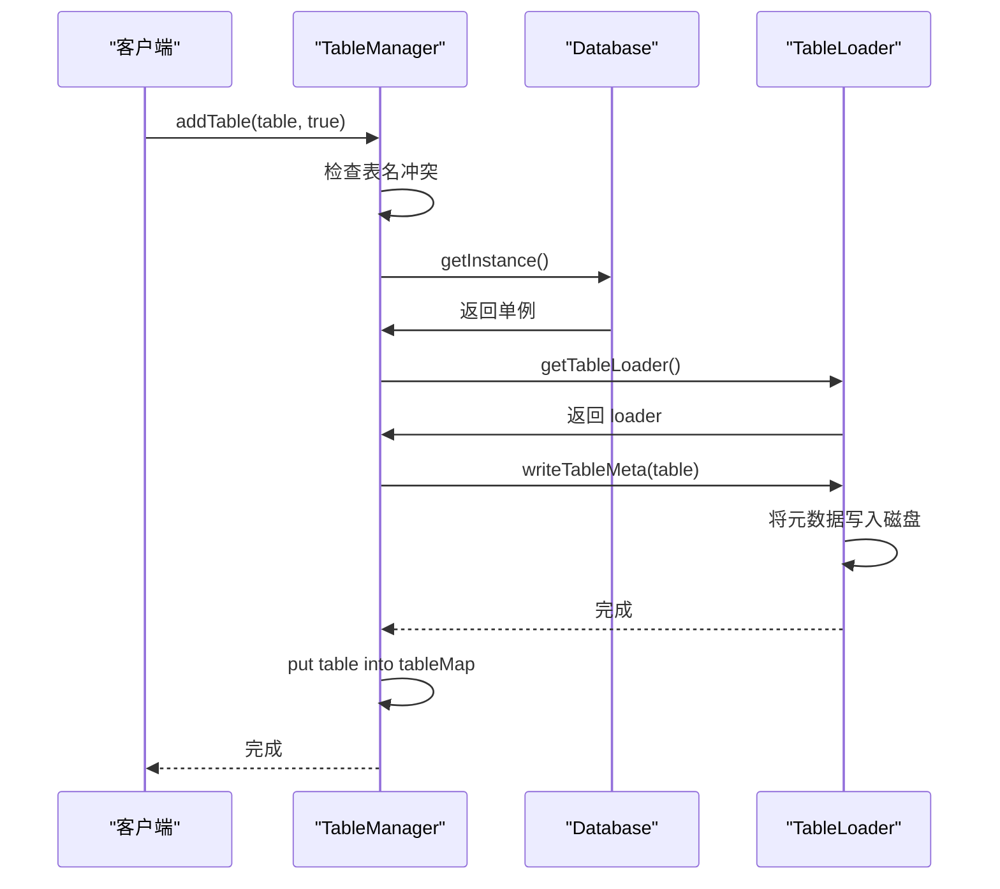
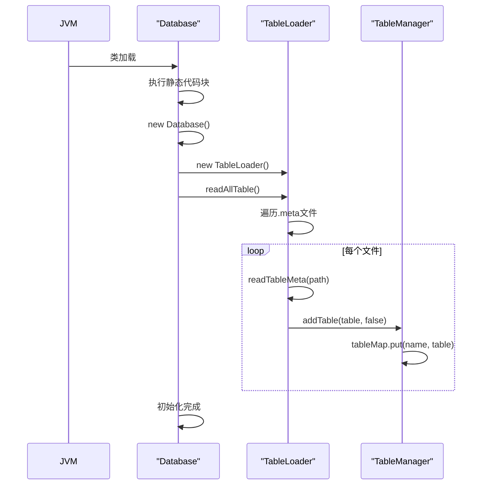

# 表注册管理

<cite>
**本文档引用文件**  
- [TableManager.java](file://src/main/java/alchemystar/freedom/meta/TableManager.java)
- [Table.java](file://src/main/java/alchemystar/freedom/meta/Table.java)
- [TableLoader.java](file://src/main/java/alchemystar/freedom/meta/TableLoader.java)
- [Database.java](file://src/main/java/alchemystar/freedom/engine/Database.java)
- [TableFilter.java](file://src/main/java/alchemystar/freedom/sql/select/TableFilter.java)
</cite>

## 目录
1. [简介](#简介)
2. [项目结构](#项目结构)
3. [核心组件](#核心组件)
4. [架构概述](#架构概述)
5. [详细组件分析](#详细组件分析)
6. [依赖分析](#依赖分析)
7. [性能考虑](#性能考虑)
8. [故障排除指南](#故障排除指南)
9. [结论](#结论)

## 简介
本文档详细说明了`TableManager`类如何作为全局单例管理数据库中所有表的注册与查找。该模块使用线程安全的`ConcurrentHashMap`（当前实现为非线程安全的`HashMap`，需注意并发风险）维护表名到`Table`实例的映射，提供表的创建、删除和获取等核心功能。文档将深入分析其生命周期管理、与`Database`实例的依赖关系、多线程访问下的并发控制策略及异常处理机制，并提出解决表注册冲突的最佳实践。

## 项目结构



**图示来源**  
- [TableManager.java](file://src/main/java/alchemystar/freedom/meta/TableManager.java)
- [Table.java](file://src/main/java/alchemystar/freedom/meta/Table.java)
- [TableLoader.java](file://src/main/java/alchemystar/freedom/meta/TableLoader.java)
- [Database.java](file://src/main/java/alchemystar/freedom/engine/Database.java)
- [TableFilter.java](file://src/main/java/alchemystar/freedom/sql/select/TableFilter.java)

**本节来源**  
- [TableManager.java](file://src/main/java/alchemystar/freedom/meta/TableManager.java#L1-L70)
- [Table.java](file://src/main/java/alchemystar/freedom/meta/Table.java#L1-L172)

## 核心组件

`TableManager`是表注册管理的核心，通过静态`tableMap`字段存储所有已注册的表。其主要方法包括`addTable`用于注册新表，`getTable`用于根据表名查找表实例，以及`newTableFilter`用于在SQL解析过程中构建表过滤器。`Table`类封装了表的元数据，如属性列表、主键索引和二级索引。`TableLoader`负责从磁盘加载和持久化表的元信息，而`Database`类作为全局单例，持有`TableLoader`实例，协调表的加载与恢复。

**本节来源**  
- [TableManager.java](file://src/main/java/alchemystar/freedom/meta/TableManager.java#L15-L70)
- [Table.java](file://src/main/java/alchemystar/freedom/meta/Table.java#L1-L172)
- [TableLoader.java](file://src/main/java/alchemystar/freedom/meta/TableLoader.java#L1-L109)

## 架构概述



**图示来源**  
- [TableManager.java](file://src/main/java/alchemystar/freedom/meta/TableManager.java#L15-L70)
- [Table.java](file://src/main/java/alchemystar/freedom/meta/Table.java#L1-L172)
- [TableLoader.java](file://src/main/java/alchemystar/freedom/meta/TableLoader.java#L1-L109)
- [Database.java](file://src/main/java/alchemystar/freedom/engine/Database.java#L1-L77)
- [TableFilter.java](file://src/main/java/alchemystar/freedom/sql/select/TableFilter.java#L1-L278)

## 详细组件分析

### TableManager 分析

`TableManager`采用静态类模式，`tableMap`作为全局唯一的表注册中心。其核心方法逻辑如下：

#### createTable 与 addTable 方法
`createTable`操作最终由`TableManager.addTable`方法实现。该方法首先检查表名是否已存在，若存在则抛出`RuntimeException`防止重复创建。如果`isPersist`参数为`true`，则会通过`Database.getInstance().getTableLoader().writeTableMeta(table)`先将表的元数据持久化到磁盘，然后才将`Table`实例放入`tableMap`中。这种“先落盘，再写入内存”的策略保证了数据的一致性。



**图示来源**  
- [TableManager.java](file://src/main/java/alchemystar/freedom/meta/TableManager.java#L50-L60)

**本节来源**  
- [TableManager.java](file://src/main/java/alchemystar/freedom/meta/TableManager.java#L50-L60)
- [Database.java](file://src/main/java/alchemystar/freedom/engine/Database.java#L50-L55)
- [TableLoader.java](file://src/main/java/alchemystar/freedom/meta/TableLoader.java#L90-L109)

#### dropTable 方法
尽管`TableManager`类中未直接提供`dropTable`方法，但可以通过`tableMap.remove(tableName)`来实现。在删除表时，应遵循与创建相反的顺序：先从`tableMap`中移除表的内存引用，再通过`TableLoader`或类似机制清理磁盘上的元数据文件，以避免出现“僵尸”文件。

#### getTable 方法
`TableManager.getTable`方法根据表名从`tableMap`中查找`Table`实例。如果未找到，会抛出`RuntimeException`，这是一种严格的错误处理方式，确保调用者必须处理表不存在的情况。而`getTableWithNoException`方法则提供了一种更宽松的查询方式，查询不到时返回`null`。



**图示来源**  
- [TableManager.java](file://src/main/java/alchemystar/freedom/meta/TableManager.java#L50-L60)
- [Database.java](file://src/main/java/alchemystar/freedom/engine/Database.java#L50-L55)
- [TableLoader.java](file://src/main/java/alchemystar/freedom/meta/TableLoader.java#L90-L109)

### 并发控制与线程安全
当前`TableManager`的实现使用了`HashMap`，它**不是线程安全的**。在多线程环境下（如多个客户端同时执行DDL操作），直接并发调用`addTable`或`getTable`可能导致`ConcurrentModificationException`或数据不一致。最佳实践是：
1.  **升级数据结构**：将`tableMap`的类型从`HashMap`改为`ConcurrentHashMap<String, Table>`，以提供线程安全的读写操作。
2.  **同步方法**：如果必须使用`HashMap`，则需要在`addTable`、`getTable`等修改或访问`tableMap`的方法上添加`synchronized`关键字，但这会降低并发性能。

**本节来源**  
- [TableManager.java](file://src/main/java/alchemystar/freedom/meta/TableManager.java#L15)

### 生命周期管理
`TableManager`的生命周期与`Database`单例紧密绑定。
- **启动时**：`Database`类的静态代码块在JVM加载类时执行，创建`Database`单例，并调用`TableLoader.readAllTable()`。该方法会扫描元数据目录，为每个`.meta`文件调用`readTableMeta`，最终通过`TableManager.addTable(table, false)`将所有持久化的表加载到`tableMap`中，实现了服务启动时的自动表注册。
- **关闭时**：文档中未明确展示关闭逻辑，但合理的做法是在`Database`的销毁方法中，遍历`tableMap`中的所有`Table`，调用其`flushDataToDisk`方法，确保所有内存中的数据和索引都持久化到磁盘。



**图示来源**  
- [Database.java](file://src/main/java/alchemystar/freedom/engine/Database.java#L20-L30)
- [TableLoader.java](file://src/main/java/alchemystar/freedom/meta/TableLoader.java#L15-L25)
- [TableManager.java](file://src/main/java/alchemystar/freedom/meta/TableManager.java#L65)

**本节来源**  
- [Database.java](file://src/main/java/alchemystar/freedom/engine/Database.java#L20-L30)
- [TableLoader.java](file://src/main/java/alchemystar/freedom/meta/TableLoader.java#L15-L25)
- [TableManager.java](file://src/main/java/alchemystar/freedom/meta/TableManager.java#L65)

## 依赖分析

```mermaid
graph TD
TableManager --> Database : "调用 getInstance()"
Database --> TableLoader : "持有实例"
TableManager --> TableLoader : "间接依赖"
TableManager --> Table : "存储实例"
TableFilter --> Table : "引用实例"
TableManager --> TableFilter : "创建实例"
```

**图示来源**  
- [TableManager.java](file://src/main/java/alchemystar/freedom/meta/TableManager.java#L50-L55)
- [Database.java](file://src/main/java/alchemystar/freedom/engine/Database.java#L10-L77)

**本节来源**  
- [TableManager.java](file://src/main/java/alchemystar/freedom/meta/TableManager.java#L1-L70)
- [Database.java](file://src/main/java/alchemystar/freedom/engine/Database.java#L1-L77)

## 性能考虑
- **内存映射**：`tableMap`提供了O(1)时间复杂度的表查找，性能优异。
- **并发瓶颈**：使用非线程安全的`HashMap`是主要的性能和稳定性隐患。在高并发场景下，应优先解决此问题。
- **持久化开销**：`addTable`时的磁盘I/O操作是同步阻塞的，可能成为创建表的性能瓶颈。可考虑异步写入或批量提交。

## 故障排除指南
- **问题：创建表时报错 "table xxx already exists"**
  - **原因**：尝试创建一个已存在于`tableMap`中的表。
  - **解决方案**：在调用`addTable`前，先使用`getTableWithNoException`检查表是否存在，或捕获`RuntimeException`进行处理。
- **问题：查询表时报错 "not found this table"**
  - **原因**：`getTable`方法未找到指定名称的表。
  - **解决方案**：确认表名拼写正确，或检查服务启动时是否成功从磁盘加载了该表的元数据。
- **问题：多线程环境下服务崩溃或数据错乱**
  - **原因**：`tableMap`的线程不安全。
  - **解决方案**：立即将`HashMap`替换为`ConcurrentHashMap`。

**本节来源**  
- [TableManager.java](file://src/main/java/alchemystar/freedom/meta/TableManager.java#L40-L46)
- [TableManager.java](file://src/main/java/alchemystar/freedom/meta/TableManager.java#L50-L55)

## 结论
`TableManager`是数据库系统中负责表元数据管理的核心模块。它通过一个静态的`tableMap`实现了全局表注册表的功能，并与`Database`和`TableLoader`协同工作，完成了表的生命周期管理。然而，其当前使用`HashMap`的设计存在严重的线程安全缺陷，必须在生产环境中修复。通过采用`ConcurrentHashMap`并完善异常处理，该模块可以成为一个高效、可靠的表管理基础设施。