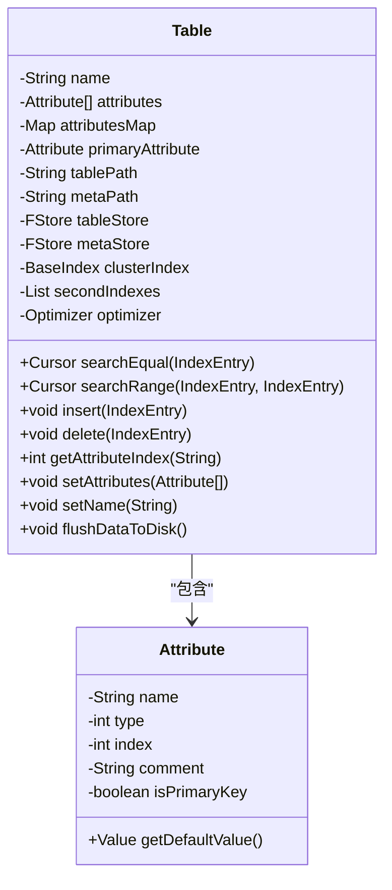
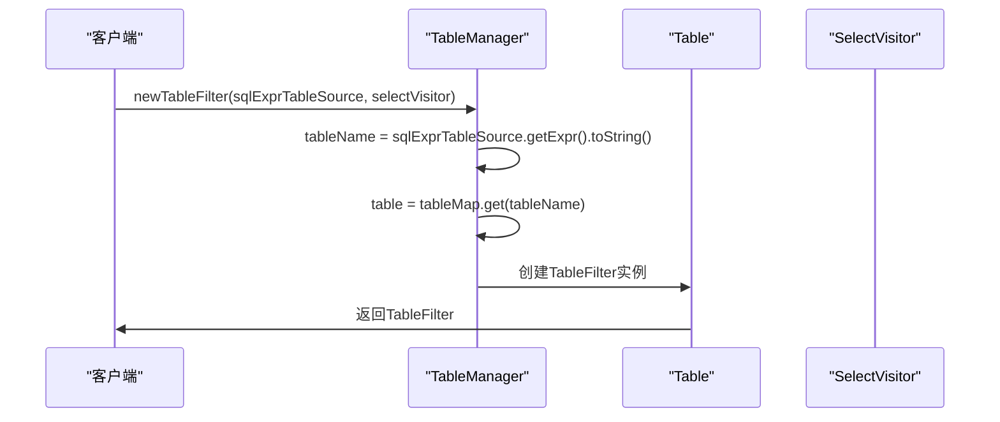
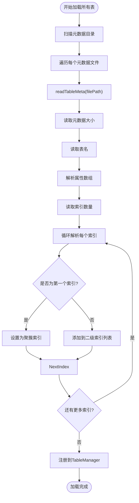
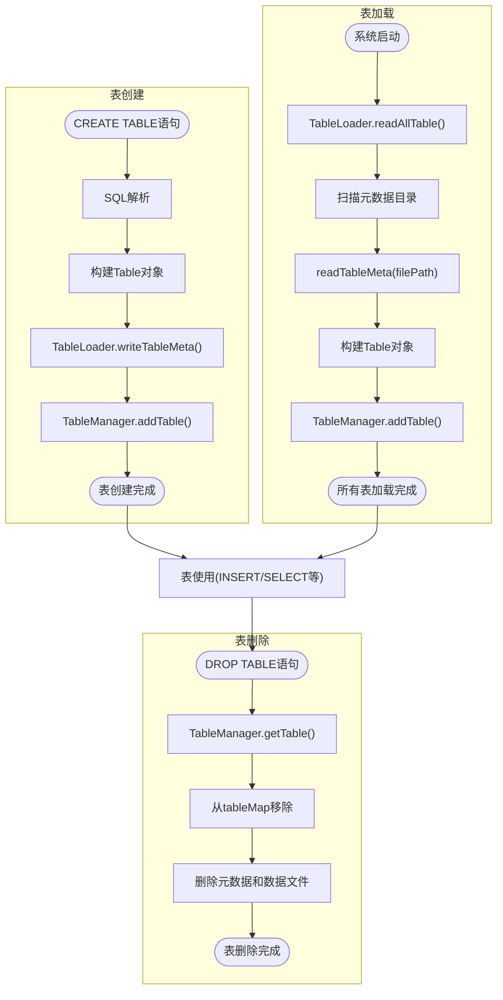

# 表管理

<cite>
**本文档引用的文件**  
- [Table.java](file://src/main/java/alchemystar/freedom/meta/Table.java)
- [TableManager.java](file://src/main/java/alchemystar/freedom/meta/TableManager.java)
- [TableLoader.java](file://src/main/java/alchemystar/freedom/meta/TableLoader.java)
- [BaseIndex.java](file://src/main/java/alchemystar/freedom/index/BaseIndex.java)
- [CreateVisitor.java](file://src/main/java/alchemystar/freedom/sql/parser/CreateVisitor.java)
- [Attribute.java](file://src/main/java/alchemystar/freedom/meta/Attribute.java)
- [Optimizer.java](file://src/main/java/alchemystar/freedom/optimizer/Optimizer.java)
- [TableFilter.java](file://src/main/java/alchemystar/freedom/sql/select/TableFilter.java)
</cite>

## 目录
1. [引言](#引言)
2. [核心组件](#核心组件)
3. [表结构表示](#表结构表示)
4. [表管理器](#表管理器)
5. [元数据加载与持久化](#元数据加载与持久化)
6. [表生命周期管理流程图](#表生命周期管理流程图)
7. [事务性与缓存一致性](#事务性与缓存一致性)
8. [代码示例分析](#代码示例分析)
9. [结论](#结论)

## 引言
本文档详细阐述Freedom数据库系统中表管理模块的设计与实现。重点分析`Table`类如何表示数据库表的逻辑结构，`TableManager`如何维护全局表注册表，以及`TableLoader`如何实现元数据的持久化与加载。同时探讨表操作的事务性保障机制与缓存一致性策略。

## 核心组件
表管理模块由三个核心类构成：`Table`表示单个表的逻辑结构；`TableManager`提供全局表的注册与查询服务；`TableLoader`负责元数据在磁盘与内存之间的转换。三者协同工作，实现了表的完整生命周期管理。

**本节来源**  
- [Table.java](file://src/main/java/alchemystar/freedom/meta/Table.java#L1-L172)
- [TableManager.java](file://src/main/java/alchemystar/freedom/meta/TableManager.java#L1-L71)
- [TableLoader.java](file://src/main/java/alchemystar/freedom/meta/TableLoader.java#L1-L109)

## 表结构表示
`Table`类是数据库表在内存中的核心表示，封装了表的逻辑结构信息。

### 表名与属性数组
`Table`类通过`name`字段存储表名，并通过`attributes`数组维护表的列定义。`attributesMap`哈希表提供列名到索引的快速映射，支持O(1)时间复杂度的列查找。



**图示来源**  
- [Table.java](file://src/main/java/alchemystar/freedom/meta/Table.java#L15-L172)
- [Attribute.java](file://src/main/java/alchemystar/freedom/meta/Attribute.java#L1-L95)

### 主键与索引管理
`Table`类通过`clusterIndex`字段维护聚簇索引（主键索引），并通过`secondIndexes`列表管理所有二级索引。聚簇索引直接组织数据行的物理存储，而二级索引包含指向聚簇索引的指针。

`insert`和`delete`方法实现了索引的联动更新：插入时先写入聚簇索引，再依次写入所有二级索引；删除时则按相反顺序操作，确保数据一致性。

**本节来源**  
- [Table.java](file://src/main/java/alchemystar/freedom/meta/Table.java#L67-L87)

## 表管理器
`TableManager`类通过静态哈希表`tableMap`实现全局唯一的表注册表，为系统提供线程安全的表增删查操作。

### 线程安全的表注册
`tableMap`使用`HashMap`实现，虽然`HashMap`本身非线程安全，但表管理操作通常在系统初始化或DDL执行期间串行化完成，避免了并发修改问题。`addTable`方法在注册新表前会检查表名是否已存在，防止重复注册。

### 表查询与过滤器创建
`getTable`方法提供表查询服务，若表不存在则抛出运行时异常；`getTableWithNoException`则返回null，适用于需要判断表是否存在的场景。`newTableFilter`方法用于创建SQL查询所需的`TableFilter`对象，将AST中的表引用与内存中的`Table`实例关联。



**图示来源**  
- [TableManager.java](file://src/main/java/alchemystar/freedom/meta/TableManager.java#L1-L71)
- [TableFilter.java](file://src/main/java/alchemystar/freedom/sql/select/TableFilter.java#L1-L278)

**本节来源**  
- [TableManager.java](file://src/main/java/alchemystar/freedom/meta/TableManager.java#L1-L71)

## 元数据加载与持久化
`TableLoader`类负责表元数据在磁盘与内存之间的双向转换，实现表结构的持久化。

### 从磁盘加载表结构
`readAllTable`方法扫描元数据目录下的所有文件，对每个文件调用`readTableMeta`进行解析。`readTableMeta`从指定路径读取元数据页，按预定义格式反序列化出`Table`对象：
1. 读取元数据大小和表名
2. 解析属性数组
3. 读取索引数量并依次解析每个索引（第一个为聚簇索引）
4. 将构建好的`Table`实例注册到`TableManager`



**图示来源**  
- [TableLoader.java](file://src/main/java/alchemystar/freedom/meta/TableLoader.java#L1-L109)

### 将元数据持久化到磁盘
`writeTableMeta`方法将内存中的`Table`对象序列化并写入磁盘：
1. 创建新页面并写入元数据大小和表名
2. 写入所有属性信息
3. 写入索引数量
4. 依次写入聚簇索引和所有二级索引的元数据
5. 将页面写入表对应的元数据文件

**本节来源**  
- [TableLoader.java](file://src/main/java/alchemystar/freedom/meta/TableLoader.java#L1-L109)

## 表生命周期管理流程图
下图展示了表从创建到删除的完整生命周期，包括元数据持久化、内存注册和索引管理等关键步骤。



**图示来源**  
- [CreateVisitor.java](file://src/main/java/alchemystar/freedom/sql/parser/CreateVisitor.java#L1-L125)
- [TableLoader.java](file://src/main/java/alchemystar/freedom/meta/TableLoader.java#L1-L109)
- [TableManager.java](file://src/main/java/alchemystar/freedom/meta/TableManager.java#L1-L71)

## 事务性与缓存一致性
### 表创建的事务性保障
表创建过程通过“先持久化后注册”的策略保障事务性。`addTable`方法在`isPersist`为true时，首先调用`Database.getInstance().getTableLoader().writeTableMeta(table)`将元数据写入磁盘，成功后再将其注册到`tableMap`。这种顺序确保了即使系统在注册前崩溃，重启后也能通过`readAllTable`正确加载已持久化的表结构。

### 元数据缓存一致性
系统采用“单写主”缓存一致性模型。`TableManager`的`tableMap`是唯一的表元数据缓存，所有修改操作（`addTable`、`removeTable`）都直接作用于该全局映射。由于表结构变更属于低频操作，且通常由单一线程（DDL执行线程）串行处理，因此无需复杂的缓存同步协议即可保证一致性。

**本节来源**  
- [TableManager.java](file://src/main/java/alchemystar/freedom/meta/TableManager.java#L60-L68)
- [TableLoader.java](file://src/main/java/alchemystar/freedom/meta/TableLoader.java#L1-L109)

## 代码示例分析
以下代码片段展示了表的加载、注册和查询过程：

```java
// 1. 系统启动时加载所有表
TableLoader loader = new TableLoader();
loader.readAllTable(); // 扫描并加载所有元数据文件

// 2. SQL解析创建新表
CreateVisitor visitor = new CreateVisitor();
visitor.visit(createTableStatement); // 构建Table对象
Table newTable = visitor.getTable();

// 3. 持久化并注册表
Database.getInstance().getTableLoader().writeTableMeta(newTable);
TableManager.addTable(newTable, false); // 已持久化，无需再写

// 4. 查询时获取表实例
Table queriedTable = TableManager.getTable("users");
```

**本节来源**  
- [TableLoader.java](file://src/main/java/alchemystar/freedom/meta/TableLoader.java#L15-L25)
- [CreateVisitor.java](file://src/main/java/alchemystar/freedom/sql/parser/CreateVisitor.java#L1-L125)
- [TableManager.java](file://src/main/java/alchemystar/freedom/meta/TableManager.java#L55-L70)

## 结论
Freedom数据库的表管理模块通过`Table`、`TableManager`和`TableLoader`三个核心组件，实现了高效、可靠的表生命周期管理。`Table`类清晰地表示了表的逻辑结构，`TableManager`提供了线程安全的全局注册服务，`TableLoader`确保了元数据的持久化一致性。通过“先持久化后注册”的策略，系统在保证性能的同时，也满足了表操作的事务性要求。该设计简洁而有效，为数据库的稳定运行奠定了坚实基础。