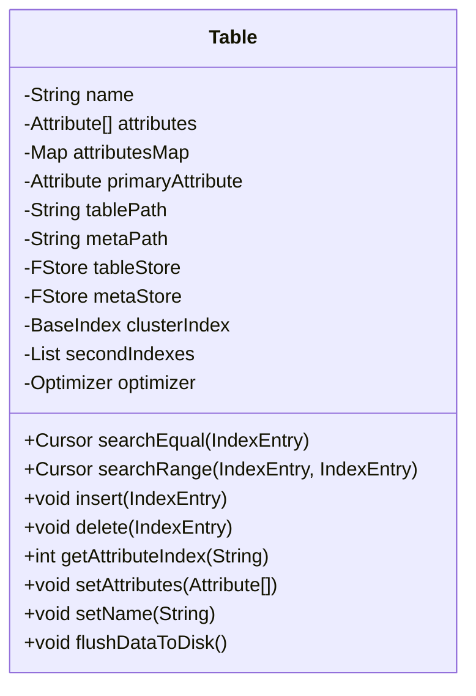
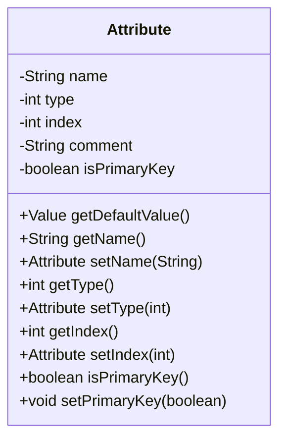
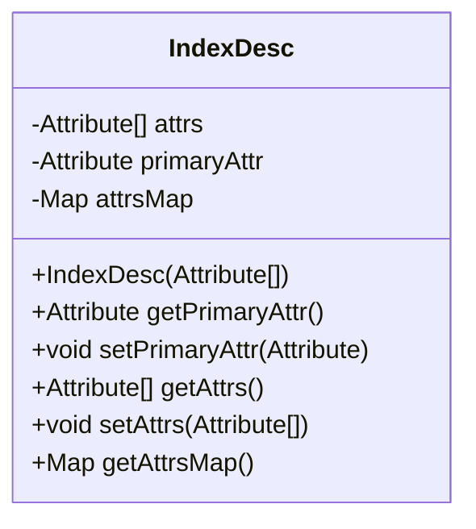
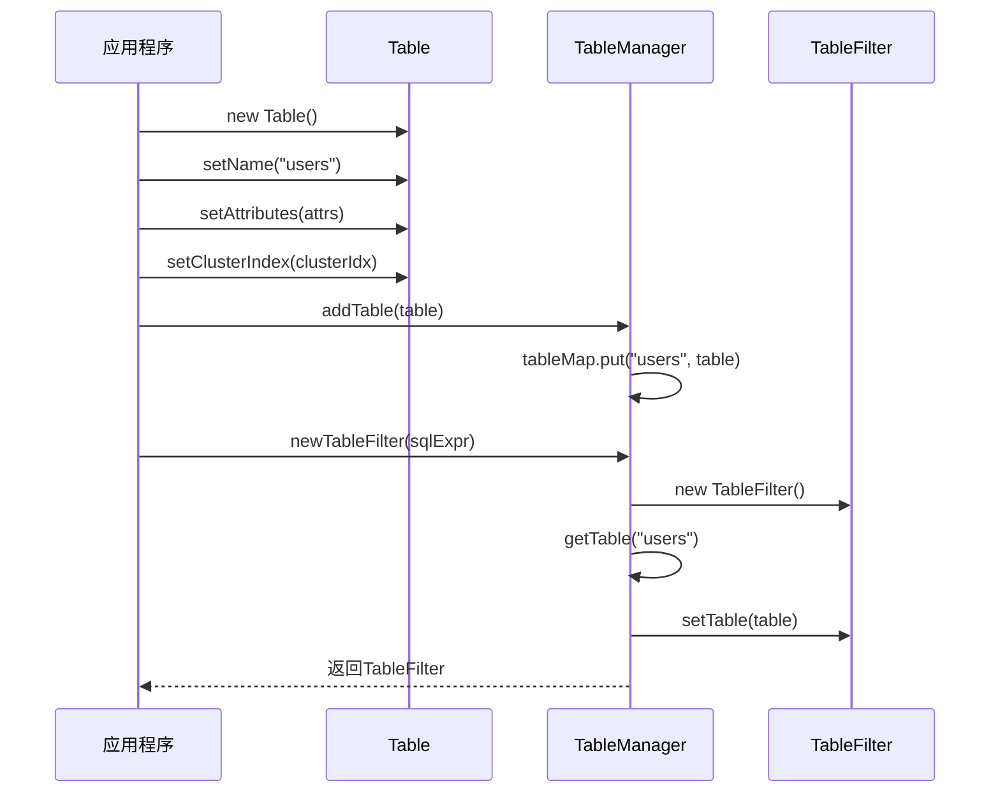
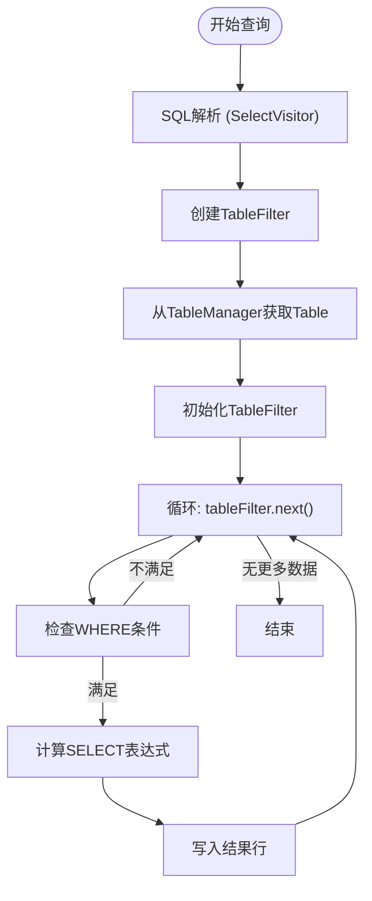

# 表结构定义

<cite>
**本文档引用的文件**  
- [Table.java](file://src/main/java/alchemystar/freedom/meta/Table.java)
- [Attribute.java](file://src/main/java/alchemystar/freedom/meta/Attribute.java)
- [IndexDesc.java](file://src/main/java/alchemystar/freedom/meta/IndexDesc.java)
- [TableManager.java](file://src/main/java/alchemystar/freedom/meta/TableManager.java)
- [SelectExecutor.java](file://src/main/java/alchemystar/freedom/sql/SelectExecutor.java)
</cite>

## 目录
1. [引言](#引言)
2. [核心类概览](#核心类概览)
3. [Table类结构分析](#table类结构分析)
4. [Attribute类设计](#attribute类设计)
5. [IndexDesc索引描述机制](#indexdesc索引描述机制)
6. [表对象的构建与管理](#表对象的构建与管理)
7. [在SQL执行中的引用机制](#在sql执行中的引用机制)
8. [扩展性与交互设计](#扩展性与交互设计)
9. [总结](#总结)

## 引言
本文档详细阐述了数据库系统中表结构的逻辑封装机制，重点分析`Table`类如何组织表名、属性列表、主键、索引等核心元数据。通过`Attribute`、`IndexDesc`等辅助类的设计，系统实现了对数据库表结构的完整建模。文档还将说明这些结构在SQL解析、查询优化和执行过程中的关键作用。

## 核心类概览
系统通过多个核心类协同工作来实现表结构的定义与管理：

- `Table`：封装数据库表的完整逻辑结构
- `Attribute`：表示表中列的元数据信息
- `IndexDesc`：定义索引的结构与属性集合
- `TableManager`：全局表注册与管理器
- `SelectExecutor`：SQL执行器，引用表结构进行查询处理

这些类共同构成了数据库元数据管理的基础框架。

## Table类结构分析
`Table`类是数据库表的逻辑封装核心，其主要字段包括：

- `name`：表名称
- `attributes`：属性数组，描述表的列结构
- `attributesMap`：属性名到索引的映射，便于快速查找
- `primaryAttribute`：主键属性
- `tablePath` 和 `metaPath`：数据与元数据存储路径
- `tableStore` 和 `metaStore`：文件存储实例
- `clusterIndex`：聚簇索引（主键索引）
- `secondIndexes`：二级索引列表
- `optimizer`：查询优化器实例

**图示来源**  
- [Table.java](file://src/main/java/alchemystar/freedom/meta/Table.java#L10-L172)

**本节来源**  
- [Table.java](file://src/main/java/alchemystar/freedom/meta/Table.java#L10-L172)

## Attribute类设计
`Attribute`类用于表示表中每一列的元数据，其核心字段如下：

- `name`：列名
- `type`：数据类型（如STRING, INT, LONG, BOOLEAN）
- `index`：在元组描述中的位置索引
- `comment`：列注释
- `isPrimaryKey`：是否为主键字段

该类提供了`getDefaultValue()`方法，根据类型返回默认值（如空字符串、0、false等），并在构造时支持链式调用设置属性。

**图示来源**  
- [Attribute.java](file://src/main/java/alchemystar/freedom/meta/Attribute.java#L10-L95)

**本节来源**  
- [Attribute.java](file://src/main/java/alchemystar/freedom/meta/Attribute.java#L10-L95)

## IndexDesc索引描述机制
`IndexDesc`类用于描述索引的结构，包含：

- `attrs`：构成索引的属性数组
- `primaryAttr`：主键属性（若适用）
- `attrsMap`：属性名到属性对象的映射，提升查找效率

在构造函数中，系统会遍历属性数组，建立映射关系，并识别主键属性。该类为索引的创建和查询提供了元数据支持。

**图示来源**  
- [IndexDesc.java](file://src/main/java/alchemystar/freedom/meta/IndexDesc.java#L10-L53)

**本节来源**  
- [IndexDesc.java](file://src/main/java/alchemystar/freedom/meta/IndexDesc.java#L10-L53)

## 表对象的构建与管理
表对象的构建流程如下：

1. 创建`Attribute`数组定义列结构
2. 实例化`Table`对象并设置名称
3. 调用`setAttributes()`方法，系统自动建立属性映射并识别主键
4. 创建聚簇索引和二级索引，并通过`setClusterIndex()`和`setSecondIndexes()`关联
5. 通过`TableManager.addTable()`注册到全局表管理器

`TableManager`使用静态`tableMap`维护所有表的映射，提供`newTableFilter()`方法用于SQL解析时创建表过滤器，并通过`getTable()`方法按名称查找表。

**图示来源**  
- [Table.java](file://src/main/java/alchemystar/freedom/meta/Table.java#L10-L172)
- [TableManager.java](file://src/main/java/alchemystar/freedom/meta/TableManager.java#L10-L71)

**本节来源**  
- [Table.java](file://src/main/java/alchemystar/freedom/meta/Table.java#L10-L172)
- [TableManager.java](file://src/main/java/alchemystar/freedom/meta/TableManager.java#L10-L71)

## 在SQL执行中的引用机制
表结构在SQL执行过程中被多个组件引用：

- **查询优化器**：`Optimizer`根据`IndexEntry`选择最优索引
- **执行器**：`SelectExecutor`通过`TableFilter`访问表数据
- **游标系统**：`Cursor`通过索引进行数据检索

以`SelectExecutor`为例，其`execute()`方法通过`SelectVisitor`获取`TableFilter`，进而访问`Table`对象进行数据遍历和条件过滤。

**图示来源**  
- [SelectExecutor.java](file://src/main/java/alchemystar/freedom/sql/SelectExecutor.java#L10-L122)
- [TableManager.java](file://src/main/java/alchemystar/freedom/meta/TableManager.java#L10-L71)

**本节来源**  
- [SelectExecutor.java](file://src/main/java/alchemystar/freedom/sql/SelectExecutor.java#L10-L122)

## 扩展性与交互设计
系统在表结构设计上体现了良好的扩展性：

- **动态属性管理**：通过`attributesMap`实现O(1)属性查找
- **索引可扩展**：支持多个二级索引，便于查询优化
- **优化器解耦**：`Optimizer`与`Table`松耦合，便于算法升级
- **持久化预留**：`loadFromDisk()`和`flushDataToDisk()`为持久化提供接口

与SQL解析器的交互通过`TableManager.newTableFilter()`实现，将DRUID解析的`SQLExprTableSource`转换为内部`TableFilter`，完成语法层到执行层的衔接。

**本节来源**  
- [Table.java](file://src/main/java/alchemystar/freedom/meta/Table.java#L10-L172)
- [TableManager.java](file://src/main/java/alchemystar/freedom/meta/TableManager.java#L10-L71)

## 总结
本文档系统分析了数据库表结构的封装机制。`Table`类作为核心，联合`Attribute`、`IndexDesc`等类完整描述了表的逻辑结构。通过`TableManager`的集中管理，表对象在SQL解析、优化和执行过程中被高效引用。该设计具有良好的扩展性和清晰的职责划分，为数据库系统的稳定运行提供了坚实基础。