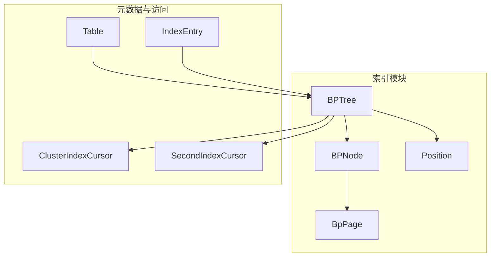
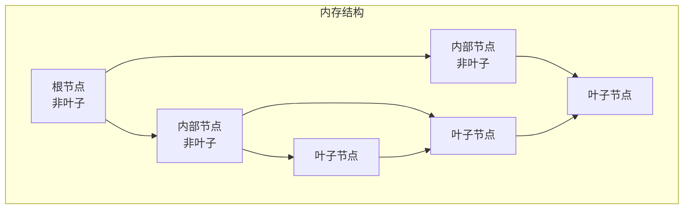
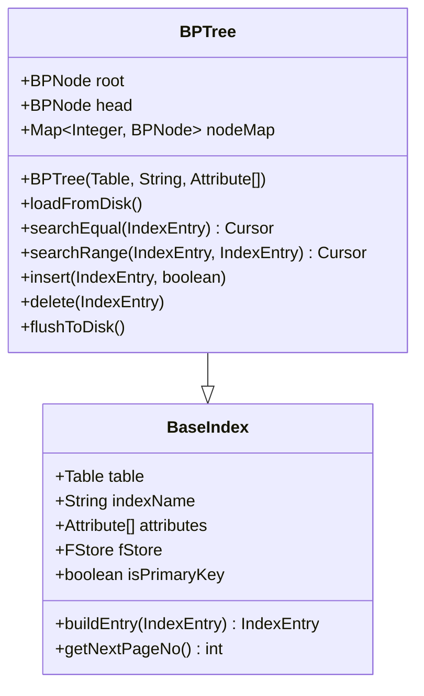
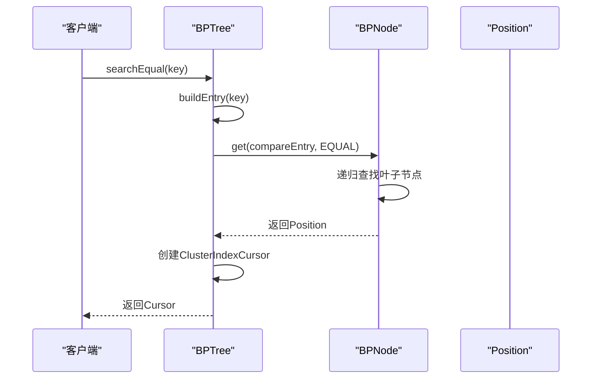
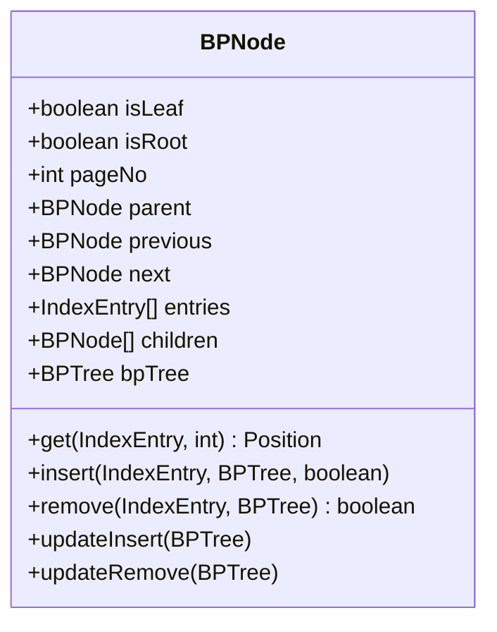
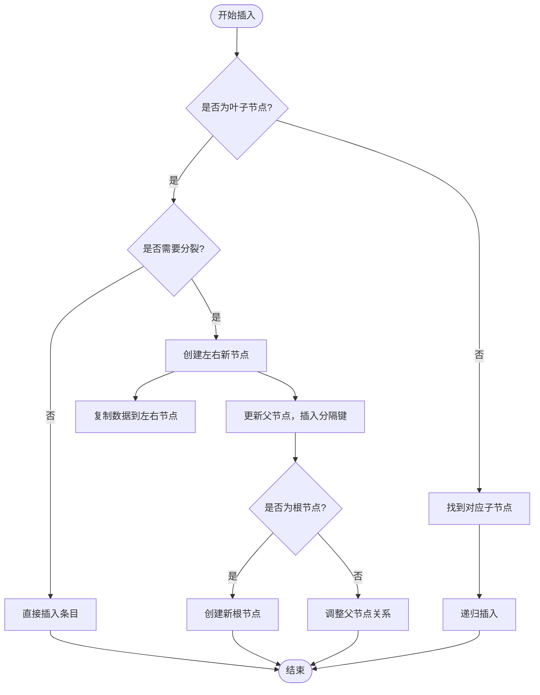
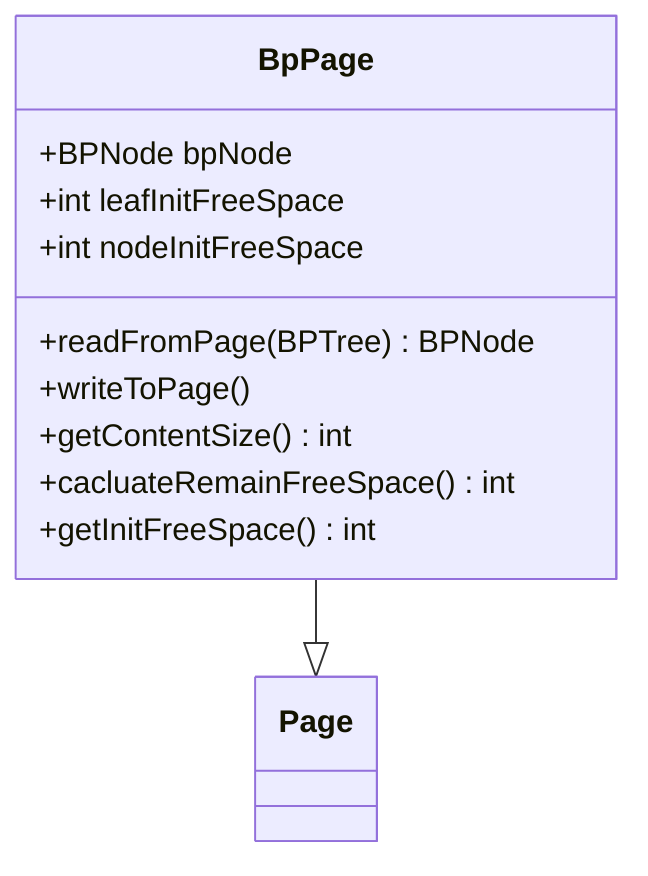
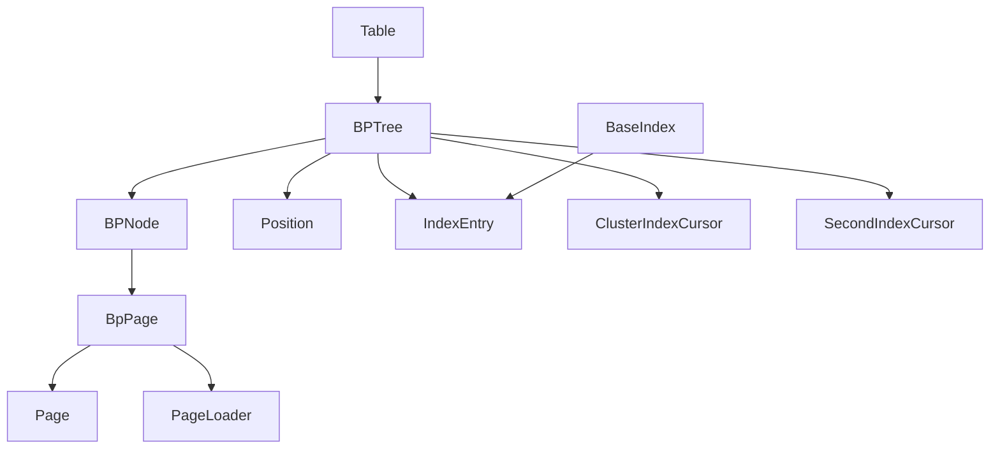

# B+树索引

<cite>
**本文档引用文件**  
- [BPTree.java](file://src/main/java/alchemystar/freedom/index/bp/BPTree.java)
- [BPNode.java](file://src/main/java/alchemystar/freedom/index/bp/BPNode.java)
- [BpPage.java](file://src/main/java/alchemystar/freedom/index/bp/BpPage.java)
- [Position.java](file://src/main/java/alchemystar/freedom/index/bp/Position.java)
- [Table.java](file://src/main/java/alchemystar/freedom/meta/Table.java)
- [BaseIndex.java](file://src/main/java/alchemystar/freedom/index/BaseIndex.java)
- [IndexEntry.java](file://src/main/java/alchemystar/freedom/meta/IndexEntry.java)
- [ClusterIndexCursor.java](file://src/main/java/alchemystar/freedom/access/ClusterIndexCursor.java)
- [SecondIndexCursor.java](file://src/main/java/alchemystar/freedom/access/SecondIndexCursor.java)
</cite>

## 目录
1. [简介](#简介)
2. [项目结构](#项目结构)
3. [核心组件](#核心组件)
4. [架构概述](#架构概述)
5. [详细组件分析](#详细组件分析)
6. [依赖分析](#依赖分析)
7. [性能考量](#性能考量)
8. [故障排查指南](#故障排查指南)
9. [结论](#结论)

## 简介
B+树是数据库系统中广泛使用的索引结构，用于高效支持数据的插入、删除、查找和范围扫描操作。本文档深入分析`BPTree`类的实现机制，涵盖节点管理、页面布局、根节点与叶子链表维护、与表元数据的关联方式以及多索引协同工作模式。同时，结合代码逻辑说明分裂合并策略、游标遍历实现和内存-磁盘映射机制，并指出当前实现的局限性及优化建议。

## 项目结构
B+树相关实现位于`src/main/java/alchemystar/freedom/index/bp`目录下，主要包括`BPTree`、`BPNode`、`BpPage`和`Position`四个核心类。这些类协同工作，构建完整的B+树索引功能。`BPTree`作为主控类，管理整棵树的结构；`BPNode`表示树中的节点；`BpPage`负责节点在磁盘上的序列化与反序列化；`Position`用于定位查找结果。

**图示来源**
- [BPTree.java](file://src/main/java/alchemystar/freedom/index/bp/BPTree.java)
- [BPNode.java](file://src/main/java/alchemystar/freedom/index/bp/BPNode.java)
- [BpPage.java](file://src/main/java/alchemystar/freedom/index/bp/BpPage.java)
- [Table.java](file://src/main/java/alchemystar/freedom/meta/Table.java)

**本节来源**
- [BPTree.java](file://src/main/java/alchemystar/freedom/index/bp/BPTree.java)
- [BPNode.java](file://src/main/java/alchemystar/freedom/index/bp/BPNode.java)
- [BpPage.java](file://src/main/java/alchemystar/freedom/index/bp/BpPage.java)

## 核心组件
`BPTree`继承自`BaseIndex`，是B+树的顶层管理类，负责维护根节点（`root`）和叶子链表头节点（`head`）。它通过`nodeMap`缓存已加载的节点，避免重复读取。`BPNode`是树的基本单元，包含关键字列表（`entries`）、子节点列表（`children`）以及前后叶子节点指针（`previous`、`next`），支持叶子节点间的双向链表遍历。`BpPage`封装了节点在磁盘上的存储格式，包括页头信息、节点属性和序列化方法。`Position`记录查找操作的结果位置，包含目标节点和索引。

**本节来源**
- [BPTree.java](file://src/main/java/alchemystar/freedom/index/bp/BPTree.java#L15-L35)
- [BPNode.java](file://src/main/java/alchemystar/freedom/index/bp/BPNode.java#L20-L60)
- [BpPage.java](file://src/main/java/alchemystar/freedom/index/bp/BpPage.java#L20-L30)
- [Position.java](file://src/main/java/alchemystar/freedom/index/bp/Position.java#L10-L15)

## 架构概述
B+树采用经典的多层结构，非叶子节点仅存储索引键和子节点指针，叶子节点存储完整的索引条目并通过双向链表连接。`BPTree`通过`root`指针访问树的顶层，`head`指针指向第一个叶子节点，支持高效的范围扫描。所有节点通过`BpPage`格式持久化到磁盘，由`FStore`进行I/O管理。查找、插入、删除操作从根节点开始递归向下，最终在叶子节点完成数据操作。

**图示来源**
- [BPTree.java](file://src/main/java/alchemystar/freedom/index/bp/BPTree.java#L15-L25)
- [BPNode.java](file://src/main/java/alchemystar/freedom/index/bp/BPNode.java#L30-L50)

## 详细组件分析

### BPTree 类分析
`BPTree`是B+树的主入口，封装了所有索引操作。其构造函数初始化根节点和头节点，`loadFromDisk`方法从磁盘加载树结构，`flushToDisk`将整个树写回磁盘。`searchEqual`和`searchRange`方法返回`Cursor`对象，用于遍历结果集。`insert`和`delete`方法委托给`root`节点处理，由`BPNode`完成具体的插入删除逻辑。

#### BPTree 类图

**图示来源**
- [BPTree.java](file://src/main/java/alchemystar/freedom/index/bp/BPTree.java#L15-L50)

#### 查找操作序列图

**图示来源**
- [BPTree.java](file://src/main/java/alchemystar/freedom/index/bp/BPTree.java#L70-L85)
- [BPNode.java](file://src/main/java/alchemystar/freedom/index/bp/BPNode.java#L100-L150)

**本节来源**
- [BPTree.java](file://src/main/java/alchemystar/freedom/index/bp/BPTree.java#L1-L277)

### BPNode 类分析
`BPNode`是B+树的核心数据结构，管理节点的关键字、子节点和前后指针。`insert`方法在叶子节点插入新条目，若空间不足则触发分裂。`remove`方法删除条目，若节点过空则尝试从兄弟节点借补或合并。`get`方法实现查找逻辑，非叶子节点根据键值范围选择子节点，叶子节点遍历条目匹配。`updateInsert`和`updateRemove`方法处理节点分裂和合并后的父节点更新。

#### BPNode 类图

**图示来源**
- [BPNode.java](file://src/main/java/alchemystar/freedom/index/bp/BPNode.java#L20-L70)

#### 插入操作流程图

**图示来源**
- [BPNode.java](file://src/main/java/alchemystar/freedom/index/bp/BPNode.java#L150-L300)

**本节来源**
- [BPNode.java](file://src/main/java/alchemystar/freedom/index/bp/BPNode.java#L1-L920)

### BpPage 类分析
`BpPage`负责`BPNode`在磁盘上的序列化和反序列化。其`writeToPage`方法将节点属性、关键字、子节点页号等写入字节缓冲区，`readFromPage`方法从磁盘读取数据并重建`BPNode`对象。`getContentSize`和`cacluateRemainFreeSpace`方法计算节点内容大小和剩余空间，用于判断是否需要分裂。

#### BpPage 类图

**图示来源**
- [BpPage.java](file://src/main/java/alchemystar/freedom/index/bp/BpPage.java#L20-L40)

**本节来源**
- [BpPage.java](file://src/main/java/alchemystar/freedom/index/bp/BpPage.java#L1-L204)

### 游标遍历机制
查找操作返回`Cursor`接口的实现，如`ClusterIndexCursor`和`SecondIndexCursor`。`Position`对象记录了起始和结束位置，`BaseIndexCursor`的`next`方法通过`incrPosition`移动指针，当到达当前节点末尾时，通过`next`指针跳转到下一个叶子节点，实现跨节点的连续遍历。

**本节来源**
- [Position.java](file://src/main/java/alchemystar/freedom/index/bp/Position.java#L1-L51)
- [ClusterIndexCursor.java](file://src/main/java/alchemystar/freedom/access/ClusterIndexCursor.java#L1-L16)
- [SecondIndexCursor.java](file://src/main/java/alchemystar/freedom/access/SecondIndexCursor.java#L1-L58)

## 依赖分析
B+树索引紧密依赖于表元数据（`Table`）和存储层（`FStore`）。`Table`类持有`clusterIndex`和`secondIndexes`列表，协调主键索引和二级索引的同步更新。`BaseIndex`提供`buildEntry`方法，根据索引定义从完整数据行中提取索引键。`IndexEntry`的`compareIndex`方法实现键值比较逻辑，是查找和排序的基础。`BpPage`依赖`Page`和`PageLoader`进行底层I/O操作。

**图示来源**
- [BPTree.java](file://src/main/java/alchemystar/freedom/index/bp/BPTree.java)
- [Table.java](file://src/main/java/alchemystar/freedom/meta/Table.java)
- [BaseIndex.java](file://src/main/java/alchemystar/freedom/index/BaseIndex.java)

**本节来源**
- [Table.java](file://src/main/java/alchemystar/freedom/meta/Table.java#L1-L172)
- [BaseIndex.java](file://src/main/java/alchemystar/freedom/index/BaseIndex.java#L1-L182)
- [IndexEntry.java](file://src/main/java/alchemystar/freedom/meta/IndexEntry.java#L1-L181)

## 性能考量
当前B+树实现存在以下性能局限：
1. **无锁机制**：多线程并发访问时缺乏锁保护，可能导致数据不一致。
2. **无日志保护**：缺少WAL（Write-Ahead Logging）机制，系统崩溃可能导致数据丢失。
3. **内存管理**：`nodeMap`缓存所有节点，大表场景下可能引发内存溢出。
4. **分裂策略**：分裂时简单地将节点对半分，未考虑数据分布特征。

**优化建议**：
- 引入读写锁或乐观锁机制保障并发安全。
- 集成`LogStore`实现事务日志，确保ACID特性。
- 实现LRU缓存替换策略，限制内存中节点数量。
- 优化分裂逻辑，根据键值分布动态调整分裂点。

## 故障排查指南
常见问题及排查方法：
1. **查找结果不完整**：检查`getFirst`和`getLast`方法中向前/向后遍历逻辑，确保处理了重复键值的情况。
2. **节点分裂失败**：验证`isLeafSplit`和`isNodeSplit`条件判断，确认`cacluateRemainFreeSpace`计算正确。
3. **链表断裂**：在`insert`和`remove`操作后，检查`previous`和`next`指针是否正确更新，特别是`head`节点的维护。
4. **内存泄漏**：监控`nodeMap`大小，确保`recycle`方法被正确调用以清理废弃节点。

**本节来源**
- [BPNode.java](file://src/main/java/alchemystar/freedom/index/bp/BPNode.java#L300-L920)
- [BPTree.java](file://src/main/java/alchemystar/freedom/index/bp/BPTree.java#L200-L277)

## 结论
本文档详细解析了B+树索引的实现机制，涵盖了从核心类设计到具体操作流程的各个方面。`BPTree`和`BPNode`协同实现了高效的索引管理，`BpPage`确保了数据的持久化。尽管当前实现缺少并发控制和崩溃恢复机制，但其清晰的架构为后续优化奠定了良好基础。通过引入锁机制和日志系统，可显著提升系统的稳定性和可靠性。