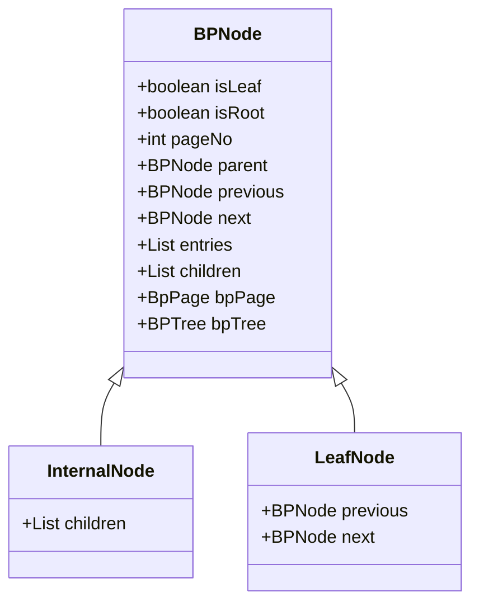
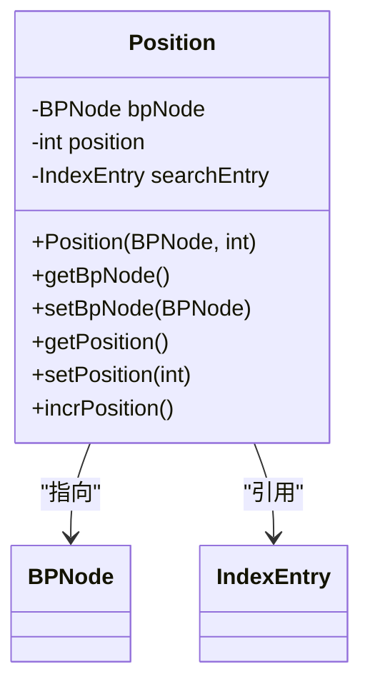
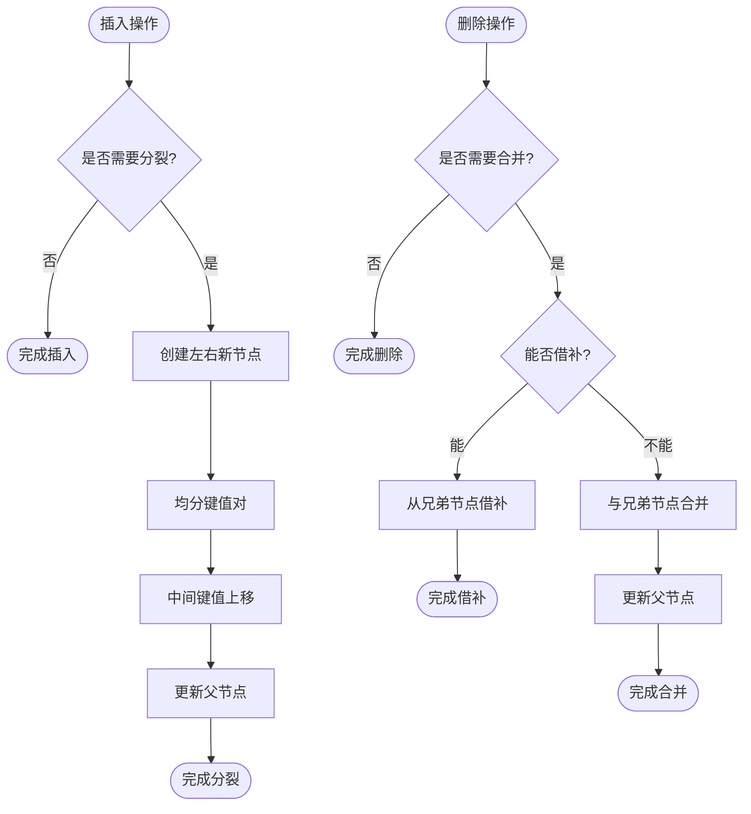
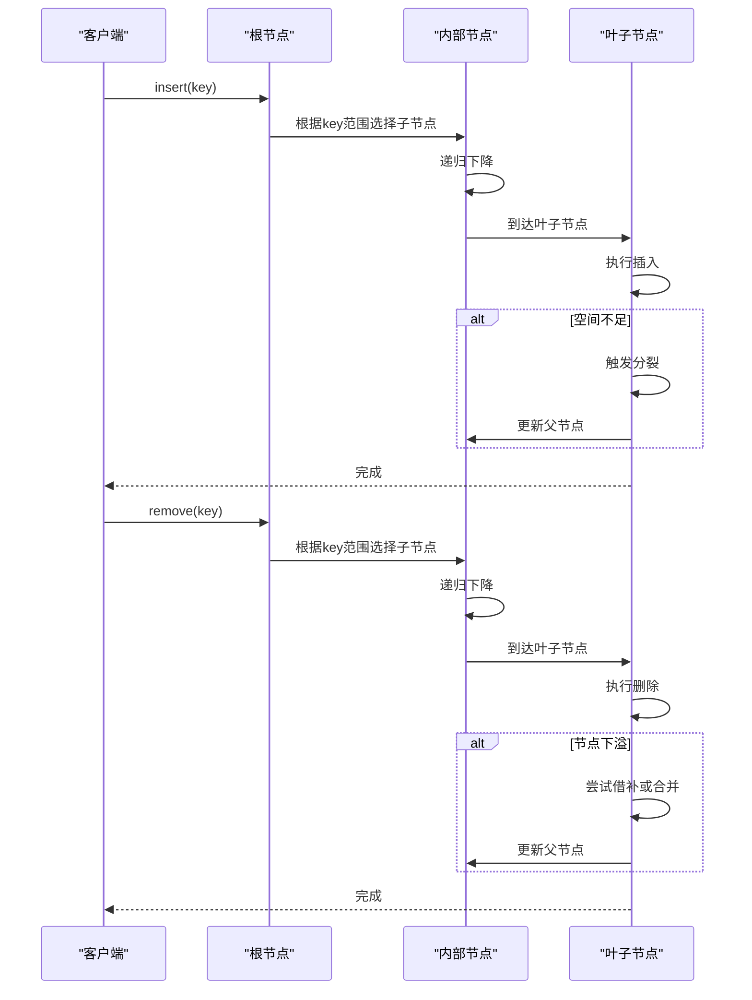
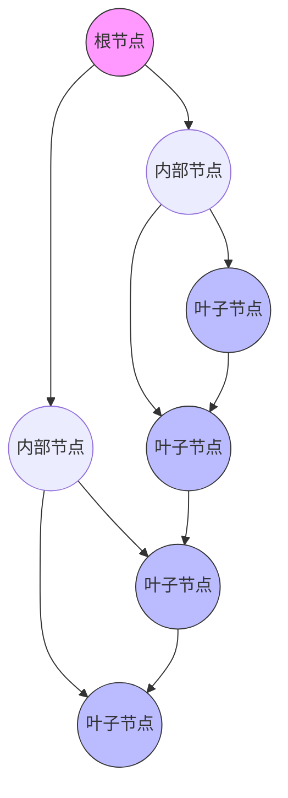

# B+树节点结构

<cite>
**本文档引用的文件**  
- [BPNode.java](file://src/main/java/alchemystar/freedom/index/bp/BPNode.java)
- [Position.java](file://src/main/java/alchemystar/freedom/index/bp/Position.java)
- [BPTree.java](file://src/main/java/alchemystar/freedom/index/bp/BPTree.java)
- [IndexEntry.java](file://src/main/java/alchemystar/freedom/meta/IndexEntry.java)
- [BpPage.java](file://src/main/java/alchemystar/freedom/index/bp/BpPage.java)
</cite>

## 目录
1. [引言](#引言)
2. [节点结构设计](#节点结构设计)
3. [内部节点与叶子节点的差异](#内部节点与叶子节点的差异)
4. [键值对的组织方式](#键值对的组织方式)
5. [Position类的作用机制](#position类的作用机制)
6. [节点分裂与合并机制](#节点分裂与合并机制)
7. [插入、删除、查找路径的递归遍历](#插入删除查找路径的递归遍历)
8. [节点与IndexEntry元数据的关联](#节点与indexentry元数据的关联)
9. [多级索引中的导航策略](#多级索引中的导航策略)
10. [节点状态调试与内存泄漏排查](#节点状态调试与内存泄漏排查)

## 引言
B+树是一种广泛应用于数据库和文件系统的平衡树结构，其高效的查找、插入和删除性能使其成为索引实现的核心数据结构。本文档聚焦于`BPNode`类的实现细节，深入分析B+树节点的内部结构、操作逻辑及与其他组件的交互机制。通过解析源码，揭示节点在不同操作下的行为模式，为开发者提供全面的技术参考。

## 节点结构设计
`BPNode`类是B+树的基本组成单元，封装了节点的所有属性和操作方法。每个节点包含以下核心字段：
- **isLeaf**: 标识是否为叶子节点
- **isRoot**: 标识是否为根节点
- **pageNo**: 对应的页面编号
- **parent**: 父节点引用
- **previous/next**: 叶子节点的前后节点引用（用于链表连接）
- **entries**: 存储索引键值对的列表
- **children**: 子节点列表（仅非叶子节点使用）
- **bpPage**: 页面结构对象
- **bpTree**: 所属的B+树实例

节点初始化时会根据是否为叶子节点决定是否创建`children`列表，并通过`PageFactory`创建对应的`BpPage`实例。

**Section sources**
- [BPNode.java](file://src/main/java/alchemystar/freedom/index/bp/BPNode.java#L19-L916)

## 内部节点与叶子节点的差异
内部节点和叶子节点在结构和功能上存在显著差异：

### 结构差异
- **内部节点**：`children`列表非空，`entries`中的键值作为分隔符指导搜索方向
- **叶子节点**：`children`列表为空，`entries`存储完整的索引数据，并通过`previous`和`next`形成双向链表

### 功能差异
- **内部节点**：主要负责路由查询，根据键值范围选择合适的子节点继续搜索
- **叶子节点**：存储实际数据，支持范围查询的顺序遍历

**Diagram sources**
- [BPNode.java](file://src/main/java/alchemystar/freedom/index/bp/BPNode.java#L19-L916)

## 键值对的组织方式
节点中的键值对通过`entries`列表有序存储，保证了二分查找的可行性。插入操作遵循以下规则：
1. 若列表为空，直接插入
2. 遍历列表，找到第一个大于等于目标键值的位置插入
3. 若键值已存在，插入到相等键值的任意位置

删除操作则通过线性搜索定位目标键值并移除。这种有序组织方式确保了节点内操作的时间复杂度为O(n)，但由于B+树的扇出较大，实际性能影响较小。

**Section sources**
- [BPNode.java](file://src/main/java/alchemystar/freedom/index/bp/BPNode.java#L500-L550)

## Position类的作用机制
`Position`类用于表示查询结果的位置信息，包含三个关键字段：
- **bpNode**: 指向包含目标键值的节点
- **position**: 键值在节点entries列表中的索引位置
- **searchEntry**: 搜索的原始键值

当执行`get`操作时，从根节点开始递归搜索，最终返回一个`Position`对象，指示目标键值的具体位置。这对于后续的范围查询和数据定位至关重要。

**Diagram sources**
- [Position.java](file://src/main/java/alchemystar/freedom/index/bp/Position.java#L9-L50)

## 节点分裂与合并机制
### 分裂机制
节点分裂在插入操作中触发，条件是剩余空间不足以容纳新键值。分裂过程如下：
1. 创建左右两个新节点
2. 将原节点的键值对均分到左右节点
3. 将中间键值上移到父节点
4. 更新父子节点关系

对于根节点的分裂，需要创建新的根节点，使树高增加一层。

### 合并机制
节点合并在删除操作后触发，当节点内容大小低于初始空闲空间的一半时，尝试与兄弟节点合并。合并策略包括：
- **借补**：从兄弟节点借用键值
- **合并**：与兄弟节点合并成一个节点

合并操作需要同步更新父节点的键值和子节点列表。

**Diagram sources**
- [BPNode.java](file://src/main/java/alchemystar/freedom/index/bp/BPNode.java#L164-L202)
- [BPNode.java](file://src/main/java/alchemystar/freedom/index/bp/BPNode.java#L561-L590)

## 插入删除查找路径的递归遍历
### 插入路径
插入操作从根节点开始，根据键值范围选择子节点递归下降，直到到达叶子节点。若叶子节点空间不足，则触发分裂。

### 删除路径
删除操作同样从根节点开始递归搜索目标键值，删除后检查节点是否下溢，必要时进行借补或合并。

### 查找路径
查找操作通过`get`方法实现，根据比较结果选择相应的子节点继续搜索，最终返回`Position`对象。

**Diagram sources**
- [BPNode.java](file://src/main/java/alchemystar/freedom/index/bp/BPNode.java#L80-L160)

## 节点与IndexEntry元数据的关联
`IndexEntry`类表示索引的基本元组，包含值数组和索引描述。`BPNode`通过`entries`列表持有`IndexEntry`实例，形成键值存储。`IndexEntry`的`compareIndex`方法用于键值比较，确保有序性。在非叶子节点中，`getCompareEntry`方法生成用于路由的比较键。

**Section sources**
- [IndexEntry.java](file://src/main/java/alchemystar/freedom/meta/IndexEntry.java#L0-L181)

## 多级索引中的导航策略
B+树通过层级结构实现高效导航：
1. 从根节点开始，根据键值范围选择子节点
2. 逐层下降，直到到达叶子节点
3. 在叶子节点中定位具体键值
4. 利用叶子节点的双向链表支持范围查询

这种导航策略保证了O(log n)的查找时间复杂度，且所有叶子节点在同一层级，确保了查询性能的稳定性。

**Diagram sources**
- [BPTree.java](file://src/main/java/alchemystar/freedom/index/bp/BPTree.java#L0-L277)

## 节点状态调试与内存泄漏排查
### 节点状态调试
- 检查`bpPage.getContentSize()`与`getInitFreeSpace()`的比例，监控空间使用率
- 验证节点间引用的正确性（parent、children、previous、next）
- 使用`flushToDisk`方法将节点状态持久化以便分析

### 内存泄漏排查
- 确保`recycle`方法被正确调用，清理`entries`和`children`引用
- 检查`bpTree.recyclePageNo(pageNo)`是否执行，释放页面编号
- 监控`nodeMap`的大小，防止节点对象累积

**Section sources**
- [BPNode.java](file://src/main/java/alchemystar/freedom/index/bp/BPNode.java#L891-L916)