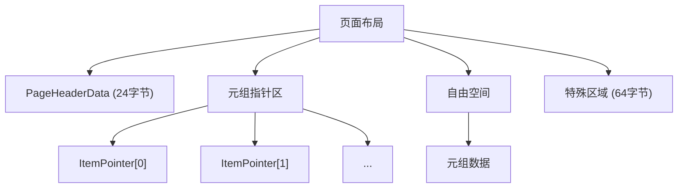
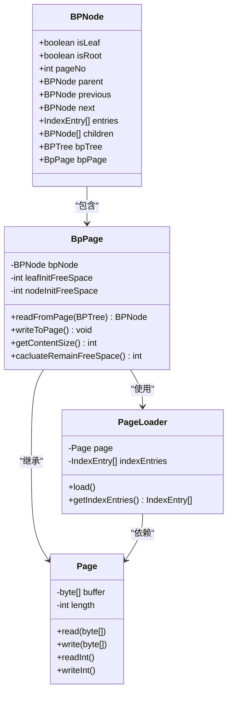

# 持久化与页面管理

<cite>
**本文档引用文件**  
- [BPNode.java](file://src/main/java/alchemystar/freedom/index/bp/BPNode.java)
- [BpPage.java](file://src/main/java/alchemystar/freedom/index/bp/BpPage.java)
- [PageHeaderData.java](file://src/main/java/alchemystar/freedom/store/page/PageHeaderData.java)
- [PageNoAllocator.java](file://src/main/java/alchemystar/freedom/store/page/PageNoAllocator.java)
- [PagePool.java](file://src/main/java/alchemystar/freedom/store/page/PagePool.java)
- [FStore.java](file://src/main/java/alchemystar/freedom/store/fs/FStore.java)
- [PageLoader.java](file://src/main/java/alchemystar/freedom/store/page/PageLoader.java)
- [RecoverManager.java](file://src/main/java/alchemystar/freedom/recovery/RecoverManager.java)
</cite>

## 目录
1. [引言](#引言)
2. [页面格式设计与页头结构](#页面格式设计与页头结构)
3. [BpPage与BPNode的内存-磁盘映射机制](#bpPage与bpNode的内存-磁盘映射机制)
4. [页面编号分配机制（PageNoAllocator）](#页面编号分配机制pagenoallocator)
5. [页面池缓存策略（PagePool）](#页面池缓存策略pagepool)
6. [FStore文件系统支持](#fstore文件系统支持)
7. [PageLoader与系统启动重建](#pageloader与系统启动重建)
8. [恢复流程分析与WAL改进方案](#恢复流程分析与wal改进方案)
9. [页面碎片整理与I/O性能调优](#页面碎片整理与i/o性能调优)
10. [结论](#结论)

## 引言
本文档详细阐述了Freedom数据库系统中B+树索引的持久化机制。重点分析了BpPage如何将内存中的BPNode结构映射到磁盘页面，涵盖页面格式、页头信息、页面编号分配、页面缓存策略、文件系统支持及系统恢复机制。同时，结合现有恢复流程，指出其缺乏日志保护的风险，并提出基于WAL（Write-Ahead Logging）的改进方案，最后提供页面碎片整理与I/O性能调优的实践指南。

## 页面格式设计与页头结构
### 页头信息（PageHeaderData）结构
`PageHeaderData`类定义了每个磁盘页面的通用头部结构，包含关键元数据，用于管理页面内的空间分配和元组布局。

**核心字段说明：**
- **magicWord**: 页面标识符，固定为"Freedom"，用于验证页面完整性。
- **lowerOffset**: 自由空间起始偏移量，指向页面中未使用空间的开始位置。
- **upperOffset**: 自由空间结束偏移量，指向页面中未使用空间的结束位置。
- **special**: 特殊区域起始偏移量，用于存储页面特定的元数据（如B+树节点信息）。
- **tupleCount**: 记录页面中有效元组的数量。

**内存布局：**
页面头部固定占用24字节（`PAGE_HEADER_SIZE`），其后是元组指针区和元组数据区。元组通过`ItemPointer`结构（包含偏移量和长度）进行间接寻址，实现了变长元组的高效管理。

**Diagram sources**
- [PageHeaderData.java](file://src/main/java/alchemystar/freedom/store/page/PageHeaderData.java#L1-L30)

**Section sources**
- [PageHeaderData.java](file://src/main/java/alchemystar/freedom/store/page/PageHeaderData.java#L1-L130)

## BpPage与BPNode的内存-磁盘映射机制
### BpPage类的作用
`BpPage`是`Page`的子类，专门负责B+树节点的序列化与反序列化。它作为内存中`BPNode`对象与磁盘上二进制页面之间的桥梁。

### 内存到磁盘的映射（writeToPage）
当`BPNode`发生变更需要持久化时，`BpPage`的`writeToPage()`方法将其状态写入底层字节数组：
1.  **写入节点类型标志**：`isLeaf`和`isRoot`。
2.  **写入页面编号**：`pageNo`。
3.  **写入父节点编号**：若非根节点，写入父节点的`pageNo`；根节点则写入-1。
4.  **写入条目（entries）**：先写入条目数量，再依次写入所有`IndexEntry`。
5.  **写入子节点或链表指针**：
    -   非叶子节点：写入子节点数量及所有子节点的`pageNo`。
    -   叶子节点：写入前驱（`previous`）和后继（`next`）叶子节点的`pageNo`（若为null则写入-1）。

### 磁盘到内存的映射（readFromPage）
系统启动或页面从磁盘加载时，`BpPage`的`readFromPage()`方法通过`PageLoader`解析字节数组，重建`BPNode`对象：
1.  使用`PageLoader`读取所有`IndexEntry`。
2.  根据读取的标志创建`BPNode`实例。
3.  设置`pageNo`，并将其注册到`BPTree`的`nodeMap`中，避免递归加载时的循环引用。
4.  递归地通过`pageNo`加载并设置父节点和子节点引用。
5.  为叶子节点设置前驱和后继指针。

此机制确保了内存中的树形结构与磁盘上的线性页面能够精确、高效地相互转换。

**Diagram sources**
- [BPNode.java](file://src/main/java/alchemystar/freedom/index/bp/BPNode.java#L1-L50)
- [BpPage.java](file://src/main/java/alchemystar/freedom/index/bp/BpPage.java#L1-L30)
- [PageLoader.java](file://src/main/java/alchemystar/freedom/store/page/PageLoader.java#L1-L10)

**Section sources**
- [BPNode.java](file://src/main/java/alchemystar/freedom/index/bp/BPNode.java#L1-L799)
- [BpPage.java](file://src/main/java/alchemystar/freedom/index/bp/BpPage.java#L1-L205)

## 页面编号分配机制（PageNoAllocator）
`PageNoAllocator`负责为新创建的页面分配唯一的、递增的页面编号（`pageNo`）。

### 核心设计
- **原子计数器**：使用`AtomicInteger count`从1开始递增（0号页面保留给元数据页）。
- **空闲列表**：`LinkedList<Integer> freePageNoList`用于回收已删除页面的`pageNo`，实现`pageNo`的复用，避免无限增长。

### 关键方法
- **getNextPageNo()**: 如果空闲列表为空，则返回`count`的当前值并递增；否则，从列表头部取出一个`pageNo`并返回。
- **recycleCount(int pageNo)**: 将指定的`pageNo`添加到空闲列表末尾，供后续分配。
- **setCount(int lastPageNo)**: 在系统恢复时，根据磁盘上已存在的最大`pageNo`来重置`count`的值，确保后续分配的连续性。

该机制在保证`pageNo`全局唯一性的同时，也支持了空间的回收利用。

**Section sources**
- [PageNoAllocator.java](file://src/main/java/alchemystar/freedom/store/page/PageNoAllocator.java#L1-L41)

## 页面池缓存策略（PagePool）
`PagePool`实现了页面的缓存池，旨在减少频繁的内存分配与垃圾回收开销。

### 实现细节
- **单例模式**：通过静态内部类实现，确保全局唯一实例。
- **并发队列**：使用`ConcurrentLinkedQueue<Page>`作为可用页面的池。
- **预分配**：在`init()`方法中，预先创建8个`Page`对象放入池中。
- **获取页面**：`getFreePage()`方法尝试从池中取出一个页面。若池为空，则创建一个新页面（当前实现始终创建新页面，未完全利用池）。
- **回收页面**：`recycle(Page page)`方法将使用完毕的页面清理后重新放回池中，等待下次复用。

尽管当前实现中`getFreePage()`未优先使用池中页面，但其设计为后续优化（如LRU策略）提供了基础。

**Section sources**
- [PagePool.java](file://src/main/java/alchemystar/freedom/store/page/PagePool.java#L1-L53)

## FStore文件系统支持
`FStore`类封装了对底层文件的读写操作，为页面的持久化提供支持。

### 核心功能
- **文件通道管理**：通过`FileChannel`进行高效的I/O操作。
- **页面读取**：`readPageFromFile(int pageIndex)`方法根据`pageIndex`计算文件偏移量，读取一个完整页面的数据，并通过`PagePool`或直接构造`BpPage`来创建页面对象。
- **页面写入**：`writePageToFile(Page page, int pageIndex)`方法将页面的字节数组写入文件的指定位置。
- **扩展支持**：文件的扩展由`FileChannel`的写操作自然完成，当写入位置超出当前文件大小时，文件会自动增长。

`FStore`是连接内存页面与磁盘文件的关键组件，确保了页面数据的可靠存储。

**Section sources**
- [FStore.java](file://src/main/java/alchemystar/freedom/store/fs/FStore.java#L1-L97)

## PageLoader与系统启动重建
`PageLoader`在系统启动时扮演着至关重要的角色，负责从磁盘重建整个B+树结构。

### 重建流程
1.  **加载根页面**：系统已知根节点的`pageNo`（通常为0或通过元数据获取）。
2.  **创建PageLoader**：调用`FStore.readPageLoaderFromFile(rootPageNo)`。
3.  **解析页面**：`PageLoader.load()`方法读取`PageHeaderData`，然后遍历元组指针区，将所有`IndexEntry`反序列化到内存数组中。
4.  **重建BPNode**：`BpPage.readFromPage()`利用`PageLoader`提供的`IndexEntry`数组，创建`BPNode`对象，并递归地加载其子节点。
5.  **构建完整树**：通过递归加载，最终在内存中重建出完整的B+树索引结构。

此过程依赖于`pageNo`作为节点间的引用，是实现持久化索引的基础。

**Section sources**
- [PageLoader.java](file://src/main/java/alchemystar/freedom/store/page/PageLoader.java#L1-L59)

## 恢复流程分析与WAL改进方案
### 当前恢复机制分析
当前系统的恢复由`RecoverManager`实现，其流程如下：
1.  从`LogStore`加载所有日志记录。
2.  识别所有已提交（COMMIT）的事务。
3.  对这些事务执行`redo()`操作，重放其修改。

**关键风险：缺乏日志保护**
- **问题**：`BpPage.writeToPage()`直接将修改写入磁盘文件，而`FStore`的`writePageToFile()`也没有强制刷盘（fsync）。这意味着在系统崩溃时，页面可能处于部分写入的中间状态（即“撕裂页”问题），导致数据结构损坏。
- **后果**：即使有redo日志，如果基础数据页已损坏，重放操作将无法成功，可能导致数据库无法启动或数据丢失。
- **根本原因**：当前实现是“先写数据页，后写日志”（Write-Ahead Data），违反了WAL协议的核心原则。

### 基于WAL的改进方案
为确保原子性和持久性，必须实现严格的WAL协议：

1.  **日志先行**：在任何对数据页的修改写入磁盘之前，必须先将描述该修改的redo日志记录（Log Record）写入并**持久化到磁盘**。
2.  **日志记录内容**：日志应包含足够的信息来重放修改，例如：`pageNo`、修改的偏移量、旧值（用于undo）、新值。
3.  **检查点（Checkpoint）**：定期执行检查点，将内存中所有“脏页”（已修改但未写入磁盘的页面）刷新到磁盘，并更新检查点记录。这可以缩短恢复时间。
4.  **恢复流程**：
    -   **分析阶段**：确定崩溃时哪些事务是活动的。
    -   **重做（Redo）阶段**：从最后一个检查点开始，重放所有日志记录，将数据库恢复到崩溃前的状态。
    -   **撤销（Undo）阶段**：回滚所有未提交事务的修改。

通过实施WAL，可以保证即使在崩溃时，也能通过日志将数据库恢复到一个一致的状态。

**Section sources**
- [RecoverManager.java](file://src/main/java/alchemystar/freedom/recovery/RecoverManager.java#L1-L63)

## 页面碎片整理与I/O性能调优
### 页面碎片整理
B+树的频繁插入和删除会导致页面内部出现碎片（`free space`不连续或利用率低）。
- **主动整理**：可设计后台任务，对碎片率过高的页面进行整理。例如，将多个半满的叶子节点合并，并将空闲的`pageNo`回收。
- **利用回收机制**：`PageNoAllocator`的`recycleCount`方法已为`pageNo`的回收提供了支持，可在此基础上实现更复杂的整理策略。

### I/O性能调优
1.  **页面池优化**：修复`PagePool.getFreePage()`，使其优先从`frees`队列中获取页面，真正实现内存复用，减少GC压力。
2.  **批量I/O**：在高并发场景下，可考虑将多个页面的写入请求合并为一次批量I/O操作，减少系统调用次数。
3.  **预读（Read-ahead）**：在顺序扫描时，预测性地提前加载后续页面到`PagePool`中，减少等待时间。
4.  **刷盘策略**：在WAL实现后，可采用异步刷盘策略，将日志和数据页的持久化操作与前端事务解耦，提高吞吐量。

## 结论
本文档深入剖析了Freedom系统中B+树的持久化架构。`BpPage`通过精心设计的序列化协议，实现了`BPNode`在内存与磁盘间的高效映射。`PageHeaderData`、`PageNoAllocator`和`PagePool`共同构成了稳健的页面管理基础。`FStore`和`PageLoader`则确保了数据的可靠存储与系统重启时的正确重建。然而，当前直接写入数据页的模式存在严重风险。引入基于WAL的日志保护机制是提升系统可靠性的关键一步。在此基础上，通过页面碎片整理和I/O调优，可进一步提升系统的整体性能和稳定性。