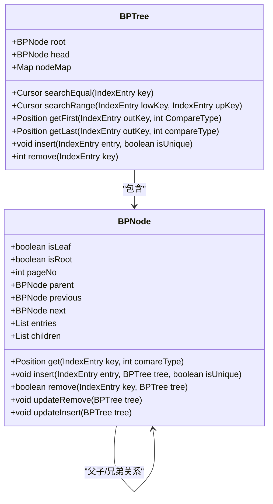
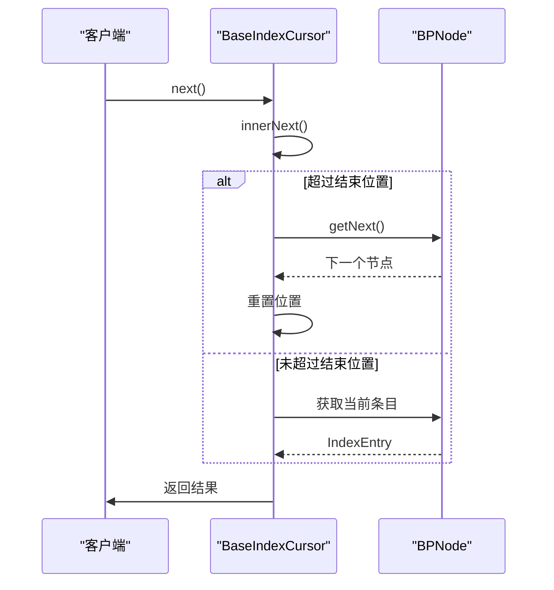
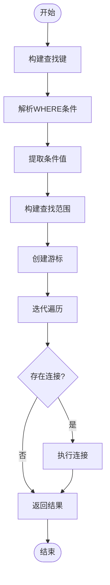
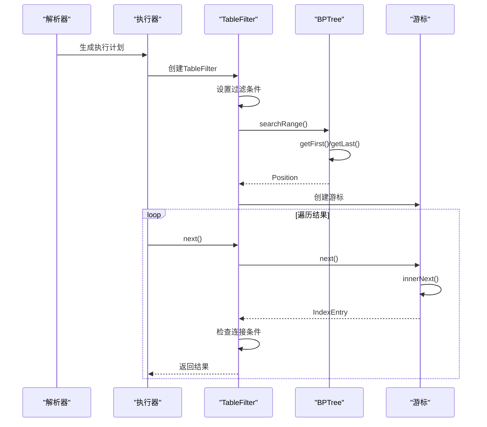
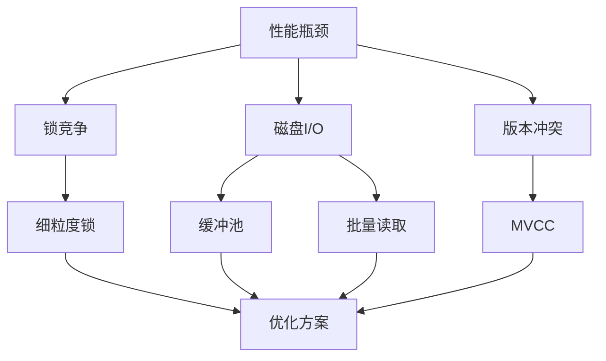
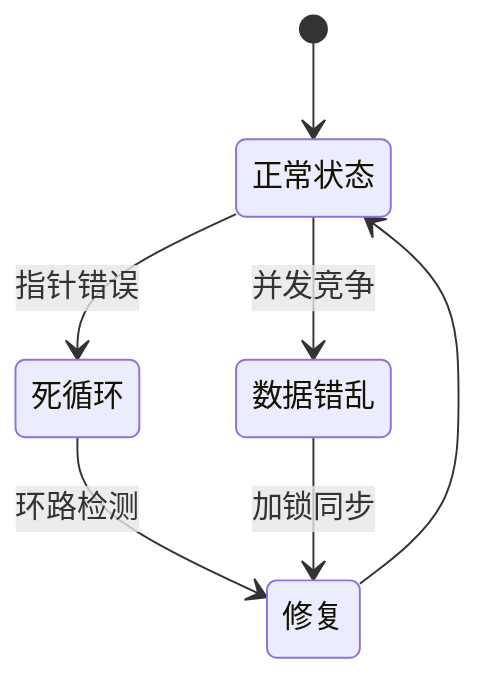

# 索引操作机制

<cite>
**本文档引用的文件**   
- [BPTree.java](file://src/main/java/alchemystar/freedom/index/bp/BPTree.java)
- [BaseIndexCursor.java](file://src/main/java/alchemystar/freedom/access/BaseIndexCursor.java)
- [SecondIndexCursor.java](file://src/main/java/alchemystar/freedom/access/SecondIndexCursor.java)
- [TableFilter.java](file://src/main/java/alchemystar/freedom/sql/select/TableFilter.java)
- [BPNode.java](file://src/main/java/alchemystar/freedom/index/bp/BPNode.java)
- [Position.java](file://src/main/java/alchemystar/freedom/index/bp/Position.java)
- [IndexEntry.java](file://src/main/java/alchemystar/freedom/meta/IndexEntry.java)
- [WhereVisitor.java](file://src/main/java/alchemystar/freedom/sql/parser/WhereVisitor.java)
</cite>

## 目录
1. [核心操作机制](#核心操作机制)
2. [游标状态管理](#游标状态管理)
3. [查询执行器交互](#查询执行器交互)
4. [SQL执行流程](#sql执行流程)
5. [高并发优化](#高并发优化)
6. [异常处理](#异常处理)

## 核心操作机制

B+树索引的核心操作由BPTree类实现，提供插入、删除、查找和范围扫描等基本功能。BPTree继承自BaseIndex，维护根节点和叶子节点链表头的引用，通过getNodeFromPageNo方法实现节点的按需加载。

插入操作通过BPNode的insert方法实现，当节点空间不足时会触发分裂。对于叶子节点，分裂时创建左右两个新节点，并调整叶子链表的前后指针。非叶子节点的分裂会将中间关键字上移到父节点，维护B+树的平衡性。

删除操作通过BPNode的remove方法实现，当节点关键字数量低于阈值时会尝试从兄弟节点借补或进行节点合并。删除过程会递归向上调整，确保树的平衡性。对于根节点，当子节点数少于2时会进行降级处理。

查找操作通过searchEqual和searchRange方法实现，返回相应的游标对象。范围查找通过getFirst和getLast方法确定起始和结束位置，支持等值查找和范围扫描两种模式。

**图示来源**
- [BPTree.java](file://src/main/java/alchemystar/freedom/index/bp/BPTree.java#L27-L276)
- [BPNode.java](file://src/main/java/alchemystar/freedom/index/bp/BPNode.java#L0-L799)

**本节来源**
- [BPTree.java](file://src/main/java/alchemystar/freedom/index/bp/BPTree.java#L27-L276)
- [BPNode.java](file://src/main/java/alchemystar/freedom/index/bp/BPNode.java#L0-L799)

## 游标状态管理

游标（Cursor）是遍历B+树索引的核心组件，通过BaseIndexCursor类实现基本的状态管理。游标维护起始位置、结束位置和当前位置三个Position对象，通过next方法实现迭代。

BaseIndexCursor的next方法首先调用innerNext获取下一个索引项，然后根据isEqual标志判断是否超出等值范围。innerNext方法检查当前位置是否超过结束位置，若未超过则返回当前节点的下一个条目；若已超过，则跳转到下一个BPNode继续遍历。

二级索引游标（SecondIndexCursor）继承自BaseIndexCursor，在next方法中增加了主键查找逻辑。它首先通过父类的next方法获取二级索引项，然后使用该索引项的rowId构造主键查找条件，通过主键索引获取完整的数据记录。

**图示来源**
- [BaseIndexCursor.java](file://src/main/java/alchemystar/freedom/access/BaseIndexCursor.java#L9-L95)
- [SecondIndexCursor.java](file://src/main/java/alchemystar/freedom/access/SecondIndexCursor.java#L0-L58)

**本节来源**
- [BaseIndexCursor.java](file://src/main/java/alchemystar/freedom/access/BaseIndexCursor.java#L9-L95)
- [SecondIndexCursor.java](file://src/main/java/alchemystar/freedom/access/SecondIndexCursor.java#L0-L58)
- [Position.java](file://src/main/java/alchemystar/freedom/index/bp/Position.java#L0-L51)

## 查询执行器交互

查询执行器通过TableFilter类与B+树索引进行交互，实现数据过滤功能。TableFilter在innerNext方法中初始化游标，通过buildLowUpEntry方法构建查找范围的上下界。

buildLowUpEntry方法解析SQL的WHERE条件，生成查找范围的边界值。它首先创建WhereVisitor解析条件表达式，获取等值、大于等于和小于等于条件的值映射。然后根据这些条件构建lowValues和upValues数组，作为范围查找的边界。

TableFilter的next方法通过innerNext实现迭代，当状态为NOT_FOUND或MOVE_TO_NEXT时，调用游标的next方法获取下一条记录。如果存在连接条件，还会递归调用join的next方法进行连接操作。

**图示来源**
- [TableFilter.java](file://src/main/java/alchemystar/freedom/sql/select/TableFilter.java#L0-L278)
- [WhereVisitor.java](file://src/main/java/alchemystar/freedom/sql/parser/WhereVisitor.java#L0-L160)

**本节来源**
- [TableFilter.java](file://src/main/java/alchemystar/freedom/sql/select/TableFilter.java#L0-L278)
- [WhereVisitor.java](file://src/main/java/alchemystar/freedom/sql/parser/WhereVisitor.java#L0-L160)

## SQL执行流程

SQL执行流程从解析阶段开始，通过ServerParseSelect解析SELECT语句，生成抽象语法树。SelectVisitor遍历语法树，创建TableFilter对象并设置过滤条件。

在执行阶段，TableFilter的buildLowUpEntry方法解析WHERE条件，生成范围查找的边界值。然后调用table.searchRange方法创建游标，开始遍历索引。对于每个匹配的索引项，通过getValue方法获取具体列的值。

当存在连接操作时，主表的TableFilter会设置join属性，指向从表的TableFilter。在迭代过程中，主表每获取一条记录，都会重置从表的游标并执行连接条件的判断。连接条件通过SelectExprEval进行表达式求值。

**图示来源**
- [TableFilter.java](file://src/main/java/alchemystar/freedom/sql/select/TableFilter.java#L0-L278)
- [BPTree.java](file://src/main/java/alchemystar/freedom/index/bp/BPTree.java#L27-L276)

**本节来源**
- [TableFilter.java](file://src/main/java/alchemystar/freedom/sql/select/TableFilter.java#L0-L278)
- [BPTree.java](file://src/main/java/alchemystar/freedom/index/bp/BPTree.java#L27-L276)
- [SelectExprEval.java](file://src/main/java/alchemystar/freedom/sql/select/item/SelectExprEval.java#L0-L118)

## 高并发优化

在高并发场景下，B+树索引操作可能遇到性能瓶颈。主要瓶颈包括节点分裂/合并时的锁竞争、频繁的磁盘I/O操作以及长事务导致的版本冲突。

优化建议包括：采用细粒度锁机制，对不同节点使用独立的锁对象，减少锁竞争范围；实现缓冲池机制，缓存热点节点，减少磁盘I/O；优化分裂策略，预分配页面空间，避免频繁的页面分配操作。

对于范围扫描操作，可以采用批量读取策略，一次性读取多个页面到内存，减少系统调用次数。同时，通过预读机制预测访问模式，提前加载可能访问的页面。

**图示来源**
- [BPTree.java](file://src/main/java/alchemystar/freedom/index/bp/BPTree.java#L27-L276)
- [BPNode.java](file://src/main/java/alchemystar/freedom/index/bp/BPNode.java#L0-L799)

**本节来源**
- [BPTree.java](file://src/main/java/alchemystar/freedom/index/bp/BPTree.java#L27-L276)
- [BPNode.java](file://src/main/java/alchemystar/freedom/index/bp/BPNode.java#L0-L799)

## 异常处理

常见操作异常包括死循环和数据错乱。死循环通常发生在游标遍历时，由于节点链表指针错误导致无法正常终止。数据错乱多由并发操作中的竞态条件引起，如在分裂过程中被其他线程访问。

死循环的根因可能是：节点的next指针形成环路；Position对象的状态未正确更新；范围查找的结束条件判断错误。解决方案包括：在遍历时记录已访问节点，检测环路；确保Position的原子性更新；严格验证结束位置的正确性。

数据错乱的根因包括：未正确加锁导致的脏读；节点分裂时的中间状态被读取；缓存与磁盘数据不一致。解决方案包括：实现严格的两阶段锁协议；在关键操作时使用互斥锁；确保缓存与磁盘的一致性。

**图示来源**
- [BaseIndexCursor.java](file://src/main/java/alchemystar/freedom/access/BaseIndexCursor.java#L9-L95)
- [BPNode.java](file://src/main/java/alchemystar/freedom/index/bp/BPNode.java#L0-L799)

**本节来源**
- [BaseIndexCursor.java](file://src/main/java/alchemystar/freedom/access/BaseIndexCursor.java#L9-L95)
- [BPNode.java](file://src/main/java/alchemystar/freedom/index/bp/BPNode.java#L0-L799)
- [BPTree.java](file://src/main/java/alchemystar/freedom/index/bp/BPTree.java#L27-L276)